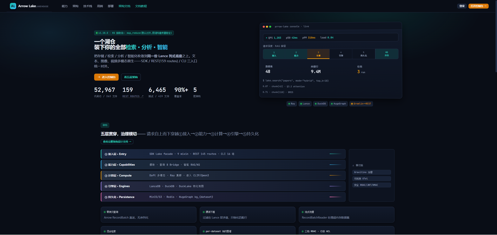
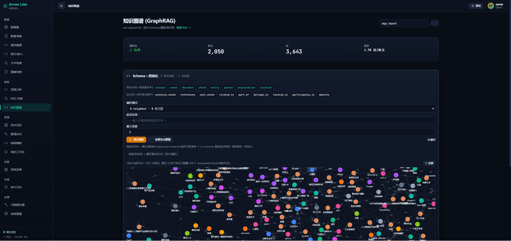
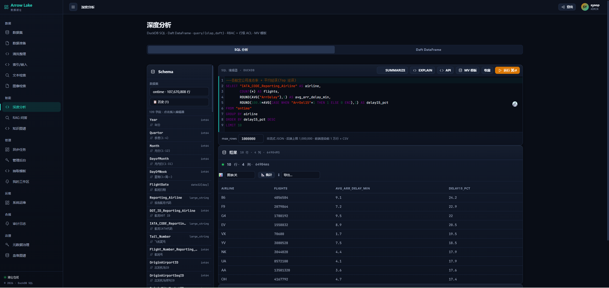

<div align="center">

# Arrow Lake

**The open-source multimodal data lakehouse for AI.**

Vectors · Full-text · SQL analytics · Knowledge Graph · GraphRAG · Document AI —
**one self-hosted platform**, not five tools stitched together.

[](#)
[](LICENSE)
[](#)
[](#)
[](#)
[](#)
[](#)
[](#)

**Repo:** [Gitee](https://gitee.com/wits__sunpw/wits-infra-dintellihub) · [GitHub mirror](https://github.com/Witshine/arrow-lake)

**English** | [中文](README.zh.md)

<p align="center">
  
</p>

</div>

---

## What is Arrow Lake

Arrow Lake is a **production-grade, multimodal data lakehouse** built for **enterprise AI teams and data platforms**. It unifies vector search, full-text search, SQL analytics, a knowledge graph, and a RAG engine behind **one `Lake` facade** — with shared storage, RBAC, lineage, and audit out of the box.

The core thesis is simple: most AI data stacks today are **glue code** — a vector DB here, an OLAP engine there, a graph store, an LLM framework, plus a hand-rolled auth/governance/UI layer wrapped around all of them. Arrow Lake collapses that sprawl into a single platform where **vector, full-text, SQL, graph, and RAG queries all run over the same dataset**, governed by the same identity and audit plane.

It is **self-hosted first**: your data, your models, your network, your compliance boundary. Deploy it from `pip` for a single node, from Docker Compose for a full stack, or from a Helm chart for Kubernetes. No vendor lock-in, no data egress, no per-seat licensing — Apache-2.0 licensed, built for adoption.

<p align="center">
  
</p>

---

## ✨ Core Capabilities

Arrow Lake is organized around **six pillars**. Each one is a first-class subsystem — not a thin wrapper — and they all share one storage layer, one identity model, and one audit trail.

### 🗄️ Unified Lakehouse

**One storage layer, one facade, one governance plane.** A single `Lake` object exposes datasets, search, SQL, graph, and RAG through a consistent Python API — and the same operations through 186 REST routes. Storage is Lance (columnar, multimodal, on object storage or local FS), so vectors, text, images, and structured fields live side-by-side in the same table. You stop maintaining five clients, five auth models, and five deployment manifests.

```python
from arrow_lake import Lake
lake = Lake("./my_lake")
# One facade → vector search, SQL, full-text, graph, RAG, governance.
```

### 🔎 Hybrid Search

**Vector + Tantivy full-text + RRF fusion — hybrid is the default, not an afterthought.**

- **Vector search** with cosine / L2 / dot metrics and **multiple index types** (`IVF_PQ`, `IVF_HNSW_PQ`, `IVF_FLAT`, `IVF_SQ`, `IVF_HNSW`) plus brute-force for small sets.
- **Full-text search** powered by Tantivy BM25, with **jieba tokenization** for CJK / Chinese text.
- **Hybrid retrieval** via Reciprocal Rank Fusion (RRF) — the recommended default — combining semantic and lexical signals.
- **Faceted search** for drill-down navigation, plus **ensemble cross-column fusion** for multi-field retrieval.

The same index and the same dataset serve all three modes. No separate search cluster, no secondary store to keep in sync.

### 🕸️ GraphRAG & Knowledge Graph

**HugeGraph + hyper-extract extraction — a real graph, not a bag of triples.**

- Per-dataset isolated knowledge graphs (`kg_{dataset}`) on HugeGraph, with Gremlin, shortest-path, and k-neighbor traversal.
- **GraphRAG** that injects entity-neighbor context into the LLM prompt, with **`relation_type` enrichment** so the model sees *how* entities connect, not just *that* they do.
- **Template-driven graph building** powered by [hyper-extract](https://github.com/hyper-extract) — strong-typed Knowledge Abstracts, 8 auto-types (graph, temporal, hypergraph, spatial…), and 80+ domain templates.
- Built-in **entity normalization** and **heuristic orphan-linking** to keep graphs connected and useful.

### 🧩 Knowledge Extraction Templates — v1.10.0 ⚑

**Author, bind, and validate extraction templates at runtime — no rebuild, no restart.** This is the headline release feature.

- **Dynamic loading** — drop a YAML template in and it is picked up live; the image never rebuilds and the service never restarts.
- **Console CRUD** — create, edit, list, and describe templates from the web UI.
- **Dataset binding** — bind a template to a dataset so `kg build` uses it automatically (`category↔doc_type` dynamic dictionary).
- **AI-assisted authoring** — generate a template draft from a prompt, then refine it.
- **Dry-run** — test a template against a sample before committing it to a full build.
- **Quality validation harness** — generate a synthetic doc → build a graph → visualize it → RAG over it → tear down, all from one page. Quantify orphan rate, relation-type coverage, and average degree before you ship a template.

### 💬 Production RAG

**Multi-provider, hybrid-by-default, with reranking and anti-hallucination checks.**

- **Multi-provider LLM** — OpenAI, Anthropic, vLLM, Ollama, DeepSeek, and Bailian (Alibaba Cloud MaaS) are all first-class.
- **Hybrid retrieval is the default** strategy (vector + FTS via RRF).
- **Three reranker families** — cross-encoder, LLM-judge, and **Ollama-hosted Qwen3-Reranker** (run fully offline).
- **Faithfulness verification** to suppress hallucinated answers.
- **HyDE** and **MultiQuery** query expansion, multi-turn **sessions**, **streaming** responses, and grounded **citations** with provenance.

### 🖼️ Multimodal & Document AI

**Text, images, audio, video, and documents — ingested, parsed, embedded, and searchable.**

- **Docling** document parsing (PDF / Office / HTML) with layout, table, and structure extraction — GPU-accelerated.
- **Image-to-image search** via CLIP-style embeddings, alongside text-to-image and text-to-text.
- **7 chunking strategies** for different content shapes.
- **OCR fallback** and structured-table extraction for scanned documents.

### 📊 Analytics

**DuckDB OLAP + Daft lazy DataFrame — from a one-off query to a Ray-distributed pipeline.**

- **DuckDB** for window functions, JOINs, streaming aggregation, and **materialized views** over Lance tables.
- **Daft** lazy DataFrame for Ray-distributed, out-of-core workloads — batch inference, large-scale transforms, and joins.
- A **Pivot helper** and `SUMMARIZE` for fast exploratory analysis.

### 🛡️ Governance & Security

**Enterprise controls built in, not bolted on.**

- **RBAC** with VIEWER / EDITOR / ADMIN roles, JWT + API-key **dual authentication**, and a Redis-backed token blacklist.
- **HMAC-SHA256 tamper-evident audit trail** and column-level **data masking**.
- **Gravitino 1.3.0** federation — tags, policies, model catalog, and retention rules across heterogeneous sources.
- **`system_db`** (libSQL) control plane for identities, RBAC, personal tokens, task history, and RAG sessions.
- **Helm chart** (HPA, Ingress, PDB, NetworkPolicy, CronJob backup) and **OpenTelemetry + Prometheus + Grafana** observability.

---

## Why Arrow Lake

Most AI data stacks are stitched together from five specialty tools, each excellent in isolation, none aware of the others. Arrow Lake replaces that glue code with one platform where everything is integrated.

| The pain of stitching 5 tools | What Arrow Lake gives you |
|---|---|
| 5 data stores + 5 clients + 5 auth models | **One `Lake` facade**, one storage layer, one RBAC model |
| "Which vector/SQL/graph tool for this query?" | **Unified search + SQL + graph** over the same dataset |
| RAG that ignores your domain structure | **GraphRAG + runtime-pluggable extraction templates** |
| No lineage, no audit, no governance | **Built-in lineage, HMAC audit, Gravitino governance** |
| A backend with no UI | **19-page operations console** (admin, KG viz, OLAP, lineage, template QA) |

**Four things that make it competitive:**

1. **Unified, not assembled** — vector + full-text + SQL + graph + RAG share one facade, one storage, one auth/lineage/audit plane.
2. **Native GraphRAG** — HugeGraph + hyper-extract extraction with template-driven graph building that loads new templates at runtime (no image rebuild, no restart).
3. **Real multimodal** — text, images, audio, vectors, Docling document parsing, and image-to-image search. Not just text embeddings.
4. **Production-ready by default** — RBAC, JWT, rate limiting, tamper-evident audit, Helm chart, and observability. Not a dev-only toy.

---

## 🖥️ Console

Arrow Lake ships a **native operations console** (vanilla JS, served by the API) — no separate frontend deployment, no CORS to manage.

- **Datasets** — browse, preview (paginated + search), schema with field comments, export
- **Knowledge Graph** — interactive `vis-network` / G6 graph visualization, GraphRAG Q&A with citations
- **OLAP Worksheet** — DuckDB SQL + Daft DataFrame + Pivot helper, RBAC-scoped
- **Lineage** — DAG visualization + event history
- **Extraction Templates** — YAML CRUD, AI generation, dry-run, and the **quality validation harness** (build a graph from a template and RAG over it)
- **Admin / Audit / Governance** — users, RBAC, tamper-evident audit, tags & masking policies

<table>
<tr>
<td align="center"><b>Overview</b><br></td>
<td align="center"><b>Knowledge Graph</b><br></td>
</tr>
<tr>
<td align="center"><b>OLAP Worksheet</b><br></td>
<td align="center"><b>Template QA (v1.10.0)</b><br></td>
</tr>
<tr>
<td align="center"><b>RAG Q&amp;A</b><br></td>
<td align="center"><b>Lineage</b><br></td>
</tr>
</table>

<sup>19 screenshots total in [`docs/assets/images/`](docs/assets/images/) — incl. login, datasets, ingest, data-prep, tidy/clean, index/embed, async tasks, docs.</sup>

---

## 🚀 Quickstart (30 seconds)

```bash
pip install arrow-lake
arrow-lake demo        # self-contained demo: vector + SQL + full-text search on synthetic data
```

Or in Python:

```python
from arrow_lake import Lake
import pyarrow as pa

lake = Lake("./my_lake")           # local FS storage — no MinIO, no Docker

table = pa.table({
    "id": ["1", "2", "3"],
    "text": ["machine learning", "deep learning", "data analytics"],
})
lake.create_dataset("articles", table)

# Vector search, full-text, hybrid, SQL — all on the same dataset
print(lake.search("articles", query="ML", top_k=3))
```

From `pip install` to first result in under a minute.

---

## 📊 How it compares

| Capability | Arrow Lake | LanceDB | DuckDB | Milvus / Qdrant | Dify | LangChain |
|---|:---:|:---:|:---:|:---:|:---:|:---:|
| Vector / hybrid search | ✅ | ✅ | — | ✅ | — | — |
| SQL OLAP analytics | ✅ | — | ✅ | — | — | — |
| Knowledge Graph + GraphRAG | ✅ | — | — | — | partial | partial |
| Template-driven extraction | ✅ | — | — | — | — | — |
| Document AI (Docling, multimodal) | ✅ | partial | — | — | partial | partial |
| Metadata governance (Gravitino) | ✅ | — | — | — | — | — |
| RBAC + audit + lineage (built-in) | ✅ | — | — | partial | partial | — |
| Operations console | ✅ | — | — | partial | ✅ | — |
| **Unified single platform** | ✅ | vector | OLAP | vector | LLM app | framework |

Each of those tools is excellent at its specialty. Arrow Lake is for teams that need **all of it, integrated**, without maintaining the glue.

### Why the RAG quality is different

Pure vector RAG (LangChain / LlamaIndex over a vector DB) retrieves by embedding similarity — it surfaces *passages*, blind to how entities relate. Arrow Lake's **GraphRAG** injects entity-neighbor context **with `relation_type` enrichment**, so the model sees *how* entities connect (caused, contains, references) — not just that they co-occur. On entity/relation-dense questions (regulations, incident chains, org structures) this is the difference between a generic summary and a precise, traceable answer.

It is backed by **template-driven extraction** (strong-typed Knowledge Abstracts, 80+ domain templates, loaded at runtime — no rebuild) and a **quality validation harness** that quantifies orphan rate, relation-type coverage, and average degree *before* you ship a template — turning KG quality from guesswork into a measurable gate.

---

## 🎯 Use cases

- **Enterprise document RAG** — ingest PDFs / Office docs, build a knowledge graph, answer with citations and provenance
- **Multimodal search** — text → image, image → image, and hybrid retrieval across modalities
- **GraphRAG / knowledge platforms** — domain-specific extraction templates producing structured entity-relation graphs
- **Self-service analytics** — SQL + DataFrame over the same lake that powers search and RAG
- **AI data layer for platforms** — one governed, audited, RBAC-protected backend for an internal AI product
- **Governed data products** — tag, mask, retain, and audit datasets across heterogeneous sources via Gravitino

**Validated on real-world large datasets:**

- **`ontime` — 107M rows, US airline on-time performance.** Analytical SQL (COUNT / GROUP BY / ORDER BY) that took **43 s** on pyarrow now runs in **0.3 s** with native scan (**145×**). A single self-hosted node serves airline-delay and route-performance analytics interactively — no OLAP cluster needed.
- **`noaa_china` — meteorological observations.** Nested `struct` location flattened to `longitude`/`latitude`, clean/writeback sustained at **10M+ rows/s**, then served for geographic climate analysis and time-series SQL.
- **Large-document RAG — 500+ page PDFs.** Docling GPU parsing (~1 s/page on RTX 3090) + hybrid retrieval + GraphRAG, end-to-end from upload to a cited answer.

---

## 📊 Benchmarks

A `@pytest.mark.benchmark` suite in `tests/benchmark/` measures every hot path on real code (no mocks): ingestion, vector / FTS / hybrid search, KG build, RAG, and the four benchmarks added in this release — **OLAP analytical SQL**, **document chunking**, **clean/writeback**, and **mixed-load concurrency**. Run the full 11-step suite with `bash deploy/scripts/run_critical_benchmarks.sh`, or one file with `.venv/bin/pytest tests/benchmark/test_bench_<name>.py -m benchmark -s`.

> **Environment**: Python 3.11.14 · WSL2 Linux x86_64 · 10 cores · DuckDB 1.5.5 · pylance 9.0.0 · lancedb 0.36.0. Numbers are the median of repeated runs (`BenchmarkReport`). Absolute values vary by hardware; the *shape* (where time goes, where throughput plateaus) is the durable finding.

**OLAP analytical queries** — `OlapSearchBridge.query`, the `/query/olap` path, on a synthetic `ontime`-schema dataset:

| Query shape | 10K rows | 100K rows |
|---|---|---|
| filter + order + limit | 0.178 s (56K rows/s) | 0.183 s (546K rows/s) |
| group-by carrier | 0.176 s (57K rows/s) | 0.180 s (554K rows/s) |
| route concat + HAVING | 0.190 s (53K rows/s) | 0.189 s (530K rows/s) |
| multi-key group-by year×month | 0.183 s (55K rows/s) | 0.176 s (568K rows/s) |

A 10× larger dataset adds **no measurable latency** — a ~180 ms per-query bridge overhead (register Lance → DuckDB view → SELECT → Arrow) dominates, while the DuckDB scan + aggregation itself is near-free up to 100K rows. Throughput therefore scales linearly with rows (56K → 554K rows/s).

**OLAP at scale — `ontime` 107M rows (real-world US airline dataset):**

| Query | pyarrow_fallback | **native scan** | speedup |
|---|---|---|---|
| COUNT(*) full scan | 43.4 s | **0.3 s** | **145×** |
| GROUP BY DayOfWeek (7 groups) | 40.7 s | **1.0 s** | **40×** |
| GROUP BY Origin (382 groups) | 51.3 s | **1.5 s** | **34×** |
| ORDER BY LIMIT 100 (107M sort) | 56.8 s | **3.1 s** | **18×** |

Native lance scan pushes aggregation / predicate / LIMIT down to the Rust scanner (zero-copy — no 9.8 GB materialization per query). Opt-in per dataset (`lance_scan_mode_overrides`), guarded by a **D-state circuit breaker** that auto-degrades to pyarrow on repeated stalls. Reproduce: `tests/benchmark/olap_ontime_benchmark.py`.

**Document chunking** — `DocumentChunker.chunk`, the CPU front of the ingest pipeline:

| Workload | Throughput |
|---|---|
| Recursive (20 pages, 512/50) | ~37K pages/s (~185K chunks/s → 100 chunks) |
| Page strategy | ~1.16M pages/s |
| Paragraph strategy | ~560K pages/s |
| Recursive (100 pages) | ~38K pages/s (500 chunks) |
| chunk_size 256 / 512 / 1024 | ~34–38K pages/s (200 / 100 / 40 chunks) |

Chunking is never the ingest bottleneck — recursive splits run at ~37K pages/s, and `chunk_size` changes only the chunk count, not throughput.

**Clean / writeback** — the `POST /clean` path (read → DuckDB transform → `restore_dataset`):

| Stage | 10K rows | 100K rows |
|---|---|---|
| full read → transform → writeback | 0.023 s (436K rows/s) | 0.059 s (1.68M rows/s) |
| read dataset | 2.43M rows/s | 4.10M rows/s |
| DuckDB transform | 915K rows/s | 5.77M rows/s |
| `restore_dataset` write | 1.70M rows/s | 9.45M rows/s |

Writeback scales super-linearly (436K → 1.68M rows/s); at 100K rows no single stage dominates.

**Mixed-load concurrency** — 300 ops (100 each vector / FTS / OLAP) under a `ThreadPoolExecutor` worker sweep:

| Workers | QPS | Wall time |
|---|---|---|
| 1 | 8.3 | 36.4 s |
| 5 | 10.2 | 29.3 s |
| 10 | 10.4 | 29.0 s |
| 20 | 10.4 | 28.8 s |

Throughput **plateaus at ~10 QPS by 5 workers** — extra concurrency buys nothing. This is the sync-query contention ceiling (GIL + DuckDB session pool + Lance scan) on one node, and is the empirical basis for the async-query track (v1.8.0 #17).

---

## 📚 Documentation & Cookbook

### Cookbook (bilingual EN / ZH)

The cookbook is the primary hands-on guide — **20 chapters** (00–19), 90 runnable examples.

| # | Chapter | SDK examples | REST examples |
|---|---|---|---|
| 00 | [Overview (start here)](docs/cookbook/00-overview.md) | — | — |
| 01 | [Quick Start](docs/cookbook/01-quickstart.md) | — | — |
| 02 | [Data Ingestion](docs/cookbook/02-ingestion.md) | `01_ingest_basics.py` | `02_ingest_file_http.py` |
| 03 | [Configuration](docs/cookbook/03-configuration.md) | — | — |
| 04 | [Vector Search & Indexing](docs/cookbook/04-vector-search.md) | `02_search_and_index.py` | `03_search_vector_fts_hybrid.py` |
| 05 | [Full-Text Search](docs/cookbook/05-fulltext-search.md) | — | — |
| 06 | [Hybrid & Faceted Search](docs/cookbook/06-hybrid-faceted.md) | `23_faceted_search.py` | — |
| 07 | [OLAP Analytics](docs/cookbook/07-olap-analytics.md) | `03_olap_and_export.py` | `04_olap_export_backup.py` |
| 08 | [RAG Pipeline](docs/cookbook/08-rag-pipeline.md) | `20_rag_qa_system.py` | `06_rag_pipeline.py` |
| 09 | [Knowledge Graph & GraphRAG](docs/cookbook/09-knowledge-graph.md) | `19_knowledge_graph_build.py` | `07_knowledge_graph.py` |
| 10 | [REST API Guide](docs/cookbook/10-rest-api.md) | — | (all `examples_api/`) |
| 11 | [Quality & Deduplication](docs/cookbook/11-quality-dedup.md) | `04_quality_and_dedup.py` | `08_quality_dedup.py` |
| 12 | [Deployment & Operations](docs/cookbook/12-deployment.md) | — | — |
| 13 | [CLI Complete Reference](docs/cookbook/13-cli-reference.md) | — | — |
| 14 | [Workflow Orchestration](docs/cookbook/14-workflow-orchestration.md) | — | — |
| 15 | [Gravitino Metadata Governance](docs/cookbook/15-gravitino-metadata.md) | `08_catalog_management.py` | — |
| 16 | [v1.8.0 New Features](docs/cookbook/16-v1.8.0-new-features.md) | — | — |
| 17 | [Data Masking](docs/cookbook/17-data-masking.md) | — | — |
| 18 | [Lineage Visualization](docs/cookbook/18-lineage-visualization.md) | — | `09_lineage_audit.py` |
| 19 | [REST Recipes](docs/cookbook/19-rest-recipes.md) | — | — |

> **Learning path:** getting started 01→02→03 · search 04→05→06 · AI 07→08→09 · production 10→11→12

**Runnable examples** — 51 SDK scripts in [`docs/cookbook/examples/`](docs/cookbook/examples/) and 39 REST scripts in [`docs/cookbook/examples_api/`](docs/cookbook/examples_api/), including the v1.10.0 **template-management** scripts (`examples/46_template_management.py`, `examples_api/34_extraction_templates_api.py`).

### Reference docs

- 🏗️ [**Architecture**](docs/architecture-design/ARCHITECTURE.md) — the authoritative technical reference (17 chapters: layers, facades, data flow + 8 diagrams & appendices A–E)
- 📦 [Product introduction](docs/arrow-lake-product-introduction.md) — capabilities overview
- 🔒 [Security policy](SECURITY.md) — auth, RBAC, audit, transport
- 🤝 [Contributing](CONTRIBUTING.md) — dev setup and standards
- 📒 [Changelog](CHANGELOG.md) — version history
- 🌐 [API docs](http://localhost:8000/docs) — OpenAPI / Swagger (running instance)
- 📖 [Cookbook index](docs/cookbook/README.md) — full table of contents

---

## Installation

**pip** (library / single-node)
```bash
pip install "arrow-lake[fts,rag,he,document]"
```

**Docker Compose** (full stack, profile-based)
```bash
git clone <repo> && cd wits-infra-dintellihub
docker compose -f deploy/docker-compose.prod_minimal.yml up -d
# API: http://127.0.0.1:8000  ·  Console: http://127.0.0.1:8000/console/
```

**Kubernetes** (production)
```bash
helm install arrow-lake deploy/helm/arrow-lake/
```

## CLI

```bash
arrow-lake demo                        # interactive demo
arrow-lake serve                       # REST API server
arrow-lake ingest files my_data *.csv
arrow-lake search vector my_data --query "ML" --top-k 5
arrow-lake query sql my_data --sql "SELECT * FROM my_data LIMIT 10"
arrow-lake kg build my_data            # build knowledge graph
arrow-lake kg build my_data --template project_concept_graph   # v1.10.0 template override
arrow-lake rag query "..." --dataset docs
```

## Configuration

34 independent config sections, 4-layer precedence: **defaults → `.env` → env vars (`ARROW_LAKE__` prefix) → YAML**.

```python
lake = Lake("./data")                       # local, minimal
lake = Lake.from_yaml("configs/prod.yaml")  # production
```

---

## Project status

Stable and in production use. Current release: **v1.10.4** — v1.10.0 knowledge extraction template management (M1–M5: dynamic loading, CRUD, binding, AI authoring, dry-run, quality validation harness) + v1.10.1 stability & governance hardening (docling GPU triton JIT fix, KG template fallback path, config consolidation, examples→cookbook) + **v1.10.2 text-document incremental build (ingest/KA/KG incremental), performance benchmark suite expansion, and timeout/reliability hardening (OLAP `conn.interrupt()` watchdog so a stuck scan can't strand the pool, async-task heartbeat + orphan reaper so worker death can't strand a task in `running`, and per-call timeouts across the ingest chain), with an SSD performance re-baseline** + v1.10.3 docling throughput & quality (ThreadedPdfPipelineOptions page-batching to saturate GPU, RapidOCR, confidence-gated OCR retry, page-image export for ColPali/CLIP multimodal RAG, baked bge-m3 tokenizer for offline HybridChunker) + **v1.10.4 per-dataset native lance scan opt-in + D-state circuit breaker (large vector-free datasets 34–145× faster via Rust aggregation pushdown; breaker auto-degrades to pyarrow on repeated D-state), OLAP result pagination + per-field distribution stats, multi-statement SQL guard, and structlog level filtering / gravitino sync log-noise reduction**. See [CHANGELOG](CHANGELOG.md) for the full history and roadmap direction (deeper multimodal, distributed scale-out, more extraction backends).

- **6,100+ tests**, 90%+ coverage, zero high-severity security findings (bandit)
- **186 REST routes** across 22 routers
- Key deps: LanceDB 0.36.0 · DuckDB 1.5.5 · Daft 0.7.21 · Gravitino 1.3.0 · HugeGraph · Docling
- Trunk-based development, frequent releases

## Community

- 💬 [Issues / Q&A](https://gitee.com/wits__sunpw/wits-infra-dintellihub/issues)
- 🤝 [Contributing guide](CONTRIBUTING.md) · [Code of Conduct](CODE_OF_CONDUCT.md)
- 💼 **Commercial support / consulting / custom integration** welcome — reach out via Issues.

### 👥 Maintainer

- **Witshine** ([@Witshine](https://github.com/Witshine)) — architecture, core engine, and battle-testing on real enterprise data platforms (100M+ row analytics, large-document parsing, GraphRAG knowledge platforms).

Arrow Lake is built from production needs, not a demo. Contributions — code, docs, domain templates, bug reports — are very welcome; please open an issue first for non-trivial changes.

Contributions (code, docs, templates, bug reports) are very welcome. Please open an issue first for non-trivial changes.

## License

[Apache License 2.0](LICENSE) — © 2026 Witshine.

Apache-2.0 lets you use, modify, and distribute Arrow Lake freely (including commercially), as long as attribution and the license notice are retained. Built for adoption — and for the consulting/projects that follow it.
