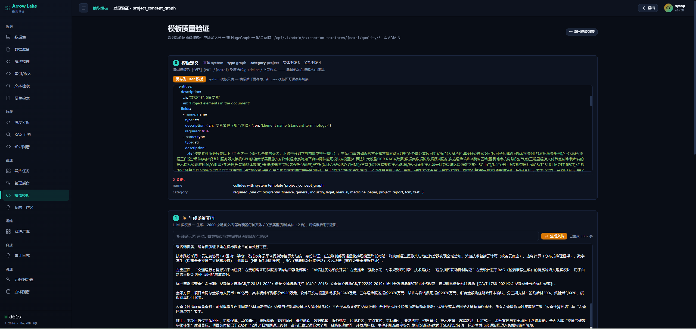
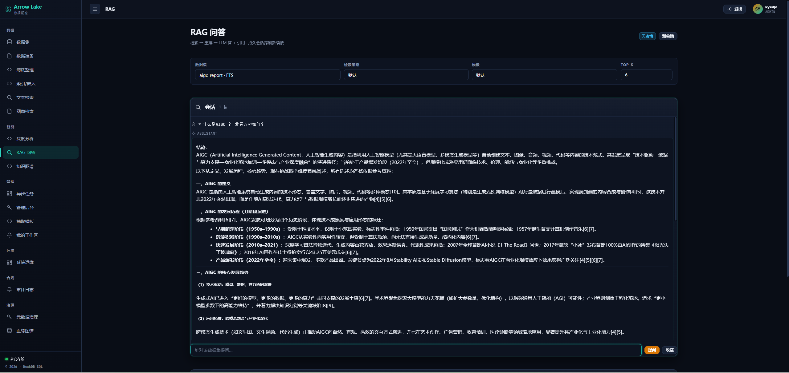
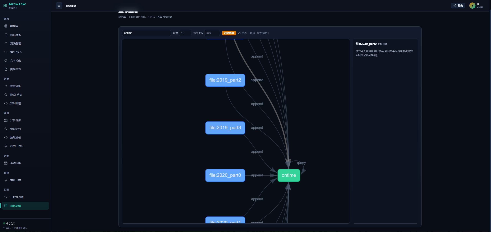

<div align="center">

# Arrow Lake

**The open-source multimodal data lakehouse for AI.**

Vectors · Full-text · SQL analytics · Knowledge Graph · GraphRAG · Document AI — **one self-hosted platform**, not five tools stitched together.

[](#)
[](LICENSE)
[](#)
[](#)
[](#)
[](#)

**Repository:** [Gitee](https://gitee.com/wits__sunpw/wits-infra-dintellihub) · [GitHub mirror](https://github.com/Witshine/arrow-lake) _(adjust mirror URL after creating)_

**English** | [中文](README.zh.md)

</div>

---

## What is Arrow Lake

Arrow Lake is a **production-grade, multimodal data lakehouse** built for **enterprise AI teams and data platforms**. Instead of wiring together a vector DB, an OLAP engine, a graph store, an LLM/RAG framework, a governance layer, and a UI — Arrow Lake unifies them behind **one `Lake` facade**, with shared storage, RBAC, lineage, and audit out of the box.

It is **self-hosted first**: your data, your models, your network. Run it from `pip`, Docker Compose, or Kubernetes (Helm).

<p align="center">
  
</p>

## Why Arrow Lake

Most AI data stacks today are **glue code** — LanceDB for vectors, DuckDB for SQL, HugeGraph for graphs, LangChain for RAG, plus a hand-rolled auth/governance/UI layer around all of them. Arrow Lake collapses that into a single platform:

| The pain of stitching | What Arrow Lake gives you |
|---|---|
| 5 data stores + 5 clients + 5 auth models | **One `Lake` facade**, one storage layer, one RBAC model |
| "Which vector/SQL/graph tool for this query?" | **Unified search + SQL + graph** over the same dataset |
| RAG that ignores your domain structure | **GraphRAG + pluggable extraction templates** (v1.10.0) |
| No lineage, no audit, no governance | **Built-in lineage, HMAC audit, Gravitino governance** |
| A backend with no UI | **16+ page operations console** (admin, KG viz, OLAP worksheet, lineage, template QA) |

**Four things that make it competitive:**

1. **Unified, not assembled** — vector + full-text + SQL + graph + RAG share one facade, one storage, one auth/lineage/audit plane.
2. **Native GraphRAG** — HugeGraph + hyper-extract knowledge extraction with **template-driven graph building** that loads new templates at runtime (**no image rebuild, no restart**).
3. **Real multimodal** — text, images, audio, vectors, plus Docling document parsing and image-to-image search. Not just text embeddings.
4. **Production-ready by default** — RBAC, JWT, rate limiting, tamper-evident audit, Helm chart, observability. Not a dev-only toy.

## Key features

| Area | Capabilities |
|---|---|
| 🔎 **Search** | Vector (cosine/L2/dot; IVF_PQ/IVF_FLAT/IVF_HNSW_PQ), Tantivy full-text (jieba CJK), **hybrid RRF**, faceted, ensemble cross-column fusion |
| 🧠 **RAG** | Multi-provider LLM (OpenAI/Anthropic/vLLM/Ollama/DeepSeek/Bailian), sessions, streaming, citations, **cross-encoder / LLM / Ollama reranking**, faithfulness verification, HyDE / MultiQuery, multi-turn |
| 🕸️ **Knowledge Graph & GraphRAG** | HugeGraph: build, Gremlin query, shortest-path, k-neighbor; **GraphRAG** with KG-injected context; **template-based extraction** (hyper-extract) |
| 🧩 **Extraction Templates (v1.10.0)** | CRUD console + AI-assisted authoring + dataset binding + dry-run + **template quality validation harness** (generate doc → build graph → visualize → RAG → cleanup); `category↔doc_type` dynamic dictionary |
| 📊 **Analytics** | DuckDB OLAP (window, JOIN, streaming, materialized views) + Daft lazy DataFrame (Ray-distributed) |
| 📄 **Document AI** | PDF/Office/HTML → Docling parse → chunk → embed → Lance; 7 chunking strategies; OCR fallback; image-to-image search |
| 🛡️ **Security & Governance** | RBAC (VIEWER/EDITOR/ADMIN), JWT + API-key dual auth, Redis-backed blacklist, rate limiting, **HMAC-SHA256 audit trail**, Gravitino 1.3.0 federation (tags/policies/model catalog), **column-level masking** |
| 🖥️ **Console** | 16+ pages: datasets, KG visualization, OLAP SQL worksheet, lineage graph, extraction-template manager, template QA, admin, audit, governance |
| 🚀 **Ops** | Docker Compose (profile-based), **Helm chart** (HPA, Ingress, PDB, NetworkPolicy, CronJob backup), OpenTelemetry + Prometheus + Grafana |

## Console

Arrow Lake ships a native operations console (vanilla JS, served by the API) — no separate frontend deployment:

- **Datasets** — browse, preview (paginated + search), schema with field comments, export
- **Knowledge Graph** — interactive `vis-network` graph, GraphRAG Q&A with citations
- **OLAP Worksheet** — DuckDB SQL + Daft DataFrame + Pivot helper, RBAC-scoped
- **Lineage** — DAG visualization + event history
- **Extraction Templates** — YAML CRUD, AI generation, dry-run, quality validation (build a graph from a template and RAG over it)
- **Admin / Audit / Governance** — users, RBAC, tamper-evident audit, tags & masking policies

<table>
<tr>
<td align="center"><b>Overview</b><br></td>
<td align="center"><b>Knowledge Graph</b><br></td>
</tr>
<tr>
<td align="center"><b>OLAP Worksheet</b><br></td>
<td align="center"><b>Template QA (v1.10.0)</b><br></td>
</tr>
<tr>
<td align="center"><b>RAG Q&amp;A</b><br></td>
<td align="center"><b>Lineage</b><br></td>
</tr>
</table>

<sup>19 screenshots total in [`docs/asserts/images/`](docs/asserts/images/) — incl. login, datasets, ingest, data-prep, tidy/clean, index/embed, async tasks, docs.</sup>

## Quickstart (30 seconds)

```bash
pip install arrow-lake
arrow-lake demo        # self-contained demo: vector + SQL + full-text search on synthetic data
```

Or in Python:

```python
from arrow_lake import Lake
import pyarrow as pa

lake = Lake("./my_lake")           # local FS storage — no MinIO, no Docker

table = pa.table({
    "id": ["1", "2", "3"],
    "text": ["machine learning", "deep learning", "data analytics"],
})
lake.create_dataset("articles", table)

# Vector search, full-text, hybrid, SQL — all on the same dataset
print(lake.search("articles", query="ML", top_k=3))
```

From `pip install` to first result in under a minute.

## How it compares

| Capability | Arrow Lake | LanceDB | DuckDB | Milvus / Qdrant | Dify | LangChain |
|---|:---:|:---:|:---:|:---:|:---:|:---:|
| Vector / hybrid search | ✅ | ✅ | — | ✅ | — | — |
| SQL OLAP analytics | ✅ | — | ✅ | — | — | — |
| Knowledge Graph + GraphRAG | ✅ | — | — | — | partial | partial |
| Template-driven extraction | ✅ | — | — | — | — | — |
| Document AI (Docling, multimodal) | ✅ | partial | — | — | partial | partial |
| Metadata governance (Gravitino) | ✅ | — | — | — | — | — |
| RBAC + audit + lineage (built-in) | ✅ | — | — | partial | partial | — |
| Operations console | ✅ | — | — | partial | ✅ | — |
| **Unified single platform** | ✅ | vector | OLAP | vector | LLM app | framework |

Each of those tools is excellent at its specialty. Arrow Lake is for teams that need **all of it, integrated**, without maintaining the glue.

## Use cases

- **Enterprise document RAG** — ingest PDFs/Office, build a knowledge graph, answer with citations and provenance
- **Multimodal search** — text→image, image→image, hybrid retrieval across modalities
- **GraphRAG / knowledge platforms** — domain-specific extraction templates, structured entity-relation graphs
- **Self-service analytics** — SQL + DataFrame over the same lake that powers search and RAG
- **AI data layer for platforms** — one governed, audited, RBAC-protected backend for an internal AI product

## Installation

**pip** (library / single-node)
```bash
pip install "arrow-lake[fts,rag,he,document]"
```

**Docker Compose** (full stack, profile-based)
```bash
git clone <repo> && cd wits-infra-dintellihub
docker compose -f deploy/docker-compose.prod_minimal.yml up -d
# API: http://127.0.0.1:8000  ·  Console: http://127.0.0.1:8000/console/
```

**Kubernetes** (production)
```bash
helm install arrow-lake deploy/helm/arrow-lake/
```

## CLI

```bash
arrow-lake demo                        # interactive demo
arrow-lake serve                       # REST API server
arrow-lake ingest files my_data *.csv
arrow-lake search vector my_data --query "ML" --top-k 5
arrow-lake query sql my_data --sql "SELECT * FROM my_data LIMIT 10"
arrow-lake kg build my_data            # build knowledge graph
arrow-lake kg build my_data --template project_concept_graph   # v1.10.0 template override
arrow-lake rag query "..." --dataset docs
```

## Configuration

27 independent config sections, 3-layer precedence: **defaults → env vars (`ARROW_LAKE__` prefix) → YAML**.

```python
lake = Lake("./data")                       # local, minimal
lake = Lake.from_yaml("configs/prod.yaml")  # production
```

## Documentation

- 📖 [Cookbook](docs/cookbook/README.md) — 15 chapters, 45+ examples (bilingual EN/ZH)
- 🏗️ [Architecture](docs/ARCHITECTURE.md) — authoritative technical reference
- 🎨 [Product introduction](docs/arrow-lake-product-introduction.md) — capabilities overview
- 🔒 [Security policy](SECURITY.md) — auth, RBAC, audit, transport
- 🤝 [Contributing](CONTRIBUTING.md) — dev setup and standards
- 📒 [Changelog](CHANGELOG.md) — version history
- 🌐 [API docs](http://localhost:8000/docs) — OpenAPI/Swagger (running instance)

## Project status

Stable and in production use. Current release: **v1.10.0** (knowledge extraction template management — M1–M5). See [CHANGELOG](CHANGELOG.md) for the full history and roadmap direction (deeper multimodal, distributed scale-out, more extraction backends).

- **6,100+ tests**, 90%+ coverage, zero high-severity security findings (bandit)
- **186 REST routes** across 22 routers
- Trunk-based development, frequent releases

## Community

- 💬 [Issues / Q&A](https://gitee.com/wits__sunpw/wits-infra-dintellihub/issues)
- 🤝 [Contributing guide](CONTRIBUTING.md) · [Code of Conduct](CODE_OF_CONDUCT.md)
- 💼 **Commercial support / consulting / custom integration** welcome — reach out via Issues.

Contributions (code, docs, templates, bug reports) are very welcome. Please open an issue first for non-trivial changes.

## License

[Apache License 2.0](LICENSE) — © 2026 Witshine.

Apache-2.0 lets you use, modify, and distribute Arrow Lake freely (including commercially), as long as attribution and the license notice are retained. Built for adoption — and for the consulting/projects that follow it.
