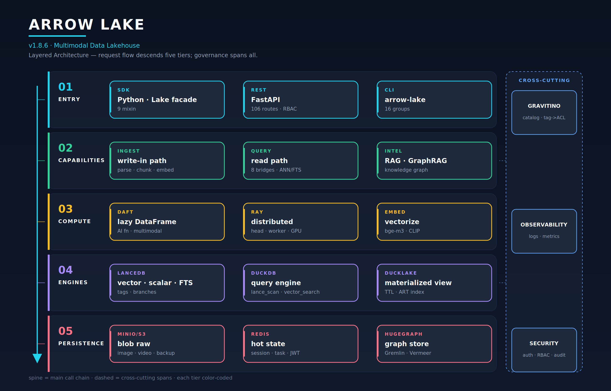
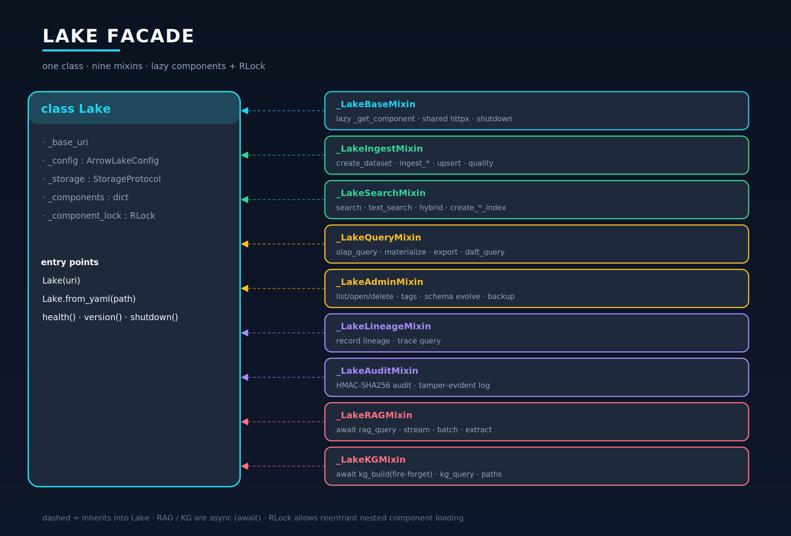
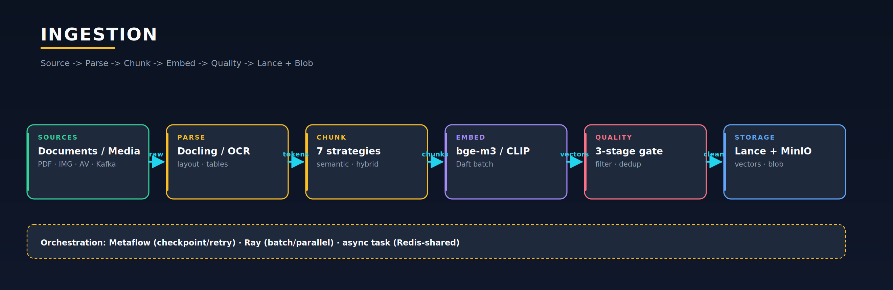
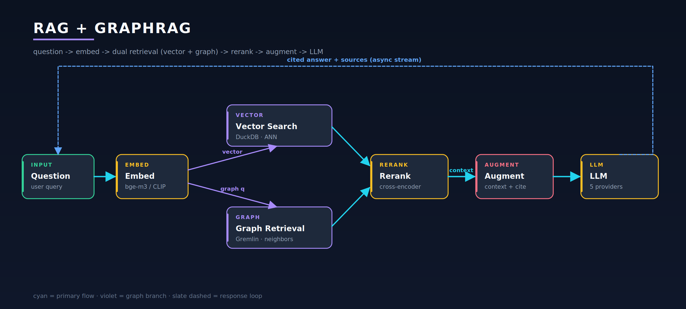
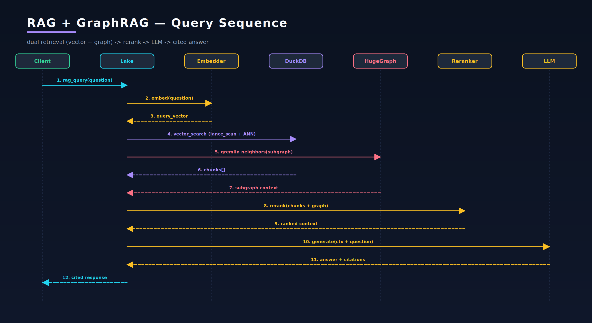
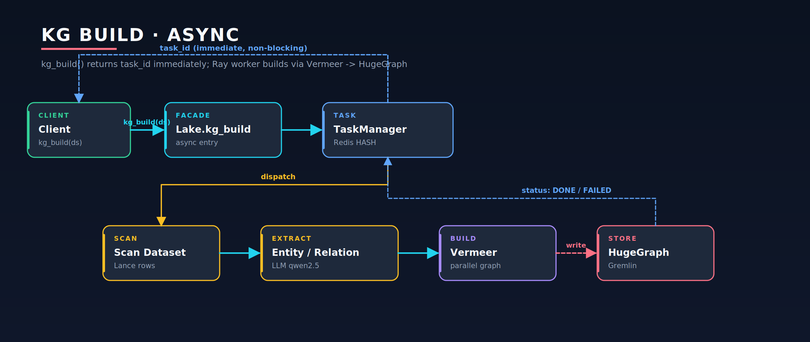
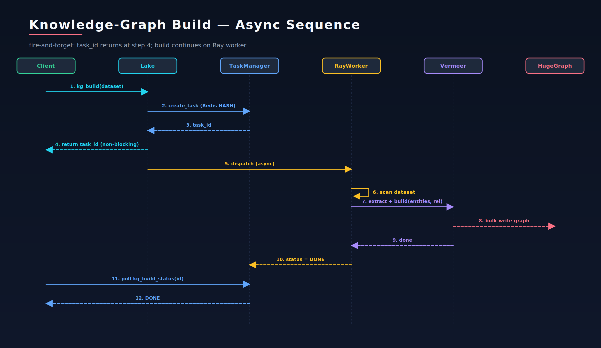
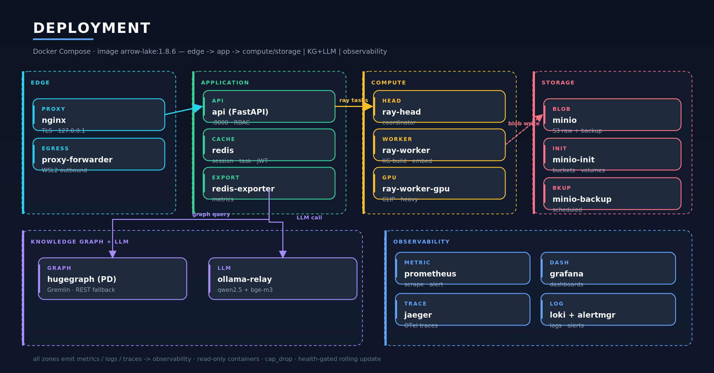

# Arrow Lake — 架构设计技术文档

> **版本基线**：v1.10.0（[`arrow_lake/_version.py`](../../arrow_lake/_version.py) = `pyproject.toml` = 1.10.0）
> **文档日期**：2026-08-03
> **状态**：随主干演进，与代码当前态对齐。v1.9.0 起**控制面库（libSQL/Turso `system_db`）**落地（接管 RBAC/identity/personal_token/catalog/任务/lineage/RAG 会话/governance，**数据面零改动**），**console** 运维/合规/治理前端完备（v1.9.1–v1.9.2）；v1.9.3–v1.9.6 增量（数据集字段注释/清洗、血缘审计、RAG 质量全链路、RAG 防幻觉+cross-encoder reranker、KG snap/strict/三路并行、lineage 可视化、masking 治理、fail-closed 安全加固、镜像模型 bake）；**v1.10.0 知识抽取模板管理**（前端模板 CRUD + 后端按新模板动态抽取建图不 rebuild/restart + LLM 辅助生成 + dry-run 试跑 + 质量验证 harness + category↔doc_type 拉通 + V005/V006/V007 迁移）。详见 [`v1.9.6-architecture-design.md`](./v1.9.6-architecture-design.md)。
> **语言约定**：中文正文、英文图注（技术图惯例 + 渲染稳定）

本文是 Arrow Lake 的**完备架构设计文档**：以 8 张 Midnight Blueprint 设计图为视觉骨架，覆盖定位、顶层架构、五层详解、模块全景、核心业务流程、横切关注点、运维与演进。每一层、每一个模块、每一条核心流程都有独立章节；核心流程章指路 `cookbook` 实战与各版本实现方案/ADR/优化 plan，不重复造轮子。

---

## 目录

- [第 0 部分 · 前言](#第-0-部分--前言)
- [第 1 部分 · 总览](#第-1-部分--总览)
- [第 2 部分 · 分层架构详解](#第-2-部分--分层架构详解)
- [第 3 部分 · 模块全景](#第-3-部分--模块全景)
- [第 4 部分 · 核心业务流程](#第-4-部分--核心业务流程)
- [第 5 部分 · 横切关注点](#第-5-部分--横切关注点)
- [第 6 部分 · 运维与演进](#第-6-部分--运维与演进)
- [附录](#附录)

---

# 第 0 部分 · 前言

## 0.1 文档定位

Arrow Lake 是一个**生产级、统一的多模态数据湖仓（Unified Multimodal Data Lakehouse）**。它把"存储 / 检索 / 分析 / 智能化"四件事收敛到一个面向 Python SDK、REST、CLI 三种入口的统一 facade 之后，核心命题是：**用一份 Lance 列式湖仓底座，同时承载向量检索（ANN）、全文检索（BM25）、OLAP 分析、RAG 问答与知识图谱（KG）**，并原生支持文本 / 图像 / 视频多模态。

本文档面向：**新成员上手、架构评审、演进决策、跨团队对齐**。读完后应能回答：系统为什么这样切分？每个模块的职责边界在哪？一条请求如何穿越系统？在什么基础设施下能跑、缺了什么会怎样？

## 0.2 与既有文档的关系

本仓库已有大量高质量材料，本文**综合而非取代**它们，分工如下：

| 既有材料 | 定位 | 本文关系 |
|---|---|---|
| [`docs/ARCHITECTURE.md`](../ARCHITECTURE.md)（990 行权威文本参考） | 逐项核实源码的技术参考 | 本文以图为骨架重组其要点，深度 API 细节回链 |
| [`docs/cookbook/`](../cookbook/)（16 章实战手册） | 可跑的 how-to | 本文 §4 流程章指路对应 cookbook 章 |
| [`CHANGELOG.md`](../../CHANGELOG.md) | 变更流水 | 本文 §6.4 抽取架构级变更 |

## 0.3 读图约定与图集索引

本文 8 张图均为 **Midnight Blueprint** 设计语言：深蓝渐变底、层级色编码（青=接入 / 翡翠=能力 / 琥珀=计算 / 紫=引擎 / 玫红=持久化 / 蓝=横切）、深色玻璃节点卡、强调色箭头。SVG 为主格式（浏览器原生渲染、可缩放），PNG 为 2× 高清备份。

| # | 图名 | 文件 | 嵌入章节 |
|---|---|---|---|
| 1 | 五层架构 | `diagrams/01-layered-architecture` | §1.4 |
| 2 | 多模态摄取流水线 | `diagrams/02-ingestion-pipeline` | §4.1 |
| 3 | RAG + GraphRAG 查询流 | `diagrams/03-rag-kg-query-flow` | §4.4 |
| 4 | KG 异步构建流水线 | `diagrams/04-kg-build-pipeline` | §4.5 |
| 5 | 部署拓扑 | `diagrams/05-deployment-topology` | §6.1 |
| 6 | RAG 查询时序图 | `diagrams/06-rag-query-sequence` | §4.4 |
| 7 | KG 构建时序图 | `diagrams/07-kgbuild-sequence` | §4.5 |
| 8 | Lake Facade + 9 mixin | `diagrams/08-lake-facade-mixins` | §3.0 |

图集由 `diagrams/gen_midnight.py` 程序化产出；修改重跑 `python3 gen_midnight.py`，再用 cairosvg 批量导出 PNG。

---

# 第 1 部分 · 总览

## 1.1 产品定位与核心命题

传统智能检索架构往往是"向量库 + 关系库 + 图谱 + 检索系统"拼装四个组件，数据要跨组件搬运、一致性难保证、运维复杂。Arrow Lake 的命题是**收敛**：一份列式湖仓底座同时承载五类能力，三种入口归一到同一个 `Lake` facade，原生多模态。

**五类能力一体**：

| 能力 | 引擎 | 入口 |
|---|---|---|
| 向量检索（ANN） | Lance 索引（IVF_PQ/HNSW/SQ/RQ）经 DuckDB `vector_search` | `Lake.search()` |
| 全文检索（BM25） | Lance FTS 倒排（Tantivy） | `Lake.text_search()` |
| OLAP 分析 | DuckDB `lance_scan` | `Lake.olap_query()` |
| RAG 问答 | RAGPipeline + 5 LLM + Reranker + GraphRAG | `await Lake.rag_query()` |
| 知识图谱 | HugeGraph（Gremlin）+ Vermeer 构建 | `await Lake.kg_build()` / `kg_query()` |

**多模态**：文本（bge-m3，1024 维）、图像（CLIP text+image 双塔）、音频/视频（Whisper/decode）统一进 Lance 多模态向量列 + MinIO blob 原文，支持文搜图 / 图搜图 / 图搜文。

## 1.2 技术栈 — DARMU

记忆口诀 **DARMU**（Daft + Arrow/Lance + Ray + Metaflow + dUckdb），外加 HugeGraph 图谱层与 Gravitino 治理层：

| 层 | 技术 | 角色 | 选型依据（ADR/plan） |
|---|---|---|---|
| 计算层 | **Daft** | lazy DataFrame + 内置 AI 函数 + 26 连接器 + 多模态 decode | — |
| 湖仓格式 | **Lance / pylance** | 列式 + 向量索引 + 标量索引 + FTS + tags/branches | — |
| 应用层 | **LanceDB** | 向量库 SDK：Table / Namespace / 索引 / 版本 | — |
| 分布式 | **Ray** | head + worker + GPU；KG 构建 / 批嵌入 | — |
| 编排 | **Metaflow** | 工作流 + checkpoint + retry/backoff + Argo 桥 | — |
| 引擎层 | **DuckDB** | **主力查询路径**（`lance_scan` / `vector_search` / `fts`） | ADR-05/06/07 |
| 物化层 | **DuckLake** | 跨存储物化视图（TTL + ART index + 行预算） | — |
| 图谱 | **HugeGraph** | 知识图谱存储 + Gremlin 遍历；Vermeer 构建 | — |
| 治理 | **Apache Gravitino** | 统一 catalog + tag-driven ACL + masking + retention | — |
| 对象存储 | **MinIO / S3** | blob 原文 + 备份 | — |
| 缓存/任务 | **Redis** | 分布式会话 + JWT 黑名单 + 异步任务跨 worker 共享 + rate_limit/login lockout（v1.9.2） | — |
| **控制面** | **libSQL / Turso（sqld）** | **v1.9.0 控制面库**：RBAC / identity / personal_token / catalog 注册 / 任务历史 / lineage 索引 / RAG 会话 / governance；**数据面不触碰**；opt-in + fail_close/fail_soft | — |
| 前端 | **Console** | v1.9.1 起（v1.9.2 完备）运维/合规/治理 Web 控制台（原生 JS + ES module，同源 mount `/console`，复用 REST + RBAC） | — |

> **关键澄清**：DuckDB 是**主力查询路径**而非 fallback。`olap_query` / `vector_search` / `fts` 全部由 DuckDB 执行（40+ 处调用），LanceDB 提供 Table/索引/版本管理 API。DuckLake 在其上提供物化视图。三者分工见 ADR-06（[DuckDB OLAP + DuckLake 评估](./adrs/adr-06-duckdb-olap-and-ducklake-evaluation.md)）与 ADR-07（[DuckDB 高可用](./adrs/adr-07-duckdb-high-availability.md)）。

## 1.3 设计哲学

1. **Facade + Mixin + Bridge + Protocol 组合** —— 一个 `Lake` 对象拥有全部能力，内部按子系统懒加载、按能力桥接。
2. **优雅降级是一等公民** —— Ray 不可用→本地、NeMo→CPU MinHash、KG→Vector RAG、Gremlin→REST。系统在不完整基础设施下持续服务（详见 §5.3）。
3. **配置驱动、四层覆盖** —— 代码默认 < `.env` < 环境变量 < YAML，34 个子配置覆盖每个子系统。
4. **压测驱动、不做投机性优化** —— v1.8.0 用 gate 框架对 async / 分布式索引 / ColBERT 逐项裁决，数据证明该做才做（见 §6.4）。

## 1.4 顶层五层架构

Arrow Lake 采用**严格五层架构**：请求自上而下穿越 **① 接入 → ② 能力 → ③ 计算 → ④ 存储引擎 → ⑤ 持久化**，**治理 / 可观测 / 安全**作为横切面贯穿全部层级。每层只依赖其直接下一层；横切面经 hook / 中间件作用于各层，不进入主调用链；知识图谱是能力层直达持久化的唯一旁路。



**读图**：左侧青色主轴 = 主调用链方向；右侧 ⟂ 横切面（治理 / 可观测 / 安全）虚线作用于能力层与引擎层；每层一种色带。

| 层 | 职责 | 关键组件 |
|---|---|---|
| ① 接入 | 四入口归一；认证 / 限流 / 路由 | `Lake` facade · FastAPI（**186 routes · 22 routers**）· CLI（16 命令组）· **Console**（v1.9.1） |
| ② 能力 | 业务能力：写进去、查出来、问答 | 摄取 · 查询（8 Bridge）· 智能（RAG / KG） |
| ③ 计算 | 批处理 / 分布式 / 嵌入 | Daft · Ray · 嵌入器（Local / Daft / CLIP / RayServe） |
| ④ 存储引擎 | 向量 / 标量 / FTS / 物化的执行 | LanceDB · DuckDB · DuckLake |
| ⑤ 持久化 | 字节级落地（数据面） | MinIO / S3 · Redis · HugeGraph |
| ⟂ 横切面 | 贯穿各层；**控制面状态由 system_db 持久化**（v1.9.0） | Gravitino 治理 · 可观测 · 安全（RBAC/identity/audit/lineage/governance 走 libSQL） |

---

# 第 2 部分 · 分层架构详解

> 本章自上而下逐层拆解。每层给：职责边界、关键组件、与本层交互的协议、上下游依赖、设计要点。模块级细节见 §3。

## 2.1 ① 接入层（Entry）

**职责**：把 SDK / REST / CLI 三种入口的请求，归一到统一的认证、限流、路由后，交给能力层。它是系统唯一的"门"。

**三入口**：

- **Python SDK** —— `Lake` facade（[`arrow_lake/__init__.py`](../../arrow_lake/__init__.py)）。`Lake("./data")` 或 `Lake.from_yaml("config.yaml")` 构造；持有 `_base_uri / _config / _storage / _components / _component_lock` 五个字段，其余能力全部 mixin 组合（见 §3.0 图 8）。
- **REST API** —— FastAPI 工厂（[`arrow_lake/api/app.py`](../../arrow_lake/api/app.py)），`uvicorn arrow_lake.api.app:create_app --factory`。186 routes / 22 routers，统一响应信封（success / data / error / meta）。
- **CLI** —— Click + Rich（`arrow_lake/cli/`），`arrow-lake` 命令组，16 group（audit/backup/catalog/config/embed/export/index/ingest/kg/lifecycle/lineage/maintenance/quality/query/rag/search）。

**请求穿越**（REST）：`AuthN（API Key HMAC / JWT）→ AuthZ（RBAC + DatasetACL）→ 限流（滑动窗口 per IP:path）→ 路由 → 能力层`。SDK / CLI 直接调 facade，不经过 HTTP 中间件，但仍受配置层 RBAC 约束（`DatasetACL` 行/列级）。

**设计要点**：三入口共用同一套 facade 方法与异常体系（§6.3），保证"SDK 能做的 REST 都能做、CLI 都能做"。详见 cookbook [`10-rest-api`](../cookbook/10-rest-api.md)、[`13-cli-reference`](../cookbook/13-cli-reference.md)。

## 2.2 ② 能力层（Capabilities）

**职责**：业务能力的实现层。三类能力：

- **摄取（Ingest）** —— 把外部数据写进湖仓：`create_dataset` / `ingest_*`（10 种源）/ `append` / `upsert` / `update_rows` / `delete_rows` + 质量门。详见 §3.3、§4.1。
- **查询（Query）** —— 把数据查出来：8 个 Bridge（`VectorSearch` / `FTS` / `Hybrid` / `Faceted` / `Ensemble` / `Olap` / ...），实现 `SearchBridge` Protocol。详见 §3.4、§4.2–4.3。
- **智能（Intelligence）** —— RAG 问答 + 知识图谱：`rag_query` / `kg_build` / `kg_query`（全 async）。详见 §3.6、§4.4–4.5。

**设计要点**：能力层不直接碰字节，而是经计算层（嵌入）/ 引擎层（DuckDB/Lance）操作。**唯一例外是知识图谱**——KG 查询从能力层直达持久化层 HugeGraph，绕过存储引擎（图 1 中"graph bypass"）。

## 2.3 ③ 计算层（Compute & Embedding）

**职责**：批处理、分布式、向量化——重活脏活都在这。

- **Daft DataFrame** —— lazy 求值，内置 AI 函数（`embed` / `prompt` / `classify`），26 个连接器，多模态 `decode_image/audio/video`。是摄取批量嵌入与多模态解码的主力。
- **Ray 集群** —— head + worker + worker-gpu。承载 KG 构建（Vermeer 并行建图）、批量嵌入、（预留）分布式索引 backfill。Ray 不可用时降级本地执行（§5.3）。
- **嵌入器矩阵** —— `Local`（单机）/ `Daft`（批量）/ `CLIP`（多模态）/ `RayServe`（在线服务）四种，按场景选；模型注册表统一版本。

**设计要点**：嵌入是摄取与查询共享的能力（写时嵌入、读时查向量），故抽到计算层而非能力层。详见 §3.4。

## 2.4 ④ 存储引擎层（Engines）

**职责**：向量 / 标量 / FTS / 物化的实际执行。三个引擎分工：

| 引擎 | 干什么 | 关键调用 |
|---|---|---|
| **LanceDB / Lance v2** | 列式存储 + 向量/标量/FTS 索引 + tags/branches + blob 管理 | Table / Namespace / `create_vector_index` / `create_fts_index` |
| **DuckDB** | **主力查询执行**：扫 + ANN + FTS + SQL | `lance_scan` / `vector_search` / `fts` / `olap_query` |
| **DuckLake** | 跨存储物化视图 | `materialize` / `cleanup_materialized`（TTL + ART index） |

**设计要点**：LanceDB 管"数据怎么存 + 索引怎么建"，DuckDB 管"查询怎么跑"。这是 v1.7.1 重定位的成果（[ADR-05](./adrs/adr-05-duckdb-olap-deviation.md) 记录了最初偏离设计、[ADR-06](./adrs/adr-06-duckdb-olap-and-ducklake-evaluation.md) 评估定型）。DuckDB 会话由 `DuckDBSessionManager` 用信号量管并发，避免连接爆炸。

## 2.5 ⑤ 持久化层（Persistence）

**职责**：字节级落地。三类存储各司其职：

- **MinIO / S3** —— blob 原文（图像 / 视频 / 大文件）+ 备份。`BlobStoreManager` 抽象，支持生命周期策略。
- **Redis** —— 热状态：分布式会话、JWT 黑名单（TTL）、**异步任务状态跨 worker 共享**（v1.6.2 TaskManager 双写 HASH）。
- **HugeGraph** —— 知识图谱存储（PD 集群模式），Gremlin 遍历；构建由 `VermeerClient` 并行完成。

**设计要点**：Lance 数据文件本身落在本地盘或对象存储（由 `_base_uri` 决定）；blob 原文单独进 MinIO；图谱进 HugeGraph。三者通过引用（URI / 主键 / 实体 ID）关联。详见 §3.3（storage）、§3.6（KG）。

## 2.6 ⟂ 横切面（Cross-Cutting）

**治理 / 可观测 / 安全**不属主调用链，而是经 hook 与中间件作用于各层（图 1 右侧 ⟂ 列）。它们贯穿五层而非居于某层：

- **治理（Gravitino）** —— 统一 catalog，**tag-driven ACL**（打标签即授权/脱敏），masking engine（v1.9.6 暴露 redact/hash/partial/nullify 4 函数 + HMAC fail-fast + mask-preview），retention enforcement，**lineage 可视化**（v1.9.6 `lineage.html` + 列级血缘 + max_nodes 截断）。作用于能力层与引擎层。
- **可观测** —— `structlog` 结构化 JSON 日志 + Prometheus 指标 + OpenTelemetry 分布式追踪（Jaeger）+ Loki 日志聚合。
- **安全** —— AuthN/AuthZ、注入防御、HMAC 审计、限流（v1.9.2 rate_limit+login lockout 迁 Redis）；**v1.9.6 fail-closed 主线**（masking/row-filter 错误返空表不泄露、HMAC 缺 key 启动阻断、mask-preview 列名白名单防注入、lineage 标签 HTML 转义防 XSS）。经 FastAPI 中间件 + facade hook 作用。
- **控制面持久化（system_db，v1.9.0）** —— 横切面的"记忆层"：RBAC / identity / personal_token / catalog 注册 / 任务历史 / lineage 索引 / RAG 会话 / governance 由 **libSQL / Turso（sqld）** 统一持久化；**数据面（Lance / DuckDB / HugeGraph / MinIO）完全不触碰**。opt-in（`enabled` 默认 false，渐进启用）+ fail_close（RBAC/identity，库挂拒非 admin）/ fail_soft（catalog/tasks/rag，记日志降级）双模；`arrow_lake/system_db/` **12 个 store**（rbac/identity/catalog/task_history/lineage_index/rag_session/governance/user_state/ingest_dlq + v1.10.0 新增 extraction_templates/template_quality_runs/doc_type_categories，+ `base.py` 基类）+ 启动迁移 V001–V007。

横切面的深入讨论见 §5。

---

# 第 3 部分 · 模块全景

> 本章对 `arrow_lake/` 下每一个模块独立成节。统一五段式：**职责 / 关键类与文件 / 公共 API / 依赖与被依赖 / 设计要点**。先给 Facade 总览（图 8），再按域分组讲 16 个模块。

## 3.0 Lake Facade —— 统一入口的总枢纽



`Lake` 类（`arrow_lake/__init__.py`）多重继承 **9 个 mixin**，对外是单一对象，对内按子系统切分文件（`_lake_*.py`）。`Lake` 本身只持有 `_base_uri / _config / _storage / _components / _component_lock`，组件按需懒加载（`_get_component(key, factory)`），`threading.RLock` 保护（v1.6.1 从 Lock 改 RLock，修复嵌套 `_get_component` 死锁）。

> ⚠️ **RAG / KG 方法多为 async（必须 await）**；`kg_build` 是 fire-and-forget，立即返回 `task_id`。

**为什么这样设计**：用户面对的 API 表面是一个对象，物理实现按子系统隔离文件、按能力桥接 Protocol。新增能力只需加一个 mixin + Bridge，不动主干。详见 [`ARCHITECTURE.md` §3 / §5](../ARCHITECTURE.md)。

---

## 3.1 配置与核心

### [`config/`](../../arrow_lake/config/) —— 配置中枢

- **职责**：Pydantic v2 配置树，`ArrowLakeConfig` 根 + 34 个子配置，覆盖每个子系统。
- **关键文件**：`_root.py`（ArrowLakeConfig）、各子配置、`_enums.py`（枚举）、`loader.py`（四层加载）。
- **公共 API**：`ArrowLakeConfig()`（代码默认）、`ArrowLakeConfig.from_env()`（读 .env / 环境变量）、`ArrowLakeConfig.from_yaml(path)`（YAML 覆盖）。
- **依赖**：被所有模块依赖（最底层）。被 `Lake` 在构造时加载。
- **设计要点**：四层覆盖（代码默认 < `.env` < 环境变量 < YAML）。关键调优经 `x-storage-env` anchor 注入（v1.7.1）。详见 cookbook [`03-configuration`](../cookbook/03-configuration.md)、§6.2。

### [`core/`](../../arrow_lake/core/) —— 公共基础设施

- **职责**：熔断器（circuit breaker）、WSL2 感知的 httpx 客户端、structlog JSON 日志、Prometheus 指标、共享工具。
- **关键文件**：`http_client.py`、`circuit_breaker.py`、`logging.py`、[`metrics.py`](../../arrow_lake/metrics.py)。
- **依赖**：被所有需要出网 / 日志 / 指标的模块复用。
- **设计要点**：httpx 客户端内建 WSL2 代理探测（[WSL2 代理方案](https://github.com/)），熔断器支撑优雅降级。

## 3.2 接入实现

### [`api/`](../../arrow_lake/api/) —— REST API

- **职责**：FastAPI 工厂，186 routes / 22 routers，统一响应信封，Auth + RBAC + 限流。
- **关键文件**：`app.py`（工厂）、`_auth.py`、`_rbac.py`、`_middleware.py`、各 router（`routers/`）。
- **公共 API**：HTTP 端点；`create_app()` 工厂。
- **依赖**：调用 `Lake` facade。被 `cli/` 复用同一套 schema。
- **设计要点**：v1.6.1+ 异步任务端点（`/ingest/async`、`/backup/create/async`、`/tasks/{id}/status`）；安全加固见 §5.1。详见 cookbook [`10-rest-api`](../cookbook/10-rest-api.md)。

### [`cli/`](../../arrow_lake/cli/) —— 命令行

- **职责**：Click + Rich，16 命令组，覆盖全部 facade 能力。
- **依赖**：调用 `Lake` facade，复用 `api/` 的 schema 与校验。
- **设计要点**：Rich 美化输出、进度条；与 SDK / REST 同源。详见 cookbook [`13-cli-reference`](../cookbook/13-cli-reference.md)。

### [`sdk/`](../../arrow_lake/sdk/) —— 对外 SDK 桥
- 薄封装，暴露 `Lake` 给外部 Python 消费者，做版本兼容与便捷构造。

## 3.3 数据进出

### [`ingest/`](../../arrow_lake/ingest/) —— 多模态摄取

- **职责**：10 种数据源摄取 + `LanceStorageManager` 写入 + `DocumentParser`（Docling/Kreuzberg）+ 7 种切块策略 + Daft 批量编排。
- **关键文件**：`sources/`（10 源：sql/kafka/iceberg/deltalake/http/images/videos/mixed/documents/and_embed）、`parser.py`（Docling/Kreuzberg）、`chunker.py`（7 策略）、`storage_manager.py`。
- **公共 API**：经 `_LakeIngestMixin` 暴露 `create_dataset` / `ingest` / `ingest_*` / `append_dataset` / `upsert` / `update_rows` / `delete_rows` / `quality_filter` / `deduplicate`。
- **依赖**：`embed/`（嵌入）、`storage/`（blob）、`quality/`（质量门）、Daft（批量）。
- **设计要点**：v1.8.x 用 Docling 库内嵌替代 Kreuzberg（多格式 + RapidOCR 中文）；7 种切块策略见 [`chunker.py`](../../arrow_lake/ingest/chunker.py)。详见 §4.1、cookbook [`02-ingestion`](../cookbook/02-ingestion.md)。

### [`storage/`](../../arrow_lake/storage/) —— 对象存储抽象
- **职责**：`BlobStoreManager` 抽象 S3/MinIO，blob 原文 + 生命周期 + 备份策略。
- **依赖**：boto3；被 `ingest/`（写 blob）、`ops/`（备份）使用。

## 3.4 查询与检索

### [`query/`](../../arrow_lake/query/) —— 查询引擎协调

- **职责**：DuckDB `DuckDBSessionManager`（信号量并发）+ 6+ Bridge + DuckLake 物化视图 + query cache。
- **关键文件**：`session.py`（会话管理）、`bridges/`（VectorSearch/FTS/Hybrid/Faceted/Ensemble/Olap）、`materialize.py`（DuckLake）、`cache.py`。
- **公共 API**：经 `_LakeQueryMixin` / `_LakeSearchMixin`：`search` / `text_search` / `hybrid_search` / `faceted_search` / `ensemble_search` / `olap_query` / `sql_query` / `materialize` / `export` / `daft_query` + 索引管理（`create_vector_index` / `create_fts_index` / `rebuild_vector_index` / ...）。
- **依赖**：DuckDB / LanceDB / DuckLake；被 `rag/`（检索）、`api/` / `cli/` 调用。
- **设计要点**：v1.8.0 Reranker（#5）、DuckLake 物化视图、SQL-PGQ/DuckLake 探索；查询缓存与并发信号量是性能关键。详见 §4.2–4.3、cookbook [`04`](../cookbook/04-vector-search.md)/[`05`](../cookbook/05-fulltext-search.md)/[`06`](../cookbook/06-hybrid-faceted.md)/[`07`](../cookbook/07-olap-analytics.md)。

### [`embed/`](../../arrow_lake/embed/) —— 嵌入引擎

- **职责**：Daft 批量编码 + CLIP 多模态 + Ray Serve 在线 + 模型注册表。
- **关键文件**：`local.py`、`daft_backend.py`、`clip.py`、`ray_serve.py`、`registry.py`。
- **公共 API**：内部模块，经 `ingest/`（写时嵌入）与 `rag/`（查询时嵌入）调用。
- **设计要点**：四后端按场景选；bge-m3 文本 1024 维、CLIP 图像/文本双塔。

## 3.5 数据质量

### [`quality/`](../../arrow_lake/quality/) —— 质量门与去重

- **职责**：`QualityFilter` Protocol + Registry，3-stage gate，`QualityReport` / `DedupResult`。
- **关键文件**：`filters/`、`registry.py`、`dedup.py`、`report.py`。
- **公共 API**：经 `_LakeIngestMixin`：`quality_filter(dataset, active_filters, mode)` → `QualityReport`；`deduplicate(dataset, strategy, action, perceptual_threshold)` → `DedupResult`。
- **设计要点**：3-stage gate（filter / dedup / report），NeMo Curator 不可用降级 CPU MinHash。详见 cookbook [`11-quality-dedup`](../cookbook/11-quality-dedup.md)、§4.6。

## 3.6 智能

### [`rag/`](../../arrow_lake/rag/) —— RAG 管线

- **职责**：`RAGPipeline` + citations + 5 LLM provider + HyDE + Reranker；GraphRAG 经 KG retriever。
- **关键文件**：`pipeline.py`、`providers/`（5 LLM）、`reranker.py`、`hyde.py`、`citations.py`。
- **公共 API**：经 `_LakeRAGMixin`（全 async）：`await rag_query(question, dataset, top_k, strategy, template_name)` / `rag_query_stream` / `rag_batch_query` / `rag_extract` / `rag_get_history` / `rag_feedback`。
- **依赖**：`query/`（检索）、`knowledge_graph/`（GraphRAG）、`embed/`（查询嵌入）。
- **设计要点**：v1.8.0 Reranker（#5）、5 LLM provider 抽象、citation 锚点。详见 §4.4、cookbook [`08-rag-pipeline`](../cookbook/08-rag-pipeline.md)。

### [`knowledge_graph/`](../../arrow_lake/knowledge_graph/) —— 知识图谱

- **职责**：`HugeGraphClient`（查询）+ `VermeerClient`（构建）+ `KGBuilder` / `KGRetriever` + `EntityExtractor` + `_import_export`（REST 降级）。
- **关键文件**：`hugegraph_client.py`、`vermeer.py`、`builder.py`、`retriever.py`、`extractor.py`、`import_export.py`。
- **公共 API**：经 `_LakeKGMixin`（全 async）：`await kg_build(dataset) -> task_id`（fire-and-forget）/ `kg_build_status(task_id)` / `kg_query(query, traversal_depth)` / `kg_get_neighbors` / `kg_stats` / `kg_all_shortest_paths` / `kg_weighted_shortest_path` / `kg_rays` / `kg_rings`。
- **依赖**：HugeGraph（存储）、Vermeer（构建）、Ray（并行）、LLM（实体抽取）。
- **设计要点**：v1.6.1 kg_build 拆 `prepare_build` + `execute_build` 并 fire-and-forget；v1.6.3 Gremlin 绑定修复 + REST 降级；**v1.8.6 per-dataset 分图隔离 + IDOR ACL gate**（v1.8.6）。详见 §4.5、cookbook [`09-knowledge-graph`](../cookbook/09-knowledge-graph.md)。

## 3.7 治理与编排

### [`catalog/`](../../arrow_lake/catalog/) —— 元数据治理

- **职责**：Gravitino 桥 + 血缘存储 + tag→ACL + Auth provider。
- **关键文件**：`gravitino_bridge.py`、`lineage_store.py`、`acl.py`、`auth_providers.py`。
- **公共 API**：经 `_LakeLineageMixin` / 治理 API；tag 驱动授权/脱敏。
- **设计要点**：tag-driven ACL、masking engine、retention enforcement。详见 cookbook [`15-gravitino-metadata`](../cookbook/15-gravitino-metadata.md)。

### [`workflow/`](../../arrow_lake/workflow/) —— 工作流编排

- **职责**：Metaflow + Argo 桥 + retry/backoff + checkpoint。
- **关键文件**：`flows/`、`argo_bridge.py`、`retry.py`。
- **公共 API**：`list_flows` / `get_flow_info`（经 `_LakeAdminMixin`）。
- **设计要点**：Metaflow checkpoint/retry，Argo 桥接生产调度。详见 cookbook [`14-workflow-orchestration`](../cookbook/14-workflow-orchestration.md)。

## 3.8 运行时与运维

### [`ray_runtime/`](../../arrow_lake/ray_runtime/) —— Ray 集群
- **职责**：Ray head/worker 管理 + autoscaler。被 `knowledge_graph/`（KG 构建）、`embed/`（批量）使用。降级本地（§5.3）。

### [`ops/`](../../arrow_lake/ops/) —— 备份恢复
- **职责**：`backup_create` / `backup_restore` / `backup_list` / `backup_delete`。经 `_LakeAdminMixin` 暴露。

### [`testing/`](../../arrow_lake/testing/) —— 测试支撑
- 测试 fixture 与工具，不在生产路径。

---

# 第 4 部分 · 核心业务流程

> 本章把"数据如何进出系统、如何被检索、如何被问答"逐流程拆解。每章统一结构：**业务目标 / 步骤拆解 / 关键代码路径 / 对应 cookbook + 实现方案材料 / 时序或流程要点**。流程图与时序图穿插嵌入。

## 4.1 多模态摄取流水线



**业务目标**：把异构数据（文档/图像/音视频/流）变成"Lance 里可检索的向量 + 标量 + MinIO blob 原文"。

**步骤拆解**（六阶段）：

1. **Sources** —— 10 种源：文档（PDF/DOCX/PPTX/XLSX/HTML）、图像（OCR）、音视频（Whisper）、流（Kafka / HTTP / Iceberg / Delta）。
2. **Parse** —— Docling（布局 / 表格 / OCR，v1.8.x 内嵌）为主，Kreuzberg 兜底；Daft decode 图像/音频/视频。
3. **Chunk** —— 7 种策略（semantic / hybrid / line 等），多模态切片保留"文本 + 图像区域"对应。
4. **Embed** —— 文本 bge-m3（1024 维），图像 CLIP（text+image 双塔），Daft 批量 + Ray Serve 扩展。
5. **Quality** —— 3-stage gate（filter · dedup），输出 `QualityReport`（逐行质量分）。
6. **Storage** —— 向量列 + 标量列落 Lance，blob 原文落 MinIO。

**关键代码路径**：`Lake.ingest()` → `_LakeIngestMixin` → `ingest/sources/*` → `parser.py` → `chunker.py` → `embed/*` → `quality/*` → `storage_manager.py` → LanceDB Table + MinIO。

**参考材料**：
- cookbook [`02-ingestion`](../cookbook/02-ingestion.md)、[`11-quality-dedup`](../cookbook/11-quality-dedup.md)
- examples [`ingestion/`](../../examples/ingestion/)、[`chunking/`](../../examples/chunking/)
- 业务端到端：§4.9 芜湖 552 页 PDF

**流程要点**：底部编排条 = Metaflow（checkpoint/retry）+ Ray（批量并行）+ 异步任务（Redis 共享状态）。大文件摄取走异步端点（`/ingest/async`），返回 task_id，避免 HTTP 超时。

## 4.2 向量检索 / 全文检索 / 混合 + 分面

**业务目标**：从 Lance 里按语义、按关键词、或两者融合找出 top-k 相关记录。

**三种检索**：

- **向量检索（`search`）** —— 查询向量经 DuckDB `vector_search` + Lance ANN（IVF_PQ/HNSW）找最近邻。
- **全文检索（`text_search`）** —— Tantivy BM25 倒排，按词频相关性。
- **混合检索（`hybrid_search`）** —— RRF（Reciprocal Rank Fusion）融合向量 + 文本排序；需同时传 `query_vector` + `query_text`。`faceted_search` 分面、`ensemble_search` 跨列 RRF。

**关键代码路径**：`Lake.search(query_vector, top_k, metric, vector_column, where)` → `VectorSearchBridge` → DuckDB `vector_search`。索引管理：`create_vector_index` / `create_fts_index` / `rebuild_vector_index`。

**参考材料**：cookbook [`04-vector-search`](../cookbook/04-vector-search.md)、[`05-fulltext-search`](../cookbook/05-fulltext-search.md)、[`06-hybrid-faceted`](../cookbook/06-hybrid-faceted.md)；examples [`search/`](../../examples/search/)。

**要点**：bge-m3 1024 维 → IVF_PQ `num_sub_vectors=32`（索引选型）；v1.8.0 对 async 检索、ColBERT 等做了 gate 裁决（数据驱动决定是否引入）。

## 4.3 OLAP 分析与物化视图

**业务目标**：对湖仓数据跑 SQL 分析，支持跨表 JOIN、聚合、物化视图加速。

**能力**：
- `olap_query(dataset, sql, max_rows, tables)` → `OlapQueryResult`（**无 params 参数**，用 `tables` 传额外表）。
- `materialize(sql, ttl_days)` —— DuckLake 物化视图（TTL + ART index + 行预算），适合重复重查询。
- `cleanup_materialized(ttl_days)` —— 清理过期物化视图。
- `export` / `daft_query` —— 导出与 Daft SQL。

**关键代码路径**：`Lake.olap_query()` → `OlapBridge` → DuckDB `lance_scan` + SQL → `OlapQueryResult`。

**参考材料**：cookbook [`07-olap-analytics`](../cookbook/07-olap-analytics.md)；DuckLake 物化视图、SQL-PGQ 探索；ADR-05/06/07；examples [`query/`](../../examples/query/)。

**要点**：DuckDB 是主力（非 fallback）；`DuckDBSessionManager` 信号量管并发，避免连接爆炸。

## 4.4 RAG + GraphRAG 问答



**业务目标**：用户提问 → 系统检索相关上下文（向量 + 图谱）→ 喂给 LLM → 返回**带引用**的答案。

**步骤拆解**：

1. **Question → Embed** —— 问题经 bge-m3 / CLIP 编码。
2. **双路检索**：
   - 🔵 **Vector Search** —— DuckDB `vector_search` + Lance ANN，找语义相关 chunk。
   - 🟣 **Graph Retrieval** —— HugeGraph Gremlin 遍历，找实体邻居 / 关系路径。
3. **Rerank** —— cross-encoder 重排（v1.8.0 #5），可选 HyDE 迭代精化。
4. **Augment** —— 拼上下文 + citation 锚点。
5. **LLM** —— 5 provider，生成答案。
6. **Response** —— 带引用返回（支持 async stream）。

**时序维度**（图 6）—— 12 步消息流，看清双路检索的并发与汇合：



**关键代码路径**：`await Lake.rag_query(question, dataset)` → `RAGPipeline` → `embed` → `query/bridges`（向量）+ `knowledge_graph/retriever`（图谱）→ `reranker` → LLM → citations。

**参考材料**：cookbook [`08-rag-pipeline`](../cookbook/08-rag-pipeline.md)；examples [`rag/`](../../examples/rag/)。

**要点**：GraphRAG 降级——KG 不可用时回落纯向量 RAG（§5.3）。GraphRAG 在"需要关系链"的问题上（如"A 项目依赖的合规风险"）显著优于单路向量。

## 4.5 知识图谱构建与查询



**业务目标**：从数据集抽实体/关系，建图存入 HugeGraph，供 GraphRAG 与图查询使用。KG 构建是重活，设计成 **fire-and-forget**。

**步骤拆解**：

- **上半（同步返回）**：`Client` 调 `await Lake.kg_build(ds)` → `TaskManager`（Redis HASH 共享状态）→ **立即返回 `task_id`**（非阻塞）。
- **下半（后台构建，Ray worker）**：扫描 Lance 数据集 → LLM（qwen2.5）抽实体/关系 → **Vermeer** 并行建图 → 写入 **HugeGraph**。
- **状态回环**：构建持续回写状态（`PENDING / RUNNING / DONE / FAILED`），客户端 `await kg_build_status(task_id)` 轮询；完成后即可 `kg_query` / 最短路径查询。

**时序维度**（图 7）—— 12 步消息流，看清 task_id 在第 4 步即返回、构建在第 5–10 步后台进行：



**关键代码路径**：`await Lake.kg_build()` → `_LakeKGMixin` → `TaskManager`（create_task，返回 task_id）+ 后台 `knowledge_graph/builder` → `extractor`（LLM）→ `vermeer` → HugeGraph。查询：`kg_query` → `hugegraph_client`（Gremlin，异常降级 REST）。

**参考材料**：cookbook [`09-knowledge-graph`](../cookbook/09-knowledge-graph.md)；examples [`knowledge_graph/`](../../examples/knowledge_graph/)。

**要点**：v1.6.1 把同步 `kg_build` 拆 `prepare_build` + `execute_build` 并异步化，解决 HTTP 超时；v1.6.2 TaskManager 双写 Redis HASH，跨 worker 状态可见；v1.8.6 per-dataset 分图隔离 + IDOR ACL gate，避免跨数据集越权。

## 4.6 数据质量与去重

**业务目标**：写入前后做质量门与去重，保证湖仓数据可信。

**能力**：
- `quality_filter(dataset, active_filters, mode="all")` → `QualityReport`（逐行质量分）。
- `deduplicate(dataset, strategy, action, perceptual_threshold)` → `DedupResult`（感知哈希去重）。

**参考材料**：cookbook [`11-quality-dedup`](../cookbook/11-quality-dedup.md)；examples [`quality/`](../../examples/quality/)。

**要点**：3-stage gate（filter / dedup / report）；NeMo Curator 不可用降级 CPU MinHash（§5.3）。

## 4.7 元数据治理、血缘与 ACL

**业务目标**：统一 catalog、数据血缘可追、tag 驱动授权与脱敏、保留期强制。

**能力**：Gravitino bridge 统一 catalog；`_LakeLineageMixin` 血缘记录与追踪；tag→ACL（行/列级 `DatasetACL` + `SchemaACL`）；masking engine；retention enforcement。

**参考材料**：cookbook [`15-gravitino-metadata`](../cookbook/15-gravitino-metadata.md)。

## 4.8 工作流编排（Metaflow + Argo）

**业务目标**：把多步骤数据流程（摄取 → 嵌入 → KG → ...）编成可恢复、可重试、可调度的工作流。

**能力**：Metaflow（FlowSpec + `@step/@batch/@kubernetes` + checkpoint + `@retry/@catch`）；Argo 桥接生产 K8s 调度；`list_flows` / `get_flow_info`。

**参考材料**：cookbook [`14-workflow-orchestration`](../cookbook/14-workflow-orchestration.md)。

## 4.9 业务端到端案例 —— 芜湖城市生命线 552 页 PDF

**业务目标**：把一份 552 页的业务 PDF 全链路跑通：摄取 → 切块 → 嵌入 → KG 构建 → RAG 问答，验证端到端可用性。

**五大踩坑与解法**（详见 [`cookbook/examples_busi/`](../cookbook/examples_busi/) 与记忆"业务PDF端到端"）：

1. **镜像无 kreuzberg** → 用 `prepare_pdf` 预处理（v1.8.x 已换 Docling 内嵌）。
2. **bge-m3 1024 维** → Lance IVF_PQ `num_sub_vectors=32` 对齐。
3. **HugeGraph 503** → `BUILD_CONCURRENCY=3` 限并发。
4. **邻居顶点 id** → 查询时注意 HugeGraph 顶点 id 类型转换。
5. **qwen3.5 不稳** → 换 `qwen2.5:14b`。

**价值**：这是系统在真实业务负载下的集成验证，暴露并修复了多个生产问题。该案例也是 §4.1–4.5 的综合演练。

---

# 第 5 部分 · 横切关注点

> 横切面贯穿五层（图 1 右侧 ⟂ 列），不属主调用链。本章深入讨论三块：安全、可观测、可靠性与性能。

## 5.1 安全架构

**认证（AuthN）**：
- API Key（HMAC 比对，防时序攻击）+ JWT（HS256/RS256/ES256）。
- Redis 黑名单（TTL）支持登出即时失效。

**授权（AuthZ）**：
- RBAC：`ADMIN > EDITOR > VIEWER`。
- 行/列级 `DatasetACL` + `SchemaACL`（数据集粒度）。
- Gravitino tag-driven ACL（治理层，打标签即授权/脱敏）。
- **v1.8.6 IDOR ACL gate**：KG 分图隔离 + 越权检查。

**注入防御**：SQL 注入（危险关键字 regex）、Gremlin 注入防御、路径遍历防护。

**审计与脱敏**：HMAC-SHA256 防篡改审计日志（`_LakeAuditMixin`）；masking engine 按 tag 脱敏。

**传输与限流**：HTTPS；滑动窗口限流（per IP:path）；安全 headers（CSP/HSTS/etc.，nginx 层）。

**安全基线**：v1.5.2 8 CRITICAL + 13 HIGH 修复；部署层 nginx gzip/CSP/proxy、`REDISCLI_AUTH`、镜像标签固定。

## 5.2 可观测性

- **日志**：`structlog` 结构化 JSON，统一字段。
- **指标**：Prometheus（`/metrics` 端点），`redis-exporter` 导出 Redis 指标。
- **追踪**：OpenTelemetry 分布式追踪，Jaeger 采集（跨服务调用链）。
- **日志聚合**：Loki。
- **健康检查**：`Lake.health()` → `HealthInfo`；部署层 readiness gate。

**参考**：§6.1 部署拓扑的 observability 区。

## 5.3 可靠性与优雅降级矩阵

优雅降级是一等公民。系统在不完整基础设施下持续服务：

| 场景 | 降级路径 | 结果 |
|---|---|---|
| Ray 不可用 | → 本地执行 | 功能不丢，吞吐降 |
| NeMo Curator 不可用 | → CPU MinHash 去重 | 去重仍可用 |
| KG 不可用 | → 纯向量 RAG | RAG 不中断 |
| Gremlin 异常 | → REST API（`export_graph`） | 图查询/导出仍可用 |
| HugeGraph 503 | → `BUILD_CONCURRENCY` 限流 + 重试 | 构建恢复 |

**支撑机制**：[`core/circuit_breaker.py`](../../arrow_lake/core/circuit_breaker.py) 熔断、`_get_component` 懒加载、Metaflow `@retry`/checkpoint、TaskManager 状态恢复。

## 5.4 性能架构

- **DuckDB 主路径**：`lance_scan` / `vector_search` / `fts` 全走 DuckDB 向量化执行（40+ 处调用）。
- **并发控制**：`DuckDBSessionManager` 信号量限并发，避免连接爆炸。
- **查询缓存**：`query/cache.py`，重复查询命中。
- **异步任务**：重操作（摄取/备份/KG 构建）异步化，Redis 共享状态，避免 HTTP 超时。
- **索引选型**：bge-m3 1024 维 → IVF_PQ `num_sub_vectors=32`；标量 BTree/Bitmap；FTS Tantivy 倒排。
- **批量嵌入**：Daft 批编 + Ray Serve 水平扩展。
- **物化视图**：DuckLake TTL + ART index 加速重复重查询。

**性能验证**：v1.8.0 gate 框架对 async / 分布式索引 / ColBERT 逐项压测裁决 —— 数据证明该做才做，不投机优化。

---

# 第 6 部分 · 运维与演进

## 6.1 部署架构



Docker Compose 单栈交付（镜像 `arrow-lake:1.8.6`），六个功能区：

| 区 | 服务 | 说明 |
|---|---|---|
| **EDGE** | nginx / proxy-forwarder | TLS 终止 · gzip · CSP · 仅 `127.0.0.1` 暴露；WSL2 出网代理 |
| **APPLICATION** | api / redis / redis-exporter | FastAPI :8000 · 会话/任务/JWT · 指标导出 |
| **COMPUTE** | ray-head / ray-worker / ray-worker-gpu | KG 构建 · 批量嵌入 · GPU 推理 |
| **STORAGE** | minio / minio-init / volume-init / minio-backup | S3 blob + 定时备份 |
| **KG + LLM** | hugegraph（PD 集群）/ ollama-relay | Gremlin 存储 · qwen2.5:14b + bge-m3 本地推理 |
| **OBSERVABILITY** | prometheus / grafana / jaeger / loki + alertmanager | 指标 · 面板 · OTel 链路 · 日志 · 告警 |

**叠加文件**：`docker-compose.prod.yml`（生产）、`docker-compose.monitoring.yml`（监控）、`docker-compose.hugegraph.yml`（图谱）、`docker-compose.gpu.yml`（GPU）、`docker-compose.dev.yml`（开发）。Helm Chart 在 `deploy/helm/arrow-lake/`。

**安全/运维**：容器 `read-only` + `cap_drop`；健康检查门控的滚动更新；所有区向可观测区打指标/日志/链路。详见 cookbook [`12-deployment`](../cookbook/12-deployment.md)。

## 6.2 配置体系

- **四层覆盖**：代码默认 < `.env` < 环境变量 < YAML。
- **34 子配置**：按域分（`RedisConfig` / `DuckDBConfig` / `GravitinoConfig` / `KGConfig` / `RAGConfig` / ...）。
- **关键 enum**：[`config/_enums.py`](../../arrow_lake/config/_enums.py)（索引类型、度量、策略等）。
- **注入链**：v1.7.1 关键调优经 `x-storage-env` anchor 注入。

详见 cookbook [`03-configuration`](../cookbook/03-configuration.md)。

## 6.3 异常体系

`ArrowLakeError` 基类派生 17 个域异常：

```
ArrowLakeError → StorageError, QueryError, IngestError, CatalogError,
  RayRuntimeError, ValidationError, HttpError, EmbeddingError, QualityError,
  WorkflowError, AuditError, RAGError, KGError, DocumentError, DuckDBError,
  ArgoError, BackupError, SchemaEvolutionError
```

`ErrorCode` enum 200+ code 精确分类。三入口（SDK/REST/CLI）共用同一套异常，REST 经统一响应信封转 HTTP 状态码。

## 6.4 版本演进

| 版本 | 关键架构变更 | 材料 |
|---|---|---|
| **v1.0–v1.3** | 架构定型：五层 + Facade + DuckDB 主路径 + Gravitino + KG | [ADR-08](./adrs/adr-08-v1.2-architecture.md) |
| **v1.4.x** | 生产就绪 + Gravitino 治理深化 + 安全加固 | — |
| **v1.5.x** | 平台系统化 + 安全加固（8 CRITICAL + 13 HIGH）+ 测试 100% | — |
| **v1.6.0–v1.6.3** | threading.RLock 死锁修复；`kg_build` fire-and-forget；TaskManager 双写 Redis；HugeGraph Gremlin 绑定修复 + REST 降级 | — |
| **v1.7.x** | hyper-extract KG 抽取引擎；Lance/DuckDB 栈优化（Daft AI / Reranker / Lance branches / DuckLake 物化视图） | — |
| **v1.8.0** | 19 项优化；gate 框架按压测裁决 async / 分布式索引 / ColBERT；CLIP 跨模态 | — |
| **v1.8.3** | 启动 HA 修复（readiness gate / warmup 后台化 / fileset 400 / Gravitino 钉版本） | — |
| **v1.8.6** | **per-dataset KG 分图隔离 + IDOR ACL gate + CLI/API 收尾** | — |
| **v1.8.7–v1.8.9** | Docling 全栈替代 kreuzberg；Console SQL Worksheet；KG per-dataset KA + doc_type 路由 + 双 LLM（`he_extract_llm`/`he_qa_llm`）；**OllamaReranker 设默认**；审计 P0 三连 + Step2-4 + P2 | — |
| **v1.9.0** | **Turso（libSQL）控制面库**（`system_db/`，9 store + base）：接管 RBAC/identity/personal_token/catalog/任务/lineage/RAG 会话/governance，**数据面零改动**；opt-in + fail_close/fail_soft；personal_token + list_users + fail-close(401) | — |
| **v1.9.1** | **console 核心界面**（原生 JS + ES module）：admin 全功能 + my-workspace 5 区；personal token 走 `X-API-Key`；dev.override 秒级热重载 | — |
| **v1.9.2**（当前） | **console 完备化 + 质量深化**：运维（system/audit/governance/maintenance）+ 合规（audit `asdict`+分页）+ 治理（admin 分页/ACL/deny）；kg.html Schema·遍历合并 + combobox + 图前 3000；**rate_limit 迁 Redis**、**kg_build fire-forget 持强引用**（治 GC 卡死）；conftest autouse 清理 + KG 模板收紧 CI | — |
| **v1.10.0** | **知识抽取模板管理**（M1–M5）：后端 `/data/lake/templates` 卷 YAML 运行时进 gallery + `reset_gallery_cache` 热重载（不 rebuild/restart）+ `/api/v1/admin/extraction-templates` CRUD（ADMIN）+ `build(template_override=)`；`console/extraction-templates.html` CRUD + 数据集绑定（`dataset_template_bindings`）；LLM 辅助生成（self-heal + `_hyperextract_check` 闸门）；dry-run 试跑沙箱；模板质量验证 harness（`template-quality.html` + `POST /{name}/quality/{doc,build}` + KA 隔离）；category↔doc_type 拉通（`/admin/doc-type-categories` + 动态 `GET /kg/doc-types`）；新增迁移 V005 extraction_templates / V006 template_quality_runs / V007 doc_type_categories；Console 弹框→站内 modal/toast | — |

完整流水见 [`CHANGELOG.md`](../../CHANGELOG.md)。

## 6.5 扩展点与路线图

- **分布式索引 backfill**（Ray，v1.8.0 gate 评估后预留）。
- **ColBERT**（v1.8.0 gate 暂缓，待数据支持）。
- **更多 Daft 连接器**。
- **Hyper-Extract autotype 扩展**。
- **SQL-PGQ / DuckLake 深化**。

扩展原则：**压测驱动**——任何新优化必须 gate 数据支持才引入，保持系统精简。

---

# 附录

## A. 术语表

| 术语 | 含义 |
|---|---|
| **DARMU** | Daft + Arrow/Lance + Ray + Metaflow + dUckdb 核心栈口诀 |
| **Facade + Mixin** | `Lake` 单对象多重继承 9 个 `_lake_*` mixin 的模式 |
| **Bridge** | 查询能力（VectorSearch/FTS/...）的独立可插拔类，实现 `SearchBridge` Protocol |
| **DuckLake** | DuckDB 扩展，提供跨存储物化视图（TTL + ART index） |
| **GraphRAG** | RAG + 知识图谱检索融合（向量 + 图谱双路） |
| **fire-and-forget** | `kg_build` 立即返回 task_id、构建后台进行的异步模式 |
| **tag-driven ACL** | Gravitino 中打标签即触发授权/脱敏/保留期 |
| **优雅降级** | 基础设施缺失时自动回落（Ray→本地、KG→向量 RAG、Gremlin→REST） |
| **gate 框架** | v1.8.0 引入的压测裁决机制，决定是否引入新优化 |

## B. 图集索引

见 §0.3。8 张 Midnight Blueprint 图：`diagrams/01..08`。

## C. Cookbook 索引

| # | 章节 | 本文引用处 |
|---|---|---|
| 01 | quickstart | — |
| 02 | ingestion | §4.1 |
| 03 | configuration | §6.2 |
| 04 | vector-search | §4.2 |
| 05 | fulltext-search | §4.2 |
| 06 | hybrid-faceted | §4.2 |
| 07 | olap-analytics | §4.3 |
| 08 | rag-pipeline | §4.4 |
| 09 | knowledge-graph | §4.5 |
| 10 | rest-api | §2.1、§3.2 |
| 11 | quality-dedup | §4.1、§4.6 |
| 12 | deployment | §6.1 |
| 13 | cli-reference | §2.1、§3.2 |
| 14 | workflow-orchestration | §4.8 |
| 15 | gravitino-metadata | §4.7 |
| 16 | v1.8.0-new-features | §6.4 |

## D. Lake Facade 公共 API 速查

```python
# 搜索（同步）
lake.search(dataset, query_vector, top_k=10, metric=None, vector_column="text_embedding", where=None)
lake.text_search(dataset, query, top_k=None, fts_column=None, where=None)
lake.hybrid_search(dataset, query_vector, query_text, top_k=None, ...)

# 查询（同步）
lake.olap_query(dataset, sql, max_rows=None, tables=None)        # → OlapQueryResult
lake.materialize(sql, ttl_days=None); lake.cleanup_materialized(ttl_days=None)

# 摄取（同步）
lake.create_dataset(name, data: pa.Table)
lake.ingest(dataset, file_paths, transforms=None)               # → IngestionReport
lake.upsert(dataset, data, on="id"); lake.delete_rows(...)
lake.quality_filter(dataset, active_filters="", mode="all")     # → QualityReport
lake.deduplicate(dataset, strategy=None, action=None)           # → DedupResult

# RAG（async）
await lake.rag_query(question, dataset, top_k=None, strategy=None, template_name=None)
await lake.rag_query_stream(...); await lake.rag_batch_query(...)

# 知识图谱（async）
task_id = await lake.kg_build(dataset)                          # fire-and-forget
await lake.kg_build_status(task_id)
await lake.kg_query(query, traversal_depth=None)
await lake.kg_all_shortest_paths(...); await lake.kg_weighted_shortest_path(...)

# 管理（同步）
lake.list_datasets(); lake.health(); lake.version()
lake.create_tag(...); lake.add_column(...); lake.backup_create(...)
```

> 完整签名见 [`ARCHITECTURE.md` §5](../ARCHITECTURE.md) 与 cookbook。

---

**文档维护**：本文随主干演进。代码变更若影响架构（新增模块/层、能力迁移、关键模式变更），同步更新对应章节与图。图修改重跑 `diagrams/gen_midnight.py`。
