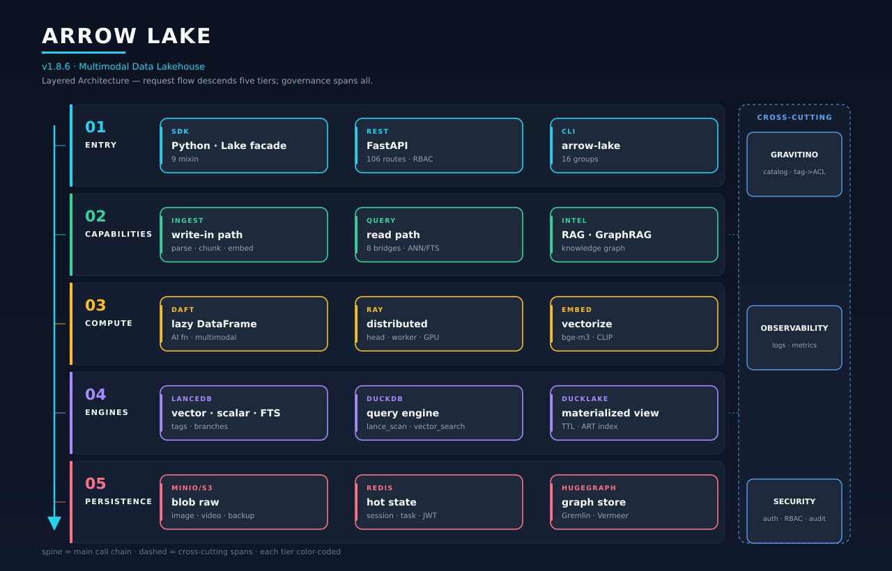
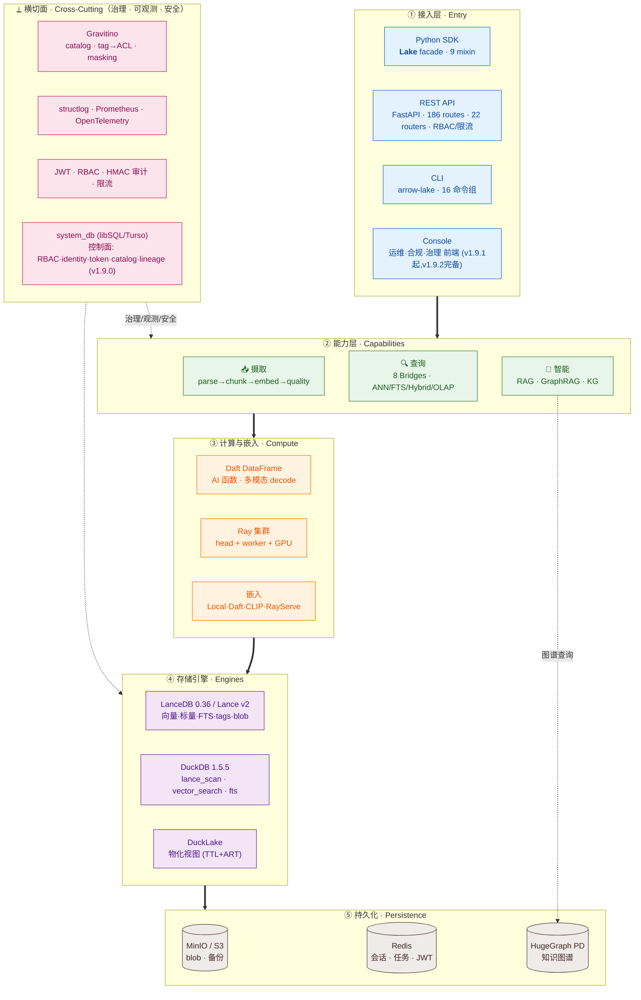
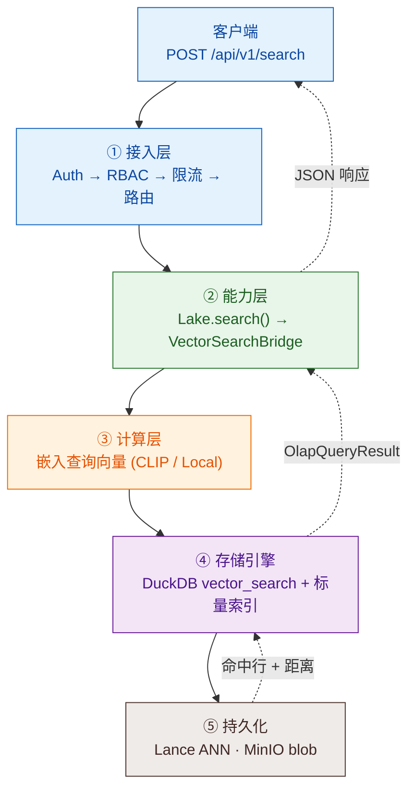
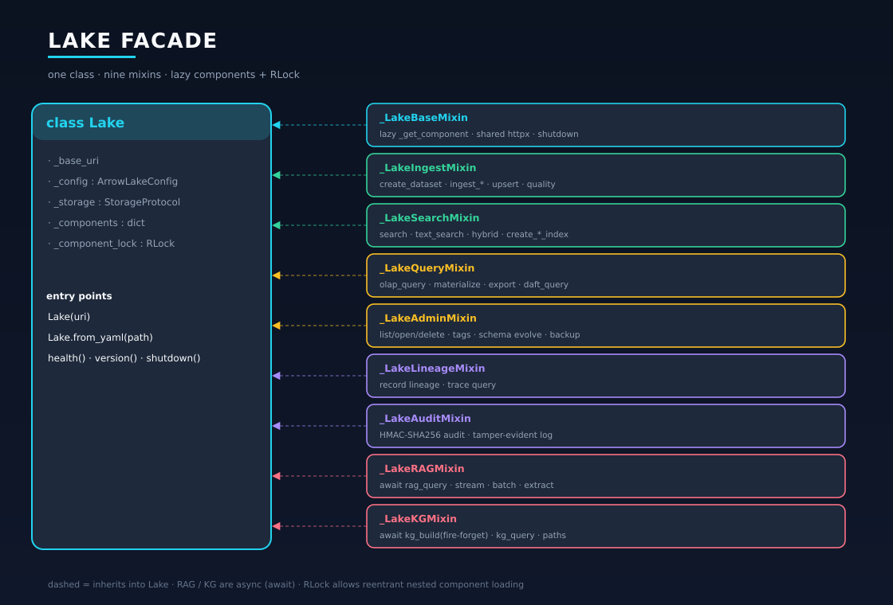
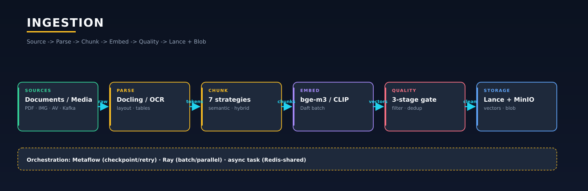
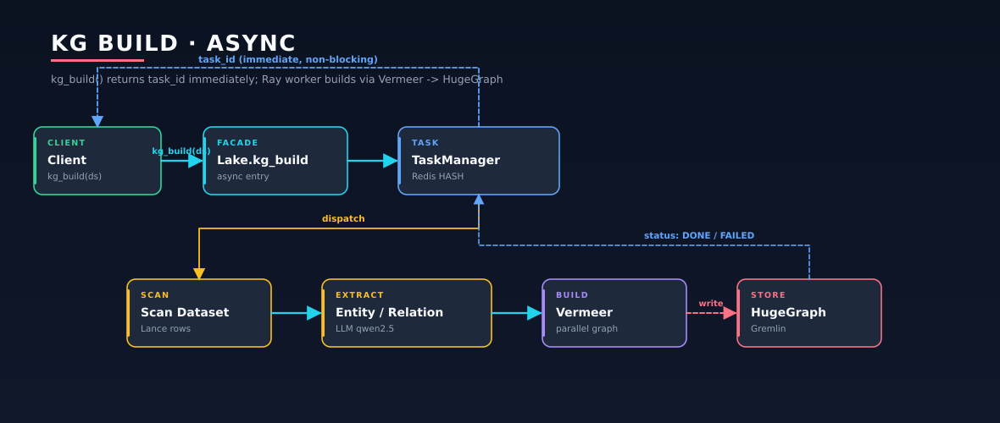
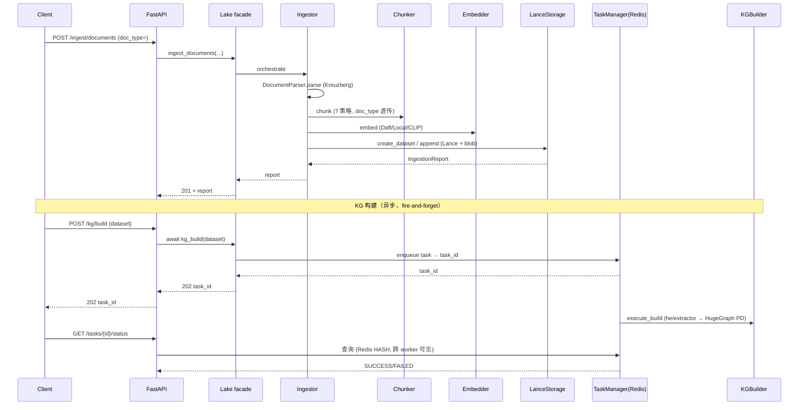
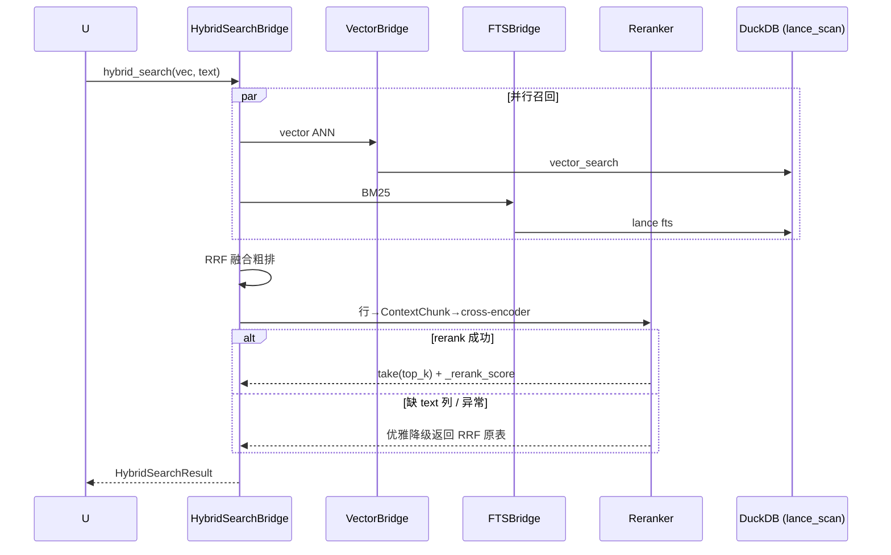
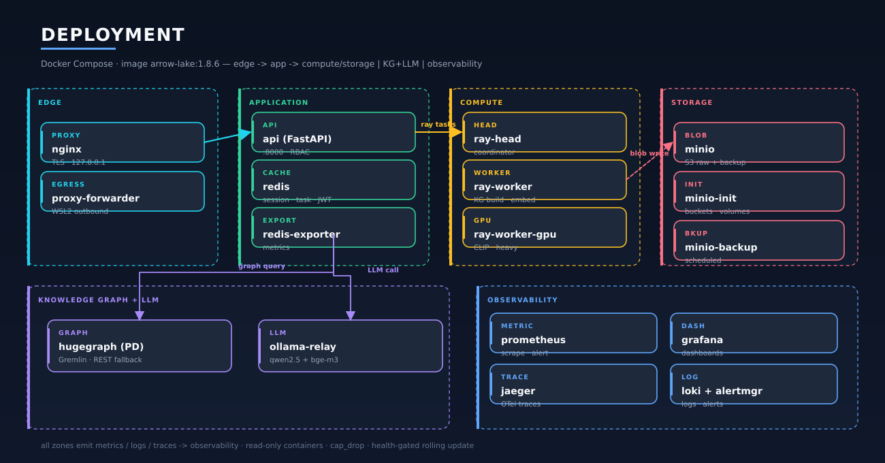

# Arrow Lake — 架构技术文档（Architecture Reference）

> **版本基线**：v1.11.0.1（已合并 `master`；`arrow_lake/_version.py` = `pyproject.toml` = 1.11.0）
> **文档日期**：2026-08-03
> **状态**：随主干演进，与代码当前态对齐（已逐项核实 `arrow_lake/` 源码）。v1.9.0 起**控制面库（libSQL / Turso）**已落地接管 RBAC/身份/personal_token/catalog/任务/RAG 会话/血缘索引（见 [§4.9](#49-控制面system_db)），console 运维/合规/治理前端已完备（见 [§12.2](#122-compose-profiles--overlays)）。
> **v1.9.0–v1.10.0 增量**（相对 v1.8.0；v1.10.1–v1.10.8 演进见 [§14](#14-版本演进)）：① v1.9.0 Turso 控制面 ② v1.9.1 console 核心（admin/my-workspace + personal token）③ v1.9.2 console 完备化 + 质量深化 ④ v1.9.3 数据集字段注释 + tidy/clean 清洗页 ⑤ v1.9.4 血缘审计评审 + KG MERGE_FIELD（治 BALANCED 合并爆炸）+ Gravitino 1.3.0 ⑥ v1.9.5 RAG 质量全链路（hybrid 默认生效 + GraphRAG + multi_query）⑦ v1.9.6 RAG 防幻觉(faithfulness) + cross-encoder reranker + KG snap/strict/三路并行 + 血缘可视化(lineage.html) + masking 治理(HMAC fail-fast) + 安全加固(fail-closed) ⑧ v1.8.8-v1.8.9 KG per-dataset KA + 双 LLM ⑨ v1.10.0 知识抽取模板管理（前端模板 CRUD + 后端按新模板动态抽取建图不 rebuild/restart + LLM 辅助生成 self-heal + dry-run 试跑沙箱 + 模板质量验证 harness + category↔doc_type 拉通 + V005/V006/V007 迁移）。详见 [§14](#14-版本演进)。
> **语言约定**：沿用本仓库全部技术文档（roadmap / implementation / 各优化 plan / CHANGELOG）的中文惯例。

本文是 Arrow Lake 的**权威技术参考**：覆盖定位、顶层架构、设计模式、分层详解、公共 API、数据流、配置、安全、可观测性、可靠性、性能、部署、异常、版本演进与测试。面向新成员上手、架构评审与后续演进决策。

---

## 目录

1. [项目定位与技术栈](#1-项目定位与技术栈)
2. [顶层架构总览](#2-顶层架构总览)
3. [核心设计模式](#3-核心设计模式)
4. [分层详解](#4-分层详解)
5. [Lake Facade — 公共 SDK API 全景](#5-lake-facade--公共-sdk-api-全景)
6. [核心数据流](#6-核心数据流)
7. [配置体系](#7-配置体系)
8. [安全架构](#8-安全架构)
9. [可观测性](#9-可观测性)
10. [可靠性与优雅降级](#10-可靠性与优雅降级)
11. [性能架构](#11-性能架构)
12. [部署架构](#12-部署架构)
13. [异常体系](#13-异常体系)
14. [版本演进](#14-版本演进)
15. [测试与质量保障](#15-测试与质量保障)
16. [扩展点与路线图](#16-扩展点与路线图)
17. [术语表](#17-术语表)

---

## 1. 项目定位与技术栈

**Arrow Lake 是一个生产级、统一的多模态数据湖仓（Unified Multimodal Data Lakehouse）。**

它把"存储 / 检索 / 分析 / 智能化"四件事收敛到一个面向 Python SDK、REST、CLI 三种入口的统一 facade 后面，核心命题是：**用一份 Lance 列式湖仓底座，同时承载向量检索（ANN）、全文检索（BM25）、OLAP 分析、RAG 问答与知识图谱（KG）**，并原生支持文本/图像/视频多模态。

### 1.1 DARMU 核心栈

记忆口诀 **DARMU**（Daft + Arrow/Lance + Ray + Metaflow + dUckdb），外加治理与图谱层：

| 层 | 技术 | 版本（`pyproject.toml` 实测 pin） | 角色 |
|---|---|---|---|
| 计算层 | **Daft** | `0.7.21` | lazy DataFrame + 内置 AI 函数（embed/prompt/classify）+ 26 连接器 + 多模态 decode |
| 湖仓格式 | **Lance / pylance** | pylance `9.0.0`（pyproject 下限 `>=7.0.0`，v1.7.1 升） | 列式存储 + 向量索引（IVF_PQ/HNSW/SQ/RQ）+ 标量索引（BTree/Bitmap）+ FTS 倒排 + tags/branches |
| 应用层 | **LanceDB** | `0.36.0`（v1.7.1 起 ≥0.33） | 向量库 SDK，Table/Namespace/索引/版本管理 + `search_async` |
| 分布式 | **Ray** | `2.56.0` | head + worker 集群，KG 构建 / 批计算 /（预留）分布式索引 backfill |
| 编排 | **Metaflow** | `2.19.35` + `metaflow-ray` `0.1.4` | 工作流编排 + checkpoint + retry/backoff + Argo 桥接 |
| 引擎层 | **DuckDB** | `1.5.5` | **主力查询路径**（`lance_scan` / `vector_search` / `fts`，40+ 处调用），非 fallback |
| 物化层 | **DuckLake** | DuckDB 扩展 | 跨存储物化视图（TTL + ART index + 行预算） |
| 图谱 | **HugeGraph** | 1.7（PD 集群模式） | 知识图谱存储 + Gremlin 遍历；`VermeerClient` 构建 |
| 治理 | **Apache Gravitino** | `1.3.0`（server `apache/gravitino:1.3.0` + SDK `apache-gravitino==1.3.0`，`s3.*` 属性） | 统一 catalog + tag-driven ACL + masking + retention |
| 对象存储 | **MinIO / S3** | `boto3>=1.35` | blob 原文（图像/视频）+ 备份 |
| 缓存/任务 | **Redis** | `redis[hiredis]>=5.0,<6.0` | 分布式会话 + JWT 黑名单 + 异步任务状态共享 + rate_limit/login lockout（v1.9.2，多 worker） |
| **控制面库** | **libSQL / Turso（sqld）** | `ghcr.io/tursodatabase/libsql-server`（**v1.9.0**） | **控制面关系库**：RBAC / identity / personal_token / catalog 注册 / 任务历史 / lineage 索引 / RAG 会话 / governance；**数据面（Lance/DuckDB/HugeGraph/MinIO）不触碰**；`enabled` 默认 false（opt-in，渐进启用）；fail_close（RBAC/identity）+ fail_soft（catalog/tasks/rag）双模 |
| 前端 | **Console** | 原生 JS + ES module（**v1.9.1**） | 运维/合规/治理完整前端（system/audit/governance/maintenance/admin/my-workspace/...），同源 `app.py` mount `/console`，bind-mount 改即生效、无 CORS |

### 1.2 设计哲学

- **Facade + Mixin + Bridge + Protocol** 的组合，让一个 `Lake` 对象同时拥有摄取/搜索/查询/RAG/KG/治理/审计的全部能力，但内部按子系统懒加载、按能力桥接。
- **优雅降级是一等公民**：Ray 不可用→本地、NeMo Curator 不可用→CPU MinHash、KG 不可用→Vector RAG、Gremlin 不可用→REST API。系统能在不完整基础设施下持续服务。
- **配置驱动、四层覆盖**：代码默认 < `.env` < 环境变量 < YAML，34 个子配置覆盖每一个子系统。
- **压测驱动、不做投机性优化**：v1.8.0 用 gate 框架对 async / 分布式索引 / ColBERT 逐项裁决，数据证明该做才做（见 [§16](#16-扩展点与路线图)）。

---

## 2. 顶层架构总览

Arrow Lake 采用**严格五层架构**：请求自上而下穿越 **① 接入 → ② 能力 → ③ 计算 → ④ 存储引擎 → ⑤ 持久化**，**治理 / 可观测 / 安全**作为横切面贯穿全部层级。每层只依赖其直接下一层；横切面经 hook / 中间件作用于各层，不进入主调用链。节点对齐 v1.9.2 现状。

> **控制面 / 数据面分离**（v1.9.0）：横切面中 RBAC / identity / personal_token / catalog 注册 / 任务历史 / lineage 索引 / RAG 会话 / governance 这些**控制面**状态由 **libSQL/Turso（`system_db`）** 统一持久化；**数据面**（Lance 列式 / DuckDB / HugeGraph / MinIO）完全不触碰。控制面是横切面的"记忆层"，图中以 SYSDB 节点表示。



### 2.1 分层视图（五层 + 横切面）

> 下图用**粗箭头 `==>` 强制纵向层级**，每层一种色带，横切面（⟂）置于右侧贯穿。



**层级职责**（每层一行，对应上图色带）：

| 层 | 职责 | 关键组件 |
|---|---|---|
| ① 接入 | 四入口归一到 facade；认证 / 限流 / 路由 | `Lake` facade · FastAPI（**22 routers / 186 routes**）· CLI · **Console**（v1.9.1 起，v1.9.2 运维/合规/治理完备） |
| ② 能力 | 业务能力：把数据写进去、查出来、问答 | 摄取 · 查询（8 Bridge）· 智能（RAG / KG） |
| ③ 计算 | 批处理 / 分布式 / 嵌入 | Daft · Ray · 嵌入器（Local / Daft / CLIP） |
| ④ 存储引擎 | 向量 / 标量 / FTS / 物化的执行 | LanceDB · DuckDB · DuckLake |
| ⑤ 持久化 | 字节级落地 | MinIO / S3 · Redis · HugeGraph |
| ⟂ 横切面 | 贯穿各层；**控制面状态由 system_db (libSQL) 持久化**（v1.9.0） | Gravitino 治理 · 可观测 · 安全（RBAC / identity / audit / lineage / governance 走 libSQL） |

> **分层依赖规则**：每层只依赖其直接下一层；横切面经 hook / 中间件作用，不参与主调用链；知识图谱是能力层直达持久化的唯一旁路。

### 2.2 一次检索请求的层级穿越

下图自上而下追踪一次 `POST /search` 穿越五层、结果再自下而上回传的完整路径，印证分层与依赖方向：



### 2.3 多模态主数据流（项目核心命题）

```text
File/HTTP/URL → 多模态处理(OCR / Daft decode_image·audio·video)
             → 嵌入(文本 bge-m3 / 图像 CLIP text+image tower)
             → Lance 多模态向量列 + blob 原文
             → 跨模态检索(文搜图 / 图搜图 / 图搜文)
```

---

## 3. 核心设计模式

### 3.1 Facade + Mixin（统一入口）

`Lake`（`arrow_lake/__init__.py`）多重继承 **9 个 mixin**，对外是单一对象，对内按子系统切分文件：

```python
class Lake(
    _LakeBaseMixin,      # 基础: 组件懒加载 / 共享 httpx / shutdown
    _LakeIngestMixin,    # 摄取: create_dataset / ingest_* / upsert / 质量
    _LakeSearchMixin,    # 搜索: search / text_search / hybrid / 索引管理
    _LakeQueryMixin,     # 查询: olap_query / materialize / export
    _LakeAdminMixin,     # 管理: 数据集 / 版本 / 标签 / Schema 演化 / 备份 / health
    _LakeLineageMixin,   # 血缘追踪
    _LakeAuditMixin,     # HMAC-SHA256 审计
    _LakeRAGMixin,       # RAG: rag_query / stream / batch / extract (全 async)
    _LakeKGMixin,        # KG: kg_build(fire-and-forget) / kg_query / 最短路径 (全 async)
): ...
```

> **文件级拆分**：每个 mixin 是 `_lake_*.py`（如 `_lake_ingest.py` 24KB、`_lake_search.py` 25KB、`_lake_kg.py` 22KB）。`Lake` 类本身只持有 `_base_uri / _config / _storage / _components / _component_lock`。

### 3.2 懒加载 + 线程安全组件缓存

```python
def _get_component(self, key: str, factory: Callable[[], Any]) -> Any:
    if key not in self._components:
        with self._component_lock:               # threading.RLock（v1.6.1 从 Lock 改 RLock）
            if key not in self._components:      # double-checked locking
                self._components[key] = factory()
    return self._components[key]
```

- **为什么 RLock**：嵌套 `_get_component` 调用（组件 A 的工厂内部又请求组件 B）在普通 `Lock` 下会死锁；v1.6.1 修复。
- 组件包括：`session_manager`（DuckDB 会话池）、`shared_http_client` / `shared_async_http_client`（复用 httpx 连接）、存储管理器等。
- `shutdown()` 遍历 `_components`，对 `shutdown()` / `aclose()` / `close()`（同步或异步）统一回收；未 shutdown 会通过 `__del__` 发 `ResourceWarning`。

### 3.3 Bridge 模式（查询能力可插拔）

查询层每个能力是独立 Bridge 类，共享 DuckDB 会话但各自封装语义：

| Bridge | 文件 | 能力 |
|---|---|---|
| `VectorSearchBridge` | `query/vector.py` | 向量 ANN + `search_async` + 跨列（`vector_column`）+ 跨模态 |
| `FullTextSearchBridge` | `query/fts.py` | lancedb 0.36 native FTS (ICU) + jieba 中文预分词 + `search_async`（v1.9.7 从 Tantivy 迁移） |
| `HybridSearchBridge` | `query/hybrid.py` | RRF 融合 + **Reranker 精排**（v1.8.0 #5）+ `search_async` |
| `FacetedSearchBridge` | `query/faceted.py` | 标量索引分面 + `search_async` |
| `EnsembleSearchBridge` | `query/ensemble.py` | 跨列 RRF 集成 |
| `OlapSearchBridge` | `query/olap.py` | DuckDB SQL + Daft + `graph_query`（递归 CTE 轻图）+ 物化 |
| `MetadataSearchBridge` | `query/metadata.py` | 标量元数据过滤 |
| `ExportBridge` | `query/export.py` | parquet/csv/json 导出 |

> Bridges 通过 `lake.get_session_manager()` 获取**受管连接**，而非每次查询新建 session。

### 3.4 Protocol（结构化契约 / Structural Typing）

`arrow_lake/_protocols.py` 用 `typing.Protocol` 定义**跨层能力契约**——只声明方法签名（参数 + 返回类型），不提供实现、不强制继承。任何具备这些方法的对象**自动满足协议**（按"结构"匹配而非"名义"），由 mypy / pyright / IDE 静态校验，无需 `isinstance` 或继承基类。这是"鸭子类型 + 静态类型安全"的结合。

**为什么用 Protocol 而非抽象基类（ABC）**：
- **零耦合**：实现方无需 import 或继承协议，独立演进的后端（Lance / DuckDB / HugeGraph / Daft）各自实现即可被桥接。
- **可插拔**：新增后端 = 写一个满足协议的类 + 注册，主干 `Lake` 不动（契合 §3.1 Mixin + §3.3 Bridge 的组合）。
- **多实现 + 编译期安全**：同一契约承载多实现（本地/S3、SentenceTransformer/Daft），类型检查器在编辑期即捕获签名漂移——既有鸭子类型的灵活，又有名义类型（继承）的安全性。

| 协议 | 契约要点 | 实现示例 |
|---|---|---|
| `StorageProtocol` | 存储后端抽象（读/写/列举/删除 blob） | 本地 FS / S3 / MinIO |
| `SearchBridge` | 查询桥接统一接口（`search` / `search_async`） | §3.3 的八个 Bridge |
| `QualityFilter` | 质量过滤器（`apply(record) → record \| None`） | `quality/` Registry + 3-stage gate |
| `EmbeddingEncoderProtocol` | `encode(list[str]) → list[vector]` | SentenceTransformer / **Daft UDF**（v1.8.0 #13 让 Daft 也满足，统一批嵌入路径） |

### 3.5 优雅降级矩阵（Reliability）

| 场景 | 主路径 | 降级路径 | 触发点 |
|---|---|---|---|
| 分布式计算 | Ray head+worker | 本地 Python 执行 | Ray 不可连 |
| 去重 | NeMo Curator (GPU) | CPU MinHash（`datasketch`） | GPU/NeMo 缺失 |
| 知识图谱问答 | HugeGraph GraphRAG | Vector RAG | KG 未构建 |
| 图导出 | Gremlin `g.V()/g.E()` | REST API `GET /graphs/.../vertices\|edges` | Gremlin 引擎异常（v1.6.3） |
| 嵌入 | RayServe | Local SentenceTransformer | Serve 未起 |
| 跨模态 | CLIP text+image | 单模态 | 无图像模型 |
| 混合精排 | cross-encoder reranker | RRF 粗排原表 | 缺 text 列 / rerank 异常（v1.8.0 #5） |

### 3.6 配置四层覆盖

```
代码默认 (Pydantic field default)
   ↓ 被覆盖
.env 文件 (pydantic-settings)
   ↓ 被覆盖
环境变量 (ARROW_LAKE__ 前缀, __ 作为层级分隔符)
   ↓ 被覆盖（最高优先级）
YAML 配置文件 (ArrowLakeConfig.from_yaml)
```

注入链实例：`main.py` env_nested_delimiter(`__`) → `OlapConfig` → `DuckDBSessionManager.from_config()` → 每个 DuckDB session。详见 [§7](#7-配置体系)。

---

## 4. 分层详解

### 4.1 API 接入层

**工厂**：`arrow_lake/api/app.py`（`create_app()` 工厂模式，`uvicorn arrow_lake.api.app:create_app --factory`）。

**规模**（已核实）：**22 个 router 文件 / 186 个路由处理器**。

| Router | 文件 | 职责 |
|---|---|---|
| `datasets` | `datasets.py` (24KB) | 数据集 CRUD / Schema 演化 / 版本 / 标签 / 分支 |
| `search` | `search.py` | 向量/全文/混合/分面/集成检索 |
| `query` | `query.py` | OLAP SQL / Daft 查询 / 图查询 |
| `embedding` | `embedding.py` | `/embed/text`（LOCAL + DAFT 分支）/ `/embed/image` |
| `rag` | `rag.py` | RAG 问答 / 流式 / 批量 / 反馈 / 历史 |
| `knowledge_graph` | `knowledge_graph.py` | `kg_build` / `kg_query` / 最短路径 / 邻居 |
| `admin` | `admin.py` | 管理 / health / version / lifecycle |
| `async_tasks` | `async_tasks.py` | 异步任务状态轮询（v1.6.1） |
| `auth` | `auth.py` | 登录 / token / API Key |
| `user_state` | `user_state.py` | `/api/v1/me/*`（saved-queries / notifications / preferences），**personal-token**（`X-API-Key`）鉴权硬约束（v1.9.0） |
| `audit` | `audit.py` | HMAC 审计日志查询（`asdict` 序列化 + 分页，v1.9.2） |
| `backup` | `backup.py` | 备份创建/恢复（含 async） |
| `export` | `export.py` | 数据导出 |
| `gravitino` | `gravitino.py` (14KB) | catalog / tag / ACL / masking |
| `lineage` | `lineage.py` | 血缘图查询 |
| `maintenance` | `maintenance.py` | 版本清理 / 紧凑 |
| `materialized` | `materialized.py` | DuckLake 物化视图面板（MV 懒加载，`ducklake_enabled=False`→503，v1.9.2） |
| `quality` | `quality.py` | 质量过滤 / 去重 |
| `cleaning` | `cleaning.py` | 结构化清洗整理（`POST /datasets/{n}/clean`，DuckDB 语义 steps→SQL→`restore_dataset` 写回） |
| `extraction_templates` | `extraction_templates.py` (51KB) | **知识抽取模板管理**（v1.10.0，ADMIN）：YAML 模板 registry + dataset 绑定 + LLM 辅助生成（self-heal + `_hyperextract_check` 闸门）+ dry-run 试跑沙箱 + 质量验证 harness |
| `doc_type_categories` | `doc_type_categories.py` | doc_type 分类词典（v1.10.0，category↔doc_type 拉通 + 动态 `GET /kg/doc-types` + category 必填校验） |
| `system` | `system.py` | 系统信息 / 配置 / 健康 |

**横切组件**（`arrow_lake/api/`）：

- **认证** `auth_service.py` + `jwt_auth.py`：API Key（HMAC compare）+ JWT（HS256/RS256/ES256）+ Redis 黑名单（TTL）
- **授权** `rbac.py` (17KB)：RBAC 三级（ADMIN > EDITOR > VIEWER）+ `DatasetACL`（行/列级）+ `SchemaACL`
- **限流** `rate_limit.py`：slowapi 滑动窗口，per `IP:path`
- **中间件** `middleware.py`：安全头 / 请求 ID / CORS
- **异步任务** `tasks.py` (12KB) + `_redis_task_store.py`：`TaskManager`，任务状态 Redis HASH 双写（v1.6.2，跨 worker 可见）
- **遥测** `telemetry.py` + `errors.py`：OpenTelemetry + 统一错误信封
- **依赖注入** `deps.py`：FastAPI Depends 提供 `Lake` 单例、当前用户、ACL 解析

> **注意**：`arrow_lake/server.py` 是 v0.2.0 前的遗留 WSGI health 端点，**已废弃**，v2.0 移除。生产用 FastAPI 工厂。

### 4.2 摄取层（Ingestion）

`arrow_lake/ingest/` —— 数据进入湖仓的唯一通道。

```
连接器(connectors_*) → 文档/媒体解析 → 切块(chunker) → 嵌入(embed) → 写入(storage) → 质量(quality)
                                                          ↑                ↑
                                                     Daft/Local/CLIP    Lance + blob
```

**关键组件**：

| 文件 | 职责 |
|---|---|
| `storage.py` (16KB) | `LanceStorageManager` —— Lance 写入主入口，实现 `StorageProtocol` |
| `_storage_crud.py` / `_storage_advanced.py` / `_storage_indexing.py` / `_storage_versioning.py` | CRUD / upsert / 索引 / 版本(tags+branches，拆分自大类) |
| `ingestor.py` | `Ingestor` 编排器，返回 `IngestionReport` |
| `document.py` | `DocumentParser`（Kreuzberg 后端）+ PDF parse mode |
| `chunker.py` | **7 种切块策略**（`ChunkStrategy` enum：fixed/semantic/sentence/word/recursive/...；含 `_chunk_with_semchunk`） |
| `media.py` (16KB) | 图像/视频/音频摄取，blob 路径引用 |
| `ocr.py` | OCR（paddle / kreuzberg 后端，`OcrBackend` enum） |
| `schema.py` (13KB) | Schema 校验 + 演化（`SchemaValidationMode`） |
| `transforms.py` | 摄取期变换（`transforms=` 参数） |
| `ingest_embed.py` | `ingest_and_embed` 端到端 |
| `dead_letter.py` | 失败记录死信队列 |
| `maintenance_scheduler.py` | 版本清理 / compact 调度 |
| `connectors*.py` | File / HTTP / SQL / Kafka / Iceberg / DeltaLake 多源连接器 |

**质量与去重**（`arrow_lake/quality/`）：`QualityFilter` protocol + Registry + **3-stage gate** → `QualityReport`；`deduplicate()` → `DedupResult`（MinHash 近似 + 感知 hash 图像去重）。

**数据集命名**：正则 `^[a-zA-Z_][a-zA-Z0-9_-]*$`（`_validate_name`）。

> v1.8.0 #1 已补 **Lance dataset branches**：`create_branch` / `list_branches` / `delete_branch` / `read_at_branch`（经 raw `lance.dataset(uri)`，因 `lancedb.LanceTable` 无 branch API，仅 tags/version）。绕过 lance 7.0.0 重名 bug（`list_branches` 预检查）。

### 4.3 存储层（Storage）

```
┌─────────────────────────────────────────────┐
│  Gravitino (统一 catalog: tag→ACL/masking)   │
├─────────────────────────────────────────────┤
│  LanceDB 0.33 应用层 (Table/Namespace/索引)  │
├─────────────────────────────────────────────┤
│  Lance v2 格式层                              │
│   · 向量: IVF_PQ / HNSW / IVF_SQ / IVF_RQ    │
│   · 标量: BTree / Bitmap (v1.7.1 全量补齐)    │
│   · FTS: Tantivy 倒排 + jieba                 │
│   · 多模态: 多向量列 + binary blob            │
│   · 版本: tags / branches / row_id           │
├─────────────────────────────────────────────┤
│  对象存储: 本地 FS / S3 / MinIO (blob 原文)   │
└─────────────────────────────────────────────┘
        ↑ lance_scan / vector_search / fts
┌─────────────────────────────────────────────┐
│  DuckDB 1.5.5 (主力查询引擎)                  │
│   + DuckLake 物化视图 (TTL + ART + 行预算)    │
└─────────────────────────────────────────────┘
```

**关键事实**：

- **DuckDB 是主力查询路径**，不是 fallback。`lance_scan` / `vector_search` / `fts` 在代码中有 **40+ 处调用**。升级 pylance 时头号风险即在此：pylance 7.0 可能写 Lance v2.2/v3，而 DuckDB core `lance` 扩展可能只认 v2.1 → `lance_scan` 全断（v1.7.1 已验证兼容）。
- **Lance tags/branches**：tags 全链路已就绪（create/list/delete/read_at_tag），v1.8.0 #1 补 branches。支持 A/B、回滚、可复现训练。
- **标量索引**：v1.7.1 前全项目 `create_scalar_index=0`，facet 列（modality/source/doc_type/created_at）缺索引；现已全量补齐 + SDK prefilter 路径。
- **FTS**：lancedb 0.36 **native FTS（ICU base_tokenizer，v1.9.7 从 Tantivy 迁移——0.36 移除了 tantivy-based FTS）** + jieba 中文预分词（default `tokenizer_type='jieba'`，写 `_fts_segmented` 列）；`use_inverted` 为实验选项；DuckDB 原生 fts（`OlapSearchBridge.fts_search` BM25）已落地（#12）。

### 4.4 查询层（Query）

`arrow_lake/query/` —— 8 个 Bridge（见 [§3.3](#33-bridge-模式查询能力可插拔)）+ 会话管理 + 缓存 + 物化。

| 文件 | 职责 |
|---|---|
| `session_manager.py` (20KB) | `DuckDBSessionManager` —— 受管连接池 + 信号量并发控制 + warmup |
| `_redis_semaphore.py` (14KB) | 跨 worker 分布式信号量（Redis） |
| `vector.py` (24KB) | 向量 ANN + `search_async`（原生 `connect_async`）+ 索引管理 |
| `fts.py` (17KB) | 全文检索 + 中文分词 + `search_async`（v1.8.0 #17，`asyncio.to_thread`） |
| `hybrid.py` (21KB) | RRF 融合 + **Reranker**（v1.8.0 #5）+ `search_async` |
| `faceted.py` (13KB) | 标量分面 + `search_async` |
| `olap.py` (25KB) | OLAP SQL + `materialize()`/`cleanup_materialized()` + **`graph_query()`**（v1.8.0 #10） |
| `ensemble.py` | 跨列 RRF 集成检索 |
| `metadata.py` | 元数据/标量过滤 |
| `daft_api.py` (24KB) | Daft 查询后端 |
| `ducklake_workspace.py` | DuckLake 物化工作区（TTL + ART index + 行预算 + `$1..$4` 参数化） |
| `federated_engine.py` | 联邦查询引擎 |
| `_cache.py` | 查询结果缓存 |
| `export.py` | 导出 bridge |
| `lazy_decode.py` / `streaming.py` | 延迟解码 / 流式结果 |

**v1.8.0 查询层三大增强**（已核实源码）：

1. **#5 Reranker 接入 hybrid**：`HybridSearchConfig` 加 `reranker_type`（默认 `none`，向后兼容）/ `reranker_model`（默认 `BAAI/bge-reranker-v2-m3`）；`HybridSearchBridge.search()` 末尾 `_rerank_table`：行 → `ContextChunk` → cross-encoder rerank → `take` 重排 + 追加 `_rerank_score` 列。缺 text 列 / 异常优雅降级。
2. **#10 轻图查询**：PGQ（`CREATE PROPERTY GRAPH`/`MATCH`）在此 DuckDB 1.5.5 build **不可用**（`pgq` 扩展无法安装，ParserException），改用 `OlapSearchBridge.graph_query()` **递归 CTE** 实现环安全 BFS 邻居/路径遍历（`list_contains` 环检测，`max_depth` 钳 [1,10]，directed/undirected + 可选权重）。与 HugeGraph 互补：重图→HG，轻查询→DuckDB。
3. **#17 全链路 async**：lancedb 无原生 async FTS/聚合路径，故给 fts/hybrid/faceted 补 `search_async`（`asyncio.to_thread` 线程卸载，非 GIL-free）；价值 = async handler 不阻塞事件循环（vector 仍是原生 `search_async`）。压测驱动 GO 后落地（worker 1→20 仅 5.8→7.2 QPS，并发平台期显著）。

### 4.5 嵌入层（Embedding）

`arrow_lake/embed/` —— 文本 + 图像 + 跨模态。

| 文件 | 嵌入器 | 说明 |
|---|---|---|
| `encoder.py` (17KB) | `LocalEmbeddingEncoder` | SentenceTransformer，v1.8.0 #13 加 `encode_to_vectors`（返回向量矩阵，null 行零填充） |
| `daft_encoder.py` (9KB) | `DaftBatchEncoder` | Daft `embed_text(provider="transformers")`，v1.8.0 #13 加 `expected_dim` 校验 + L2 归一化 + `encode(list[str])` 满足 `EmbeddingEncoderProtocol` |
| `image_encoder.py` (10KB) | `CLIPImageEncoder` | `encode()` 编图、v1.8.0 #6 新增 `encode_text()` 编查询（CLIP/SigLIP **text tower**）→ 补全跨模态 text→image |
| `ray_serve_encoder.py` | RayServe 远程嵌入 | Ray Serve 承载，不可用降级 Local |
| `registry_resolver.py` | 模型注册解析 | 模型名 → 后端路由 |

**v1.8.0 #13 PoC 实测**（`Qwen/Qwen3-Embedding-0.6B`，n=50）：
- Daft `embed_text` vs Local `SentenceTransformer`：**cosine(mean)=1.0000**（语义等价）、dim 1024 ✓、**speedup 1.14x**
- 代码足迹：Daft 调度 ~30 行 vs Local 手写 ~150 行（删减 ~120 行 lazy-load/GPU/batch/normalize/retry）
- **结论**：Daft 内置 AI 函数（自动批处理/限流/重试/背压）可完全替代自建嵌入调度。

> 注：KG 抽取的 `he_extractor.py` 保留 hyper-extract（领域模板 + AutoGraph），**不**用 Daft prompt 替换——Daft `prompt()` 是 DataFrame 列表达式，无法注入 Template 的 `llm_client`。Daft prompt KG 抽取拆为独立后续项 `DaftExtractor`。

### 4.6 智能层（Intelligence：RAG + KG）

#### RAG（`arrow_lake/rag/`）

| 文件 | 职责 |
|---|---|
| `pipeline.py` (16KB) | `RAGPipeline` 主编排，返回 `RAGResponse`（含 citation） |
| `provider.py` (20KB) | **5 LLM provider**：OpenAI 兼容 / Anthropic / Ollama / vLLM / 自定义；`LLMProviderType` enum |
| `reranker.py` | reranker 体系：`BaseReranker` / `NoopReranker` / `CrossEncoderReranker`（**v1.9.6 默认**，bge-reranker-v2-m3，本地 `/opt/models/` 加载）/ `LLMReranker` / `OllamaReranker`（v1.8.9 Qwen3-Reranker yes/no judge）+ `create_reranker` 工厂（接 `ContextChunk`）；`_retrieve_ranked` 统一 async 契约（v1.9.6 refactor #7）；LLMReranker 带 SSRF scheme 校验 + prompt-injection 过滤 |
| `query_transform.py` | **HyDE** + multi-query 查询改写 |
| `graph_rag.py` (11KB) | GraphRAG（经 KG retriever） |
| `context.py` (10KB) | `ContextChunk` + 上下文组装 |
| `session.py` | 多轮会话存储（Redis） |
| `prompt.py` | 提示模板 |

> facade RAG 方法**全 async**：`await rag_query(...)` / `rag_query_stream(...)` / `rag_batch_query(...)` / `rag_extract(...)`。

#### 知识图谱（`arrow_lake/knowledge_graph/`）

| 文件 | 职责 |
|---|---|
| `client.py` (18KB) | `HugeGraphClient` —— Gremlin 查询 + REST 降级（v1.6.3） |
| `builder.py` (21KB) | `KGBuilder` —— 三元组抽取 + **A 方案实体双写**（通用 `entity` + 细分 label） |
| `retriever.py` | `KGRetriever` —— GraphRAG 检索 |
| `extractor.py` (12KB) | `EntityExtractor` —— 基础实体抽取 |
| `he_extractor.py` (8KB) | **hyper-extract (he) 后端**（v1.7.0）：langchain `ChatOpenAI` + 领域模板，三元组精准度提升 |
| `doc_type_router.py` (18KB) | **doc_type 三层路由**（v1.7.0，见下） |
| `entity_router.py` | 关系路由（同义词→细分边，无→`related_to` 降级） |
| `entity_resolver.py` | 实体消歧（embedding 余弦聚类 + 批量 LLM，opt-in `he_entity_resolution=auto`，治同实体多顶点） |
| `orphan_linker.py` | 启发式孤儿连接（共现 + embedding + type-pair，零 LLM 连通孤立顶点，v1.9.9） |
| `template_registry.py` / `template_type_selector.py` | **抽取模板 registry + 类型选择**（v1.10.0，运行时动态加载 YAML 模板，`reset_gallery_cache` 热重载，不 rebuild/restart） |
| `relation_validator.py` | type-pair 合法性校验（非法关系软降级为 `相关`，不丢弃端点连通性） |
| `vermeer_client.py` (9KB) | `VermeerClient` —— KG 构建 |
| `_traversers.py` (11KB) | 最短路径 / 邻居 / rays / rings 遍历 |
| `_import_export.py` | 图导入导出（Gremlin→REST 降级） |
| `schema.py` / `queries.py` | 图 schema + Gremlin 查询模板 |

**v1.7.0 KG 三大特性**：

1. **doc_type 三层路由**：① config override ② `TemplateGallery` 元数据驱动匹配（扫描 hyperextract 全部 preset 的 tags/category/name/description，**新模板自动可用**）③ default 兜底；`normalize_doc_type` 别名归一化；`DocTypeClassifier` LLM 内容推断；`KNOWN_DOC_TYPES` + `validate_taxonomy()` 单一真相源 + CI 守护。
2. **hyper-extract (he) 抽取后端**：`HugeGraphConfig.extractor_backend="he"` 启用。
3. **A 方案实体双写**：每个实体写通用 `entity` 顶点 + 细分 label（person/organization/concept/...）。

**HugeGraph PD 集群模式**（v1.7.0）：`hg-pd` + `hg-store` + `hg-server`（hstore backend）替代 standalone rocksdb，支持**运行时创建多 graph**（每文档独立 KG 隔离）。启动顺序 PD→Store→Server（healthcheck 依赖）。

**kg_build 是 fire-and-forget**（v1.6.1）：`await kg_build(dataset_name) -> str` 返回 `task_id`，**不阻塞**；`await kg_build_status(task_id)` 查状态。

### 4.7 目录与治理层（Catalog & Governance）

`arrow_lake/catalog/` —— 以 Gravitino 为中枢的元数据治理。

| 文件 | 职责 |
|---|---|
| `gravitino_bridge.py` (10KB) | `GravitinoBridge` —— 主桥接 |
| `gravitino_client.py` | Gravitino REST 客户端 |
| `lineage.py` (25KB) | **事件级血缘 store** + 查询（`LineageConfig`） |
| `lineage_hooks.py` | 摄取/查询自动埋点 |
| `tag_acl_resolver.py` | **tag → ACL** 解析 |
| `gravitino_auth.py` | Gravitino 认证（`GravitinoAuthType`） |
| `gravitino_sync.py` | 双向同步（`GravitinoSyncDirection`） |
| `gravitino_stats.py` / `gravitino_models.py` | 统计 + 数据模型 |
| `connection_pool.py` | 连接池 |
| `actor.py` (14KB) | Actor 模型任务 |
| `replica.py` | 副本 |

**治理能力**：tag-driven ACL、masking engine（脱敏）、retention enforcement（保留期）。`MaskingEngine` + `RegistryModelResolver`（图中可观测）。

### 4.8 编排与运行时（Workflow & Runtime）

- **`arrow_lake/workflow/`**：Metaflow 编排 + **Argo bridge**（`ArgoConfig`，`ArgoError`）+ retry/backoff + checkpoint + autoscale（`AutoscaleConfig`）。
- **`arrow_lake/ray_runtime/`**：Ray head + worker（+ GPU worker）集群 + autoscaler。`LANCE_IO_THREADS=64` / `LANCE_CPU_THREADS=4` 注入（v1.7.1，4 服务继承）。
- **`arrow_lake/ops/`**：backup / restore（`BackupInfo`）。

### 4.9 控制面（system_db）

`arrow_lake/system_db/` —— **控制面统一关系库**，v1.9.0 引入。把原本散落在内存 / 临时文件 / 各 store 的**控制面状态**收敛到一个 libSQL（Turso sqld）实例；**数据面（Lance / DuckDB / HugeGraph / MinIO）完全不触碰**。

| 文件 / store | 职责 |
|---|---|
| `connection.py` | `SystemDB` 单例连接（retry + 启动健康探测） |
| `migrator.py` | 顺序 SQL 迁移 runner（`migrations/`，V001–V007 已落地；v1.10.0 新增 V005 extraction_templates / V006 template_quality_runs / V007 doc_type_categories） |
| `stores/rbac.py` | RBAC 角色 / `DatasetACL` / `SchemaACL` 持久化 |
| `stores/identity.py` | 用户身份 + **personal_token**（admin 签发 `POST /admin/users/{id}/tokens`） |
| `stores/catalog.py` | catalog 注册表（dataset 元数据镜像） |
| `stores/task_history.py` | 异步任务历史（替代纯 Redis 易失态） |
| `stores/lineage_index.py` | 血缘事件索引（ingest→索引→KG→RAG 全路径） |
| `stores/rag_session.py` | RAG 多轮会话 |
| `stores/governance.py` | governance 历史 |
| `stores/user_state.py` | 用户态（saved-queries / notifications / preferences） |
| `stores/ingest_dlq.py` | 摄取死信队列 |
| `stores/extraction_templates.py` | **抽取模板** CRUD + 元数据（v1.10.0，YAML 模板 registry + dataset 绑定） |
| `stores/template_quality_runs.py` | 模板质量验证试跑历史（v1.10.0，dry-run sandbox + KA 隔离） |
| `stores/doc_type_categories.py` | doc_type 分类词典（v1.10.0，category↔doc_type 拉通 + 动态 `GET /kg/doc-types`） |

**`SystemDBConfig`**（`config/system_db.py`）关键项：

| 项 | 默认 | 说明 |
|---|---|---|
| `enabled` | `false` | **opt-in**；false 时各 store 回退 v1.9.0 前的内存/临时文件行为（优雅降级） |
| `url` | `file:local.db` | 三态：`file:local.db`（嵌入/dev）· `http://system-db:8080`（自托管 sqld/prod）· `:memory:`（单测） |
| `fail_mode` | `fail_close` | RBAC/identity = **fail_close**（库挂时拒非 admin 请求）；catalog/tasks/rag = **fail_soft**（记日志降级） |
| `serve_stale_on_error` | `false` | **fail-open 开关**；true = sqld 不可达时 RBAC 读返回缓存决策（可能 honor 宕机期间撤销的权限）；默认 false = 安全 fail-close |
| `acl_cache_ttl_seconds` | `5.0` | per-worker ACL 短缓存（多 worker 最终一致） |

**部署形态**：compose `system-db` 服务 = `ghcr.io/tursodatabase/libsql-server`（sqld，distroless），持久卷 `system-db-data:/var/lib/sqld`，HTTP `:8080`；默认 disabled，`SYSTEM_DB_ENABLED=true` 启用（见 [§12.1](#121-服务拓扑docker-composeprodyml-42kb)）。

> **降级保证**：控制面 opt-in + fail_soft/fail_close 双模——不启用 system_db 时平台行为与 v1.8.x 一致；启用后 sqld 宕机，RBAC 默认 fail-close 拒绝（安全优先），catalog/tasks/rag fail-soft 降级。与 [§3.5](#35-优雅降级矩阵reliability) 降级矩阵一脉相承。

---

## 5. Lake Facade — 公共 SDK API 全景



`Lake("./data")` 或 `Lake.from_yaml("config.yaml")`。以下为已核实的方法族（按 mixin 分组）。

> ⚠️ **RAG / KG 方法多为 async，必须 `await`。`kg_build` 是 fire-and-forget 返回 `task_id`。**

### 5.1 搜索（`_lake_search.py`，全同步 + v1.8.0 async 补齐）

```python
# 向量 ANN
lake.search(dataset_name, query_vector, *, top_k=10, metric=None,
            vector_column="text_embedding", where=None)
# 全文 BM25
lake.text_search(dataset_name, query, *, top_k=None, fts_column=None, where=None)
# RRF 混合（需同时传 vector + text）
lake.hybrid_search(dataset_name, query_vector, query_text, *,
                   top_k=None, vector_column=..., fts_column=...)
# 分面 / 跨列集成
lake.faceted_search(...); lake.ensemble_search(...)
# v1.8.0 #17 async 非阻塞包装
await lake.text_search_async(...); await lake.hybrid_search_async(...)
await lake.faceted_search_async(...)
```

**索引管理**：`create_vector_index` / `create_fts_index` / `create_scalar_index` / `create_facet_indexes` / `list_vector_indexes` / `rebuild_vector_index` / `delete_vector_index` / `delete_fts_index` / `get_vector_index_info`。

### 5.2 查询（`_lake_query.py`，全同步）

```python
lake.olap_query(dataset_name, sql, *, max_rows=None, tables=None)  # → OlapQueryResult（无 params，用 tables 传额外表）
lake.sql_query(...)              # olap_query 语义别名
lake.materialize(...); lake.cleanup_materialized(ttl_days=None)    # DuckLake 物化
lake.export(...); lake.daft_query(...)
```

### 5.3 摄取（`_lake_ingest.py`，全同步）

```python
lake.create_dataset(name, data: pa.Table)                 # 主写入入口
lake.ingest(dataset_name, file_paths, *, transforms=None) # → IngestionReport
lake.ingest_and_embed(...)                                # 端到端
# 多源
lake.ingest_sql / ingest_kafka / ingest_iceberg / ingest_deltalake
lake.ingest_http / ingest_images / ingest_videos / ingest_mixed / ingest_documents
# 写入
lake.append_dataset / upsert(dataset_name, data, *, on="id")
lake.update_rows(dataset_name, where, values) / delete_rows
# 质量
lake.quality_filter(dataset_name, active_filters="", *, mode="all")  # → QualityReport
lake.deduplicate(dataset_name, *, strategy=None, action=None,
                 perceptual_threshold=None)                          # → DedupResult
```

### 5.4 RAG（`_lake_rag.py`，全 async）

```python
await lake.rag_query(question, dataset_name, *, top_k=None, strategy=None, template_name=None)
await lake.rag_query_stream(...) / await lake.rag_batch_query(...) / await lake.rag_extract(...)
lake.rag_get_history(session_id); lake.rag_feedback(...); lake.rag_cleanup_expired_sessions()
```

### 5.5 知识图谱（`_lake_kg.py`，全 async）

```python
await lake.kg_build(dataset_name) -> str          # fire-and-forget，返回 task_id
await lake.kg_build_status(task_id)
await lake.kg_query(query, *, traversal_depth=None)
# 邻居/统计
lake.kg_get_neighbors / kg_stats / kg_graph_exists / kg_ensure_graph / kg_delete_graph
# 路径遍历
lake.kg_all_shortest_paths / kg_weighted_shortest_path / kg_single_source_shortest_path
lake.kg_multi_node_shortest_path / kg_rays / kg_rings
```

### 5.6 管理（`_lake_admin.py`，全同步）

```python
# 数据集
lake.list_datasets / open_dataset / read_dataset / scan_dataset
lake.delete_dataset / rename_dataset / copy_dataset / merge_datasets
# 版本/标签/分支
lake.get_dataset_version / list_dataset_versions
lake.create_tag / read_at_tag / list_tags / delete_tag
lake.create_branch / list_branches / delete_branch / read_at_branch      # v1.8.0 #1
# Schema 演化
lake.add_column / add_columns_table / alter_column / drop_column / compact_dataset
# 备份
lake.backup_create / backup_restore / backup_list / backup_delete
# 系统
lake.health() -> HealthInfo; lake.version(); lake.lifecycle_apply(prefix="")
# Metaflow
lake.list_flows / get_flow_info
```

### 5.7 其他

- `_lake_lineage.py`：血缘追踪
- `_lake_audit.py`：HMAC-SHA256 tamper-evident 审计

**四个入口点**：

| 入口 | 用法 |
|---|---|
| Python SDK | `Lake` facade（`arrow_lake/__init__.py`） |
| REST API | FastAPI 工厂（`arrow_lake/api/app.py`）`uvicorn arrow_lake.api.app:create_app --factory` |
| CLI | Click（`arrow_lake/cli/__init__.py`）`arrow-lake` 命令组（16 组：audit/backup/catalog/config/embed/export/index/ingest/kg/lifecycle/lineage/maintenance/quality/query/rag/search） |
| **Console**（v1.9.1） | 原生 JS + ES module 前端，同源 mount `/console`（`app.py`），复用 REST + RBAC；运维/合规/治理/管理/工作台全页（system/audit/governance/maintenance/admin/my-workspace/datasets/...） |

---

## 6. 核心数据流

### 6.1 文档摄取 + 嵌入 + KG 构建（端到端）







### 6.2 混合检索 + Reranker（v1.8.0 #5）



### 6.3 跨模态检索（文搜图，v1.8.0 #6）

```
query text → CLIPImageEncoder.encode_text() [text tower, L2 norm]
           → lake.search(ds, vec, vector_column="image_embedding")
           → Lance 多模态向量列 → 命中图像（blob 在 Lance binary 列 / MinIO）
```

### 6.4 RAG 问答（含 GraphRAG 降级）

```
question → query_transform (HyDE/multi-query)
         → 检索（KG 存在? GraphRAG : Vector Hybrid）
         → context 组装 + citation
         → LLM provider (OpenAI/Anthropic/Ollama/vLLM)
         → RAGResponse (含引用)
         → session 落 Redis（多轮）
```

---

## 7. 配置体系

`ArrowLakeConfig`（`config/main.py`）是根，组合 **34 个子配置**（已核实 `config/__init__.py`）。

### 7.1 子配置清单（按域）

| 域 | 子配置 |
|---|---|
| **API/横切** | `ApiConfig` · `AuthConfig` · `AuditConfig` · `RateLimitConfig` · `LineageConfig` · `OpenTelemetryConfig` |
| **存储** | `StorageConfig`（`StorageBackend`: LOCAL/S3/MINIO） |
| **查询** | `OlapConfig` · `VectorSearchConfig` · `FullTextSearchConfig` · `HybridSearchConfig` · `FacetedSearchConfig` · `EnsembleSearchConfig` |
| **摄取/媒体** | `DocumentConfig` · `MediaConfig` · `DecodeConfig` · `EmbeddingConfig` · `ExportConfig` · `QualityConfig` |
| **智能** | `RAGConfig` · `LLMConfig` · `HugeGraphConfig` |
| **治理** | `GravitinoConfig`（+ `GravitinoAuthType` · `GravitinoSyncDirection`） |
| **运行时** | `ComputeConfig` · `DaftConfig` · `WorkflowConfig` · `ArgoConfig` · `AutoscaleConfig` · `BackpressureConfig` · `LifecycleConfig` · `ResourceLimits` |
| **基础设施** | `RedisConfig` · `HttpConfig` · `ObservabilityConfig` |

### 7.2 关键 enum（`config/_enums.py`）

`AuthMode` · `ChunkStrategy` · `DecodeQuality` · `DistanceMetric` · `EmbeddingBackend` · `FilterMode` · `LLMProviderType` · `LogLevel` · `ModelSource` · `OcrBackend` · `PdfParseMode` · `SchemaValidationMode` · `StorageBackend` · `VectorIndexType`。

### 7.3 四层覆盖 + 注入链

```
代码默认 < .env < 环境变量(ARROW_LAKE__ 前缀, __ 分层) < YAML(from_yaml)
```

注入链实例（v1.7.1 实测）：
```
main.py: env_nested_delimiter="__"
  → OlapConfig.max_query_memory_mb (512→1024) / API_MEMORY_LIMIT (4G→8G)
  → DuckDBSessionManager.from_config(olap_config, storage_config, redis_config)
  → 每个 DuckDB session (memory budget 校验)
```

> **内存预算校验**：`OlapConfig.validate_memory_budget()` 在创建 session manager 前校验（4 workers × 4 并发 × 512MB 已超 4G → v1.7.1 调到 1024MB + 8G）。

### 7.4 v1.7.1 关键调优注入（`x-storage-env` anchor）

`LANCE_IO_THREADS=64` / `LANCE_CPU_THREADS=4` → api / ray-head / ray-worker / ray-gpu-worker 4 服务继承（纯 compose，零 Python 代码）。

---

## 8. 安全架构

### 8.1 认证（AuthN）

- **API Key**：HMAC compare（非常量比较，防时序攻击）
- **JWT**：HS256 / RS256 / ES256
- **JWT 黑名单**：Redis + TTL（登出即失效，分布式生效）
- **personal_token**（v1.9.0）：admin 经 `POST /admin/users/{id}/tokens` 签发长期 token，请求带 `X-API-Key` header；`/api/v1/me/*`（saved-queries / notifications / preferences）**硬约束必须 personal token**（JWT/api_key 不可调）。token + 身份持久化到 system_db（`stores/identity.py`）。
- Gravitino：Simple / OAuth / Kerberos / Custom（`GravitinoAuthType`）

### 8.2 授权（AuthZ）

- **RBAC 三级**：ADMIN > EDITOR > VIEWER（`api/rbac.py` 17KB）；v1.9.0 起角色矩阵 / ACL / 身份可持久化到 **system_db**（libSQL，`stores/rbac.py` + `stores/identity.py`），启动预热 + per-worker 5s ACL 缓存；不启用则回退内存态。
- **细粒度 ACL**：`DatasetACL`（行/列级 `visible_columns` + `row_filter`）+ `SchemaACL`（`allowed/denied_actions`）
- **tag-driven ACL**：Gravitino tag → ACL（`tag_acl_resolver.py`）

### 8.3 注入防护

- **SQL 注入**：危险关键字 regex 拦截 + **参数化执行**（DuckLake 元数据表全 `$1..$4`，v1.8.0 #11 守卫）
- **Gremlin 注入**：防御性参数化
- **路径遍历**：数据集名正则 + 路径净化

### 8.4 审计与脱敏

- **HMAC-SHA256 tamper-evident 审计**（`_lake_audit.py`）：日志不可篡改，可验证；masking 策略创建/变更复用同一轨迹（零新表）
- **Masking engine**（v1.9.6 完整治理）：暴露 **4 函数**（`redact` / `hash`(HMAC-SHA256 128 位) / `partial` / `nullify`）+ **HMAC fail-fast**（缺 `MASKING__HMAC_KEY` 启动阻断，`ALLOW_MISSING_KEY=1` opt-in）+ **mask-preview**（`POST /datasets/{name}/quality/mask-preview`，ADMIN-only，列名白名单防注入）；未知函数 raise（不 no-op）
- **Retention enforcement**：保留期强制

### 8.5 传输与限流

- **限流**：slowapi 滑动窗口 per `IP:path`；v1.9.2 起 **rate_limit + login lockout 迁 Redis**（per-`username,ip` 失败计数 + 锁定窗口），多 worker 一致、**fail-open**（Redis 不可达时放行避免锁死）；v1.9.1 前为单进程内存态（分布式下可被并行撞库绕过）
- **安全头**：CSP / HSTS / X-Frame-Options / nosniff（nginx + middleware）
- **HTTPS**：nginx 代理 + cert（`deploy/certs/`、`gen-certs.sh`），`ARROW_LAKE_SSL_VERIFY` 控制
- **secret 管理**：`deploy/.env.example` 脱敏模板；`REDISCLI_AUTH` 替代 `-a` 暴露密码（v1.6.3）

### 8.6 v1.5.2 安全加固基线

8 CRITICAL + 13 HIGH 已修复（见 CHANGELOG / `project_v152_security` 记忆），构成当前安全底盘。

### 8.7 v1.9.6 fail-closed 主线

信任边界出错向安全一侧失败，绝不向数据泄露失败：

| 路径 | 失败场景 | 行为 |
|---|---|---|
| masking `_apply_masking` | 引擎抛错 / 未知函数 / hash 缺 key | 返空表 `slice(0,0)` |
| row-filter `_apply_row_filter` | 表达式不可解析 / 列缺失 / 类型不匹配 | 返空表 |
| masking `_fetch_rules` | Gravitino 拉规则失败 | `raise RuntimeError`（不返空规则集） |
| 启动 | `MASKING__HMAC_KEY` 缺失 | 启动阻断（`ALLOW_MISSING_KEY=1` opt-in） |
| mask-preview | 列名非法 | 标识符白名单拒（防 SQL 注入）+ ADMIN 收紧 |
| lineage 图谱 | 节点/边标签 | HTML 转义（vis title + DOT/Mermaid，防 XSS） |

矩阵详见 [`docs/architecture-design/rbac-user-system.md`](architecture-design/rbac-user-system.md) §10。

---

## 9. 可观测性

| 维度 | 实现 |
|---|---|
| **结构化日志** | structlog JSON（`core/logging.py`），`LogLevel` enum |
| **指标** | Prometheus（`core/metrics.py` 10KB），`/metrics` 端点；含 `system_uptime_seconds`（懒设置） |
| **链路追踪** | OpenTelemetry（`OpenTelemetryConfig` + `api/telemetry.py`） |
| **熔断** | `core/circuit_breaker.py` —— 防止级联故障 |
| **健康检查** | `health() → HealthInfo`；API healthcheck interval 15s / start_period 60s（4 workers） |
| **Redis 指标** | `redis-exporter` 侧车（v1.6.3） |
| **Grafana** | `deploy/grafana/` 预置面板 |
| **告警** | Prometheus alert rules（Redis/MinIO/基础设施 +8 rules，v1.6.3） |

**WSL2 代理**：`core/http.py` 的 httpx client 统一处理 WSL2 mirrored 模式代理。

---

## 10. 可靠性与优雅降级

### 10.1 降级矩阵（详见 [§3.5](#35-优雅降级矩阵reliability)）

### 10.2 异步任务可靠性

- **fire-and-forget kg_build**（v1.6.1）：拆 `prepare_build` + `execute_build`，`TaskManager` 泛化；task 不再永久 RUNNING（`execute_build` 异常处理拓宽至 Exception，先 re-raise CancelledError）。
- **Redis 任务双写**（v1.6.2）：`TaskManager` 写 Redis HASH + `RedisTaskStore` + `RedisConfig.task_key_prefix/task_ttl_seconds`；`BackgroundTask.to_dict()/from_dict()` —— 跨 worker 任务状态可见。
- **HTTP 重试**：`tenacity` + 熔断。

### 10.3 组件生命周期

`Lake.shutdown()` 统一回收：`shutdown()` / `aclose()`（async httpx）/ `close()`（同步或异步），未 shutdown 则 `__del__` 发 `ResourceWarning`。推荐 `with Lake(...) as lake:`。

---

## 11. 性能架构

| 机制 | 位置 | 说明 |
|---|---|---|
| **RLock 组件缓存** | `_get_component` | v1.6.1 修复嵌套死锁 |
| **DuckDB 会话池 + 信号量** | `session_manager.py` + `_redis_semaphore.py` | 受管连接 + 跨 worker 分布式信号量限并发 |
| **冷启动 warmup** | `_create_session_manager` | `OlapConfig.warmup_enabled` 自动预热 |
| **查询缓存** | `_cache.py` | 重复查询命中 |
| **物化视图** | DuckLake `materialize()` | TTL + ART index + 行预算 |
| **Lance IO 并发** | `LANCE_IO_THREADS=64` | v1.7.1 注入 |
| **内存预算** | `max_query_memory_mb=1024` + `API_MEMORY_LIMIT=8G` | v1.7.1 调优 |
| **标量索引** | `create_scalar_index` / `create_facet_indexes` | v1.7.1 全量补齐 facet 列 |
| **Daft 内置 AI 函数** | `embed_text` | 自动批处理/限流/重试/背压，speedup 1.14x（v1.8.0 #13） |
| **向量原生 async** | `search_async`（`connect_async`） | v1.7.1 增量入口 |
| **线程卸载 async** | fts/hybrid/faceted `search_async`（`asyncio.to_thread`） | v1.8.0 #17，事件循环不阻塞 |

**压测驱动决策**（v1.8.0 gate 框架）：async 因并发平台期显著（GO，已实现）；分布式索引单节点 ~10M 行内充裕（DEFER）；ColBERT recall@50=1.000 无召回缺口（DEFER）。

---

## 12. 部署架构



`deploy/` —— 全套容器化 + K8s。

### 12.1 服务拓扑（`docker-compose.prod.yml` 42KB）

| 服务组 | 服务 |
|---|---|
| **核心** | `api`（4 workers，`read_only: true` 只挂载卷可写）· `nginx`（HTTPS 代理 + gzip + CSP + SSE 600s） |
| **控制面** | `system-db`（**v1.9.0**，libSQL/Turso sqld，`ghcr.io/tursodatabase/libsql-server`，distroless，持久卷，HTTP `:8080`，默认 disabled） |
| **存储** | `minio`（S3）· `redis`（会话/任务/JWT 黑名单/rate_limit，v1.9.2）+ `redis-exporter` |
| **计算** | `ray-head` · `ray-worker` · `ray-gpu-worker`（`tmpfs /tmp` 兼容 read_only） |
| **图谱** | `hg-pd` + `hg-store` + `hg-server`（PD 集群，v1.7.0） |
| **治理** | `gravitino`（`init-gravitino.sh`） |
| **模型** | `ollama`（承载 Embed/LLM/VLM）· 可选 vLLM |
| **监控** | `prometheus` · `grafana` · `alertmanager`（monitoring overlay） |

### 12.2 Compose profiles / overlays

| 文件 | 用途 |
|---|---|
| `docker-compose.yml` | 基础（profile: core/dev/gravitino） |
| `docker-compose.prod.yml` | 生产（42KB，全服务 + 安全加固 + 镜像标签固定） |
| `docker-compose.prod_minimal.yml` | **精简生产栈**（v1.8+ 实际部署：api + minio + redis + hg-server + gravitino + system-db + ollama-relay/proxy-forwarder socat 中继；启动 `docker compose --project-directory deploy -p arrow-lake -f deploy/docker-compose.prod_minimal.yml up -d`） |
| `docker-compose.dev.override.yml` | **dev 联调热重载**（挂 `arrow_lake/` 源码 + `console/` bind-mount + uvicorn `--reload` + `PYTHONPATH=/app`，改 Python/前端秒级生效免 rebuild；须 `--force-recreate`） |
| `docker-compose.dev.yml` | 开发 |
| `docker-compose.gpu.yml` | GPU worker |
| `docker-compose.hugegraph.yml` | HugeGraph overlay（Gremlin fix entrypoint） |
| `docker-compose.monitoring.yml` | Prometheus/Grafana/Alertmanager |

### 12.3 关键脚本（`deploy/scripts/`）

`entrypoint-hugegraph.sh`（Gremlin 绑定注入，v1.6.3）· `fix-hugegraph-gremlin.sh` · `init-gravitino.sh` · `init-hugegraph-schema.sh` · `backup-minio.sh` · `gen-certs.sh` · `init-env.sh`。

### 12.4 Kubernetes

`deploy/helm/arrow-lake/`：`Chart.yaml` + `values.yaml`（生产）+ `values-dev.yaml`（开发）+ `templates/`。

### 12.5 镜像构建

`Dockerfile`（builder + runtime 双显式构建代理，WSL2 mirror 模式 buildkit 自动代理不注入 → 手动注入；apt/PyPI 切 aliyun 镜像；extras 合并一次解析；`--mount=type=cache,target=/root/.cache/uv` 复用下载，改 `arrow_lake/` 源码后 rebuild ~3-5min）+ `Dockerfile.gpu`（CUDA 12.4 cu124 torch）。当前生产镜像 **`arrow-lake:1.11.0`**（`prod_minimal.yml` 声明 tag；CPU ~16.8GB）/ **`arrow-lake:1.11.0-gpu`**。

> **v1.9.6 模型 bake**：reranker（modelscope `BAAI--bge-reranker-v2-m3` 2.2G）+ docling（HF `docling-project/*` 506M）经 BuildKit **named context**（`--build-context hfmodels=…/msmodels=…`；compose `additional_contexts`）COPY 进镜像 → `/opt/models/`（reranker 本地路径加载）+ `/opt/hf-cache/`（docling）；`ENV HF_HOME=/opt/hf-cache` + `HF_HUB_OFFLINE=1` → **服务离线就绪，启动零模型下载**。reranker 走 modelscope（HF hub 国内受限，hf-mirror 经代理不稳）。

`api` 容器 `read_only: true` —— 改后端 Python 必须 rebuild，或走 dev.override 热重载（见 [§12.2](#122-compose-profiles--overlays)）。

> **WSL2 部署经验**：mirrored 模式 Docker 容器外网代理三件套；Gitee push 经 Windows 互操作（gitee:22 blocked）。

---

## 13. 异常体系

`ArrowLakeError`（根）→ 17 个领域异常（已在 `__init__.py` 导出）：

```
ArrowLakeError
├── StorageError            ├── RAGError
├── QueryError              ├── KGError
├── IngestError             ├── DocumentError
├── CatalogError            ├── DuckDBError
├── RayRuntimeError         ├── ArgoError
├── ValidationError         ├── BackupError
├── HttpError               ├── SchemaEvolutionError
├── EmbeddingError          ├── AuditError
├── QualityError            └── WorkflowError
```

`ErrorCode` enum 含 **200+ 错误码**。API 层经 `errors.py` 统一封装为错误信封（success/status/data/error/metadata）。

---

## 14. 版本演进

> 完整记录见 `CHANGELOG.md`。以下为架构级里程碑。

| 版本 | 日期 | 架构里程碑 |
|---|---|---|
| **v1.5.2** | — | 安全加固基线（8 CRITICAL + 13 HIGH）+ 测试全覆盖冲刺（69 新测试文件） |
| **v1.6.0** | — | Lake facade + 9 mixin 成型；Metaflow 编排；catalog/lineage |
| **v1.6.1** | — | `_component_lock` Lock→RLock（死锁修复）；`kg_build` fire-and-forget；`TaskManager` 泛化；异步 API（`/ingest/async`、`/tasks`） |
| **v1.6.2** | — | `TaskManager` Redis HASH 双写（跨 worker 状态共享）+ `RedisTaskStore` |
| **v1.6.3** | 2026-06-09 | HugeGraph Gremlin 绑定修复（entrypoint wrapper）；`export_graph()` Gremlin→REST 降级；deploy 安全加固（redis-exporter、nginx CSP、`REDISCLI_AUTH`、镜像标签固定） |
| **v1.7.0** | 2026-06-24 | HugeGraph **PD 集群模式**（运行时多 graph）；**hyper-extract (he)** KG 抽取后端；**doc_type 三层路由**；A 方案实体双写；ingest doc_type 贯通 |
| **v1.7.1** | 2026-06-25 | lancedb 0.33 + pylance 7.0 + DuckDB 1.5.2 调优；标量索引全量补齐；`search_async` 增量入口；`LANCE_IO_THREADS=64`；内存预算 1024MB+8G；cookbook 对齐；全量 5005 passed |
| **v1.8.0** | 2026-06-29 | **roadmap 19 项全部落地**（17 ✅ + 2 ⏸ 压测 DEFER，见 [§16](#16-扩展点与路线图)）：检索精度（#5 Reranker / #6 CLIP）、治理（#1 branches / #9 物化 / #10 轻图 / #2 blob / #3 行级 lineage / #19 Gravitino facade）、性能（#13 Daft AI / #16 流式写 / #17 async）、多模态与联邦（#18 VLM / #14 Daft↔Gravitino / #12 DuckDB FTS / #8 hf:// / #4 日文分词）；+ 生产 Review CRITICAL 修复（`/embed/image` 死链）+ 压测 gate 框架 |
| **v1.8.6** | 2026-06-30 | **per-dataset HugeGraph 隔离**（`kg_{ds}` 动态图 + drop-on-delete hook + 迁移脚本）；facade 8 traverser + stats/neighbors 按 dataset 图隔离；CLI `--dataset` |
| **v1.8.7** | 2026-07-10 | **Docling 全栈**（库内嵌替代 kreuzberg，多格式 + RapidOCR/EasyOCR）；**Console SQL Worksheet**（DuckDB SQL 走 `/query/olap`）；旗舰展示前端；HugeGraph 写入吞吐优化 + gremlin 绑定修复 |
| **v1.8.8** | 2026-07-13 | **KG per-dataset KA**（dataset 下 chunk `feed_text` 进同一 KA，激活跨 chunk 合并/去重/裁剪 + 落盘）；**doc_type 三层路由强化** + hyper-extract 模板暴露（REST `list-doc-types`/`list-templates`/`describe-template`）；`he_kg_granularity` |
| **v1.8.9** | 2026-07-16 | **RAG reranker 回归可用**（新增 `OllamaReranker` 并设默认，修死配置/async-sync/评分反转 + SSRF/prompt-injection 加固）；**KG 双阶段 LLM**（`he_extract_llm`/`he_qa_llm`）+ **增量 KA/KG** + KA 版本管理；`/ingest/documents` 多格式 + append；审计 **P0 三连**（stderr 泄漏 / KG 默认模板 strict：定义 0%→100% / type-enum 竞态）+ Step2（append 刷派生结构 + 缓存失效）+ Step3（内容哈希三连）+ Step4-B（feed_text 退避）+ P2（max_tokens 走 config / 向量校验 / docling 进程级单例 / nprobes clamp）；移除 `_normalize_type` 死代码。 |
| **v1.9.0** | 2026-07-17 | **Turso (libSQL) 控制面库**（`arrow_lake/system_db/`，见 [§4.9](#49-控制面system_db)）：接管 RBAC / identity / personal_token / catalog 注册 / 任务历史 / lineage 索引 / RAG 会话 / governance；**数据面（Lance/DuckDB/HugeGraph/MinIO）不触碰**；opt-in（`enabled` 默认 false）+ fail_close/fail_soft 双模 + 启动迁移 V001–V004；personal_token 端点（admin 签发，`/me/*` 硬约束）+ list_users + fail-close(401) 实证。 |
| **v1.9.1** | 2026-07-23 | **console 核心界面**（原生 JS + ES module）：admin 全功能（用户/ACL/deny）+ my-workspace 5 区；personal token 走 `X-API-Key`；dev.override 联调秒级热重载（挂 `arrow_lake/` 源码 + `console/` bind-mount + uvicorn `--reload`） |
| **v1.9.2** | 2026-07-23 | **console 完备化 + 质量深化**：运维（`system.html` DuckDB 池/熔断/任务/maintenance）+ 合规（audit `asdict` 序列化修复 + 分页）+ 治理（admin 用户分页、governance/lineage/backup Tab）；`kg.html` Schema·图遍历合并 + 起点实体可搜索 combobox + 图前 3000；后端 gravitino router 加 `/api/v1` prefix、**rate_limit+login lockout 迁 Redis**（多 worker fail-open）、**kg_build fire-forget 持强引用**（治大 dataset asyncio task 被 GC 卡死）、audit 全覆盖（structlog + turso）；质量（conftest autouse 全局清理 / KG 模板收紧 + CI 校验）。 |
| **v1.9.3** | 2026-07-24 | **数据集字段注释**（PyArrow sidecar + DB 捕获 + `GET/POST /schema` annotate + console chip 编辑）+ **tidy.html 清洗整理页**（DuckDB 语义 steps→SQL→`restore_dataset` 写回）+ data-prep 文档型准备页（MinHash 去重 / llm_enrich）；tasks 列表 libSQL task_history 回填修复 |
| **v1.9.4** | 2026-07-25 | **血缘埋点评审**（5 基底 + 8 gap，P0 = actor 传递链 + delete 审计）+ KG **project_concept_graph** 模板（22 类型 14 关系，质量碾压 entity_graph）+ **MERGE_FIELD 合并**（治 BALANCED grouped OOM/卡死，非 LLM 稳定 15% 内存）+ Gravitino server **1.3.0** 升级（`s3.*` 属性 / `GRAVITINO_HOME=/opt`） |
| **v1.9.5** | 2026-07-26 | **RAG 质量全链路**：hybrid 默认生效（修死配置 `_rag_retriever` 分流）+ ingest 自动 `create_vector_index`（≥256 IVF_PQ）+ `use_kg` per-query + **GraphRAG**（extract_llm=qwen-turbo，109s→50s）+ qwen-plus@16384 最优 QA + docling chunk 语义 + Lance 留 MinIO（非反模式） |
| **v1.9.6** | 2026-07-28 | **RAG 防幻觉**（faithfulness verify，`support_ratio`/`unsupported`，embedding cosine 默认 + LLM judge opt-in）+ **cross-encoder reranker**（bge-reranker-v2-m3 默认）+ **KG 质量/性能**（snap 编辑距离归一 / strict definition 过滤 / enum 正则解析 / GraphRAG 三路并行 -40~50% / KA LRU / QuestionEntityCache monotonic）+ **治理兑现**（`lineage.html` 血缘可视化 + 列级血缘 + `max_nodes` 截断 / masking 4 函数 + HMAC fail-fast + mask-preview + audit 复用 Lance）+ **架构 refactor**（RAGQueryPlan + score 列 / `ingest_documents_and_index` 收口 / GraphRAG 模板方法 / reranker async 契约）+ **安全加固**（fail-closed 矩阵 + SQL 注入防护 + XSS esc + HMAC 128 位）。 |
| **v1.10.0** | 2026-08-03 | **知识抽取模板管理**（M1–M5 全交付）：① M1 后端动态加载（`/data/lake/templates` 卷 YAML 运行时进 gallery + `reset_gallery_cache` 热重载，**不 rebuild/不 restart**）+ `/api/v1/admin/extraction-templates` CRUD（ADMIN）+ `template_registry` 校验 + 查询路径模板快照 + `build(template_override=)`；② M2 `console/extraction-templates.html` CRUD 页 + 数据集绑定（`dataset_template_bindings`，`/kg/build` 自动解析）；③ M2.5 LLM 辅助生成模板（self-heal + `_hyperextract_check` 落盘闸门）；④ M3 dry-run 试跑沙箱 + set-default + usage；⑤ M4 模板质量验证 harness（`console/template-quality.html` + `POST /{name}/quality/{doc,build}` + `DELETE /quality/{temp_ds}` + KA 隔离 + 验证历史 V006）；⑥ M5 category↔doc_type 拉通 + 动态词典（V007 `doc_type_categories` + `/admin/doc-type-categories` + category 必填校验 + `GET /kg/doc-types` 动态）。新增 system_db 迁移 **V005 extraction_templates / V006 template_quality_runs / V007 doc_type_categories**；Console 原生弹框→站内 modal/toast。详见 CHANGELOG。 |
| **v1.10.1** | 2026-08-04 | **稳定性与治理收尾**：① docling GPU triton JIT 缺 C 编译器修复（Dockerfile runtime 加 `build-essential`，治 worker 崩溃循环 pid 8→3380+）；② KG 抽取模板降级路径修复（`he_extractor` 降级走 `_resolve_template_path`，治 misroute chunk 0 实体）；③ 配置精简（11 config −209 行）+ 部署 override 收敛（删 4 冗余）；④ **examples/examples_image 整合进 docs/cookbook**（自包含：SDK 59 + REST 40 + datas，根 examples 全重叠清除）；⑤ 架构文档整合（ARCHITECTURE 移入 architecture-design + 注入图集 + 附录 A 图集 / B ADR / C 源码导航 / E 组件链接+Lance 湖仓博文）。 |
| **v1.10.2** | 2026-08-06 | **文本增量构建 + 超时/可靠性加固**：① ingest/KA/KG 增量（map_reduce per-cid 分片 checkpoint 复用、边 MULTIPLE+sort_keys 幂等）；② embedding 异步回填（大 null ingest 不阻塞，Redis mirror 跨 worker 状态）；③ ingest 全类型异步化（10 异步端点）+ 描述竞态治本 + tasks 闪烁治本（Redis 懒重连 + 强引用）；④ 异步任务心跳 + 孤儿回收（worker 死亡不再永久 running）；⑤ OLAP `conn.interrupt()` 看门狗（卡死扫描收敛到 504）。 |
| **v1.10.3** | 2026-08-09 | **docling 吞吐与质量**：ThreadedPdfPipelineOptions 页批处理跑满 GPU、RapidOCR、置信度门控 OCR 重试、页面图片导出（ColPali/CLIP 多模态 RAG 输入）。 |
| **v1.10.4** | 2026-08-10 | **per-dataset native lance scan opt-in + D-state 熔断器**：`lance_scan_mode_overrides`（无向量大数据集经 Rust 聚合下推 34–145×）+ `scan_breaker.py` 熔断器（D-state 重复触发自动降回 pyarrow 冷却，fail-open Redis）；OLAP 结果分页 + 字段分布统计；多语句 SQL 防护；structlog 级别过滤 / gravitino 同步降噪。 |
| **v1.10.5** | 2026-08-15 | **认证/授权原生加固**（Logto-ready 接缝不引外部 IdP）：JWT `aud` claim + per-user token 失效（token_valid_after）+ admin 一次性密码重置 + admin 全写操作审计 + 共享 API key 弃用引导 + JWKS/RS256 推荐 + `require_permission` scope 化鉴权（空 permissions 回退 role 兼容）。 |
| **v1.10.6** | 2026-08-21 | **P0 安全加固**（pre-MS1 综合 review 批）：DuckDB 会话 `disabled_filesystems` + SQL 表函数黑名单（读容器文件类攻击全封）；rollback 双失败安全副本保留；限流 `trusted_proxies` CIDR（恢复真实客户端 IP 维度）；限流中间件外移（401 短路同样计数）；限流器 Redis 懒重连；422 响应脱敏。 |
| **v1.10.7** | 2026-08-24 | **P1 数据面加固冲刺**（v1.11.x 平台列车地基，WP1-WP6）：① **源头级 SQL ACL 强制**（sqlglot：行过滤下推进查询 + 列引用 AST 拒绝，封别名/聚合/CTE 绕过类）；deny/ACL 守卫补齐全部 `{name}` 读端点；RAG 对行/列受限数据集 fail-closed；② ingest 专属线程池隔离；③ 认证热路径出事件循环；④ lifespan 信号修复（SIGTERM 优雅停机真正执行）；⑤ **质量门控接线**（`gate_mode=off|shadow|enforce` 默认 shadow，11 处 ingest 构造点注入 + 修三个潜伏 bug）；⑥ 池回滚/tag→ACL 回收/embed 守卫可靠性。**发布后四维 review 当日再修 7 项 HIGH 收敛进本版**（CRITICAL 大小写绕过——标识符匹配大小写不敏感化、COLUMNS() 通配拒绝、作用域感知别名解析、`--` 名谓词加引号、全拒批 falsy 判空、tag 回收两处 fail-open）；遗留 backlog 见 `docs_offline/v1.10.7-post-release-review-2026-08-24.md`。 |
| **v1.11.0.1** | 2026-08-26 | **数据集契约 + 多表容器(DR13/DR14)**:`arrow_lake/contract/`(schema+SQL 编译器)+ V012 版本链 + quality gate 第四 stage `contract_check`(shadow/enforce,enforce 评估异常 fail-closed)+ SQL/CH/Kafka/Iceberg/Delta 五源统一过门禁 + `/api/v1/contracts` + console 契约页 + 基线脚本(--max-rows 护栏+跳过节阻断假绿灯);多表容器 `{ds}.{table}` 两段化存储 + V011 registry(json1 原子合并)+ REST `?table=` 寻址 + Gravitino dataset→schema + 备份/restore 容器化 + console 容器视图;发版前四维 review(P0×9+P1×10)当日清零:表级 deny-read 闭环、池化 DuckDB 查询后清注册(跨用户读封堵)、五源门禁接线、YAML 深度帽。 |
| **v1.11.0** | 2026-08-25 | **MS1 本体与规则地基**：`arrow_lake/ontology/` 六件套（template_adapter/shape_builder/validator/gate/versioning/rules_renderer）+ V010（ontology_versions 快照版本链 + ontology_rules 规则注册表，draft→active→retired 状态机）+ KG build 收尾本体门禁（off/shadow/enforce 默认 shadow，超时 fail-closed，指标 `arrow_lake_ontology_check_total`，enforce 翻 FAILED 带违规明细）+ 模板 `ontology:` 段（project_concept_graph 22 类/16 关系/72 配对与运行时白名单同源测试钉死）+ F1.5 渲染（段→guideline 规则行，工具路径）+ `/api/v1/ontology`（ADMIN）+ console ontology.html + kg.html 门禁摘要 + 基线脚本（czxm_lifeline 逃逸率 29.21% → 维持 shadow）；修复 docling 格式白名单漂移与无页格式（md）分块回归（md 摄入自 v1.10.3 起损坏）。 |
| **v1.10.8** | 2026-08-24 | **MS1 前置加固批**（发版后 review backlog B-1~B-4+M-7）：① 同步 ingest×10 端点补齐 ingest_executor 接线（WP2 只覆盖了 async 路径）；② 控制面故障 fail-closed——行/列 ACL store 异常 raise `AclStoreUnavailable`→503（不再被读作"无限制"）+ tva provider 故障默认拒绝（`auth_tva_fail_open` 显式开关）；③ 死信表移入 `_{ds}_dead_letter` internal 命名空间 + ADMIN-only 守卫（新旧命名、大小写不敏感）；④ deny(write) 约束写路径——ingest/index/upload/delete 全部 21 个端点挂 `authorize_dataset(write=True)`,scoped personal token 写语义对齐 require_permission（scope 抬得动 role-default 抬不动 deny）；⑤ 认证超时 503（verify_token 超时不再 401、登录 store 超时不再裸 500）。自查 review 补两修：死信守卫大小写绕过（R-01 同型）+ scoped token 过度拒绝。 |

**v1.8.0 实施纪律**（trunk-based，直接提交 `master`，不开 feature 分支——项目约定优先于全局 PR 规则）：每项 TDD（RED→GREEN→REFACTOR）→ 对应 cookbook 跑通 → 全量 pytest 零失败 → CHANGELOG/roadmap/implementation 同步。

---

## 15. 测试与质量保障

- **规模**：**424+ 个测试文件**（unit / integration / e2e / benchmark 四类），全量 **5005+ passed**（v1.7.1 基线，v1.8.0 / v1.9.x 各批回归零失败；v1.9.2 conftest autouse 全局清理 fixture 治理隔离污染）。
- **框架**：pytest（`-q --tb=line --no-header`，失败 `-x`）。
- **环境**：统一 `.venv/bin/python3`。
- **基准**：`tests/benchmark/`（scale / quality / perf-regression / **batch3 gates**）；`BenchmarkReport` 可复用。`deploy/scripts/run_critical_benchmarks.sh` 编排 11 步全链路：ingest / vector / fts / hybrid / kg_build / rag_pipeline / **olap / parse / clean / concurrency** / perf_regression。后四项为 v1.10.x 新增，覆盖此前缺口：
  - **OLAP 分析查询**（`OlapSearchBridge.query`，`ontime` schema，1 万 / 10 万行）：四种查询形态（过滤+排序 / 单键聚合 / 航线拼接+HAVING / 多键聚合）每查询 ~180 ms 固定 bridge 开销主导，10 万行较 1 万行延迟几乎不变，吞吐 56K → 554K 行/s 线性扩展。
  - **文档分块**（`DocumentChunker.chunk`）：递归 ~37K 页/s（~185K 块/s），按页 / 按段 >560K 页/s；`chunk_size` 只改变块数不影响吞吐 → 分块非摄入瓶颈。
  - **清洗写回**（`POST /clean` 路径：read → DuckDB 转换 → `restore_dataset`）：完整写回 436K（1 万行）→ 1.68M 行/s（10 万行）超线性扩展。
  - **混合负载并发**（向量+全文+OLAP 各 100 次，worker 扫描）：吞吐在 5 worker 见顶于 ~10 QPS → 同步查询争用天花板，v1.8.0 #17 异步查询的实证依据。
  - 复现：`.venv/bin/pytest tests/benchmark/test_bench_<olap|parse|clean|concurrency>.py -m benchmark -s`（详见 README「📊 Benchmarks」）。
- **覆盖**：unit 7043 节点 / integration 457 / e2e 80 / benchmark 190（含 v1.10.2 新增 olap/parse/clean/concurrency 17 项；codebase-memory 图谱统计）。
- **cookbook**：`docs/cookbook/`（18 章，中英双语）+ `examples/` + `examples_api/`（SDK + REST 端到端示例）—— 作为回归套件。
- **CI 守护**：`KNOWN_DOC_TYPES` + `validate_taxonomy()` 单一真相源。

---

## 16. 扩展点与路线图

### 16.0 v1.9.x 演进（已落地）

v1.8.0 19 项落地后，主干演进分两条线（详见 [§14](#14-版本演进)）：

- **控制面独立**（v1.9.0）：libSQL/Turso `system_db` 把 RBAC/identity/personal_token/catalog/任务/lineage/RAG 会话/governance 从各组件内存态收敛到统一关系库，**数据面零改动**；opt-in + fail_close/fail_soft 双模保证渐进启用与降级（见 [§4.9](#49-控制面system_db)）。
- **console 完备化**（v1.9.1–v1.9.2）：原生 JS 前端从"数据智能 + 管理"扩展到"含运维/合规/治理的完整数据平台"，覆盖全部 22 routers；配套质量深化（kg_build fire-forget GC fix / redis rate_limit / KG 模板收紧 / 测试隔离治理）。

> 下方 §16.1 为 v1.8.0 roadmap 19 项的历史状态总览（保留作 go/no-go gate 记录）；v1.9.x 增量以本节 + [§14](#14-版本演进) 为准。

### 16.1 v1.8.0 19 项状态总览

> **19 项全部落地**：17 项 ✅ 实现 + 2 项 ⏸ 压测 DEFER。无 🔜 遗留。

| 批次 | # | 项 | 状态 |
|---|---|---|---|
| 🟥 | #13 | Daft AI 函数（embed_text 替代自建调度） | ✅ 完成（cosine=1.0，speedup 1.14x，删减 ~120 行） |
| 🟥 | #5 | Reranker 接入 hybrid | ✅ 完成（`HybridSearchConfig.reranker_type`） |
| 🟥 | #1 | Lance dataset branches | ✅ 完成（tags + branches；facade `create_branch/list_branches/delete_branch/read_at_branch` 已暴露） |
| 🟧 | #6 | CLIP 跨模态 encode_text | ✅ 完成（text tower；facade `encode_text_clip` + REST `/embed/clip-text`） |
| 🟧 | #10 | SQL-PGQ 轻图查询 | ✅ 完成（递归 CTE `graph_query`；facade `lake.graph_query()` + REST `/query/graph`；`start_node=None` guard） |
| 🟧 | #9 | DuckLake 物化视图 | ✅ 核实（已在 `olap.py`，29 tests） |
| 🟧 | #11 | Prepared statements | ✅ 核实（已 `$1..$4` 参数化，4 tests 守卫） |
| 🟨 | #17 | 全链路 async | ✅ 完成（压测 GO，fts/hybrid/faceted `search_async`） |
| 🟧 | #2 | Lance blob 存原文 | ✅ 完成（`add_blob_column`，Lance binary 列存 image/audio/video bytes） |
| 🟧 | #3 | row-level lineage（row_id） | ✅ 完成（`lineage_record_row`，Lance row_id 行级溯源） |
| 🟧 | #4 | FTS 多语言分词 | ✅ 完成（lindera 日文分词路由 + 模块级缓存 + 优雅降级） |
| 🟧 | #8 | `hf://` 现成数据集 | ✅ 完成（`load_hf_dataset`，lancedb `hf://` scheme） |
| 🟧 | #12 | DuckDB 原生 fts/vss | ✅ 完成（`OlapSearchBridge.fts_search` BM25；`vss` 此 build 不可用） |
| 🟧 | #14 | Daft ↔ Gravitino 连接器 | ✅ 完成（`daft_from_gravitino`，`daft.io.GravitinoConfig` 直连） |
| 🟧 | #16 | Daft 流式写 >16× 内存 | ✅ 完成（`write_lance_from_dataframe`，Daft lazy） |
| 🟧 | #18 | VLM decode_image | ✅ 完成（`transforms._build_decode_image`，VLM 链补全） |
| 🟧 | #19 | Gravitino 统一 catalog facade | ✅ 完成（register/deregister/sync_inbound/table_statistics/health） |
| 🟨 | #15 | 分布式索引 backfill（Ray） | ⏸ DEFER（单节点 21s/1M，1B+ 行才需 Ray；基建已就绪） |
| 🟨 | #7 | ColBERT / colpali | ⏸ DEFER（现实 recall 96%；病态下降是 IVF_PQ 量化，修法 HNSW，非 ColBERT 场景） |

> **生产 Review（2026-06-26）**：1 项 CRITICAL 修复 —— `/api/v1/embed/image` 死链（`ImageEmbeddingResult.table` 字段 + `encode()` 重赋 + endpoint 读 `result.table` + `_make_vector` dim 取首个非 None 嵌入），附非 mock 回归断言守卫。

### 16.2 v1.8.0 之后的下一步（建议）

> 17 项已实现，#1/#6/#10 facade + REST 已暴露。剩余演进方向：

1. **Daft prompt KG 抽取（`DaftExtractor`）**：作 `extractor_backend="daft"` 第三选项，与 hyper-extract 并列对比批量结构化抽取价值（v1.8.0 #13 仅覆盖嵌入层，KG 抽取仍走 he）。
2. **CLI 暴露补全**：facade 已就绪的 `graph_query` / `encode_text_clip` / branches / blob / hf 等能力，补齐对应 `arrow-lake` CLI 子命令（REST 已覆盖核心）。
3. **HNSW 索引修召回**：#7 压测揭示 IVF_PQ 量化是召回病态根因——对召回敏感场景把向量索引切 / 补 HNSW，比上 ColBERT 更对症。
4. **DEFER 项复测**：数据规模（1B+ 行）或真实细粒度语义变化后，用 `tests/benchmark/test_bench_batch3_gates.py` 重跑重评 #15（Ray 分布式索引）/ #7。

### 16.3 扩展点

- **新嵌入后端**：实现 `EmbeddingEncoderProtocol.encode(list[str])` 即可（参照 `DaftBatchEncoder` v1.8.0 改法）。
- **新查询 Bridge**：参照 `query/_base.py` + 现有 8 bridge，经 `get_session_manager()` 取连接。
- **新 KG 抽取后端**：`HugeGraphConfig.extractor_backend` 加选项（参照 he / 未来 daft）。
- **新质量过滤器**：实现 `QualityFilter` protocol + 注册到 Registry。
- **新 catalog**：Gravitino 14 种 catalog 类型（关系型/湖仓/文件/消息/模型）。

---

## 17. 术语表

| 术语 | 含义 |
|---|---|
| **DARMU** | Daft + Arrow/Lance + Ray + Metaflow + dUckdb 核心栈 |
| **Facade + Mixin** | `Lake` 单对象 + 9 个能力 mixin 的组合模式 |
| **Bridge** | 查询层每个能力（向量/全文/混合/...）的独立桥接类 |
| **fire-and-forget** | `kg_build` 立即返回 task_id，后台执行（v1.6.1） |
| **PD 集群** | HugeGraph PD(Placement Driver) + Store + Server，运行时多 graph（v1.7.0） |
| **doc_type 三层路由** | config override → TemplateGallery 元数据匹配 → default（v1.7.0） |
| **he (hyper-extract)** | 领域模板 + AutoGraph 的 KG 抽取后端（v1.7.0） |
| **A 方案实体双写** | 通用 `entity` 顶点 + 细分 label 双写（v1.7.0） |
| **DuckLake 物化** | 跨存储物化视图，TTL + ART index + 行预算 |
| **graph_query** | OlapSearchBridge 递归 CTE 轻图查询（PGQ 替代，v1.8.0 #10） |
| **4 层配置覆盖** | 代码默认 < .env < 环境变量 < YAML |
| **压测 gate** | 数据驱动 go/no-go 决策框架（v1.8.0 第三批） |
| **trunk-based** | 直接提交 master，不开 feature 分支（本项目约定） |
| **system_db** | libSQL/Turso 控制面库（v1.9.0），持久化 RBAC/identity/personal_token/catalog/任务/lineage/RAG 会话/governance；**数据面不触碰**；opt-in + fail_close/fail_soft |
| **personal_token** | admin 签发的长期 token（带 `X-API-Key` header），`/api/v1/me/*` 硬约束必用（v1.9.0） |
| **Console** | 原生 JS + ES module 运维/合规/治理前端（v1.9.1），同源 mount `/console`，复用 REST + RBAC，无 CORS |
| **控制面 / 数据面** | 控制面 = system_db 管的状态（RBAC/身份/元数据/任务/血缘）；数据面 = Lance/DuckDB/HugeGraph/MinIO 的业务数据；v1.9.0 起物理隔离 |

---

## 附录 A. 图集索引

> 8 张图均为 Midnight Blueprint 设计语言（深蓝渐变底、层级色编码、深色玻璃节点卡）。SVG 为主格式，PNG 为 2× 高清备份。由 `diagrams/gen_midnight.py` 程序化产出，修改重跑后 cairosvg 导出 PNG。

| # | 图名 | 嵌入章节 | 文件 |
|---|---|---|---|
| 1 | 五层架构（接入/能力/计算/引擎/持久化 + 横切） | §2 | `diagrams/01-layered-architecture` |
| 2 | 多模态摄取流水线 | §6 | `diagrams/02-ingestion-pipeline` |
| 3 | RAG + GraphRAG 查询流 | §6 | `diagrams/03-rag-kg-query-flow` |
| 4 | KG 异步构建流水线 | §6 | `diagrams/04-kg-build-pipeline` |
| 5 | 部署拓扑（prod_minimal 栈） | §12 | `diagrams/05-deployment-topology` |
| 6 | RAG 查询时序图 | §6 | `diagrams/06-rag-query-sequence` |
| 7 | KG 构建时序图 | §6 | `diagrams/07-kgbuild-sequence` |
| 8 | Lake Facade + 9 能力 mixin | §5 | `diagrams/08-lake-facade-mixins` |

## 附录 B. 关键决策记录（ADR）索引

| ADR | 主题 | 文件 |
|-----|------|------|
| ADR-05 | DuckDB OLAP 偏差与迁移路线 | [`adrs/adr-05-duckdb-olap-deviation.md`](adrs/adr-05-duckdb-olap-deviation.md) |
| ADR-06 | DuckDB OLAP 定位 + DuckLake v1.0 评估 | [`adrs/adr-06-duckdb-olap-and-ducklake-evaluation.md`](adrs/adr-06-duckdb-olap-and-ducklake-evaluation.md) |
| ADR-07 | DuckDB High Availability — 统一会话管理 | [`adrs/adr-07-duckdb-high-availability.md`](adrs/adr-07-duckdb-high-availability.md) |
| ADR-08 | v1.2 Architecture Decisions | [`adrs/adr-08-v1.2-architecture.md`](adrs/adr-08-v1.2-architecture.md) |

## 附录 C. 源码导航（arrow_lake/ 模块 → 章节）

| 模块（.py 数） | 职责 | 参见章节 |
|---|---|---|
| `api`（55） | REST API 层（FastAPI 路由、RBAC、auth） | §4 分层详解 / §8 安全 |
| `cli`（17） | 命令行（`arrow-lake` 入口） | §4 |
| `sdk`（1） | Lake facade 公共入口 | §3 设计模式 / §5 |
| `ingest`（26） | 多模态摄取（docling/kreuzberg → Lance） | §4 / §6 数据流 |
| `storage`（3） | 存储抽象（MinIO/S3 + Lance） | §4 |
| `query`（24） | OLAP/SQL（DuckDB + Lance bridge） | §4 / §6 / §11 性能 |
| `rag`（11） | RAG/GraphRAG 检索 + rerank | §6 |
| `embed`（6） | 嵌入编码（多 backend） | §4 |
| `knowledge_graph`（22） | KG build/traversal/resolve（HugeGraph + hyper-extract） | §6 |
| `quality`（17） | 数据质量 / 去重 / 清洗写回 | §4 |
| `catalog`（13） | 元数据（Gravitino bridge / lance-rest） | §4 / §11 可观测 |
| `system_db`（17） | 控制面（libSQL：RBAC/身份/catalog/任务/lineage） | §4 / §9 配置 |
| `config`（15） | 分层配置（pydantic-settings） | §7 配置体系 |
| `core`（7） | 核心（http client / exceptions / utils） | §3 / §13 异常 |
| `workflow`（11） | Metaflow 编排 | §4 |
| `ray_runtime`（5） | Ray 分布式（可选） | §4 / §11 |
| `ops`（3） | 运维（export / backup） | §12 部署 |
| `testing`（2） | 测试 fixtures | §15 测试 |

---

## 附录 E. 组件官方链接与 Lance 湖仓架构参考

### E.1 核心组件官方文档

| 组件 | 本项目用途 | 官方链接 |
|------|------------|----------|
| **Lance** | 列式湖仓格式（文件 + 表 + catalog 三合一），数据面存储基座 | https://lancedb.github.io/lance/ |
| **LanceDB** | 向量数据库 / 多模态湖仓引擎（向量 ANN + FTS + 混合检索） | https://lancedb.com · https://docs.lancedb.com |
| **Daft** | 分布式 DataFrame（多模态读取、批 LLM/embed、UDF） | https://getdaft.io |
| **Ray** | 分布式计算运行时（ray_runtime，可选并行） | https://ray.io |
| **DuckDB** | 进程内 OLAP 分析引擎（DuckLake 物化 / SQL Worksheet） | https://duckdb.org |
| **Apache HugeGraph** | 图数据库（per-dataset KG：实体/关系/遍历） | https://hugegraph.apache.org |
| **Turso / libSQL** | 控制面库（SQLite fork，RBAC/身份/catalog/任务/lineage/governance） | https://turso.tech/libsql · https://github.com/tursodatabase/libsql |
| **Apache Gravitino** | 元数据治理（RBAC/tag/血缘/fileset，可选） | https://gravitino.apache.org |
| **MinIO** | S3 兼容对象存储（Lance 主场、上传 bucket） | https://min.io |
| **FastAPI** | 异步 Web 框架（REST API 层） | https://fastapi.tiangolo.com |
| **hyper-extract** | 知识抽取（结构化模板 + doc_type 路由 → KA/KG） | https://github.com/hyperextract/hyper-extract |
| **Docling** | 文档解析（PDF/Office → 结构化，GPU 加速） | https://docling-project.github.io |
| **Pydantic** | 数据校验 / Settings（分层 config） | https://docs.pydantic.dev |

### E.2 Lance 湖仓架构参考博文

> Arrow Lake 的数据面架构（Lance + 多模态 + 向量 + 湖仓）与下列参考同源，阅读有助于理解设计取舍。

- **[What is the LanceDB Multimodal Lakehouse?](https://www.lancedb.com/blog/multimodal-lakehouse)**（官方旗舰文）— 定义"多模态湖仓"架构范式：raw files → production-ready 特征的统一管线。**最权威起点**。
- **[How Lance Enables the Multimodal Lakehouse](https://thedataquarry.com/blog/how-lance-enables-the-multimodal-lakehouse)**（The Data Quarry）— Lance 格式级深度技术解析（列式 + 向量 + 随机访问），理解文件/表/catalog 三合一。
- **[Test-Driving the Lance Lakehouse Format in DuckDB](https://duckdb.org/2026/05/21/test-driving-lance.html)**（DuckDB 官方）— DuckDB 视角，点明 Lance 与 Parquet 的关键差异：**文件格式 + 表格式 + catalog spec 三合一**（本项目 §5.4 存储引擎同源）。
- **[Rethinking What "Multimodal" Means for AI](https://www.lancedb.com/blog/what-we-mean-by-multimodal)**（LanceDB）— 多模态复杂度分级与架构应对。
- **[Building an Open Lakehouse for Multimodal AI with LanceDB on S3](https://medium.com/@shahsoumil519/building-an-open-lakehouse-for-multimodal-ai-with-lancedb-on-s3-937106455a2e)**（Medium）— S3/MinIO 实战（对应本项目 MinIO 部署）。
- **[The Rise of the Multimodal Lakehouse](https://gradientflow.substack.com/p/the-rise-of-the-multimodal-lakehouse)**（Gradient Flow / Ben Lorica）— 行业分析，存储 + 检索多样化的范式收敛。
- **[Apache Polaris and Lance: AI-Native Storage for the Open Multimodal Lakehouse](https://polaris.apache.org/blog/2026/01/06/apache-polaris-and-lance-bringing-ai-native-storage-to-the-open-multimodal-lakehouse/)**（Apache Polaris）— 开放 catalog 互操作（对应本项目 Gravitino/lance-rest catalog 取向）。

---

**文档维护**：随版本演进更新；架构级变更须同步本文 + `CHANGELOG.md` + 对应 roadmap/implementation。源码核实优先于记忆——本文所有方法签名、文件路径、版本事实均已对齐 `arrow_lake/` 当前主干（**v1.10.0**，2026-08-03）。
