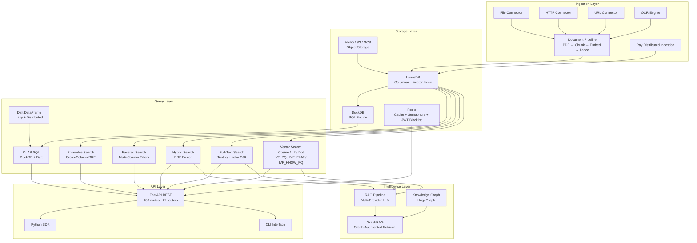
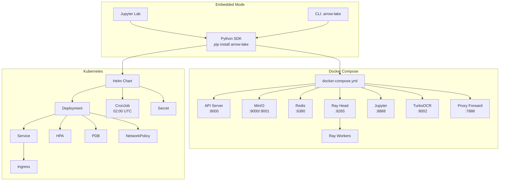

# Arrow Lake

**面向 AI/ML 团队的生产级多模态数据湖仓（Data Lakehouse）**

Arrow Lake 将 Lance 列式存储、Daft DataFrame 处理和 Ray 分布式计算统一为一个 Python 原生平台 —— 你可以在同一架构内完成文档、图像和非结构化数据的摄入，通过向量搜索（Vector Search）、全文搜索（Full-Text Search）和混合搜索（Hybrid Search）进行检索，使用 OLAP SQL 进行分析，并将数据直接送入 RAG 管线和知识图谱。采用 Apache-2.0 许可证，基于 Python 3.11+ 构建，拥有约 28,000 行生产代码、5,005+ 个测试用例（v1.10.0），开箱即用覆盖率超过 80%。自 v1.9.0 起以 **libSQL/Turso 控制面库**统一承载 RBAC、身份、personal token、审计、血缘、任务等控制面状态（数据面零改动、opt-in），并内置覆盖运维/合规/治理的 **Web 控制台（console，v1.9.1）**。

---

## 为什么选择 Arrow Lake —— 我们解决的问题

现代 AI/ML 团队从不想要一个五工具堆栈。他们只是被动地继承了它。

一个典型的生产环境通常需要串联向量数据库来存储嵌入、全文搜索引擎用于关键词检索、独立的 OLAP 系统用于分析、对象存储保存原始文件，以及一个 ML 管线编排器将一切连接起来。每个工具使用自己的查询语言、管理自己的存储格式、需要自己的运维专长。结果可想而知：数据散落在各个孤岛中 —— 向量在这里，文本在那里，图像归档在别处 —— 团队不得不编写脆弱的 ETL 管线在系统之间复制数据。每一次复制都引入延迟。每一次 Schema 变更需要跨系统协调迁移。每一次调试都横跨三个日志和两个仪表盘。这些成本在不断累积，而不一致性往往是隐性的，直到下游模型开始基于过时的嵌入产生幻觉时才被发现。

安全性在这种复杂性面前往往难以幸存。某些服务配置了认证，但并非全部。速率限制覆盖了 API 网关，却没有覆盖内部查询引擎。注入防御参差不齐，因为每个系统需要不同的转义策略。当平台投入生产时，安全攻击面已经变成了一个由部分解决方案拼凑而成的补丁集合。

Arrow Lake 将这个堆栈坍缩为单一、内聚的架构。每种数据类型 —— 文本、图像、文档、嵌入、结构化元数据 —— 都存储在基于 Apache Arrow 构建的列式存储中。每种查询模式 —— 向量相似度、全文、混合、分面、OLAP SQL —— 都在同一个存储上运行，支持零拷贝读取（Zero-Copy Read）和谓词下推（Predicate Pushdown）。每个管线步骤 —— 摄入、分块、嵌入、质量评分、RAG 检索、知识图谱构建 —— 都是一等公民（First-Class Citizen），而不是用胶带脚本粘合在两个 API 之间的临时方案。安全不是事后补丁；它是结构性的，从第一天起就在每个端点上覆盖了 RBAC、JWT 生命周期管理、速率限制、TLS 加固和注入防御。

---

## 架构概览

Arrow Lake 按四个水平层级组织 —— 摄入层、存储层、查询层和智能层 —— 顶部是一个统一的 API 表面。每个层级可独立扩展，但设计为作为一个整体系统运行：摄入层写入的数据可立即被存储层和查询层查询，并立即可用于智能层进行 RAG 和知识图谱操作。



**Lake 类**是中央编排器，通过 Mixin 架构组合而成，将每个关注点隔离并独立可测试。九个 Mixin 类 —— 基础生命周期、摄入、搜索、查询/OLAP、管理/版本、血缘、审计、RAG 与知识图谱 —— 各自是独立的 `_lake_*.py` 文件，每个能力都独立维护与测试。一个 `Lake` 实例始终携带全部九个 Mixin，但每个子系统都懒加载并缓存在可重入锁（`_get_component`）之后，因此你只为用到的部分付费：一个轻量级索引工作负载永远不会启动 RAG 管线或 HugeGraph 客户端。这是纯粹的 Python 组合 —— 无需插件注册，无需配置驱动的分发 —— 新增能力只需追加一个 Mixin 加一个 Bridge，无需改动主干。

三个性能原则贯穿每一个层级。第一，**零拷贝查询（Zero-Copy Query）**：因为 Lance 以 Apache Arrow 格式存储数据，每条读取路径都直接将 Arrow RecordBatch 返回给调用者 —— 无序列化，无拷贝。第二，**谓词下推（Predicate Pushdown）**：元数据列上的过滤条件被下推到 Lance 存储引擎，只有匹配的行才会被物化到内存中。第三，**流式处理（Streaming）**：摄入、嵌入和查询结果都通过 RecordBatchReader 迭代器流动，这意味着你可以在不进行分页或溢写的情况下处理超出可用 RAM 的数据集。

---

## 核心能力

### 多模态数据摄入

Arrow Lake 通过连接器抽象（Connector Abstraction）从磁盘文件、HTTP 上传和远程 URL 接收数据，将每种数据源标准化为统一的摄入请求。文档管线负责处理非结构化内容的繁重工作：一份 PDF 到达后，经过 OCR 处理扫描页面，被分割成语义连贯的片段，嵌入为向量，写入 Lance 数据集 —— 全部在一个编排好的流程中完成。每个阶段生成的中间产物都有版本记录且可审计，因此你可以追踪任意一个嵌入向量到其源页面和分块策略。

七种分块策略覆盖了从确定性到语义化的完整光谱：基于页面和基于段落的分割器尊重文档结构；递归字符分割处理纯文本并控制重叠；Semchunk 按词元数量优化分块边界；三种 Chonkie 策略 —— Token、Semantic 和 SDPM（Semantic Density Preserving Merge，语义密度保留合并） —— 使用感知 ML 的分割方式，保留跨边界的语义含义。你可以按数据集选择策略，管线会在元数据中记录每个分块所使用的策略。

除了文本，Arrow Lake 还在摄入时处理媒体数据。图像会生成缩略图和预览图，分辨率目标可配置。大图在嵌入前会被缩小，以控制向量维度和成本。Schema 验证在数据进入存储之前捕获结构不匹配问题 —— 在严格模式下，无效记录被拒绝；在宽松模式下，采用尽力解析策略。被拒绝的记录流入死信队列（Dead Letter Queue），附带完整的错误上下文，确保没有任何数据会悄无声息地丢失。

| 能力 | 详情 |
|---|---|
| 数据源连接器 | 文件系统、HTTP 上传、远程 URL |
| 文档管线 | PDF、OCR、分块、嵌入、Lance 写入 |
| 分块策略 | Page、Paragraph、Recursive、Semchunk、Chonkie Token/Semantic/SDPM |
| 媒体处理 | 缩略图生成、预览图创建、图像缩放 |
| Schema 处理 | 严格/宽松验证、Schema 演化、版本管理 |
| 死信队列 | 附带完整错误上下文的被拒绝记录 |

### 多模态搜索

Arrow Lake 的搜索不是单一算法 —— 它是一个由五种查询策略组成的可组合堆栈，你可以根据问题的需求灵活组合。向量搜索支持余弦相似度（Cosine Similarity）、L2 距离和点积（Dot Product）三种度量，配备三种索引类型：IVF_PQ 用于高吞吐量的压缩召回、IVF_FLAT 用于分区内的精确召回、IVF_HNSW_PQ 用于带量化的图近似最近邻搜索。全文搜索基于 Tantivy 引擎，集成了 jieba 分词器处理 CJK 内容，无需单独的索引步骤即可获得高质量的中日韩分词效果。

混合搜索通过倒数排名融合（Reciprocal Rank Fusion, RRF）将向量和文本结果融合，为每个结果分配一个平衡语义相似度和关键词相关性的分数。分面搜索在任何查询策略之上叠加多列元数据过滤，让你可以搜索"管线架构"的同时按日期范围、文档类型和来源系统进行过滤。集成搜索（Ensemble Search）进一步扩展了这一能力，在多个嵌入列之间运行 RRF 融合 —— 例如，将稠密嵌入与稀疏 BM25 风格嵌入结合，同时捕获语义和词法信号。

所有五种策略共享统一的结果接口：带有分数、元数据和可选高亮片段的排序命中列表。切换策略只需更改参数，无需重写查询。

| 搜索类型 | 引擎 | 索引 / 方法 |
|---|---|---|
| 向量搜索 | Lance 原生 | IVF_PQ, IVF_FLAT, IVF_HNSW_PQ |
| 全文搜索 | Tantivy + jieba | 带 CJK 分词器的倒排索引 |
| 混合搜索 | RRF 融合 | 向量 + FTS 分数组合 |
| 分面搜索 | Lance 元数据 | 多列谓词过滤 |
| 集成搜索 | 跨列 RRF | 多嵌入结果融合 |

### OLAP 分析

Arrow Lake 不强制你将数据导出到独立的数仓进行分析。DuckDB 直接在 Lance 数据集上运行，支持完整 SQL 能力：跨表 JOIN、用于时序分析的窗口函数、以及面向大规模结果集的流式执行。你用标准 SQL 查询多模态数据 —— 将图像元数据与嵌入相似度分数关联、计算文档摄入时间戳的滚动平均值、或对分块质量指标进行临时聚合。

Daft 为同一数据提供 DataFrame API，具备惰性求值（Lazy Evaluation）能力，将计算推迟到需要结果时才执行，并通过 Ray 实现分布式执行，处理超出单节点容量的大规模工作负载。DuckLake 集成实现跨存储 JOIN —— 例如将 Lance 表与 MinIO 中的 Parquet 文件连接 —— 物化为可查询的视图，在标准 SQL 接口背后隐藏存储边界。

查询治理防止单个分析查询耗尽集群资源。内存限制、并发上限和可配置的超时在 DuckDB Session 层面强制执行。会话池管理连接，确保 OLAP 查询不会饿死实时搜索路径。

| 能力 | 引擎 | 关键特性 |
|---|---|---|
| SQL 分析 | DuckDB | JOIN、窗口函数、流式执行 |
| DataFrame API | Daft | 惰性求值、Ray 分布式执行 |
| 跨存储 JOIN | DuckLake | Lance + Parquet 物化视图 |
| 资源治理 | 会话池 | 内存、并发、超时限制 |

### RAG 管线

Arrow Lake 中的 RAG 管线不是一个粘在聊天补全 API 上的检索函数。它是一条一等管线，具备可配置的检索策略、会话历史、引用追踪和流式生成能力 —— 旨在成为生产级 AI 应用的检索骨干。你配置管线使用的搜索策略（向量、混合、分面、集成），设置一个限制送入 LLM 词元数量的上下文预算，管线自动处理检索、排序、上下文组装和提示词构建。

LLM 提供商通过通用接口抽象：OpenAI、Anthropic、vLLM、Ollama 和 DeepSeek 全部支持流式响应生成。会话历史跨轮次持久化，管线维护对话上下文而无需调用方自行管理。每条生成的回答都包含引用参考，将每个论断追溯到产生它的具体文档分块和搜索分数，实现可审计性和信任验证。

GraphRAG 通过在向量和文本搜索之外同时查询 HugeGraph 知识图谱来扩展检索管线。当用户提出涉及实体关系的问题时 —— "哪些系统依赖于认证服务？" —— 管线检索相关图子图，将它们与传统搜索结果一起注入上下文，生成同时基于结构化和非结构化证据的回答。

**交叉编码器重排序（Cross-Encoder Reranking）** 在第一阶段召回之后锐化检索精度。默认情况下，管线对每个候选分块用 bge-reranker-v2-m3 交叉编码器针对查询打出一个连续的相关性分数并重排列表，使最贴切的证据上浮到顶部。重排器可插拔 —— CrossEncoder（默认）、LLM-as-judge 或 Ollama 二值判断 —— 并支持可配置设备（auto/cpu/cuda）与启动预热（warm-up-on-init），让首次查询不付冷启动代价。

**忠实度校验（Faithfulness Verification）** 闭环防幻觉。生成之后，回答的每一句都被拿来与检索上下文核对：轻量默认版用嵌入余弦相似度（复用抽取编码器，阈值可通过 `verification_threshold` 配置），另有一个 opt-in 的 LLM-judge 模式以单次调用逐句打分。响应携带 `support_ratio` 和明确的 `unsupported` 列表，让下游消费者可以拒绝或标记那些论断未被源证据支撑的回答。

| 能力 | 详情 |
|---|---|
| LLM 提供商 | OpenAI、Anthropic、vLLM、Ollama、DeepSeek |
| 检索模式 | 向量、混合、分面、集成 |
| 重排序 | 交叉编码器 bge-reranker-v2-m3（默认）、LLM、Ollama |
| 上下文管理 | 可配置的词元预算、会话历史 |
| 引用追踪 | 每条论断的源引用及搜索分数 |
| 忠实度校验 | support_ratio + unsupported（嵌入余弦 / LLM judge） |
| GraphRAG | 通过 HugeGraph 实现知识图谱增强检索 |
| 生成 | 流式响应，附带引用 + 延迟 + 校验信息 |

### 知识图谱

Arrow Lake 集成 HugeGraph 作为原生知识图谱后端，为你提供一个与向量和文本存储共享同一数据血缘的图数据库。实体和关系通过可配置的 LLM 驱动提取提示（Extraction Prompt）从摄入的文档中抽取，经 Schema 验证后写入 HugeGraph 并自动构建图结构。结果是一个随数据湖增长而有机扩展的知识图谱 —— 每一份新文档都可能添加连接到现有图谱的节点和边。

查询通过 Gremlin —— 标准图遍历语言 —— 执行，每条查询路径都内置了注入防御。参数化查询（Parameterized Query）防止 Gremlin 注入，即使遍历路径由用户输入塑造。对于分析型模式 —— 最短路径、子图枚举、邻域查询 —— Arrow Lake 提供辅助函数，从结构化参数构建安全的 Gremlin 遍历。

GraphRAG 桥接知识图谱和检索管线。当 RAG 查询到达时，系统从查询中提取候选实体，遍历知识图谱检索相关子图，将这些子图结果与传统搜索结果合并后再将组合上下文传递给 LLM。这赋予你不仅能理解文档说了什么，还能理解文档中概念如何相互关联以及与更广泛知识库关联的检索能力。

**知识抽取模板管理（v1.10.0）** 是平台扩展性的核心能力：内置模板管理控制台（extraction-templates.html）提供 YAML 在线编辑、实时校验与系统模板派生，支持数据集与模板绑定（`/kg/build` 自动套用绑定模板），并可通过 LLM 辅助生成新模板（自带 self-heal 与权威校验闸门）。KA/KG 抽取引擎在运行时动态加载用户模板进行建图，**无需 rebuild 镜像或重启服务**。配套的模板质量验证页（template-quality.html）支持场景文档生成→建图→可视化→RAG→清理的端到端试跑，并通过 category↔doc_type 端到端拉通与动态领域词典，让新业务领域快速接入。

| 能力 | 详情 |
|---|---|
| 图后端 | HugeGraph（Gremlin 兼容） |
| 实体抽取 | LLM 驱动，可配置提示词 |
| 查询语言 | 带注入防御的 Gremlin |
| GraphRAG 集成 | 子图检索合并到 RAG 上下文中 |
| Schema 管理 | 从抽取结果自动构建图 Schema |
| 抽取模板管理 | YAML CRUD 控制台 + LLM 辅助生成 + 数据集绑定，运行时动态建图（v1.10.0） |

### 数据质量与治理

数据质量在 Arrow Lake 中不是摄入后的检查清单 —— 它是一个嵌入每个管线阶段的持续自动化流程。Schema 验证对进入湖中的每条记录执行结构正确性检查，严格模式拒绝格式错误的数据，宽松模式应用尽力修复。去重通过内容哈希捕获完全重复，通过感知哈希（Perceptual Hashing）捕获近似重复的图像，确保你不会将嵌入计算浪费在冗余数据上。NVIDIA NeMo Curator 质量评分为每条记录分配质量等级，下游消费者可据此过滤训练数据。

全链路数据血缘（Data Lineage）追踪每条记录从源头到终点的完整路径。当一个嵌入出现在搜索结果中时，你可以追溯它到原始文档、来源页面、产生它的分块策略、向量化它的嵌入模型，以及它获得的质量评分。血缘是可查询的，你可以回答诸如"哪些文档贡献了这条 RAG 回答"或"本周有多少条记录未通过 Schema 验证"等问题。

HMAC-SHA256 审计轨迹使血缘具备防篡改能力。每个状态转换 —— 摄入、验证、分块、嵌入、查询 —— 都记录了带密钥哈希，可检测审计记录的修改或删除。这不是一个事后才想到的安全特性；它是一个结构性保证，确保湖中每条数据的来源都可以被独立验证。

**数据脱敏（Data Masking）** 将列级隐私控制引入治理平面。策略把敏感列映射到四种函数之一 —— `redact`、`hash`（HMAC-SHA256，128 位）、`partial` 或 `nullify` —— 并对 VIEWER 角色在读取时透明强制执行。脱敏引擎采用 fail-closed 设计：若 HMAC 密钥缺失，服务拒绝启动（可通过 `ALLOW_MISSING_KEY=1` opt-in 降级）；任何脱敏失败都返回空表，而非泄露未脱敏的源数据。`mask-preview` 端点读取数据集前几行并返回脱敏前/后对比，让策略作者在发布规则前即可验证其效果。

**血缘可视化（Lineage Visualization）** 把审计图谱变成一个可交互的界面。`lineage.html` 控制台页面围绕任一数据集渲染其完整的上下游图谱（按 target/source/derived 着色），以可配置的 `max_nodes` 封顶遍历规模，避免大图压垮浏览器；点击节点即可展示**列级血缘** —— 精确显示哪个源列流向哪个目标列、经由何种变换。策略变更与脱敏操作本身也通过同一套 Lance 审计轨迹记录，使治理动作可被治理。

| 能力 | 详情 |
|---|---|
| Schema 验证 | 严格/宽松模式，支持 Schema 演化 |
| 去重 | 精确哈希（内容）+ 感知哈希（图像） |
| 质量评分 | NVIDIA NeMo Curator 集成 |
| 数据血缘 | 全链路追踪，可交互图谱 + 列级血缘 |
| 数据脱敏 | redact/hash/partial/nullify，HMAC fail-closed，mask-preview |
| 审计轨迹 | HMAC-SHA256 防篡改事件日志 |

---

## 安全 —— 从第一天起即可用于生产

大多数数据平台将安全视为部署关注点 —— 代码运行后再配置的东西。Arrow Lake 将安全视为结构属性，从查询引擎到 API 表面的每个层级都内置安全能力。基于角色的访问控制（Role-Based Access Control, RBAC）覆盖全部 22 个 router 的 186 条路由，分为三个层级：VIEWER 用于只读访问，EDITOR 用于写操作，ADMIN 用于配置和用户管理。认证同时支持 API Key 验证和 JWT Token，可配置 HS256、RS256 或 ES256 签名，外加 admin 签发的 personal token 用于长生命周期服务访问（v1.9.0）。

JWT 生命周期完全受控。Token 以可配置的过期时间签发，登出或撤销时通过 Redis 支持的 TTL 黑名单进行失效处理，每次请求都进行验证。速率限制在端点级别强制执行，配备可配置的每分钟请求上限和突发余量（Burst Allowance），防止失控的客户端耗尽查询容量。TLS 在 FastAPI 层终止，安全头 —— Content-Security-Policy、X-Frame-Options、HSTS 等 —— 应用于每个响应。

注入防御覆盖每一条用户输入与查询引擎交汇的查询路径。Gremlin 查询通过参数化防止图注入。SQL 查询使用 DuckDB 的预处理语句（Prepared Statement）接口。路径遍历攻击通过对所有文件路径输入进行标准化和验证来阻断。结果是一个无需额外 Web 应用防火墙即可抵御 OWASP Top 10 的平台。

容器加固在 Docker 配置中指定：`cap-drop ALL` 移除所有 Linux Capabilities，文件系统以只读方式挂载并显式声明可写卷，资源限制约束 CPU 和内存。Kubernetes NetworkPolicy 模板将 Pod 间通信限制在 Arrow Lake 所需的端口和协议，最小化任何容器被攻破后的爆炸半径。

**默认 fail-closed（失败即关闭）** 是 v1.9.6 安全模型的主线。当信任边界处出现问题时，系统总是向安全一侧失败，绝不向数据泄露一侧失败：脱敏引擎失败和不可解析的行级过滤器返回空表，而非未脱敏或未过滤的源数据；启动时脱敏 HMAC 密钥缺失是硬失败而非告警；mask-preview 的列名经标识符白名单校验以拒绝 SQL 注入；血缘图谱标签经 HTML 转义以阻断经节点标题发起的 XSS。原则是一致的 —— 在任何隐私或授权路径上发生错误时，宁可返回空结果，也不泄露数据。

| 安全特性 | 实现方式 |
|---|---|
| RBAC | 3 级（VIEWER/EDITOR/ADMIN），覆盖全部 186 条路由 / 22 routers |
| 认证 | API Key + JWT（HS256/RS256/ES256）+ personal token（v1.9.0） |
| JWT 黑名单 | Redis 支持，带 TTL |
| 速率限制 | 按端点 RPM，支持突发 |
| TLS 与安全头 | TLS 终止 + CSP、X-Frame-Options、HSTS |
| 注入防御 | Gremlin 参数化、SQL 预处理语句、路径标准化 |
| Fail-closed | 脱敏/行过滤错误返回空表；启动必须提供 HMAC 密钥 |
| 容器加固 | cap-drop ALL、只读文件系统、资源限制 |
| 网络隔离 | Kubernetes NetworkPolicy 模板 |

---

## 性能与扩展性

Arrow Lake 的设计目标是在无需架构变更的情况下处理从数千到数十亿条记录的数据集增长。向量索引使用 IVF_PQ 量化（Quantization）将高维嵌入压缩为原始大小的一小部分，降低内存占用并加速召回，且不显著损失准确性。谓词下推确保元数据过滤在 Lance 存储层执行，只有匹配的行才会被解码并返回给查询引擎。RecordBatchReader 流式处理使摄入和查询结果以固定大小的 Arrow 批次流动，这意味着你可以在不显式分页的情况下处理超出可用内存的数据集。

图像密集型工作负载受益于惰性解码（Lazy Decode）：缩略图和预览图以压缩形式存储，仅在下游消费者请求像素数据时才解码，避免了在传输过程中持有已解码图像缓冲区的内存开销。并发通过 Redis 分布式信号量（Distributed Semaphore）管理，协调多个工作进程对共享资源 —— 嵌入模型推理、图写操作和速率受限的 LLM 调用 —— 的访问。

GPU 自动扩缩集成支持空闲时段的缩放到零（Scale-to-Zero）和成本高效的推理分片 GPU 分配。Ray 分布式摄入在集群上并行化文档处理，因此一万份 PDF 的批量任务可以并发地进行分块和嵌入，而非顺序处理。为优化存储成本，Blob 生命周期分层（Lifecycle Tiering）根据文件年龄和访问模式自动将原始文件从标准存储迁移到低频访问再到归档存储，降低冷数据的存储成本同时将热数据保留在高速存储上。

| 性能特性 | 收益 |
|---|---|
| IVF_PQ 压缩索引 | 降低内存占用，加速召回 |
| 谓词下推 | 仅物化匹配行 |
| RecordBatchReader 流式处理 | 处理超出 RAM 的数据集 |
| 图像惰性解码 | 像素数据仅在请求时解码 |
| Redis 分布式信号量 | 多工作进程并发协调 |
| DuckDB 会话池 | OLAP 查询隔离，无饥饿 |
| GPU 自动扩缩 | 缩放到零、分片 GPU |
| Ray 分布式摄入 | 并行文档处理 |
| Blob 生命周期分层 | Standard → IA → Glacier 成本优化 |

---

## 技术栈

Arrow Lake 构建在一个精心策划的顶级开源技术栈之上，每个组件都因生产可靠性、大规模性能和社区成熟度而被选用。每个依赖都锁定到精确版本，经过 5,000+ 个测试的验证，并持续进行安全漏洞扫描。

| 层级 | 技术 | 版本 | 用途 |
|-------|-----------|---------|---------|
| **数据处理** | Daft | 0.7.21 | 多模数据分布式 DataFrame 引擎 |
| | PyArrow | 23.0.1 | 内存列式格式和 IPC |
| | DuckDB | 1.5.5 | 嵌入式 OLAP SQL 引擎 |
| **向量存储** | LanceDB | 0.36.0 | 基于 Lance 构建的无服务器向量数据库 |
| | Lance (pylance) | 9.0.0 | 列式向量存储格式 |
| **分布式计算** | Ray | 2.56.0 | 可扩展的集群运行时，用于并行任务 |
| | Metaflow | 2.19.35 | 数据管线工作流编排 |
| **API 框架** | FastAPI | >=0.115 | 高性能异步 REST API |
| | Uvicorn | >=0.34 | 支持 HTTP/1.1 和 WebSocket 的 ASGI 服务器 |
| | slowapi | >=0.1.9 | 请求速率限制中间件 |
| **前端控制台** | Console（原生 JS + ES module） | v1.9.1 | 运维/合规/治理 Web 控制台，同源 mount `/console`，复用 REST + RBAC |
| **对象存储** | boto3 | >=1.35 | S3 兼容存储（MinIO、AWS S3、GCS） |
| **会话协调** | Redis (hiredis) | >=5.0, <6.0 | 分布式会话、JWT 黑名单、信号量、rate_limit/login lockout（v1.9.2） |
| **控制面库** | libSQL / Turso (sqld) | latest（v1.9.0） | 控制面关系库：RBAC / 身份 / personal token / catalog 注册 / 任务历史 / 血缘索引 / RAG 会话；**数据面不触碰**；opt-in |
| **知识图谱** | HugeGraph | 1.7.0 | 支持 Gremlin 遍历的属性图数据库 |
| **嵌入模型** | Qwen3-Embedding | 0.6B | 默认文本嵌入（ModelScope/Ollama） |
| | Qwen3-VL-Embedding | — | 多模态（文本 + 图像）嵌入 |
| | sentence-transformers | >=3.3 | 本地嵌入模型执行 |
| **LLM 提供商** | OpenAI | >=1.50 | GPT-4o、GPT-4、GPT-3.5 |
| | Anthropic | >=0.40 | Claude 4 系列 |
| | vLLM / Ollama | — | 自托管 LLM 推理 |
| | DeepSeek | — | DeepSeek V3/R1 模型 |
| **OCR** | Kreuzberg | >=0.1 | 多后端 OCR（PaddleOCR、Tesseract、EasyOCR） |
| | TurboOCR | latest | GPU 加速文档 OCR 服务 |
| **分块** | Recursive | 内置 | 基于字符的递归分割 |
| | Page / Paragraph | 内置 | 感知文档结构的分块 |
| | Semchunk | >=2.0 | 语义边界感知分块 |
| | Chonkie | >=1.0 | 高级语义分块 |
| **全文搜索** | Tantivy | >=0.20.0 | Rust 原生全文搜索引擎 |
| | jieba | >=0.42 | 中文文本分词，用于 CJK 搜索 |
| **数据质量** | datasketch | >=1.6 | 基于 MinHash 的近似重复检测 |
| | imagehash | >=4.3 | 图像去重的感知哈希 |
| **验证** | Pydantic | >=2.10 | 数据模型验证和序列化 |
| | pydantic-settings | >=2.7 | 基于环境变量的配置管理 |
| **弹性** | tenacity | >=9.0 | 指数退避重试 |
| **多模态 I/O** | Pillow | >=10.4 | 图像解码、缩略图、格式转换 |
| | av | >=12.0 | 视频和音频容器解析 |
| **可观测性** | structlog | >=24.4 | 结构化 JSON 日志 |
| | prometheus-client | >=0.21 | 指标暴露 |
| | OpenTelemetry | >=1.24 | 分布式追踪（API、SDK、OTLP/gRPC） |
| **安全** | PyJWT | >=2.9 | JWT Token 签名和验证 |
| **CLI** | Click | >=8.1 | 命令行界面框架 |
| | Rich | >=13.0 | 终端格式化、表格和进度条 |

### 可选依赖组

Arrow Lake 使用模块化的 extras 系统，你只需安装工作流所需的组件。核心功能无需任何可选依赖即可运行。

| Extra | 安装内容 | 使用场景 |
|-------|----------|----------|
| `jupyter` | jupyterlab, ipywidgets | 交互式 Notebook 开发 |
| `fts` | tantivy, jieba | 支持 CJK 的全文搜索 |
| `rag` | openai, anthropic, jinja2 | 接入云 LLM 提供商的 RAG 管线 |
| `document` | kreuzberg | PDF 和文档 OCR 处理 |
| `chunking-advanced` | semchunk | 语义边界感知分块 |
| `chunking-semantic` | chonkie, sentence-transformers | 基于 Transformer 的语义分块 |
| `chunking-full` | semchunk, chonkie, sentence-transformers | 全部分块策略 |
| `dedup` | imagehash | 图像感知去重 |
| `otel` | opentelemetry-api/sdk/exporter | OpenTelemetry 分布式追踪 |
| `jwt` | PyJWT | JWT 认证 Token |
| `gpu` | torch >=2.4 | GPU 加速嵌入和推理 |
| `modelscope` | modelscope >=1.18 | 从 ModelScope Hub 下载模型 |
| `nemo-curator` | nemo-curator >=0.6 | NVIDIA NeMo 数据治理管线 |

---

## 部署选项

Arrow Lake 提供三种部署模式，从单个开发者笔记本到生产级 Kubernetes 集群均可覆盖。每条部署路径使用相同的核心引擎和配置系统，你的代码和工作流可以在环境之间无缝迁移。



### Docker Compose（开发与小规模生产）

Docker Compose 部署提供了一套完整的、经过安全加固的 9 个容器化服务栈。基于 Profile 的激活机制让你精确启动所需的服务 —— 不多不少。

**服务与激活 Profile：**

| Profile | 服务 | 命令 | 使用场景 |
|---------|----------|---------|----------|
| `core` | API、MinIO、MinIO Init、Redis、Proxy Forward | `make up` | 最小化生产 API |
| `dev` | core + Ray Head、Ray Worker、Jupyter | `make dev` | 完整开发环境 |
| `compute` | Ray Head、Ray Worker | — | 仅分布式计算 |
| `gpu` | GPU 启用的 Ray Head/Worker | `make gpu` | GPU 推理工作负载 |
| `monitoring` | core + Prometheus、Grafana、Jaeger | `make full` | 可观测性栈 |
| `ocr` | TurboOCR（GPU、NVIDIA 预留） | `make ocr` | 文档 OCR 处理 |

每个服务默认应用生产级安全约束：`cap_drop: ALL`、只读文件系统配合显式可写卷、PID 限制、内存上限和 CPU 配额。六个命名 Docker Volume 确保数据在容器重启后持久存活。

### Kubernetes（生产环境）

Helm Chart 提供生产就绪的 Kubernetes 部署，包含 10 个模板资源，涵盖安全、可扩展性和运维可靠性。

| 模板 | 用途 |
|----------|---------|
| `deployment.yaml` | 带存活/就绪探针和安全上下文的 API 服务器 |
| `service.yaml` | 暴露端口 8000 的 ClusterIP Service |
| `ingress.yaml` | 支持 TLS 的可配置 Ingress |
| `hpa.yaml` | 水平 Pod 自动扩缩（CPU + 内存，2-8 Pod） |
| `pdb.yaml` | Pod 中断预算，保障最低可用性 |
| `secret.yaml` | API Key、JWT 密钥、HMAC 审计密钥 |
| `cronjob-backup.yaml` | 通过 API 触发的每日备份（UTC 02:00） |
| `networkpolicy.yaml` | 零信任入站/出站规则 |
| `prometheusrule.yaml` | 基于 SLO 的告警规则 |

### Python SDK（嵌入式）

为最大化灵活性，Arrow Lake 可作为 Python 库运行，无需任何外部服务。提供三种接口：编程式 `Lake` 类、`arrow-lake` CLI（16+ 子命令组）和用于多语言集成的 REST API 服务器。三者共享相同的代码路径和配置系统。

```bash
# 核心引擎（LanceDB + Daft + DuckDB，无服务器）
pip install arrow-lake

# 带常用 extras
pip install "arrow-lake[fts,rag,document,chunking-full,jupyter]"

# 完整生产栈
pip install "arrow-lake[gpu,otel,jwt,modelscope]"
```

---

## 开发者体验

Arrow Lake 的设计目标是让你在三分钟内从零搭建出一条可运行的管线。SDK 暴露一个 `Lake` 入口点，通过一致的、文档完善的 Python API 提供对所有能力的访问。

**16+ 子命令组的 CLI：**

| 命令组 | 子命令 | 用途 |
|--------------|-------------|---------|
| `serve` | --host, --port, --reload | 启动 REST API 服务器（uvicorn 工厂） |
| `catalog` | list, info, schema | 数据集目录管理 |
| `maintenance` | expire, compact, stats | 数据集版本清理与压缩 |
| `ingest` | files, images, audio, video, documents | 多模态数据摄入 |
| `search` | vector, text, hybrid | 语义和全文搜索 |
| `index` | create, delete, list | 向量和 FTS 索引管理 |
| `query` | sql, explain | OLAP SQL 查询 |
| `export` | parquet, csv | 带投影的数据导出 |
| `embed` | generate, add, model-info | 嵌入向量生成 |
| `quality` | check, dedup | 数据质量评分和去重 |
| `backup` | create, restore, list | 数据集备份与恢复 |
| `kg` | build, query, stats, traverser, algo | 知识图谱操作 |
| `rag` | query, session, config | RAG 问答 |
| `audit` | log, verify, export | 防篡改审计轨迹 |
| `lineage` | trace, query | 数据血缘追踪 |
| `lifecycle` | expire, archive, stats | Blob 生命周期管理 |
| `config` | show, validate, diff | 配置检查 |

**文档套件：**

文档包含 19 章双语 Cookbook（英文和中文），50+ 个可运行示例，覆盖从基础摄入到高级 GraphRAG、数据脱敏、血缘可视化的每个功能。权威的 [`ARCHITECTURE.md`](./architecture-design/ARCHITECTURE.md) 技术参考、以图驱动的 [`architecture-design/`](./architecture-design/) 设计文档，以及 [`cookbook/`](./cookbook/) 实战手册，提供更深层的架构上下文、配置参考和部署流程。

**配置系统：**

34 个独立配置节（Pydantic v2 `ArrowLakeConfig` 根组合 34 个子配置），每个都由带类型验证的 Pydantic 模型支撑。四层优先级：代码默认值（最低）、`.env` 文件、带 `ARROW_LAKE__` 前缀的环境变量（`__` 作层级分隔符）、YAML 配置文件覆盖（最高）。`config show` CLI 命令在运行时显示解析后的完整配置。

---

## 使用场景

### 企业知识库

一家金融服务公司将 50,000 份监管文件、内部政策和研究报告摄入 Arrow Lake。文档管线自动解析 PDF，对扫描页面应用 OCR，将内容分割成语义分块，并生成嵌入向量。当分析师提出问题时，RAG 管线检索相关分块并返回带有来源引用的接地回答。审计轨迹记录每次查询以供合规审查。平均查询延迟低于 800 毫秒。

```python
lake = Lake.from_yaml("configs/production.yaml")
# 解析 + 分块 + 嵌入 + 写入，一个编排流程完成
lake.ingest_documents("regulations", ["data/regulations/"])

answer = await lake.rag_query(
    "What are the capital requirements for Basel III Tier 1?",
    dataset_name="regulations",
    top_k=10,
)  # RAGResponse 始终携带 citations
```

### 多媒体资产管理平台

一家媒体公司管理 200,000 张产品图片、5,000 个宣传视频和 10,000 条音频片段。Arrow Lake 将原始资产存储在 MinIO 中，同时在 LanceDB 中维护元数据、缩略图和嵌入向量。分面搜索让编辑可以按分辨率、格式和日期范围过滤，同时按视觉相似度搜索。OLAP 查询生成月度使用报告。

```python
lake.ingest_images("product_photos", ["photos/*.jpg", "photos/*.png"])
lake.ingest_videos("promos", ["videos/*.mp4"], keyframe_interval=5)

# 文搜图：用 CLIP text tower 编码查询，搜索 image_embedding 列
query_vec = lake.encode_text_clip("red sneakers on white background")
results = lake.search("product_photos", query_vec, vector_column="image_embedding", top_k=20)

# Analytics: asset usage by format and month
report = lake.olap_query("product_photos",
    "SELECT format, DATE_TRUNC('month', created_at) as month, "
    "COUNT(*) FROM product_photos GROUP BY format, month ORDER BY month")
```

### 数据质量管线

一个机器学习团队维护着 12 个数据集共计 200 万行训练数据的质量。质量管线每晚运行：Schema 验证、空值检测、异常值标记，以及使用 SHA-256 进行精确去重和 MinHash 进行近似去重。标记的记录路由到死信数据集待审查。团队报告训练失败率降低了 34%。

```python
report = lake.quality_filter("training_data", mode="all")   # 跑全部已注册过滤器 → QualityReport
flagged = lake.deduplicate("training_data", strategy="minhash", action="flag")
clean = lake.deduplicate("training_data", strategy="exact", action="remove")
```

### 跨域分析

一个零售分析团队通过单一 OLAP 接口查询多模态数据集 —— 客户交易（结构化）、产品评论（文本）和门店照片（图像）。DuckDB 实现跨数据集 JOIN 和窗口函数。物化视图预计算每日 KPI。

```python
result = lake.olap_query("transactions",
    """SELECT t.product_category,
              AVG(t.amount) as avg_value,
              COUNT(r.id) as review_count,
              AVG(r.sentiment_score) as avg_sentiment
       FROM transactions t
       LEFT JOIN reviews r ON t.product_id = r.product_id
       GROUP BY t.product_category
       ORDER BY avg_value DESC""")
```

### AI 增强科研

一家研究机构在 10 万篇学术论文上构建知识图谱。基于 LLM 的抽取识别实体（作者、机构、方法、数据集）和关系（引用、扩展、反驳）。GraphRAG 将向量搜索与图谱上下文结合，生成同时基于文本证据和结构化关系的全面回答。

```python
task_id = await lake.kg_build("papers")   # fire-and-forget；实体类型由抽取模板决定
await lake.kg_build_status(task_id)        # 轮询直到 COMPLETED

answer = await lake.rag_query(
    "Which labs are working on efficient attention mechanisms?",
    dataset_name="papers",
    use_kg=True,                            # GraphRAG：KG 子图 + 向量检索
    top_k=15,
)
```

---

## 快速上手

### 系统要求

| 要求 | 最低配置 | 推荐配置 |
|-------------|---------|-------------|
| Python | 3.11 | 3.12+ |
| 内存 | 4 GB | 16 GB+ |
| 磁盘 | 2 GB | SSD，可用空间 50 GB+ |
| 操作系统 | Linux、macOS、Windows (WSL2) | Ubuntu 22.04+ |
| GPU | — | NVIDIA CUDA 12.x（用于嵌入/OCR） |

### 安装

```bash
python -m venv .venv && source .venv/bin/activate
pip install "arrow-lake"

# 带常用 extras
pip install "arrow-lake[fts,rag,document,chunking-full,jupyter,otel]"
```

### 快速开始

```python
from arrow_lake import Lake
import pyarrow as pa

# 1. Create a lake
lake = Lake(base_uri="./data")

# 2. Ingest data
lake.create_dataset("docs", pa.table({"text": ["Hello world"]}))

# 3. Query with SQL
result = lake.olap_query("docs", "SELECT * FROM docs")

# 4. RAG with LLM
lake = Lake.from_yaml("configs/my_config.yaml")
lake.ingest("knowledge_base", ["data/papers/"])
lake.embed_and_add("knowledge_base")
answer = await lake.rag_query("What is the state of the art?", dataset_name="knowledge_base")
```

### 资源

| 资源 | 地址 |
|----------|----------|
| 源代码 | [GitHub](https://github.com/wits-sunpw/arrow-lake) / [Gitee](https://gitee.com/wits__sunpw/wits-infra-dintellihub) |
| Cookbook | 19 章，50+ 个示例 —— 中英双语 |
| 安全策略 | `SECURITY.md` |
| API 文档 | 服务启动时自动生成于 `/docs` |

### 许可证

Arrow Lake 采用 **Apache License 2.0** 发布。这是一款宽松、商业友好的许可证，同时附带明确的专利授权 —— 可自由使用、修改和分发，适用于商业和开源项目。
