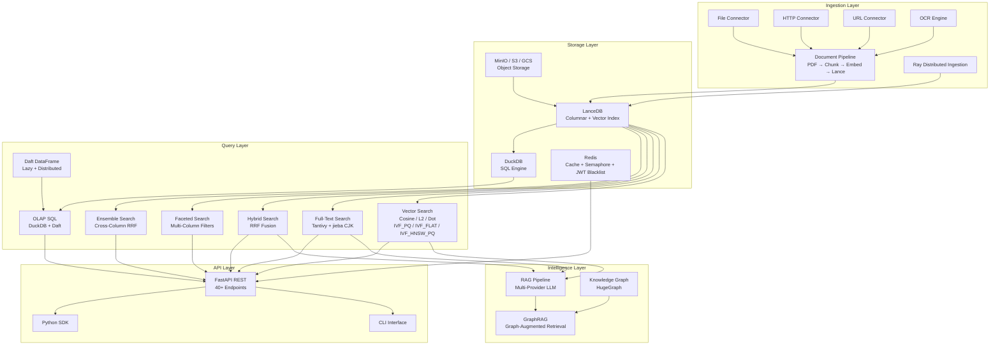
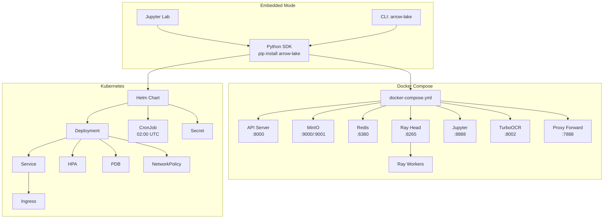

# Arrow Lake

**Production-Grade Multimodal Data Lakehouse for AI/ML Teams**

Arrow Lake unifies Lance columnar storage, Daft DataFrame processing, and Ray distributed compute into a single Python-native platform — so you can ingest documents, images, and unstructured data; search it with vector, full-text, and hybrid queries; analyze it with OLAP SQL; and feed it directly into RAG pipelines and knowledge graphs, all without leaving one architecture. MIT licensed, built for Python 3.11+, with roughly 28,000 lines of production code, 5,005+ tests (v1.9.2), and 80%+ coverage out of the box. Since v1.9.0 a **libSQL/Turso control-plane database** unifies RBAC, identity, personal tokens, audit, lineage, and task state (data plane untouched, opt-in), and a built-in **web console (v1.9.1)** covers operations, compliance, and governance.

---

## Why Arrow Lake — The Problem We Solve

Modern AI/ML teams did not ask for a five-tool stack. They inherited one.

A typical production environment today chains together a vector database for embeddings, a full-text engine for keyword search, a separate OLAP system for analytics, an object store for raw files, and an ML pipeline orchestrator to wire it all together. Each tool speaks its own query language, manages its own storage format, and demands its own operational expertise. The result is predictable: data lives in silos — vectors here, text there, images archived somewhere else — and teams write fragile ETL pipelines to copy data between them. Every copy introduces latency. Every schema change requires coordinated migrations across systems. Every debugging session spans three logs and two dashboards. The cost compounds, and the inconsistency is invisible until a downstream model starts hallucinating on stale embeddings.

Security rarely survives this complexity. Authentication is bolted on to some services but not others. Rate limiting covers the API gateway but not the internal query engine. Injection defenses are uneven because each system requires a different escaping strategy. By the time a platform reaches production, the security surface is a patchwork of partial solutions.

Arrow Lake collapses this stack into a single, coherent architecture. Every data type — text, images, documents, embeddings, structured metadata — lives in one columnar store built on Apache Arrow. Every query pattern — vector similarity, full-text, hybrid, faceted, OLAP SQL — runs against that same store with zero-copy reads and predicate pushdown. Every pipeline step — ingestion, chunking, embedding, quality scoring, RAG retrieval, knowledge graph construction — is a first-class citizen, not a script duct-taped between two APIs. Security is not retrofitted; it is structural, covering RBAC, JWT lifecycle, rate limiting, TLS hardening, and injection defense across every endpoint from day one.

---

## Architecture Overview

Arrow Lake is organized into four horizontal layers — ingestion, storage, query, and intelligence — topped by a unified API surface. Each layer is independently scalable but designed to operate as a single system: data written by the ingestion layer is immediately queryable by the storage and query layers, and immediately available to the intelligence layer for RAG and knowledge graph operations.



**The Lake class** is the central orchestrator, composed through a mixin architecture that keeps each concern isolated and independently testable. Eight mixin classes provide ingestion, storage management, search, analytics, RAG, knowledge graph, data quality, and security capabilities. A Lake instance gains behavior by inheriting the mixins it needs — no plugin registration, no configuration-driven dispatch, just clean Python composition. This design means you can instantiate a Lake with ingestion and search only for a lightweight indexing service, or enable all eight mixins for a full-featured data platform, without changing a single line of business logic.

Three performance principles run through every layer. First, **zero-copy query**: because Lance stores data in Apache Arrow format, every read path returns Arrow RecordBatches directly to the caller — no serialization, no copies. Second, **predicate pushdown**: filters on metadata columns are pushed down to the Lance storage engine so only matching rows are materialized into memory. Third, **streaming**: ingestion, embedding, and query results all flow through RecordBatchReader iterators, meaning you can process datasets that exceed available RAM without paging or spilling.

---

## Core Capabilities

### Multimodal Ingestion

Arrow Lake accepts data from files on disk, HTTP uploads, and remote URLs through a connector abstraction that normalizes each source into a unified ingest request. The document pipeline handles the heavy lifting for unstructured content: a PDF arrives, gets routed through OCR for scanned pages, is chunked into semantically coherent segments, embedded into vectors, and written as a Lance dataset — all in a single orchestrated flow. Each stage produces intermediate artifacts that are versioned and auditable, so you can trace any embedding back to its source page and chunking strategy.

Seven chunking strategies cover the spectrum from deterministic to semantic: Page-based and Paragraph-based splitters respect document structure; Recursive character splitting handles plain text with overlap control; Semchunk optimizes chunk boundaries by token count; and three Chonkie strategies — Token, Semantic, and SDPM (Semantic Density Preserving Merge) — use ML-aware splitting that preserves meaning across boundaries. You choose the strategy per-dataset, and the pipeline records which strategy produced each chunk in the metadata.

Beyond text, Arrow Lake processes media at ingestion time. Images are thumbnailed and previewed with configurable resolution targets. Large images are downscaled before embedding to control vector dimensionality and cost. Schema validation catches structural mismatches before data enters the store — in strict mode, invalid records are rejected; in lenient mode, they are best-effort parsed. Rejected records flow into a dead letter queue with full error context, so nothing disappears silently.

| Capability | Details |
|---|---|
| Source connectors | File system, HTTP upload, remote URL |
| Document pipeline | PDF, OCR, chunk, embed, Lance write |
| Chunking strategies | Page, Paragraph, Recursive, Semchunk, Chonkie Token/Semantic/SDPM |
| Media processing | Thumbnail generation, preview creation, downscaling |
| Schema handling | Strict/lenient validation, evolution, versioning |
| Dead letter queue | Rejected records with full error context |

### Multi-Modal Search

Search in Arrow Lake is not a single algorithm — it is a composable stack of five query strategies that you combine based on what the question demands. Vector search supports cosine, L2, and dot-product similarity with three index types: IVF_PQ for compressed high-throughput recall, IVF_FLAT for exact recall within partitions, and IVF_HNSW_PQ for graph-based approximate nearest neighbor with quantization. Full-text search is powered by Tantivy with a jieba tokenizer for CJK content, giving you proper Chinese, Japanese, and Korean segmentation without a separate indexing step.

Hybrid search fuses vector and text results through Reciprocal Rank Fusion (RRF), assigning each result a score that balances semantic similarity with keyword relevance. Faceted search adds multi-column metadata filtering on top of any query strategy, so you can search for "pipeline architectures" and simultaneously filter by date range, document type, and source system. Ensemble search extends this further by running RRF fusion across multiple embedding columns — for example, combining a dense embedding with a sparse BM25-style embedding to capture both semantic and lexical signals.

All five strategies share a common result interface: ranked hits with scores, metadata, and optional highlight snippets. Switching between strategies requires changing a parameter, not rewriting a query.

| Search Type | Engine | Index / Method |
|---|---|---|
| Vector | Lance native | IVF_PQ, IVF_FLAT, IVF_HNSW_PQ |
| Full-text | Tantivy + jieba | Inverted index with CJK tokenizer |
| Hybrid | RRF fusion | Vector + FTS score combination |
| Faceted | Lance metadata | Multi-column predicate filters |
| Ensemble | Cross-column RRF | Multi-embedding result fusion |

### OLAP Analytics

Arrow Lake does not force you to export data to a separate warehouse for analytics. DuckDB runs directly against Lance datasets with full SQL support: joins across tables, window functions for time-series analysis, and streaming execution for large result sets. You write standard SQL against your multimodal data — joining image metadata with embedding similarity scores, computing rolling averages over document ingestion timestamps, or running ad-hoc aggregations on chunk quality metrics.

Daft provides a DataFrame API for the same data, with lazy evaluation that defers computation until results are needed and distributed execution powered by Ray for workloads that exceed single-node capacity. The DuckLake integration materializes cross-storage joins — for example, joining Lance tables with Parquet files in MinIO — into queryable views that hide the storage boundary behind a standard SQL interface.

Query governance prevents a single analytical query from consuming cluster resources. Memory limits, concurrency caps, and configurable timeouts are enforced at the DuckDB session level. A session pool manages connections so that OLAP queries do not starve the real-time search path.

| Capability | Engine | Key Feature |
|---|---|---|
| SQL analytics | DuckDB | Joins, window functions, streaming |
| DataFrame API | Daft | Lazy evaluation, Ray distributed |
| Cross-storage joins | DuckLake | Lance + Parquet materialized views |
| Resource governance | Session pool | Memory, concurrency, timeout limits |

### RAG Pipeline

The RAG pipeline in Arrow Lake is not a retrieval function bolted onto a chat completion API. It is a first-class pipeline with configurable retrieval strategies, session history, citation tracking, and streaming generation — designed to be the retrieval backbone of production AI applications. You configure which search strategy the pipeline uses (vector, hybrid, faceted, ensemble), set a context budget that caps the number of tokens fed to the LLM, and the pipeline handles retrieval, ranking, context assembly, and prompt construction automatically.

LLM providers are abstracted behind a common interface: OpenAI, Anthropic, vLLM, Ollama, and DeepSeek are all supported with streaming response generation. Session history persists across turns, so the pipeline maintains conversational context without requiring the caller to manage it. Every generated response includes citation references that trace each claim back to the specific document chunks and search scores that produced it, enabling auditability and trust verification.

GraphRAG extends the retrieval pipeline by querying the HugeGraph knowledge graph alongside vector and text search. When a user asks a question that involves entity relationships — "Which systems depend on the authentication service?" — the pipeline retrieves relevant graph subgraphs, injects them into the context alongside traditional search results, and generates an answer grounded in both structured and unstructured evidence.

**Cross-encoder reranking** sharpens retrieval precision after first-stage recall. By default the pipeline applies a bge-reranker-v2-m3 cross-encoder to score every candidate chunk against the query with a continuous relevance score, reordering the list so the most pertinent evidence rises to the top. The reranker is pluggable — CrossEncoder (default), LLM-as-judge, or Ollama binary — and runs with a configurable device (auto/cpu/cuda) and warm-up-on-init, so the first query pays no cold-start penalty.

**Faithfulness verification** closes the hallucination loop. After generation, every sentence of the answer is checked against the retrieved context: the lightweight default uses embedding cosine similarity (reusing the extract encoder, threshold configurable via `verification_threshold`), with an opt-in LLM-judge mode that scores each sentence in a single call. The response carries a `support_ratio` and an explicit `unsupported` list, so downstream consumers can refuse or flag answers whose claims are not grounded in the source evidence.

| Capability | Details |
|---|---|
| LLM providers | OpenAI, Anthropic, vLLM, Ollama, DeepSeek |
| Retrieval modes | Vector, Hybrid, Faceted, Ensemble |
| Reranking | Cross-encoder bge-reranker-v2-m3 (default), LLM, Ollama |
| Context management | Configurable token budget, session history |
| Citation tracking | Per-claim source references with search scores |
| Faithfulness verify | support_ratio + unsupported (embedding cosine / LLM judge) |
| GraphRAG | Knowledge graph-augmented retrieval via HugeGraph |
| Generation | Streaming response with citations + latency + verification |

### Knowledge Graph

Arrow Lake integrates HugeGraph as a native knowledge graph backend, giving you a graph database that shares the same data lineage as your vector and text stores. Entities and relations are extracted from ingested documents using configurable LLM-powered extraction prompts, then written into HugeGraph with schema validation and automatic graph construction. The result is a knowledge graph that grows organically as your data lake grows — every new document potentially adds nodes and edges that connect to the existing graph.

Query runs through Gremlin, the standard graph traversal language, with injection defense built into every query path. Parameterized queries prevent Gremlin injection even when user input shapes the traversal. For analytical patterns — shortest path, subgraph enumeration, neighborhood queries — Arrow Lake provides helper functions that construct safe Gremlin traversals from structured parameters.

GraphRAG bridges the knowledge graph and the retrieval pipeline. When a RAG query arrives, the system extracts candidate entities from the query, traverses the knowledge graph to retrieve relevant subgraphs, and merges those subgraph results with traditional search results before passing the combined context to the LLM. This gives you retrieval that understands not just what a document says, but how concepts in the document relate to each other and to the broader knowledge base.

| Capability | Details |
|---|---|
| Graph backend | HugeGraph (Gremlin-compatible) |
| Entity extraction | LLM-powered with configurable prompts |
| Query language | Gremlin with injection defense |
| GraphRAG integration | Subgraph retrieval merged into RAG context |
| Schema management | Automatic graph schema from extraction results |

### Data Quality and Governance

Data quality is not a post-ingestion checklist in Arrow Lake — it is a continuous, automated process integrated into every pipeline stage. Schema validation enforces structural correctness on every record entering the lake, with strict mode rejecting malformed data and lenient mode applying best-effort fixes. Deduplication catches both exact duplicates through content hashing and near-duplicate images through perceptual hashing, so you do not waste embedding compute on redundant data. NVIDIA NeMo Curator quality scoring assigns each record a quality grade that downstream consumers can use to filter training data.

Full-chain data lineage tracks every record from source to sink. When an embedding appears in a search result, you can trace it back to the original document, the page it came from, the chunking strategy that produced it, the embedding model that vectorized it, and the quality score it received. This lineage is queryable, so you can answer questions like "which documents contributed to this RAG response" or "how many records failed schema validation this week."

An HMAC-SHA256 audit trail makes the lineage tamper-evident. Every state transition — ingest, validate, chunk, embed, query — is recorded with a keyed hash that detects modification or deletion of audit records. This is not a security-afterthought feature; it is a structural guarantee that the provenance of every piece of data in the lake can be independently verified.

**Data masking** brings column-level privacy controls into the governance plane. Policies map sensitive columns to one of four functions — `redact`, `hash` (HMAC-SHA256, 128-bit), `partial`, or `nullify` — and are enforced transparently on read for VIEWER roles. The masking engine is fail-closed: if the HMAC key is missing the service refuses to start (opt-in downgrade via `ALLOW_MISSING_KEY=1`), and any masking failure returns an empty table rather than leaking the unmasked source. A `mask-preview` endpoint reads the first rows of a dataset and returns before/after pairs, so policy authors can verify a rule before publishing it.

**Lineage visualization** turns the audit graph into an interactive surface. The `lineage.html` console page renders the full upstream/downstream graph around any dataset (color-coded by target/source/derived), caps the traversal at a configurable `max_nodes` to keep large graphs from overwhelming the browser, and exposes **column-level lineage** on node click — showing exactly which source column flowed into which target column and through what transform. Policy changes and masking operations are themselves audited through the same Lance audit trail, so governance actions are governable.

| Capability | Details |
|---|---|
| Schema validation | Strict/lenient modes, evolution support |
| Deduplication | Exact hash (content) + perceptual hash (images) |
| Quality scoring | NVIDIA NeMo Curator integration |
| Data lineage | Full-chain tracking, interactive graph + column-level |
| Data masking | redact/hash/partial/nullify, HMAC fail-closed, mask-preview |
| Audit trail | HMAC-SHA256 tamper-evident event log |

---

## Security — Production-Ready from Day One

Most data platforms treat security as a deployment concern — something you configure after the code is running. Arrow Lake treats security as a structural property, built into every layer from the query engine to the API surface. Role-based access control covers all 40+ REST endpoints with three tiers: VIEWER for read-only access, EDITOR for write operations, and ADMIN for configuration and user management. Authentication supports both API key validation and JWT tokens with configurable HS256 or RS256 signing.

The JWT lifecycle is fully managed. Tokens are issued with configurable expiration, blacklisted on logout or revocation through a Redis-backed blacklist with TTL, and validated on every request. Rate limiting is enforced per-endpoint with configurable requests-per-minute thresholds and burst allowances, so a runaway client cannot exhaust query capacity. TLS terminates at the FastAPI layer with security headers — Content-Security-Policy, X-Frame-Options, HSTS, and more — applied to every response.

Injection defense covers every query path where user input meets a query engine. Gremlin queries are parameterized to prevent graph injection. SQL queries use DuckDB's prepared statement interface. Path traversal attacks are blocked by normalizing and validating all file path inputs. The result is a platform that resists the OWASP Top 10 without requiring a separate Web Application Firewall.

Container hardening is specified in the Docker configuration: `cap-drop ALL` removes all Linux capabilities, the filesystem is mounted read-only with explicit writable volumes, and resource limits constrain CPU and memory. A Kubernetes NetworkPolicy template restricts pod-to-pod communication to only the ports and protocols that Arrow Lake requires, minimizing the blast radius of any container compromise.

**Fail-closed by default** is the through-line of the v1.9.6 security model. When something goes wrong at a trust boundary, the system fails toward the safe side, never toward data exposure: masking-engine failures and unparseable row filters return an empty table instead of the unmasked or unfiltered source; a missing masking HMAC key at startup is a hard failure, not a warning; mask-preview column names are validated against an identifier whitelist to refuse SQL injection; and lineage graph labels are HTML-escaped to block XSS through node titles. The principle is uniform — on any error in a privacy or authorization path, prefer an empty result over a leaked one.

| Security Feature | Implementation |
|---|---|
| RBAC | 3-tier (VIEWER/EDITOR/ADMIN) on all 40+ endpoints |
| Authentication | API Key + JWT (HS256/RS256) |
| JWT blacklist | Redis-backed with TTL |
| Rate limiting | Per-endpoint RPM with burst |
| TLS and headers | TLS termination + CSP, X-Frame-Options, HSTS |
| Injection defense | Gremlin parameterization, SQL prepared statements, path normalization |
| Fail-closed | Masking/row-filter errors return empty table; HMAC key required at boot |
| Container hardening | cap-drop ALL, read-only fs, resource limits |
| Network isolation | Kubernetes NetworkPolicy template |

---

## Performance and Scale

Arrow Lake is designed for datasets that grow from thousands to billions of records without architectural changes. Vector indexes use IVF_PQ quantization to compress high-dimensional embeddings into a fraction of their original size, reducing memory footprint and accelerating recall without significant accuracy loss. Predicate pushdown ensures that metadata filters are evaluated at the Lance storage layer, so only matching rows are decoded and returned to the query engine. RecordBatchReader streaming allows both ingestion and query results to flow in fixed-size Arrow batches, meaning you can process datasets larger than available memory without explicit paging.

Image-heavy workloads benefit from lazy decode: thumbnails and previews are stored in compressed form and decoded only when a downstream consumer requests the pixel data, avoiding the memory cost of holding decoded image buffers in flight. Concurrency is managed through a Redis distributed semaphore that coordinates access to shared resources — embedding model inference, graph write operations, and rate-limited LLM calls — across multiple worker processes.

GPU autoscaling integration supports both scale-to-zero for idle periods and fractional GPU allocation for cost-efficient inference. Ray distributed ingestion parallelizes document processing across a cluster, so a batch of ten thousand PDFs is chunked and embedded concurrently rather than sequentially. For storage cost optimization, blob lifecycle tiering automatically migrates raw files from Standard to Infrequent Access to Glacier storage tiers based on age and access patterns, reducing storage costs for cold data while keeping hot data on fast storage.

| Performance Feature | Benefit |
|---|---|
| IVF_PQ compressed indexes | Reduced memory, faster recall |
| Predicate pushdown | Only matching rows materialized |
| RecordBatchReader streaming | Process datasets larger than RAM |
| Lazy image decode | Pixel data decoded only on demand |
| Redis distributed semaphore | Coordinated multi-worker concurrency |
| DuckDB session pool | Isolated OLAP queries, no starvation |
| GPU autoscaling | Scale-to-zero, fractional GPU |
| Ray distributed ingestion | Parallel document processing |
| Blob lifecycle tiering | Standard to IA to Glacier cost optimization |

---

## Technology Stack

Arrow Lake is built on a carefully curated stack of best-in-class open-source technologies, each chosen for production reliability, performance at scale, and community maturity. Every dependency is pinned to an exact version, validated across 5,000+ tests, and continuously scanned for security vulnerabilities.

| Layer | Technology | Version | Purpose |
|-------|-----------|---------|---------|
| **Data Processing** | Daft | 0.7.8 | Distributed DataFrame engine for multimodal data |
| | PyArrow | 23.0.1 | In-memory columnar format and IPC |
| | DuckDB | 1.5.2 | Embedded OLAP SQL engine |
| **Vector Storage** | LanceDB | 0.33.0 | Serverless vector database built on Lance |
| | Lance (pylance) | >=7.0.0 | Columnar vector storage format |
| **Distributed Compute** | Ray | 2.54.1 | Scalable cluster runtime for parallel tasks |
| | Metaflow | 2.19.22 | Workflow orchestration for data pipelines |
| **API Framework** | FastAPI | >=0.115 | High-performance async REST API |
| | Uvicorn | >=0.34 | ASGI server with HTTP/1.1 and WebSocket |
| | slowapi | >=0.1.9 | Request rate limiting middleware |
| **Web Console** | Console (vanilla JS + ES modules) | v1.9.1 | Operations / compliance / governance web console, same-origin mount `/console`, reuses REST + RBAC |
| **Object Storage** | boto3 | >=1.35 | S3-compatible storage (MinIO, AWS S3, GCS) |
| **Session Coordination** | Redis (hiredis) | >=5.0, <6.0 | Distributed session, JWT blacklist, semaphore, rate_limit/login lockout (v1.9.2) |
| **Control Plane** | libSQL / Turso (sqld) | latest (v1.9.0) | Control-plane relational DB: RBAC / identity / personal tokens / catalog registry / task history / lineage index / RAG sessions; **data plane untouched**; opt-in |
| **Knowledge Graph** | HugeGraph | 1.7.0 | Property graph database with Gremlin traversal |
| **Embedding Models** | Qwen3-Embedding | 0.6B | Default text embedding (ModelScope/Ollama) |
| | Qwen3-VL-Embedding | — | Multimodal (text + image) embedding |
| | sentence-transformers | >=3.3 | Local embedding model execution |
| **LLM Providers** | OpenAI | >=1.50 | GPT-4o, GPT-4, GPT-3.5 |
| | Anthropic | >=0.40 | Claude 4 family |
| | vLLM / Ollama | — | Self-hosted LLM inference |
| | DeepSeek | — | DeepSeek V3/R1 models |
| **OCR** | Kreuzberg | >=0.1 | Multi-backend OCR (PaddleOCR, Tesseract, EasyOCR) |
| | TurboOCR | latest | GPU-accelerated document OCR service |
| **Chunking** | Recursive | built-in | Character-based recursive splitting |
| | Page / Paragraph | built-in | Document structure-aware chunking |
| | Semchunk | >=2.0 | Semantic boundary-aware chunking |
| | Chonkie | >=1.0 | Advanced semantic chunking |
| **Full-Text Search** | Tantivy | >=0.20.0 | Rust-native full-text search engine |
| | jieba | >=0.42 | Chinese text segmentation for CJK search |
| **Data Quality** | datasketch | >=1.6 | MinHash-based near-duplicate detection |
| | imagehash | >=4.3 | Perceptual hashing for image dedup |
| **Validation** | Pydantic | >=2.10 | Data model validation and serialization |
| | pydantic-settings | >=2.7 | Environment-based configuration management |
| **Resilience** | tenacity | >=9.0 | Retry with exponential backoff |
| **Multimodal I/O** | Pillow | >=10.4 | Image decoding, thumbnails, format conversion |
| | av | >=12.0 | Video and audio container parsing |
| **Observability** | structlog | >=24.4 | Structured JSON logging |
| | prometheus-client | >=0.21 | Metrics exposition |
| | OpenTelemetry | >=1.24 | Distributed tracing (API, SDK, OTLP/gRPC) |
| **Security** | PyJWT | >=2.9 | JWT token signing and verification |
| **CLI** | Click | >=8.1 | Command-line interface framework |
| | Rich | >=13.0 | Terminal formatting, tables, and progress bars |

### Optional Dependency Groups

Arrow Lake uses a modular extras system so you install only what your workflow requires. Core functionality works with zero optional dependencies.

| Extra | Installs | Use Case |
|-------|----------|----------|
| `jupyter` | jupyterlab, ipywidgets | Interactive notebook development |
| `fts` | tantivy, jieba | Full-text search with CJK support |
| `rag` | openai, anthropic, jinja2 | RAG pipeline with cloud LLM providers |
| `document` | kreuzberg | PDF and document OCR processing |
| `chunking-advanced` | semchunk | Semantic boundary-aware chunking |
| `chunking-semantic` | chonkie, sentence-transformers | Transformer-based semantic chunking |
| `chunking-full` | semchunk, chonkie, sentence-transformers | All chunking strategies |
| `dedup` | imagehash | Perceptual image deduplication |
| `otel` | opentelemetry-api/sdk/exporter | OpenTelemetry distributed tracing |
| `jwt` | PyJWT | JWT authentication tokens |
| `gpu` | torch >=2.4 | GPU-accelerated embedding and inference |
| `modelscope` | modelscope >=1.18 | Model download from ModelScope hub |
| `nemo-curator` | nemo-curator >=0.6 | NVIDIA NeMo data curation pipeline |

---

## Deployment Options

Arrow Lake offers three deployment models that scale from a single developer laptop to a production Kubernetes cluster. Every deployment path uses the same core engine and configuration system, so your code and workflows are portable across environments.



### Docker Compose (Development and Small Production)

The Docker Compose deployment provides a complete, hardened stack with 9 containerized services. Profile-based activation lets you spin up exactly the services you need — nothing more, nothing less.

**Services and Activation Profiles:**

| Profile | Services | Command | Use Case |
|---------|----------|---------|----------|
| `core` | API, MinIO, MinIO Init, Redis, Proxy Forward | `make up` | Minimal production API |
| `dev` | core + Ray Head, Ray Worker, Jupyter | `make dev` | Full development environment |
| `compute` | Ray Head, Ray Worker | — | Distributed compute only |
| `gpu` | GPU-enabled Ray Head/Worker | `make gpu` | GPU inference workloads |
| `monitoring` | core + Prometheus, Grafana, Jaeger | `make full` | Observability stack |
| `ocr` | TurboOCR (GPU, NVIDIA reservation) | `make ocr` | Document OCR processing |

Every service applies production-grade security constraints by default: `cap_drop: ALL`, read-only filesystems with explicit writable volumes, PID limits, memory caps, and CPU quotas. Six named Docker volumes ensure data survives container restarts.

### Kubernetes (Production)

The Helm chart provides a production-ready Kubernetes deployment with 10 template resources covering security, scalability, and operational reliability.

| Template | Purpose |
|----------|---------|
| `deployment.yaml` | API server with liveness/readiness probes and security context |
| `service.yaml` | ClusterIP Service exposing port 8000 |
| `ingress.yaml` | Configurable Ingress with TLS support |
| `hpa.yaml` | Horizontal Pod Autoscaler (CPU + memory, 2-8 pods) |
| `pdb.yaml` | Pod Disruption Budget for minimum availability |
| `secret.yaml` | API key, JWT secret, HMAC audit key |
| `cronjob-backup.yaml` | Daily backup at 02:00 UTC via API trigger |
| `networkpolicy.yaml` | Zero-trust ingress/egress rules |
| `prometheusrule.yaml` | SLO-based alerting rules |

### Python SDK (Embedded)

For maximum flexibility, Arrow Lake runs as a Python library with no external services required. Three interfaces are available: the programmatic `Lake` class, the `arrow-lake` CLI with 16+ subcommand groups, and the REST API server for multi-language integration. All three share the same code path and configuration system.

```bash
# Core engine (LanceDB + Daft + DuckDB, no server)
pip install arrow-lake

# With common extras
pip install "arrow-lake[fts,rag,document,chunking-full,jupyter]"

# Full production stack
pip install "arrow-lake[gpu,otel,jwt,modelscope]"
```

---

## Developer Experience

Arrow Lake is designed so you can go from zero to a working pipeline in under three minutes. The SDK exposes a single `Lake` entry point that provides access to every capability through a consistent, well-documented Python API.

**CLI with 16+ Subcommand Groups:**

| Command Group | Subcommands | Purpose |
|--------------|-------------|---------|
| `serve` | --host, --port, --reload | Start REST API server |
| `catalog` | list, info, schema | Dataset catalog management |
| `ingest` | files, images, audio, video, documents | Multimodal data ingestion |
| `search` | vector, text, hybrid | Semantic and full-text search |
| `index` | create, delete, list | Vector and FTS index management |
| `query` | sql, explain | OLAP SQL queries |
| `export` | parquet, csv | Data export with projection |
| `embed` | generate, add, model-info | Embedding generation |
| `quality` | check, dedup | Data quality scoring and dedup |
| `backup` | create, restore, list | Dataset backup and recovery |
| `kg` | build, query, stats, traverser, algo | Knowledge graph operations |
| `rag` | query, session, config | RAG question-answering |
| `audit` | log, verify, export | Tamper-evident audit trail |
| `lineage` | trace, query | Data lineage tracking |
| `lifecycle` | expire, archive, stats | Blob lifecycle management |
| `config` | show, validate, diff | Configuration inspection |

**Documentation Suite:**

The documentation includes 13 bilingual cookbook chapters (English and Chinese) with 43 runnable examples covering every feature from basic ingestion to advanced GraphRAG. Twelve comprehensive usage guides provide deeper architectural context, configuration reference, and deployment procedures.

**Configuration System:**

27 independent configuration sections, each backed by a Pydantic model with type validation. Three-layer precedence: code defaults (lowest), environment variables with `ARROW_LAKE__` prefix, and YAML config file overlay (highest). A `config show` CLI command displays the resolved configuration at runtime.

---

## Use Cases

### Enterprise Knowledge Base

A financial services firm ingests 50,000 regulatory documents, internal policies, and research reports into Arrow Lake. The document pipeline automatically parses PDFs, applies OCR to scanned pages, splits content into semantic chunks, and generates embeddings. When an analyst asks a question, the RAG pipeline retrieves relevant chunks and returns a grounded answer with source citations. The audit trail logs every query for compliance review. Average query latency is under 800 milliseconds.

```python
lake = Lake.from_yaml("configs/production.yaml")
lake.ingest("regulations", ["data/regulations/"], document_mode=True)
lake.chunk("regulations", strategy="semantic")
lake.embed_and_add("regulations")

answer = await lake.rag_query(
    "What are the capital requirements for Basel III Tier 1?",
    dataset_name="regulations",
    top_k=10,
    include_citations=True,
)
```

### Multimedia Asset Platform

A media company manages 200,000 product images, 5,000 promotional videos, and 10,000 audio clips. Arrow Lake stores raw assets in MinIO while maintaining metadata, thumbnails, and embeddings in LanceDB. Faceted search lets editors filter by resolution, format, and date range while simultaneously searching by visual similarity. OLAP queries generate monthly usage reports.

```python
lake.ingest_images("product_photos", ["photos/*.jpg", "photos/*.png"])
lake.ingest_videos("promos", ["videos/*.mp4"], keyframe_interval=5)

# Find visually similar products
results = lake.search("product_photos", query_image="reference.jpg", top_k=20)

# Analytics: asset usage by format and month
report = lake.olap_query("product_photos",
    "SELECT format, DATE_TRUNC('month', created_at) as month, "
    "COUNT(*) FROM product_photos GROUP BY format, month ORDER BY month")
```

### Data Quality Pipeline

A machine learning team maintains training data quality across 12 datasets totaling 2 million rows. The quality pipeline runs nightly: schema validation, null detection, outlier flagging, and deduplication using SHA-256 for exact matches and MinHash for near-duplicates. Flagged records route to a dead-letter dataset for review. The team reports a 34% reduction in training failures.

```python
report = lake.quality_check("training_data", checks=["schema", "nulls", "outliers"])
flagged = lake.deduplicate("training_data", strategy="minhash", threshold=0.85, action="flag")
clean = lake.deduplicate("training_data", strategy="exact", action="remove")
```

### Cross-Domain Analytics

A retail analytics team queries across multimodal datasets — customer transactions (structured), product reviews (text), and store photos (images) — using a single OLAP interface. DuckDB enables cross-dataset JOINs and window functions. Materialized views precompute daily KPIs.

```python
result = lake.olap_query("transactions",
    """SELECT t.product_category,
              AVG(t.amount) as avg_value,
              COUNT(r.id) as review_count,
              AVG(r.sentiment_score) as avg_sentiment
       FROM transactions t
       LEFT JOIN reviews r ON t.product_id = r.product_id
       GROUP BY t.product_category
       ORDER BY avg_value DESC""")
```

### AI-Augmented Research

A research institution builds a knowledge graph over 100,000 academic papers. LLM-based extraction identifies entities (authors, institutions, methods, datasets) and relationships (cites, extends, contradicts). GraphRAG combines vector search with graph context for comprehensive answers grounded in both textual evidence and structural relationships.

```python
task_id = await lake.kg_build("papers", entity_types=["author", "institution", "method", "dataset"])
await lake.kg_wait(task_id)

answer = await lake.rag_query(
    "Which labs are working on efficient attention mechanisms?",
    dataset_name="papers",
    use_graph=True,
    top_k=15,
)
```

---

## Get Started

### System Requirements

| Requirement | Minimum | Recommended |
|-------------|---------|-------------|
| Python | 3.11 | 3.12+ |
| RAM | 4 GB | 16 GB+ |
| Disk | 2 GB | SSD with 50 GB+ free |
| OS | Linux, macOS, Windows (WSL2) | Ubuntu 22.04+ |
| GPU | — | NVIDIA CUDA 12.x (for embedding/OCR) |

### Installation

```bash
python -m venv .venv && source .venv/bin/activate
pip install "arrow-lake"

# With common extras
pip install "arrow-lake[fts,rag,document,chunking-full,jupyter,otel]"
```

### Quick Start

```python
from arrow_lake import Lake
import pyarrow as pa

# 1. Create a lake
lake = Lake(base_uri="./data")

# 2. Ingest data
lake.create_dataset("docs", pa.table({"text": ["Hello world"]}))

# 3. Query with SQL
result = lake.olap_query("docs", "SELECT * FROM docs")

# 4. RAG with LLM
lake = Lake.from_yaml("configs/my_config.yaml")
lake.ingest("knowledge_base", ["data/papers/"])
lake.embed_and_add("knowledge_base")
answer = await lake.rag_query("What is the state of the art?", dataset_name="knowledge_base")
```

### Resources

| Resource | Location |
|----------|----------|
| Source Code | [GitHub](https://github.com/wits-sunpw/arrow-lake) / [Gitee](https://gitee.com/wits__sunpw/wits-infra-dintellihub) |
| Cookbook | 13 chapters, 43 examples — bilingual English/Chinese |
| Usage Guide | `docs/usage-guide.md` |
| Security Policy | `SECURITY.md` |
| API Documentation | Auto-generated at `/docs` when server is running |

### License

Arrow Lake is released under the **MIT License**. Free to use, modify, and distribute in commercial and open-source projects without restriction.
