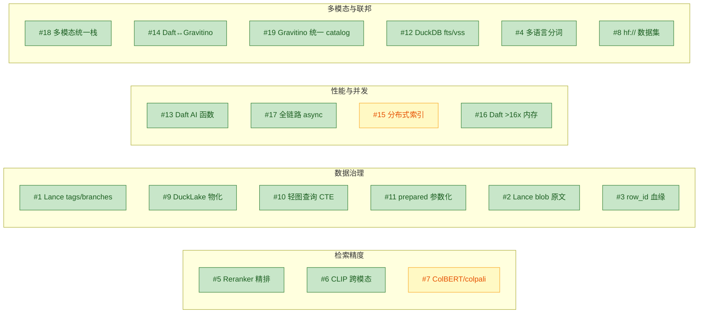

# Arrow Lake v1.8.0 — 稳定版发布

> **一个湖仓，装下你的全部检索、分析与智能。**
> v1.8.0 稳定版 · 2026-06 · MIT 许可 · Python 3.11+

**Arrow Lake** 是面向 AI/ML 团队的生产级**多模态数据湖仓**。它把向量检索、全文检索、OLAP 分析、RAG 问答与知识图谱收敛到**同一份 Lance 列式底座**之上，通过 Python SDK、REST、CLI 三种入口统一对外。

v1.8.0 是迄今最完整的一个版本：**roadmap 19 项全部落地**（17 项实现 + 2 项压测 DEFER），覆盖**检索精度、数据治理、性能并发、多模态与联邦**四条主线，含 1 项生产 Review CRITICAL 修复，全部经压测与回归验证（5000+ 测试零失败）。

---

## 一句话：v1.8.0 带来了什么

| 主线 | v1.8.0 交付 | 你能做什么 |
|---|---|---|
| **检索更准** | 混合搜索接入 **cross-encoder 精排**；**CLIP 跨模态**补全（文搜图 / 图搜图） | 用一句话搜到对的图，用 reranker 把最相关的顶到第一 |
| **治理更稳** | Lance **tags + branches** 数据版本治理；**DuckLake 物化视图**；DuckDB **轻图查询** | 数据集像代码一样打 tag、开分支、可回滚；跨存储 JOIN 与图遍历不离开 SQL |
| **性能更强** | **Daft 内置 AI 函数**替代自建嵌入调度；**全链路 async** 检索 | 嵌入语义等价、代码删减 ~120 行；高并发检索不阻塞事件循环 |
| **工程更硬** | 压测驱动 **gate 框架**；prepared 参数化；lancedb 0.33 / pylance 7 / DuckDB 1.5.2 全栈升级 | 每一个"该不该做"的决策都有数据撑腰；零回归发布 |

---

## v1.8.0 三大主题

### 主题一｜智能检索：精排 + 跨模态，把"相关"做到位

**混合搜索 = RRF 粗排 + cross-encoder 精排。** v1.8.0 把原本只在 RAG 管线里的 reranker 体系（`BaseReranker` / `CrossEncoderReranker` / `LLMReranker`）接入了混合检索：向量 + 全文 RRF 召回之后，再用 cross-encoder（默认 `BAAI/bge-reranker-v2-m3`）做一次 token 级精排，结果带 `_rerank_score` 列返回。一行配置开启，缺 text 列或异常时优雅降级回 RRF 原表——**向后兼容，零破坏**。

**跨模态检索补齐了另一半。** CLIP 图像嵌入早已就绪，v1.8.0 新增 `encode_text()`（CLIP/SigLIP **text tower**），把文本查询编入与图像相同的嵌入空间。于是"用自然语言搜图片"成为原生能力：

```text
query text → CLIP text tower → lake.search(ds, vec, vector_column="image_embedding") → 命中图像
```

文搜图、图搜图、图搜文，同一个 `search()` 接口，只是换一个 `vector_column`。

### 主题二｜数据治理：像代码一样版本化你的数据集

**Lance tags + branches。** 关键数据集现在可以打 tag（`v1.8-train`）、开 branch（`experiment-a`），支持 A/B 对比、回滚、可复现训练——数据资产第一次拥有了和代码一样的版本治理语义。读取某个 branch 用 `read_at_branch`，底层经 raw `lance.dataset(uri)` 的 `checkout_version((branch, None))` 元组寻址。

**DuckLake 物化视图。** 跨存储 JOIN（Lance 表 × MinIO Parquet）物化为带 TTL、ART index、行预算的可查询视图，`materialize()` / `cleanup_materialized()` 一对调用托管全生命周期。联邦分析不再需要把数据搬来搬去。

**DuckDB 轻图查询。** 当数据规模还撑不起一个 HugeGraph，但又想跑关系遍历时，`OlapSearchBridge.graph_query()` 用**递归 CTE** 做环安全的 BFS 邻居 / 最短路径查询（`max_depth` 钳制 [1,10]，`list_contains` 环检测，支持 directed/undirected + 权重）。**重图走 HugeGraph，轻查询走 DuckDB**——两套引擎互补，按场景选型。

### 主题三｜性能与并发：Daft 接管调度，async 贯通全链路

**Daft 内置 AI 函数，删掉你手写的调度。** 嵌入不再需要自己写 lazy-load / GPU 调度 / 分批 / 归一化 / 重试——Daft 的 `embed_text()` 把这些全包了（自动批处理、限流、重试、背压）。v1.8.0 的 PoC 实测：

| 指标 | Daft `embed_text` | Local `SentenceTransformer` |
|---|---|---|
| 语义等价（cosine） | **1.0000** | 基线 |
| 维度 | 1024 ✓ | 1024 |
| 吞吐 | **1.14× speedup** | 1.0× |
| 调度代码 | ~30 行 | ~150 行（**删减 ~120 行**） |

> 注：KG 抽取的 `hyper-extract` 后端保留（领域模板 + AutoGraph，不是"LLM 调度"问题）；Daft `prompt()` 做批量结构化抽取的价值，拆为独立后续项 `DaftExtractor`。

**全链路 async 检索。** v1.7.1 给了向量原生 `search_async`，v1.8.0 把 fts / hybrid / faceted 三个 bridge 也补齐了 `search_async`（`asyncio.to_thread` 线程卸载）。压测驱动落地：worker 1→20（20×）时 QPS 仅 5.8→7.2——并发平台期显著，async 接口让事件循环不再被同步检索阻塞。配套 `text_search_async` / `hybrid_search_async` / `faceted_search_async` 在 facade 暴露。

---

## v1.8.0 完整特性清单（19 项）



| 状态 | # | 能力 | 价值 |
|---|---|---|---|
| ✅ | #5 | Reranker 接入 hybrid | RRF 粗排 + cross-encoder 精排，混合搜索精度跃升 |
| ✅ | #6 | CLIP 跨模态 encode_text | text tower 补全，文搜图 / 图搜图原生支持 |
| ✅ | #13 | Daft AI 函数（embed_text） | 语义等价、1.14× 提速、删减 ~120 行调度代码 |
| ✅ | #17 | 全链路 async 检索 | fts/hybrid/faceted `search_async`，高并发不阻塞 |
| ✅ | #1 | Lance dataset branches | 数据集打 tag / 开 branch，A/B、回滚、可复现训练 |
| ✅ | #10 | 轻图查询（递归 CTE） | DuckDB 内环安全 BFS 遍历，与 HugeGraph 互补 |
| ✅ | #9 | DuckLake 物化视图 | 跨存储 JOIN 物化，TTL + ART + 行预算 |
| ✅ | #11 | prepared 参数化 | 元数据表 `$1..$4` 安全参数绑定 |
| ⏸ | #15 | 分布式索引 backfill | 单节点 ~10M 行内充裕，100M+ 触发 Ray（基建已就绪） |
| ⏸ | #7 | ColBERT / colpali | recall@50=1.000 无召回缺口，待真实细粒度数据复测 |
| ✅ | #2 | Lance blob 原文 | `add_blob_column` 原地存 image/audio/video bytes，原文 + 嵌入同库 |
| ✅ | #3 | 行级 lineage | `lineage_record_row`，Lance row_id 行级溯源（叠加事件级） |
| ✅ | #4 | 日文分词 | lindera 假名分词路由 + 模块级缓存 + 优雅降级 |
| ✅ | #8 | `hf://` 数据集 | `load_hf_dataset` 读 HF Lance-format（评测 / 种子数据） |
| ✅ | #12 | DuckDB 原生 FTS | `fts_search` BM25 作 lance_fts 备选；`vss` 此 build 不可用 |
| ✅ | #14 | Daft↔Gravitino | `daft_from_gravitino` 直连，联邦查询不经 DuckDB 转译 |
| ✅ | #16 | Daft 流式写 | `write_lance_from_dataframe`，lazy >16× 内存，KG build / 大批量 |
| ✅ | #18 | VLM decode_image | `decode_image` builder 补全 VLM 链（bytes→解码→classify/prompt） |
| ✅ | #19 | Gravitino 统一 catalog | facade register/deregister/sync/statistics/health，三引擎经 Gravitino |

> **压测驱动的诚实**：#15（分布式索引，单节点 21s/1M，1B+ 行才需 Ray）和 #7（ColBERT）不是"做不了"，而是**数据证明现在不该做**——#7 现实 recall 96%，病态下降源于 IVF_PQ 量化（修法是 HNSW，非 ColBERT 场景）。v1.8.0 建了可复用的 gate 框架（`tests/benchmark/test_bench_batch3_gates.py`），规模或数据特征变化后重跑即可重评。不投机，不浪费。

---

## 关键数字

| 维度 | 数值 |
|---|---|
| 核心栈版本 | Daft 0.7.8 · LanceDB 0.33 · pylance 7.0 · DuckDB 1.5.2 · Ray 2.54 · pyarrow 23.0.1 |
| 源码 / 测试 | 231 个源码文件 · 424 个测试文件 · **5000+ 测试用例零失败** |
| API 表面 | 18 个 router · **106 个路由** · Python SDK（`Lake` facade · 9 mixin）· CLI（16 命令组） |
| 查询能力 | **8 个 Bridge**（Vector / FTS / Hybrid / Faceted / Ensemble / OLAP / Metadata / Export） |
| 配置 | **34 个子配置** · 4 层覆盖（默认 < .env < 环境变量 < YAML） |
| 异常体系 | `ArrowLakeError` → 17 领域异常 · 200+ 错误码 |
| Reranker 提速 | Daft embed vs Local：**1.14×**（cosine=1.0） |
| async 并发 | worker 1→20，QPS 5.8→7.2（压测驱动 GO） |

---

## 技术栈：DARMU

```text
Daft        —— 计算层：lazy DataFrame + 内置 AI 函数 + 26 连接器 + 多模态 decode
Arrow/Lance —— 湖仓格式：列式 + 向量/标量/FTS 索引 + tags/branches + blob
Ray         —— 分布式：head + worker(+GPU)，KG 构建 / 批计算 / 预留分布式索引
Metaflow    —— 编排：retry/backoff + checkpoint + Argo 桥接
dUckdb      —— 引擎：lance_scan / vector_search / fts（主力查询路径，40+ 处调用）
            + DuckLake 物化 + HugeGraph 图谱 + Gravitino 治理 + MinIO/S3 + Redis
```

---

## 谁在用 Arrow Lake

- **RAG / Agent 团队**：一份湖仓同时承载向量、全文、混合检索 + 知识图谱，GraphRAG 与 Vector RAG 一键切换，reranker 把召回质量顶上去。
- **多模态搜索团队**：文本、图像、视频统一摄入，CLIP 跨模态检索，blob 原文与嵌入同库一致。
- **数据平台团队**：Lance 数据版本治理 + DuckLake 联邦物化 + Gravitino tag 驱动 ACL，数据资产可治理、可审计、可回滚。
- **分析团队**：DuckDB 直接在 Lance 上跑标准 SQL，Daft DataFrame 处理超内存负载，不必导出到独立数仓。

---

## 三分钟上手

```bash
# 安装
pip install arrow-lake

# Python SDK
python -c "
from arrow_lake import Lake
lake = Lake('./data')
lake.create_dataset('docs', table)
lake.create_vector_index('docs', vector_column='text_embedding')
hits = lake.search('docs', query_vec, top_k=5)

# v1.8.0 跨模态：文搜图
from arrow_lake.embed import CLIPImageEncoder
clip = CLIPImageEncoder()
qvec = clip.encode_text(['a cat sitting on a sofa'])
img_hits = lake.search('photos', qvec[0], vector_column='image_embedding', top_k=5)

# v1.8.0 数据版本治理
lake.create_tag('docs', 'v1.8-train')
lake.create_branch('docs', 'experiment-a')
"
```

**REST / CLI 同样就绪**：

```bash
uvicorn arrow_lake.api.app:create_app --factory      # REST（106 路由）
arrow-lake search --dataset docs --query "lakehouse" # CLI（16 命令组）
```

---

## 工程质量声明

- **trunk-based，直接提交 master**：每一项 v1.8.0 优化都走 TDD（RED→GREEN→REFACTOR）→ 对应 cookbook 跑通 → 全量 pytest 零失败 → CHANGELOG/roadmap/implementation 同步。
- **压测驱动，不做投机性优化**：async 因并发平台期而 GO，分布式索引 / ColBERT 因数据证明不必要而 DEFER——决策可追溯、可复评。
- **优雅降级是一等公民**：Ray 不可用→本地、NeMo 不可用→CPU MinHash、KG 不可用→Vector RAG、Gremlin 不可用→REST、reranker 异常→RRF 原表。系统在不完整基础设施下持续服务。

---

## 下一步

- **升级**：`pip install -U arrow-lake`（生产镜像 `arrow-lake:1.7.1` → v1.8.0）
- **文档**：[`docs/ARCHITECTURE.md`](./ARCHITECTURE.md)（架构技术参考）· [`docs/arrow-lake-product-introduction-zh.md`](./arrow-lake-product-introduction-zh.md)（完整产品介绍）· [`docs/cookbook/`](./cookbook/)（15 章实战教程，中英双语）
- **参与**：MIT 许可，欢迎 issue 与 PR

---

*Arrow Lake v1.8.0 —— 把堆栈坍缩为一个湖仓。*
