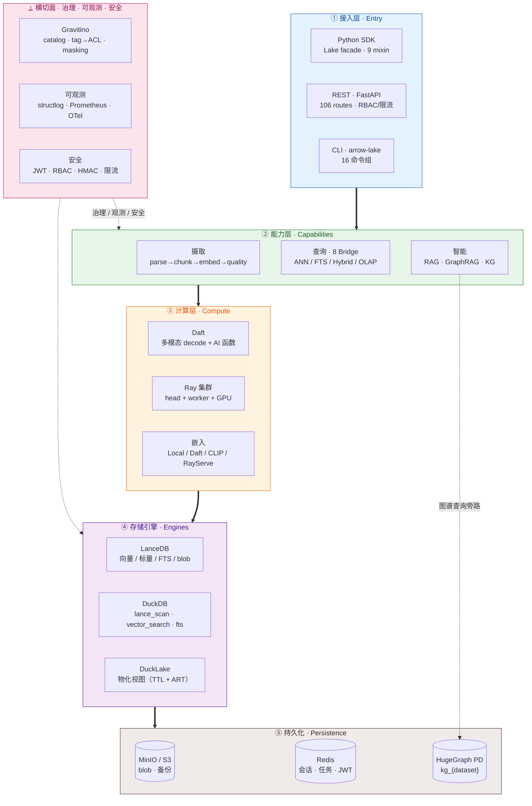
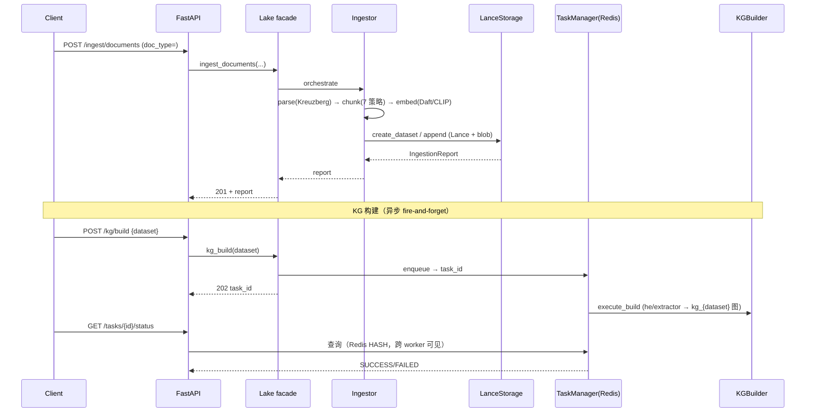
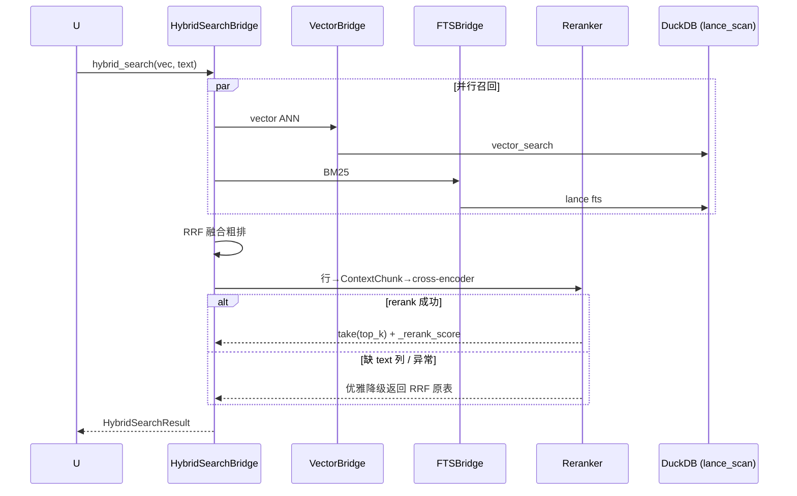
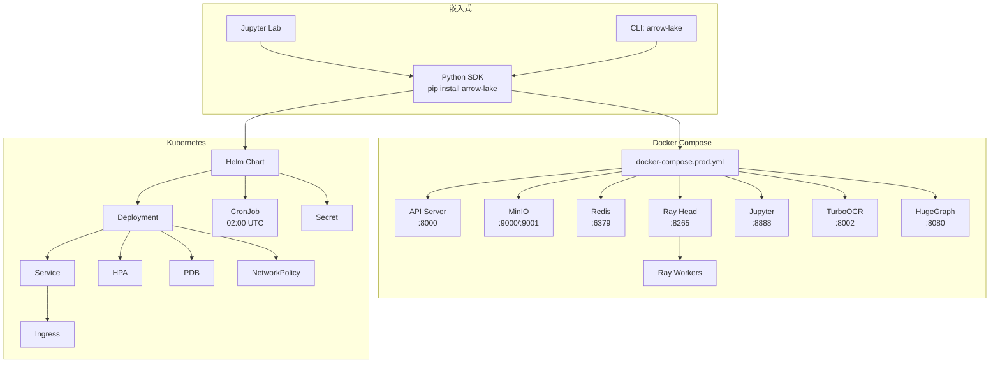

# Arrow Lake（v1.8.6）

> **一个湖仓，装下你的全部检索、分析与智能。**
> 生产级多模态数据湖仓 · MIT 许可 · Python 3.11+ · 约 50,000 行代码 / 6,283 测试（424 文件）/ 覆盖率 80%+

**Arrow Lake** 是面向 AI/ML 团队的生产级**多模态数据湖仓**。现代数据栈多半是拼凑出来的——向量库存嵌入、全文引擎做关键词、独立 OLAP 跑分析、对象存放原始文件、ML 编排器把它们串起来；每个工具一种查询语言、一份存储格式、一套运维，结果数据落孤岛、ETL 脆弱、安全各管一段。Arrow Lake 把**存储 / 检索 / 分析 / 智能化**这四件事收敛到**同一份 Lance 列式底座**之上（治理作为横切面贯穿全链），通过 **Python SDK、REST（106 routes）、CLI** 三种入口统一对外，文本/图像/视频多模态原生支持。

一份湖仓同时承载完整能力链：**多模态摄入**（文件/HTTP/URL + OCR + 7 种分块 + 多模型嵌入）、**五种检索**（向量 IVF_PQ/HNSW、全文 Tantivy+jieba、RRF 混合、分面、跨列集成）、**OLAP 分析**（DuckDB SQL + Daft 分布式 DataFrame + DuckLake 跨存储物化视图）、**RAG 问答**（OpenAI/Anthropic/Ollama/vLLM + GraphRAG + 引用追踪）、**知识图谱**（HugeGraph，按 dataset 分图），以及贯穿全链路的 **Gravitino 元数据治理**、**HMAC-SHA256 防篡改审计**、**RBAC + JWT + per-dataset ACL 安全**。优雅降级是一等公民——Ray 不可用回退本地、KG 不可用回退 Vector RAG、Gremlin 不可用回退 REST，系统在不完整基础设施下仍能持续服务。

当前版本 **v1.8.6**（tag `v1.8.6`）：在 v1.8.0 roadmap 19 项落地的基础上，把知识图谱从"单图混存"升级为**按 dataset 分图隔离**（`kg_{dataset}`，删 dataset 即清图、零残留），并补齐 8 个 traverser 的 REST 暴露与 per-dataset 访问控制。版本演进见文末「版本演进」节（v1.5.2 → v1.8.6 全里程碑）。

---

## 为什么是 Arrow Lake——我们解决的问题

现代 AI/ML 团队从未主动要求一个五件套技术栈，他们只是被动继承了它。

一个典型的生产环境：向量库存嵌入、全文引擎做关键词检索、独立的 OLAP 系统跑分析、对象存储放原始文件、再加一个 ML 编排器把这一切串起来。每个工具说自己的查询语言、管自己的存储格式、要自己的运维专家。结果可以预见：数据散落在孤岛里——向量在这、文本在那、图像归档在别处——团队靠脆弱的 ETL 管线在它们之间搬数据。每一次拷贝都引入延迟，每一次 schema 变更都要跨系统协同迁移，每一次排障都要翻三个日志、两个仪表盘。成本不断累加，而不一致直到下游模型基于过期嵌入开始幻觉时才暴露。

安全在这种复杂度下几乎总存活不下来：认证只挂在部分服务上，限流只覆盖 API 网关而漏掉内部查询引擎，注入防御因系统而异（每个系统要不同的转义策略）。等平台上了生产，安全面就是一堆半成品的拼凑。

Arrow Lake 把这个技术栈坍缩为单一、内聚的架构。每种数据类型——文本、图像、文档、嵌入、结构化元数据——都住在同一个基于 Apache Arrow 的列式存储里。每种查询模式——向量相似度、全文、混合、分面、OLAP SQL——都跑在同一份存储上，支持零拷贝读取和谓词下推。每一个管线步骤——摄入、分块、嵌入、质量评分、RAG 检索、知识图谱构建——都是一等公民，而不是用胶带脚本粘在两个 API 之间的临时方案。安全不是事后补丁，而是结构性的：从第一天起就在每个端点上覆盖 RBAC、JWT 生命周期、限流、TLS 加固和注入防御。

---

## 架构概览

Arrow Lake 采用**严格五层架构**：请求自上而下穿越 **① 接入 → ② 能力 → ③ 计算 → ④ 存储引擎 → ⑤ 持久化**，**治理 / 可观测 / 安全**作为横切面贯穿全部层级。每层只依赖其直接下一层；横切面经 hook / 中间件作用，不进入主调用链；**知识图谱是能力层直达持久化的唯一旁路**，其余请求穿满五层。



> **读图**：粗箭头 `==>` 是主调用链（请求自上而下穿越五层，响应原路返回）；虚线是横切面（治理/可观测/安全，经 hook/中间件作用、不进主链）；知识图谱是**能力层直达持久化的唯一旁路**，其余请求穿满五层。

| 层 | 职责 | 关键组件 |
|---|---|---|
| ① 接入 | 三入口归一到 facade；认证 / 限流 / 路由 | `Lake` facade · FastAPI（18 routers / 106 routes）· CLI |
| ② 能力 | 业务能力：写进去、查出来、问答 | 摄取 · 查询（8 Bridge）· 智能（RAG / KG） |
| ③ 计算 | 批处理 / 分布式 / 嵌入 | Daft · Ray · 嵌入器（Local / Daft / CLIP） |
| ④ 存储引擎 | 向量 / 标量 / FTS / 物化的执行 | LanceDB · DuckDB · DuckLake |
| ⑤ 持久化 | 字节级落地 | MinIO / S3 · Redis · HugeGraph |
| ⟂ 横切面 | 贯穿各层 | Gravitino 治理 · 可观测 · 安全 |

**Lake 类**是中央编排器，通过 Mixin 架构组合而成，让每个关注点相互隔离、可独立测试。九个 Mixin 类分别提供摄入、存储管理、搜索、分析、RAG、知识图谱、数据质量和安全能力。Lake 类组合全部 9 个 Mixin，组件按需懒加载——没有插件注册，没有配置驱动的分发，就是纯粹的 Python 组合。你只用自己需要的能力即可（不调用的 mixin 不占资源），轻量用法与全功能数据平台共享同一套代码。

三条性能原则贯穿每一层。第一，**零拷贝查询**：因为 Lance 以 Apache Arrow 格式存数据，每条读路径都把 Arrow RecordBatch 直接返回给调用方——无序列化、无拷贝。第二，**谓词下推**：元数据列上的过滤被下推到 Lance 存储引擎，只有匹配的行才会被物化进内存。第三，**流式**：摄入、嵌入、查询结果都通过 RecordBatchReader 迭代器流动，意味着你可以处理超过可用内存的数据集，无需分页或溢出落盘。

### 核心数据流

#### ① 摄取 + 嵌入 + KG 构建（端到端）

摄取同步返回，知识图谱构建异步 fire-and-forget：



#### ② 混合检索 + Reranker

向量 ANN 与 BM25 并行召回 → RRF 融合 → cross-encoder 重排（无 text 列则优雅降级）：



#### ③ 跨模态检索（文搜图）

```
query text → CLIPImageEncoder.encode_text() [text tower, L2 归一化]
           → lake.search(ds, vec, vector_column="image_embedding")
           → Lance 多模态向量列 → 命中图像（blob 在 Lance binary 列 / MinIO）
```

#### ④ RAG 问答（含 GraphRAG 降级）

```
question → query_transform (HyDE / multi-query)
         → 检索（KG 存在? GraphRAG (kg_{dataset}) : Vector Hybrid）
         → context 组装 + citation
         → LLM provider (OpenAI / Anthropic / Ollama / vLLM)
         → RAGResponse（含引用）
         → session 落 Redis（多轮）
```

---

## 核心能力

### 多模态摄入

Arrow Lake 通过一个连接器抽象，接受来自磁盘文件、HTTP 上传、远程 URL 的数据，把每个来源归一化为统一的摄入请求。文档管线为非结构化内容承担重活：一份 PDF 进来，扫描页走 OCR，被切成语义连贯的片段，嵌入为向量，写成 Lance 数据集——全部在一个编排好的流里完成。每个阶段产出的中间产物都带版本、可审计，于是你能把任何一个嵌入追溯到它的源页和分块策略。

七种分块策略覆盖从确定性到语义的谱系：基于页/基于段落的切分器尊重文档结构；递归字符切分处理纯文本并支持重叠控制；Semchunk 按 token 数优化切分边界；三种 Chonkie 策略——Token、Semantic、SDPM（语义密度保留合并）——用感知 ML 的切分在边界处保留语义。你按数据集选择策略，管线在元数据里记录每个 chunk 由哪种策略产出。

文本之外，Arrow Lake 在摄入时处理媒体：图像生成缩略图和可配分辨率的预览，大图在嵌入前降采样以控制向量维度和成本。Schema 校验在数据进入存储前捕获结构错配——严格模式拒绝非法记录，宽松模式尽力解析。被拒绝的记录带着完整错误上下文进入死信队列，没有东西会静默消失。

| 能力 | 详情 |
|---|---|
| 来源连接器 | 文件系统、HTTP 上传、远程 URL |
| 文档管线 | PDF、OCR、分块、嵌入、Lance 写入 |
| 分块策略 | Page、Paragraph、Recursive、Semchunk、Chonkie Token/Semantic/SDPM |
| 媒体处理 | 缩略图生成、预览创建、降采样 |
| Schema 处理 | 严格/宽松校验、演进、版本化 |
| 死信队列 | 带完整错误上下文的被拒记录 |

### 多模态搜索

Arrow Lake 的搜索不是单一算法——它是一组五种可组合的查询策略，你按问题需要组合它们。向量检索支持 cosine、L2、点积相似度，三种索引：IVF_PQ（压缩、高吞吐召回）、IVF_FLAT（分区内精确召回）、IVF_HNSW_PQ（基于图的近似最近邻 + 量化）。全文检索由 Tantivy 驱动，配 jieba 分词器处理中文/日文/韩文，无需单独的索引步骤就能正确分词。

混合检索通过倒数排名融合（RRF）融合向量与文本结果，给每条结果一个平衡语义相似度和关键词相关性的分数。分面检索在任意查询策略之上叠加多列元数据过滤，于是你可以搜"管线架构"并同时按日期范围、文档类型、来源系统过滤。集成检索更进一步，跨多个嵌入列做 RRF 融合——例如把稠密嵌入和稀疏 BM25 式嵌入组合，同时捕获语义和词法信号。

五种策略共享统一的结果接口：带分数的排序命中、元数据、可选高亮片段。在策略间切换只需改一个参数，不用重写查询。

| 搜索类型 | 引擎 | 索引 / 方法 |
|---|---|---|
| 向量 | Lance 原生 | IVF_PQ、IVF_FLAT、IVF_HNSW_PQ |
| 全文 | Tantivy + jieba | 带 CJK 分词器的倒排索引 |
| 混合 | RRF 融合 | 向量 + FTS 分数组合 |
| 分面 | Lance 元数据 | 多列谓词过滤 |
| 集成 | 跨列 RRF | 多嵌入结果融合 |

### OLAP 分析

Arrow Lake 不强制你把数据导到独立数仓做分析。DuckDB 直接跑在 Lance 数据集上，完整支持 SQL：跨表 JOIN、时序分析的窗口函数、大结果集的流式执行。你对着多模态数据写标准 SQL——把图像元数据和嵌入相似度分数 JOIN 起来、对文档摄入时间戳算滚动平均、对 chunk 质量指标跑临时聚合。

Daft 为同一份数据提供 DataFrame API，支持懒求值（推迟到需要结果时才计算）和由 Ray 驱动的分布式执行（应对超出单机容量的工作负载）。DuckLake 集成把跨存储 JOIN——例如把 Lance 表和 MinIO 里的 Parquet 文件 JOIN——物化成可查询视图，把存储边界藏在标准 SQL 接口背后。

查询治理防止单个分析查询吃掉集群资源：内存上限、并发上限、可配超时都在 DuckDB 会话层强制执行。会话池管理连接，使 OLAP 查询不会饿死实时检索路径。

| 能力 | 引擎 | 关键特性 |
|---|---|---|
| SQL 分析 | DuckDB | JOIN、窗口函数、流式 |
| DataFrame API | Daft | 懒求值、Ray 分布式 |
| 跨存储 JOIN | DuckLake | Lance + Parquet 物化视图 |
| 资源治理 | 会话池 | 内存、并发、超时上限 |

### RAG 管线

Arrow Lake 的 RAG 管线不是套在 chat completion API 上的检索函数，而是一条一等管线：可配检索策略、会话历史、引用追踪、流式生成——被设计为生产 AI 应用的检索骨架。你配管线用哪种搜索策略（向量、混合、分面、集成），设一个喂给 LLM 的 token 上下文预算，管线自动处理检索、排序、上下文组装和 prompt 构造。

LLM provider 抽象在统一接口背后：OpenAI、Anthropic、vLLM、Ollama、DeepSeek 都支持流式响应生成。会话历史跨轮持久化，管线维持对话上下文而无需调用方管理。每条生成响应都带引用参照，把每个论断追溯到产出它的具体文档 chunk 和搜索分数，支撑可审计性和可信度验证。

GraphRAG 通过在向量和文本检索之外同时查询 HugeGraph 知识图谱来扩展检索管线。当用户提出涉及实体关系的问题——"哪些系统依赖认证服务？"——管线检索相关图子图，连同传统搜索结果一起注入上下文，生成既基于结构化又基于非结构化证据的回答。

| 能力 | 详情 |
|---|---|
| LLM provider | OpenAI、Anthropic、vLLM、Ollama、DeepSeek |
| 检索模式 | 向量、混合、分面、集成 |
| 上下文管理 | 可配 token 预算、会话历史 |
| 引用追踪 | 逐论断的来源参照 + 搜索分数 |
| GraphRAG | 经 HugeGraph 的图增强检索 |
| 生成 | 可配参数的流式响应 |

### 知识图谱（v1.8.6：按 dataset 分图隔离）

Arrow Lake 把 HugeGraph 集成为原生知识图谱后端，给你一个与向量/文本存储共享同一数据血缘的图数据库。实体和关系由可配的 LLM 驱动抽取提示从摄入文档中抽取，经 schema 校验后写入 HugeGraph 并自动构图。

**v1.8.6 的根本变化是分图隔离**：此前所有 dataset 的图谱数据写入**单个** `hugegraph` 图，仅靠 `document_name` 属性区分来源——无逻辑隔离、删 dataset 不清图、单图索引随数据量膨胀、一个 dataset 的脏查询拖慢整图。v1.8.6 起，**每个 Lance dataset 映射到独立图 `kg_{dataset}`**，实体/关系/索引/后端分区完全隔离，删 dataset 触发 drop-on-delete 钩子清掉对应图，无残留。纯图内查询，不做跨 dataset 检索（隔离优先于联邦的设计取舍）。

```python
# 建图：自动落到独立图 kg_papers（builder 派生 graph_name，调用方无感）
await lake.kg_build("papers")

# 所有 KG 方法接受可选 dataset_name，缺省回退默认图（向后兼容）
stats = await lake.kg_stats(dataset_name="papers")            # 仅统计 kg_papers
nbrs  = await lake.kg_get_neighbors("entity:42", depth=2, dataset_name="papers")
paths = await lake.kg_all_shortest_paths("A", "B", dataset_name="papers")

# GraphRAG 检索同样按 dataset 隔离
result = await lake.kg_retrieve("哪些系统依赖认证服务？", dataset_name="papers")

# 删 dataset = 删图（best-effort，永不抛）
await lake.delete_dataset("papers")   # → kg_papers 被清理，无残留
```

**8 个 traverser（路径查询）三层全暴露**：facade SDK（核心路径方法支持 `dataset_name`）、CLI `arrow-lake kg traverser <rays|rings|crosspoints|all-shortest-paths|weighted-shortest|single-source|multi-node|customized> --dataset <ds>`、以及 v1.8.6 新增的 REST `POST /api/v1/kg/traversers/{...}`。任意 gremlin 查询走参数化（防 Gremlin 注入）；分析型路径（最短路径、子图枚举、邻域查询）由辅助函数从结构化参数构造安全遍历。GraphRAG 在 RAG 查询到达时从查询抽取候选实体，遍历 `kg_{dataset}` 检索相关子图，与传统搜索结果合并后喂给 LLM。

| 能力 | 详情 |
|---|---|
| 图后端 | HugeGraph 1.7（Gremlin 兼容） |
| **隔离模型** | **每 dataset 独立图 `kg_{dataset}`（v1.8.6）** |
| 实体抽取 | LLM 驱动 + hyper-extract（qwen3/Ollama），可配提示词 |
| 查询语言 | 带注入防御的 Gremlin |
| Traverser | 8 种路径查询，SDK / CLI / REST 三层 |
| GraphRAG | 子图检索合并进 RAG 上下文，按 dataset 作用域 |
| 生命周期 | drop-on-delete 钩子（best-effort，sync/async 桥接） |
| Schema | 每图独立 schema，从抽取结果自动构建 |

### 数据质量与治理

数据质量在 Arrow Lake 里不是摄入后的检查清单，而是嵌入每个管线阶段的持续自动化流程。Schema 校验对进入湖的每条记录强制结构正确性，严格模式拒绝畸形数据，宽松模式尽力修复。去重通过内容哈希捕获完全重复、通过感知哈希捕获近似重复图像，避免把嵌入算力浪费在冗余数据上。可选的质量评分管线（基于 NeMo Curator 等数据整理工具，需启用 `nemo-curator` extra）可为记录打质量等级，下游据此过滤。

全链路数据血缘追踪每条记录从源到汇。当一个嵌入出现在搜索结果里，你能追溯到原始文档、它来自的页、产出它的分块策略、向量化它的嵌入模型、它收到的质量分。这个血缘可查询，于是你能回答"哪些文档贡献了这个 RAG 响应"或"本周有多少条记录未通过 schema 校验"。

HMAC-SHA256 审计追踪让血缘防篡改。每个状态转换——摄入、校验、分块、嵌入、查询——都用带密钥哈希记录，能检测审计记录的修改或删除。这不是安全事后的补丁，而是结构性保证：湖里每条数据的来源都可独立验证。

| 能力 | 详情 |
|---|---|
| Schema 校验 | 严格/宽松模式、演进支持 |
| 去重 | 精确哈希（内容）+ 感知哈希（图像） |
| 质量评分 | NVIDIA NeMo Curator 集成 |
| 数据血缘 | 从源到查询结果的全链路追踪 |
| 审计追踪 | HMAC-SHA256 防篡改事件日志 |

---

### 元数据治理（Gravitino）

Apache Gravitino 作为统一元数据层，把分散的 Lance 数据集、HugeGraph 图谱、对象存储 blob 纳入同一个 catalog 视图——数据资产可发现、可检索、可治理。**tag 驱动 ACL**：给数据集/列打标后，访问控制、动态脱敏（masking）、保留策略（retention）按标签自动生效，无需在每个查询点重复配置。血缘按事件级追踪记录流转，配合 HMAC 审计形成"可发现 → 可控权 → 可追溯"的治理闭环。Daft 等引擎可经 Gravitino connector 做联邦查询。

| 能力 | 详情 |
|---|---|
| 统一 catalog | Lance / HugeGraph / blob 同一视图 |
| tag→ACL | 按标签自动授权、脱敏、保留 |
| 血缘 + 审计 | 事件级流转 + HMAC 防篡改 |
| 联邦查询 | Daft 等经 connector 跨源 JOIN |

---

## 安全——从第一天起即可用于生产

多数数据平台把安全当部署关注点——代码跑起来之后再配。Arrow Lake 把安全当结构属性，建进从查询引擎到 API 面的每一层。基于角色的访问控制覆盖全部 106 条 routes（18 个 router），三档：VIEWER（只读）、EDITOR（写）、ADMIN（配置与用户管理）；更细粒度的 `DatasetACL`（行/列级）与 `SchemaACL` 提供超越三档角色的访问控制。认证同时支持 API Key 校验和 JWT（可配 HS256/RS256 签名）。

JWT 生命周期完整托管：token 带可配过期时间签发，登出或吊销时通过 Redis 黑名单（带 TTL）拉黑，每个请求都校验。限流按端点强制，可配每分钟请求数阈值和突发额度，防止失控客户端耗尽查询容量。TLS 在 FastAPI 层终结，安全响应头——Content-Security-Policy、X-Frame-Options、HSTS 等——应用到每个响应。

注入防御覆盖每条用户输入触及查询引擎的路径。Gremlin 查询参数化防图注入；SQL 查询用 DuckDB prepared statement；路径遍历攻击通过对所有文件路径输入做归一化和校验来阻断。**v1.8.6 新增 per-dataset ACL**：所有按 dataset 作用域的读/写/删端点（`kg_stats`、`kg_neighbors`、8 个 traverser、`DELETE /graph?dataset=`）经 `PermissionChecker.check_dataset_access(role, dataset, action)` 校验，拒绝越权访问他人 dataset 图谱（防 IDOR）。customized traverser 的 step 强类型校验（direction 枚举、列表上限）防 DoS。结果是一个无需额外 WAF 即可抵抗 OWASP Top 10 的平台。

容器加固写在 Docker 配置里：`cap-drop ALL` 移除所有 Linux 能力，文件系统只读挂载并显式声明可写卷，资源限制约束 CPU 和内存。Kubernetes NetworkPolicy 模板把 pod 间通信限制在 Arrow Lake 所需的端口和协议上，最小化任何容器被攻破的爆炸半径。

| 安全特性 | 实现 |
|---|---|
| RBAC | 三档（VIEWER/EDITOR/ADMIN）覆盖全部 106 routes |
| 细粒度 ACL | DatasetACL（行/列级）+ SchemaACL |
| 认证 | API Key + JWT（HS256/RS256） |
| JWT 黑名单 | Redis 托管，带 TTL |
| 限流 | 按端点 RPM + 突发 |
| TLS 与响应头 | TLS 终结 + CSP、X-Frame-Options、HSTS |
| 注入防御 | Gremlin 参数化、SQL prepared statement、路径归一化 |
| **per-dataset ACL** | **check_dataset_access，防 IDOR（v1.8.6）** |
| 容器加固 | cap-drop ALL、只读 fs、资源限制 |
| 网络隔离 | Kubernetes NetworkPolicy 模板 |

---

## 性能与扩展

Arrow Lake 为从数千到数十亿记录增长的数据集设计，无需架构变更。向量索引用 IVF_PQ 量化把高维嵌入压缩到原始大小的一小部分，降低内存占用并加速召回而精度损失很小。谓词下推保证元数据过滤在 Lance 存储层求值，只有匹配的行被解码并返回给查询引擎。RecordBatchReader 流式让摄入和查询结果都以固定大小 Arrow 批次流动，意味着你可以处理超过可用内存的数据集而无需显式分页。

图像密集负载受益于懒解码：缩略图和预览以压缩形式存储，只在下游消费者请求像素数据时才解码，避免持有已解码图像缓冲区的内存开销。并发通过 Redis 分布式信号量协调，跨多 worker 进程管理共享资源——嵌入模型推理、图写操作、限流 LLM 调用。

GPU 自动伸缩集成同时支持空闲期缩到零和成本高效的部分 GPU 分配。Ray 分布式摄入跨集群并行处理文档，于是上万份 PDF 的批次被并发分块嵌入而非串行。为优化存储成本，blob 生命周期分层按年龄和访问模式自动把原始文件从 Standard 迁到 Infrequent Access 再到 Glacier，冷数据降本而热数据留在快存储。

| 性能特性 | 收益 |
|---|---|
| IVF_PQ 压缩索引 | 内存更省、召回更快 |
| 谓词下推 | 只物化匹配行 |
| RecordBatchReader 流式 | 处理超过内存的数据集 |
| 图像懒解码 | 像素数据按需解码 |
| Redis 分布式信号量 | 多 worker 协调并发 |
| DuckDB 会话池 | OLAP 查询隔离、无饥饿 |
| GPU 自动伸缩 | 缩到零、部分 GPU |
| Ray 分布式摄入 | 并行文档处理 |
| blob 生命周期分层 | Standard→IA→Glacier 成本优化 |

---

### 优雅降级（一等公民）

Arrow Lake 在基础设施不完整时仍能持续服务——每个外部依赖都有回退路径，不会因单一组件缺失而整体不可用：

| 依赖不可用 | 回退到 | 影响 |
|---|---|---|
| Ray 集群 | 本地执行 | 失去分布式，单机仍可跑 |
| HugeGraph / 知识图谱 | Vector Hybrid RAG | 失去图谱增强，仍可问答 |
| Gremlin 绑定 | HugeGraph REST API | 图查询路径切换 REST（v1.8.6 分图也走此路） |
| NeMo Curator | CPU MinHash 去重 | 近似去重精度略降 |
| 云 LLM provider | Ollama / vLLM 本地推理 | 切自托管，延迟/成本变化 |

---

## 技术栈

Arrow Lake 建在一组精心筛选的、各自领域最佳的开放源码技术之上，每一项都因生产可靠性、规模性能和社区成熟度被选中。每个依赖钉到确切版本，经 6,000+ 测试验证，并持续做安全漏洞扫描。

| 层 | 技术 | 版本 | 用途 |
|-------|-----------|---------|---------|
| **数据处理** | Daft | 0.7.8 | 多模态分布式 DataFrame 引擎 |
| | PyArrow | 23.0.1 | 内存列式格式与 IPC |
| | DuckDB | 1.5.2 | 嵌入式 OLAP SQL 引擎 |
| **向量存储** | LanceDB | 0.33.0 | 基于 Lance 的无服务器向量库 |
| | Lance (pylance) | ≥7.0.0 | 列式向量存储格式 |
| **分布式计算** | Ray | 2.54.1 | 可伸缩集群运行时 |
| | Metaflow | 2.19.22 | 数据管线工作流编排 |
| **API 框架** | FastAPI | ≥0.115 | 高性能异步 REST API |
| | Uvicorn | ≥0.34 | ASGI 服务器（HTTP/1.1 + WebSocket） |
| | slowapi | ≥0.1.9 | 请求限流中间件 |
| **对象存储** | boto3 | ≥1.35 | S3 兼容存储（MinIO、AWS S3、GCS） |
| **会话协调** | Redis (hiredis) | ≥5.0, <6.0 | 分布式会话、JWT 黑名单、信号量 |
| **知识图谱** | HugeGraph | 1.7（PD 集群模式） | 属性图数据库（Gremlin 遍历，按 dataset 分图） |
| **嵌入模型** | Qwen3-Embedding | 0.6B | 默认文本嵌入（ModelScope/Ollama） |
| | Qwen3-VL-Embedding | — | 多模态（文本 + 图像）嵌入 |
| | sentence-transformers | ≥3.3 | 本地嵌入模型执行 |
| **LLM Provider** | OpenAI | ≥1.50 | GPT-4o、GPT-4、GPT-3.5 |
| | Anthropic | ≥0.40 | Claude 4 系列 |
| | vLLM / Ollama | — | 自托管 LLM 推理 |
| | DeepSeek | — | DeepSeek V3/R1 |
| **OCR** | Kreuzberg | ≥0.1 | 多后端 OCR（PaddleOCR、Tesseract、EasyOCR） |
| | TurboOCR | latest | GPU 加速文档 OCR 服务 |
| **分块** | Recursive | 内置 | 基于字符的递归切分 |
| | Page / Paragraph | 内置 | 文档结构感知切分 |
| | Semchunk | ≥2.0 | 语义边界感知切分 |
| | Chonkie | ≥1.0 | 高级语义切分 |
| **全文检索** | Tantivy | ≥0.20.0 | Rust 原生全文搜索引擎 |
| | jieba | ≥0.42 | 中文分词（CJK 检索） |
| **数据质量** | datasketch | ≥1.6 | 基于 MinHash 的近似重复检测 |
| | imagehash | ≥4.3 | 图像去重的感知哈希 |
| **校验** | Pydantic | ≥2.10 | 数据模型校验与序列化 |
| | pydantic-settings | ≥2.7 | 基于环境变量的配置管理 |
| **韧性** | tenacity | ≥9.0 | 指数退避重试 |
| **多模态 I/O** | Pillow | ≥10.4 | 图像解码、缩略图、格式转换 |
| | av | ≥12.0 | 视频/音频容器解析 |
| **可观测** | structlog | ≥24.4 | 结构化 JSON 日志 |
| | prometheus-client | ≥0.21 | 指标暴露 |
| | OpenTelemetry | ≥1.24 | 分布式追踪（API、SDK、OTLP/gRPC） |
| **安全** | PyJWT | ≥2.9 | JWT token 签发与校验 |
| **CLI** | Click | ≥8.1 | 命令行框架 |
| | Rich | ≥13.0 | 终端格式化、表格、进度条 |

### 可选依赖组

Arrow Lake 用模块化 extras 系统，你只装工作流所需的。核心存储/摄取/OLAP 查询在零可选依赖下即可工作；检索（FTS）/RAG/OCR/高级分块按需安装对应 extra。

| Extra | 安装 | 用途 |
|-------|----------|----------|
| `jupyter` | jupyterlab、ipywidgets | 交互式 notebook 开发 |
| `fts` | tantivy、jieba | 带 CJK 的全文检索 |
| `rag` | openai、anthropic、jinja2 | 用云 LLM 的 RAG 管线 |
| `document` | kreuzberg | PDF 与文档 OCR |
| `chunking-advanced` | semchunk | 语义边界切分 |
| `chunking-semantic` | chonkie、sentence-transformers | 基于 transformer 的语义切分 |
| `chunking-full` | semchunk、chonkie、sentence-transformers | 全部分块策略 |
| `dedup` | imagehash | 感知图像去重 |
| `otel` | opentelemetry-api/sdk/exporter | OpenTelemetry 分布式追踪 |
| `jwt` | PyJWT | JWT 认证 token |
| `gpu` | torch ≥2.4 | GPU 加速嵌入与推理 |
| `modelscope` | modelscope ≥1.18 | 从 ModelScope 下载模型 |
| `nemo-curator` | nemo-curator ≥0.6 | NVIDIA NeMo 数据整理管线 |

---

## 部署选项

Arrow Lake 提供三种部署模式，从单台开发笔记本缩到生产 Kubernetes 集群。每条部署路径都用同一套核心引擎和配置系统，于是你的代码和工作流跨环境可移植。



### Docker Compose（开发与小型生产）

Docker Compose 部署提供一套完整、加固的、9 个容器化服务的栈。基于 profile 的激活让你只起需要的服务。

**服务与激活 profile：**

| Profile | 服务 | 命令 | 用途 |
|---------|----------|---------|----------|
| `core` | API、MinIO、MinIO Init、Redis、Proxy Forward | `make up` | 最小生产 API |
| `dev` | core + Ray Head、Ray Worker、Jupyter | `make dev` | 完整开发环境 |
| `compute` | Ray Head、Ray Worker | — | 仅分布式计算 |
| `gpu` | GPU 版 Ray Head/Worker | `make gpu` | GPU 推理负载 |
| `monitoring` | core + Prometheus、Grafana、Jaeger | `make full` | 可观测栈 |
| `kg` | HugeGraph（store + server） | `make kg` | 知识图谱 |
| `ocr` | TurboOCR（GPU、NVIDIA 预留） | `make ocr` | 文档 OCR |

每个服务默认套用生产级安全约束：`cap_drop: ALL`、只读文件系统 + 显式可写卷、PID 限制、内存上限、CPU 配额。六个命名 Docker 卷保证数据跨容器重启存活。

### Kubernetes（生产）

Helm chart 提供生产级 Kubernetes 部署，含覆盖安全、可伸缩、运维可靠性的 10 个模板资源。

| 模板 | 用途 |
|----------|---------|
| `deployment.yaml` | API server，含 liveness/readiness 探针与 security context |
| `service.yaml` | ClusterIP Service，暴露 8000 |
| `ingress.yaml` | 可配 Ingress，支持 TLS |
| `hpa.yaml` | 水平 Pod 自动伸缩（CPU + 内存，2–8 pod） |
| `pdb.yaml` | Pod Disruption Budget，最低可用 |
| `secret.yaml` | API key、JWT secret、HMAC 审计 key |
| `cronjob-backup.yaml` | 每日 02:00 UTC 经 API 触发备份 |
| `networkpolicy.yaml` | 零信任 ingress/egress 规则 |
| `prometheusrule.yaml` | 基于 SLO 的告警规则 |

### Python SDK（嵌入式）

为最大化灵活性，Arrow Lake 可作为 Python 库运行，无需外部服务。三种接口可用：编程式 `Lake` 类、`arrow-lake` CLI（16 个子命令组）、用于多语言集成的 REST API server。三者共享同一代码路径和配置系统。

```bash
# 核心引擎（LanceDB + Daft + DuckDB，无 server）
pip install arrow-lake

# 带常用 extras
pip install "arrow-lake[fts,rag,document,chunking-full,jupyter]"

# 完整生产栈
pip install "arrow-lake[gpu,otel,jwt,modelscope]"
```

---

## 开发者体验

Arrow Lake 让你能三分钟内从零到一条可工作的管线。SDK 暴露单一 `Lake` 入口，通过一致、文档齐全的 Python API 提供所有能力。

**CLI（16 个子命令组）：**

| 命令组 | 子命令 | 用途 |
|--------------|-------------|---------|
| `serve` | --host、--port、--reload | 启动 REST API server |
| `catalog` | list、info、schema | 数据集目录管理 |
| `ingest` | files、images、audio、video、documents | 多模态数据摄入 |
| `search` | vector、text、hybrid | 语义与全文检索 |
| `index` | create、delete、list | 向量与 FTS 索引管理 |
| `query` | sql、explain | OLAP SQL 查询 |
| `export` | parquet、csv | 带投影的数据导出 |
| `embed` | generate、add、model-info | 嵌入生成 |
| `quality` | check、dedup | 数据质量评分与去重 |
| `backup` | create、restore、list | 数据集备份与恢复 |
| `kg` | build、query、stats、traverser、delete | 知识图谱（含 per-dataset `--dataset`） |
| `rag` | query、session、config | RAG 问答 |
| `audit` | log、verify、export | 防篡改审计追踪 |
| `lineage` | trace、query | 数据血缘追踪 |
| `lifecycle` | expire、archive、stats | blob 生命周期管理 |
| `config` | show、validate、diff | 配置检查 |

**文档套件：**

文档含 15 个双语 cookbook 章节（中英），46 个可运行示例，覆盖从基础摄入到高级 GraphRAG 的每个特性。配套的使用指南、配置参考与部署文档（`docs/usage-guide.md`、`docs/ARCHITECTURE.md` 等）提供更深的架构上下文。

**配置系统：**

34 个子配置段，每段由带类型校验的 Pydantic 模型支撑。三层优先级：代码默认（最低）、带 `ARROW_LAKE__` 前缀的环境变量、YAML 配置文件叠加（最高）。`config show` CLI 命令在运行时显示解析后的配置。

---

## 使用场景

### 企业知识库

某金融服务公司把 50,000 份监管文件、内部政策和研究报告摄入 Arrow Lake。文档管线自动解析 PDF、对扫描页做 OCR、把内容切成语义片段、生成嵌入。分析师提问时，RAG 管线检索相关 chunk 并返回带来源引用的、有根据的回答。审计追踪记录每条查询供合规复核。平均查询延迟低于 800 毫秒。

```python
lake = Lake.from_yaml("configs/production.yaml")
lake.ingest("regulations", ["data/regulations/"], document_mode=True)
lake.chunk("regulations", strategy="semantic")
lake.embed_and_add("regulations")

answer = await lake.rag_query(
    "巴塞尔 III 一级资本要求是什么？",
    dataset_name="regulations",
    top_k=10,
    include_citations=True,
)
```

### 多模态资产平台

某媒体公司管理 200,000 张产品图、5,000 个宣传片、10,000 个音频片段。Arrow Lake 把原始资产存 MinIO，同时在 LanceDB 维护元数据、缩略图和嵌入。分面检索让编辑按分辨率、格式、日期范围过滤，同时按视觉相似度搜索。OLAP 查询生成月度使用报告。

```python
lake.ingest_images("product_photos", ["photos/*.jpg", "photos/*.png"])
lake.ingest_videos("promos", ["videos/*.mp4"], keyframe_interval=5)

# 找视觉相似产品
results = lake.search("product_photos", query_image="reference.jpg", top_k=20)

# 分析：按格式和月份的资产用量
report = lake.olap_query("product_photos",
    "SELECT format, DATE_TRUNC('month', created_at) as month, "
    "COUNT(*) FROM product_photos GROUP BY format, month ORDER BY month")
```

### 数据质量管线

某机器学习团队跨 12 个数据集（共 200 万行）维护训练数据质量。质量管线每夜跑：schema 校验、空值检测、离群标记、去重（精确用 SHA-256，近似用 MinHash）。被标记记录路由到死信数据集待复核。团队报告训练失败下降 34%。

```python
report = lake.quality_check("training_data", checks=["schema", "nulls", "outliers"])
flagged = lake.deduplicate("training_data", strategy="minhash", threshold=0.85, action="flag")
clean = lake.deduplicate("training_data", strategy="exact", action="remove")
```

### 跨域分析

某零售分析团队用单一 OLAP 接口跨多模态数据集查询——客户交易（结构化）、商品评论（文本）、门店照片（图像）。DuckDB 支持跨数据集 JOIN 和窗口函数。物化视图预计算日度 KPI。

```python
result = lake.olap_query("transactions",
    """SELECT t.product_category,
              AVG(t.amount) as avg_value,
              COUNT(r.id) as review_count,
              AVG(r.sentiment_score) as avg_sentiment
       FROM transactions t
       LEFT JOIN reviews r ON t.product_id = r.product_id
       GROUP BY t.product_category
       ORDER BY avg_value DESC""")
```

### AI 增强研究（v1.8.6 per-dataset 图谱）

某研究机构在 100,000 篇学术论文上建知识图谱。v1.8.6 下，每个研究领域/语料是一个独立 `kg_{dataset}` 图，互不污染。LLM 抽取识别实体（作者、机构、方法、数据集）和关系（引用、扩展、反驳）。GraphRAG 把向量检索与图上下文结合，给出既基于文本证据又基于结构关系的综合回答。

```python
# v1.8.6：每个 dataset 一张独立图
task_id = await lake.kg_build("papers", entity_types=["author", "institution", "method", "dataset"])
await lake.kg_wait(task_id)

answer = await lake.rag_query(
    "哪些实验室在做高效注意力机制？",
    dataset_name="papers",      # 仅检索 kg_papers
    use_graph=True,
    top_k=15,
)

# per-dataset 路径查询
paths = await lake.kg_all_shortest_paths("lab_A", "lab_B", dataset_name="papers")
```

---

## 快速上手

### 系统要求

| 要求 | 最低 | 推荐 |
|-------------|---------|-------------|
| Python | 3.11 | 3.12+ |
| 内存 | 4 GB | 16 GB+ |
| 磁盘 | 2 GB | SSD，50 GB+ 可用 |
| 操作系统 | Linux、macOS、Windows（WSL2） | Ubuntu 22.04+ |
| GPU | — | NVIDIA CUDA 12.x（嵌入/OCR） |

### 安装

```bash
python -m venv .venv && source .venv/bin/activate
pip install "arrow-lake"

# 带常用 extras
pip install "arrow-lake[fts,rag,document,chunking-full,jupyter,otel]"
```

### 快速开始

```python
from arrow_lake import Lake
import pyarrow as pa

# 1. 建一个 lake
lake = Lake(base_uri="./data")

# 2. 摄入数据
lake.create_dataset("docs", pa.table({"text": ["Hello world"]}))

# 3. SQL 查询
result = lake.olap_query("docs", "SELECT * FROM docs")

# 4. LLM RAG
lake = Lake.from_yaml("configs/my_config.yaml")
lake.ingest("knowledge_base", ["data/papers/"])
lake.embed_and_add("knowledge_base")
answer = await lake.rag_query("当前 state of the art 是什么？", dataset_name="knowledge_base")
```

### 版本演进（架构里程碑）

| 版本 | 架构里程碑 |
|---|---|
| v1.5.2 | 安全加固基线（8 CRITICAL + 13 HIGH）+ 测试全覆盖冲刺 |
| v1.6.0 | Lake facade + 9 mixin 成型；Metaflow 编排；catalog/lineage |
| v1.6.1 | `_component_lock` Lock→RLock（死锁修复）；`kg_build` fire-and-forget；`TaskManager` 泛化；异步 API（`/ingest/async`、`/tasks`） |
| v1.6.2 | TaskManager Redis HASH 双写（跨 worker 状态共享）+ `RedisTaskStore` |
| v1.6.3 | HugeGraph Gremlin 绑定修复（entrypoint wrapper）；`export_graph` Gremlin→REST 降级；deploy 安全加固 |
| v1.7.0 | HugeGraph **PD 集群模式**（运行时多 graph）；**hyper-extract (he)** KG 抽取后端；**doc_type 三层路由**；A 方案实体双写 |
| v1.7.1 | lancedb 0.33 + pylance 7.0 + DuckDB 1.5.2 调优；标量索引全量补齐；`search_async` 增量入口；全量 5005 passed |
| v1.8.0 | roadmap 19 项落地（17 ✅ + 2 ⏸ 压测 DEFER）：#5 Reranker / #6 CLIP / #1 branches / #9 物化 / #3 行级 lineage / #19 Gravitino facade / #13 Daft AI / #17 async… |
| v1.8.3 | 启动性能 + 生产 HA：readiness gate、DuckDB warmup 后台化、fileset 400 误判修复、Gravitino 钉版本 |
| v1.8.5 | 上传端点 500 修复（boto3/botocore 版本错配）、Ray readiness 探针改 dashboard 轻探 |
| **v1.8.6** | **per-dataset HugeGraph 分图隔离**（`kg_{dataset}`）+ 全 traverser REST 暴露 + per-dataset ACL（防 IDOR）+ step/list 安全加固 |

> 完整记录见 `CHANGELOG.md`；架构级细节见 `docs/ARCHITECTURE.md` §14（注：`ARCHITECTURE.md` 当前基线为 v1.8.0，§14 版本表止于 v1.8.0；v1.8.3–v1.8.6 的演进以本文此表与 `CHANGELOG.md` 为准）。

### 升级到 v1.8.6

```bash
# 拉代码 + 切到 tag
git fetch && git checkout v1.8.6

# 重建镜像（多服务共享 image tag，只 build 一个服务即可，避免 BuildKit 重复导出竞态）
docker compose -f deploy/docker-compose.prod.yml -p deploy build api

# 滚动更新（先 api gate 健康检查，再 ray）
docker compose -f deploy/docker-compose.prod.yml -p deploy up -d --no-deps api      # 等 healthy
docker compose -f deploy/docker-compose.prod.yml -p deploy up -d --no-deps ray-head ray-worker

# 迁移存量图谱（把单图数据按 dataset 拆到各自 kg_{ds}）
python scripts/migrate-kg-per-dataset.py
```

### 资源

| 资源 | 位置 |
|----------|----------|
| 源码 | [Gitee](https://gitee.com/wits__sunpw/wits-infra-dintellihub) / [GitHub](https://github.com/wits-sunpw/arrow-lake) |
| Cookbook | 15 章、46 示例——中英双语 |
| 使用指南 | `docs/usage-guide.md` |
| 安全策略 | `SECURITY.md` |
| API 文档 | server 运行时在 `/docs` 自动生成 |

### 许可证

Arrow Lake 以 **MIT 许可证**发布。可在商业与开源项目中自由使用、修改、分发，无限制。

---

## v1.8.6 验收

- **单元测试**：5005 全绿，kg 模块覆盖率 83.69%
- **live 集成**（HugeGraph 1.7 PD）：两图隔离 `ga=1/gb=0` + drop 不串扰；GraphRAG `retrieve(dataset_name=...)` 不跨图泄漏
- **安全**：per-dataset ACL gate（防 IDOR）+ customized step 强类型 + multi-node 列表上限
- **cookbook**：46/46 示例通过
- **线上**：api + ray-head + 2 worker 全 healthy，镜像 `arrow-lake:1.8.6`

> 后续：默认图 `hugegraph` 也纳入 per-dataset ACL（`kg:read_default`）的统一访问控制改造；跨 dataset 联邦检索（当前刻意不做）；按 doc_type 定制每图 schema。
