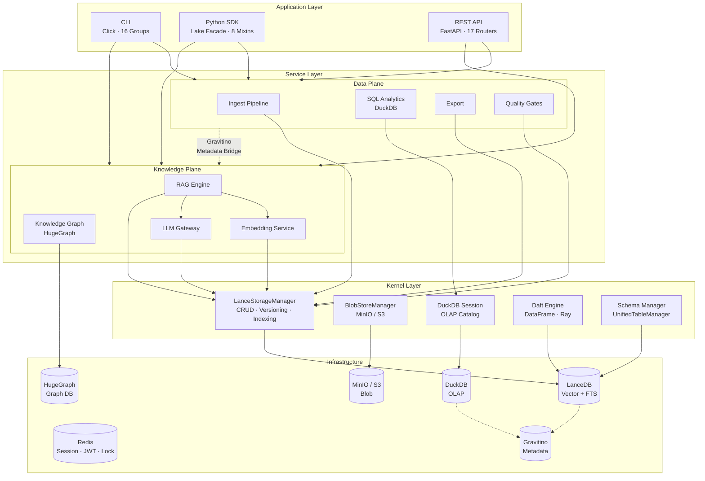
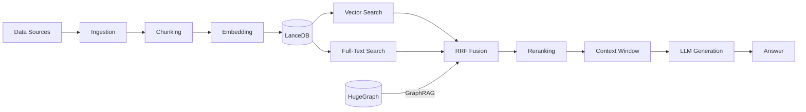

# Architecture — Three-Layer + Dual-Plane

**Version:** v1.5.2 | **Updated:** 2026-05-26

---

## System Overview



---

## Three-Layer Architecture

| Layer | Responsibility | Key Modules |
|-------|---------------|-------------|
| **Application** | User-facing interfaces | `cli/`, `__init__.py` (Lake), `api/routers/`, `server.py` |
| **Service** | Business logic, domain services | `ingest/`, `query/`, `rag/`, `knowledge_graph/`, `embed/`, `quality/`, `catalog/` |
| **Kernel** | Storage, compute, schema primitives | `storage/`, `ingest/storage.py`, `ingest/schema.py`, `query/session_manager.py`, `ray_runtime/` |

**Dependency rule:** Application → Service → Kernel (one direction only, no bypass).

---

## Dual-Plane Architecture

### Data Plane

Handles structured/unstructured data lifecycle — ingestion, storage, analytics, export, quality.

| Component | Module | Role |
|-----------|--------|------|
| Ingest Pipeline | `ingest/` | File/API/stream ingestion, chunking, OCR |
| SQL Analytics | `query/` | DuckDB OLAP, Daft DataFrame, federated query |
| Export | `ingest/storage.py` | Parquet/CSV export with version selection |
| Quality Gates | `quality/` | Schema validation, dedup, null detection |
| Lifecycle | `storage/lifecycle.py` | TTL, retention, compaction |

### Knowledge Plane

Handles knowledge extraction, embedding, retrieval, and generation — RAG pipeline + knowledge graph.

| Component | Module | Role |
|-----------|--------|------|
| RAG Engine | `rag/` | Multi-provider LLM, reranking, query transform, multi-turn |
| Knowledge Graph | `knowledge_graph/` | HugeGraph integration, GraphRAG |
| Embedding Service | `embed/` | SentenceTransformers, multi-model support |
| LLM Gateway | `rag/provider.py` | OpenAI/Anthropic/vLLM/Ollama/DeepSeek abstraction |

**Orthogonality:** Data Plane and Knowledge Plane share Kernel Layer interfaces but do not import each other's internal modules. They communicate through Gravitino metadata bridge for schema/catalog coordination.

---

## SDK Facade — Lake + 8 Mixins

```
Lake (Facade)
├── _LakeIngestMixin     # Dataset CRUD, file/batch ingestion
├── _LakeSearchMixin     # Vector/FTS/hybrid/faceted/ensemble search
├── _LakeQueryMixin      # SQL OLAP, Daft DataFrame, federated query
├── _LakeAdminMixin      # Maintenance, compaction, index rebuild
├── _LakeLineageMixin    # Data lineage tracking
├── _LakeAuditMixin      # HMAC-SHA256 audit trail
├── _LakeRAGMixin        # RAG pipeline, sessions, streaming
└── _LakeKGMixin         # Knowledge graph CRUD, Gremlin query
```

---

## Data Flow: Ingestion to Answer


