# Arrow Lake 总体架构图

**版本**: v1.4.4 | **日期**: 2026-05-26
**来源**: [architecture-v1.3.0.md](architecture-v1.3.0.md) + [architecture-v1.0_draft_up.md](architecture-v1.0_draft_up.md)

> ⚠️ **本文为 v1.4.4 架构快照**（历史草案合集），**不反映 v1.5+ 变更**。当前主干为 **v1.10.0**（2026-08-03）：v1.9.0 起 **libSQL/Turso 控制面库（`system_db`）** 接管 RBAC/身份/personal_token/catalog/任务/lineage/RAG 会话（数据面零改动），v1.9.1 起内置运维/合规/治理 **console** 前端，v1.10.0 起新增**知识抽取模板管理**（前端模板 CRUD + 后端动态抽取建图）。权威技术参考请见 [`docs/ARCHITECTURE.md`](../ARCHITECTURE.md)（v1.10.0 基线），完备架构设计见 [`docs/architecture-design/00-architecture-design.md`](../architecture-design/00-architecture-design.md)。

---

## 一、系统分层架构

```text
                              +---------------------------+
                              |     客户端 / 前端应用       |
                              +-------------+-------------+
                                            |
                              +-------------v-------------+
                              |   API Gateway / Ingress   |
                              +-------------+-------------+
                                            |
                   +------------------------+------------------------+
                   |                        |                        |
        +----------v----------+  +----------v----------+  +----------v----------+
        | Arrow Lake REST API |  |  Python SDK (Lake)  |  |  CLI (Click)        |
        | FastAPI · 15 routers|  |  Facade · 8 Mixins  |  |  15 command groups  |
        +----------+----------+  +----------+----------+  +---------------------+
                   |                        |
          +--------+--------+       +-------+-------+
          | Middleware Chain|       | RAG Engine    |
          | Auth·RateLimit  |       | Retrieve+Gen  |
          | Security·OTel   |       +---+-----+-----+
          +--------+--------+           |     |
                   |                +---v--+  +--v-----------+
          +--------v---+--------+   |DuckDB|  | LLM Provider  |
          | LanceDB SDK| DuckDB  |   |SQL   |  | OpenAI/vLLM   |
          | (数据管理层)|(OLAP    |   |引擎  |  | Ollama        |
          | 写入/索引   | 分析层) |   |      |  +---------------+
          | Schema演化  |         |   |      |
          | 版本管理    |         |   |      |
          +--------+----+--+--+--+---+------++
                   |     |  |  |           |
                   |     |  |  +-----------+-----+
                   |     |  |                    |
                   |     |  +----------+   +-----v----------+
                   |     |             |   | Daft Query     |
                   |     |             |   | Engine         |
                   |     |             |   | (DataFrame     |
                   |     |             |   |  惰性操作链)    |
                   |     |             |   | sort/filter/   |
                   |     |             |   | groupby/sql/   |
                   |     |             |   | pivot/explode  |
                   |     |             |   +-----+----------+
          +--------v-----v--v--v--------+      |
          |      Lance 数据格式层        |<-----+
          |  列式+向量+FTS+版本管理       |
          +----+-------------------------+
               |
               +──────────┬──────────────────┬─────────────────+
               |          |                  |                 |
     +---------v---+ +----v-----------+ +----v----------+ +----v----------+
     | Lance Files | | MinIO / S3     | | Redis         | | HugeGraph     |
     | (列式存储)   | | (Blob Storage) | | Session·JWT   | | (图数据库)     |
     +-------------+ +----------------+ | Semaphore     | | (外部部署)     |
                                       +---------------+ +---------------+

          +------------------------------------------------------------+
          |                       部署层                                |
          |  Docker Compose (6 profiles)  |  Helm + Kubernetes          |
          |  api · minio · redis          |  HPA · PDB · Ingress        |
          |  ray-head · ray-worker        |  Secret · CronJob Backup    |
          |  jupyter · turbo-ocr          |  NetworkPolicy              |
          +------------------------------------------------------------+
```

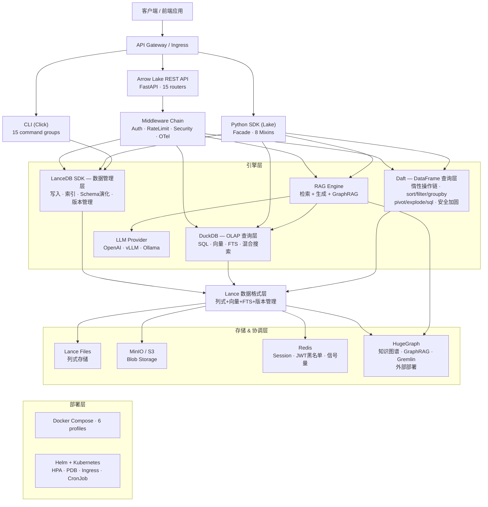

### 分层说明

| 层级 | 组件 | 职责 |
| ------ | ------ | ------ |
| **客户端层** | CLI / REST API / SDK / Jupyter | 用户交互入口 |
| **网关层** | FastAPI + Middleware Chain | HTTP 接口、认证、限流、安全头、可观测 |
| **SDK 层** | Lake facade (8 Mixins) | 统一编程接口，懒初始化组件 |
| **管理层** | LanceDB SDK | 数据写入 / 索引创建 / Schema 演化 / 版本管理 |
| **OLAP 查询层** | DuckDB + Lance 扩展 | SQL OLAP / 向量搜索 / FTS / 混合搜索 / Session Pool |
| **DataFrame 查询层** | Daft + DaftQueryEngine | 惰性 DataFrame 操作链 / SQL 子查询 / 安全加固 / 行数限制 |
| **衍生层** | DuckDB + DuckLake 扩展 | ETL 物化 / 可写工作区 / DML |
| **格式层** | Lance | 列式存储 + 向量索引 + 全文索引 + 版本管理 |
| **存储层** | MinIO (S3) / 本地 FS | Lance 格式持久化 + 媒体二进制 |
| **协调层** | Redis | 分布式信号量 / JWT 黑名单 / Session 协调 |
| **图数据库** | HugeGraph (外部) | 知识图谱 / GraphRAG / Gremlin 遍历 |
| **元数据联邦层** | Gravitino (v1.4.1) | 跨数据源统一元数据管理 / 标签治理 / 策略执行 / 统计采集 / RBAC 桥接 |
| **外部层** | LLM / Ray / OTel / Alertmanager | 生成 / 分布式计算 / 可观测 / 告警 |
| **RAG 增强层** | Reranker + QueryTransformer (v1.4.4) | CrossEncoder/LLM 重排 + HyDE/MultiQuery 查询改写 + 多轮对话 |
| **编排层** | Metaflow Flows | 工作流编排: 并行/分支/重试/超时/资源/追溯 |

---

## 二、LanceDB SDK / DuckDB / Daft 三方分工

**核心原则：LanceDB SDK 负责数据管理（写），DuckDB 负责 SQL 查询分析（读），Daft 负责 DataFrame 编程式查询（读）。三者互补，各司其职。**

```text
LanceDB SDK (数据管理层)
├── 写入 (table.add) → Lance 文件
├── 索引 (create_index / create_fts_index) → Lance 索引
├── Schema 演化 (add/drop/alter columns) → Lance 文件
└── 版本管理 (list_versions / tags) → Lance 元数据

DuckDB (SQL 查询分析层)
├── lance 扩展 → Lance (只读 SSOT: 原始数据、向量、FTS)
├── ducklake 扩展 → DuckLake (可写衍生: ETL、物化、工作区)
└── 原生 SQL → JOIN 跨存储查询

Daft (DataFrame 查询层)
├── DaftQueryEngine → Lance 数据集加载 (S3/本地)
├── LazyDaftFrame → 惰性操作链 (sort/filter/groupby/join/sql/pivot/explode/sample)
├── 安全加固 → 标识符验证 + SQL 黑名单 + collect 行数限制 + 错误脱敏
└── REST API → POST /api/v1/datasets/{name}/query/daft (链式 pipeline)
```

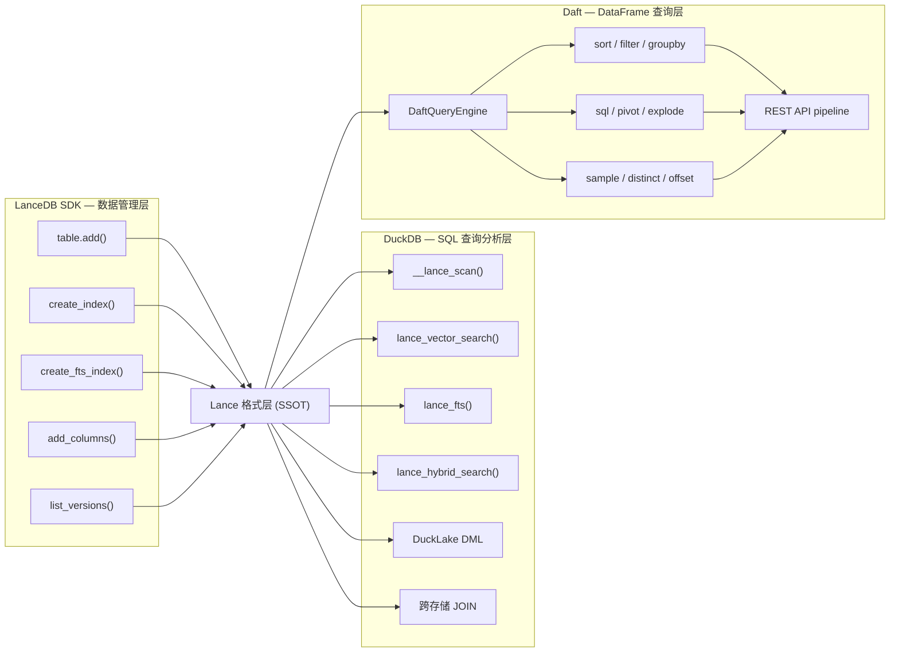

### 职责矩阵

| 操作类别 | DuckDB lance 扩展 | LanceDB SDK | Daft | 说明 |
| ------- | :---: | :---: | :---: | ------- |
| 创建向量索引 (IVF-PQ) | - | ✓ | - | `table.create_index()` |
| 创建 FTS 索引 (BM25) | - | ✓ | - | `table.create_fts_index()` |
| 向量搜索 (使用索引) | ✓ | ✓ | - | DuckDB `lance_vector_search()` |
| 全文搜索 (使用索引) | ✓ | ✓ | - | DuckDB `lance_fts()` |
| 混合搜索 (RRF 融合) | ✓ | ✓ | - | DuckDB 原生 `lance_hybrid_search()` |
| OLAP SQL (聚合/JOIN/窗口) | ✓ | - | - | DuckDB 强项 |
| 数据写入 (add/optimize) | - | ✓ | - | `table.add()`, `table.optimize()` |
| Schema 演化 | - | ✓ | - | `table.add_columns()` 等 |
| 版本管理 (list/tags) | - | ✓ | - | `table.list_versions()` 等 |
| 跨存储 JOIN (Lance+DuckLake) | ✓ | - | - | DuckDB 独有能力 |
| DataFrame 编程式查询 | - | - | ✓ | 惰性操作链: sort/filter/groupby/pivot |
| SQL 子查询 (CTE/窗口函数) | - | - | ✓ | `frame.sql()` — DuckDB 不擅长的复杂子查询 |
| Ingest 文件读取 (CSV/Parquet/JSON) | - | - | ✓ | Daft 多格式读取 |
| 多模态数据处理 | - | - | ✓ | 图像/音频/视频 + embed/classify/prompt |
| 安全标识符验证 | - | - | ✓ | 全方法 `_SAFE_IDENTIFIER_RE` 校验 |

### 调用关系

```text
Ingest 流程:
  数据 → LanceDB SDK (table.add + table.create_index) → Lance 文件
  文件读取 → Daft (read_csv/read_parquet/read_json) → 数据预处理 → LanceDB SDK

SQL Query 流程:
  REST API → DuckDB SQL (lance_vector_search / lance_fts / __lance_scan) → Lance 文件

DataFrame Query 流程:
  REST API → DaftQueryEngine.load() → LazyDaftFrame (链式操作) → collect() → Arrow Table
  SDK → lake.daft_query() → sort/filter/groupby/sql/pivot → collect()

管理流程:
  Admin API → LanceDB SDK (schema_evolution / version_management / optimize) → Lance 文件
```

---

## 三、数据流总体关系

```text
[原始数据] --ingest--> [LanceDB SDK] --create_index--> [Lance 格式层 (元数据+向量+索引)]
       |                      |  (数据管理层)                  |
       |                      | 写入/Schema演化/版本            |
       |                      +-------------------------------+
       |                      |
       |              +-------v-------+
       |              | MinIO / S3    | ← Lance 持久化后端 (storage_options)
       |              | (生产)         |
       |              +-------+-------+
       |                      |
       |              +-------v-------+
       |              | 本地 FS       | ← Lance 持久化后端 (开发)
       |              +---------------+
       |
       +---> [HugeGraph] ← KG Construction
       |
       +---> [MinIO 原始媒体] ← 二进制文件 (非 Lance)
                      |
                      +------------+------------+------------+
                                   |            |            |
                          [DuckDB SQL 查询层]  [Daft DataFrame 查询层]
                          ┌──────────────────────┐
                          │ lance 扩展:          │
                          │ · __lance_scan       │ → OLAP SQL
                          │ · lance_vector_search│ → 向量搜索
                          │ · lance_fts          │ → 全文搜索
                          │ · lance_hybrid_search│ → 混合搜索
                          ├──────────────────────┤
                          │ ducklake 扩展:       │
                          │ · ETL 物化           │ → 衍生数据
                          │ · DML (读写)         │ → 工作区
                          │ · 快照时间旅行         │ → 版本管理
                          └──────────┬───────────┘
                          ┌──────────────────────┐
                          │ Daft DataFrame 引擎: │
                          │ · sort/filter/groupby│ → 编程式查询
                          │ · sql/pivot/explode  │ → 复杂变换
                          │ · sample/distinct    │ → 采样去重
                          │ · 安全加固 + 行数限制  │ → 防注入/DoS
                          └──────────┬───────────┘
                                     |
                 +───────────────────+───────────────────+
                 |                   |                   |
         [REST API 直查]     [RAG Engine 检索]    [Graph Traversal]
         OLAP/Faceted        |                    [HugeGraph]
         向量/FTS/混合        │                        |
         Daft DataFrame       │                        |
                            +──┬─────────────+─────────┘
                               │             │
                    +──────────▼───┐  +───────▼──────┐
                    │ 上下文组装    │  │  图三元组      │
                    │ token预算/去重 │  │  子图序列化    │
                    +──────┬───────┘  +───────┬──────┘
                           +────────┬────────┘
                                    │
                           [LLM Provider]
                           OpenAI/Anthropic/vLLM/Ollama
                                    │
                  ┌─────────────────▼─────────────────┐
                  │ Reranker (v1.4.4)                  │
                  │ CrossEncoder / LLM / Noop          │
                  └─────────────────┬─────────────────┘
                                    │
                  ┌─────────────────▼─────────────────┐
                  │ Query Transform (v1.4.4)           │
                  │ HyDE / MultiQuery / Identity       │
                  └─────────────────┬─────────────────┘
                                    │
                           [Cited Response]
```

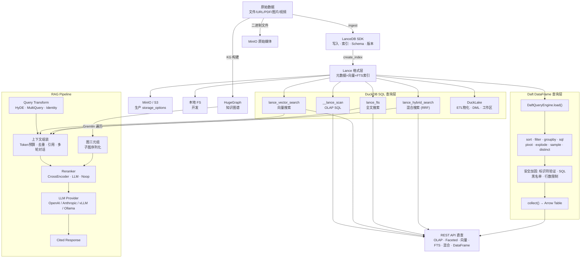

---

## 三B、查询引擎定位与选型 (DuckDB vs Daft)

### 执行架构差异

```text
DuckDB 查询路径 (OLAP 强项):
  SQL → 查询优化器 → 流式执行引擎 → 逐行输出 (out-of-core)
        │                │
        ├─ 谓词下推       ├─ 超内存自动溢写到磁盘
        ├─ 列裁剪         ├─ Pipeline 并行
        └─ JOIN 重排      └─ 算子融合

Daft 查询路径 (DataFrame 强项):
  链式 API → 执行计划优化 → 分区式执行 → 全量物化到内存
              │                │            │
              ├─ 惰性求值       ├─ 分区并行    ├─ to_arrow() 必须
              ├─ 列裁剪         ├─ 每分区256MB  │  全部装入内存
              └─ 谓词下推       └─ Ray 分布式   └─ ⚠️ 大数据量瓶颈
```

### 瓶颈分析

| 操作 | DuckDB | Daft | 说明 |
| ---- | ------ | ---- | ---- |
| 全表扫描 5M 行 | 流式处理，内存可控 | ⚠️ 全量物化到 Arrow Table | Daft `collect()` 一次性装进内存 |
| `GROUP BY` 聚合 | 流式聚合，内存=分组数 | 分区内聚合后合并 | Daft 聚合结果小，通常安全 |
| `ORDER BY` 全排序 | 外部排序，溢写到磁盘 | ⚠️ 全量排序后物化 | 大数据排序是 Daft 的弱点 |
| `LIMIT 10` | Top-N 优化，只保留 10 行 | ⚠️ 先物化全量再截断 | Daft 无法在引擎层做 Top-N |
| 复杂 JOIN | Hash/Sort JOIN + 溢出 | 分区内 JOIN | 大表 JOIN DuckDB 更优 |
| 多模态 (图像/嵌入) | ❌ 不支持 | ✅ 原生支持 | Daft 独有能力 |
| 编程式链式操作 | ❌ SQL only | ✅ DataFrame API | Daft 独有能力 |

### 选型矩阵

```text
┌─────────────────────────────────────────────────────────┐
│                    数据量评估                              │
│                                                         │
│  < 100K 行        100K-1M 行        > 1M 行             │
│  ┌──────────┐    ┌──────────┐    ┌──────────┐           │
│  │ Daft ✅  │    │ Daft ⚠️  │    │ DuckDB ✅│           │
│  │ 首选     │    │ 加 limit │    │ 首选     │           │
│  │          │    │ DuckDB   │    │          │           │
│  └──────────┘    │ 可替代   │    └──────────┘           │
│                  └──────────┘                           │
│                                                         │
│  场景:                                                  │
│  编程式分析 → Daft    复杂SQL → DuckDB                    │
│  多模态/AI  → Daft    大数据OLAP → DuckDB                │
│  ETL预处理  → Daft    流式聚合 → DuckDB                  │
└─────────────────────────────────────────────────────────┘
```

### 安全防护 (已实现)

| 防护层 | 机制 | 阈值 |
| ------ | ---- | ---- |
| 标识符注入 | `_SAFE_IDENTIFIER_RE` 全方法校验 | 拒绝特殊字符 |
| SQL 注入 | DDL/DML 关键词黑名单 + 长度上限 | 10K 字符 |
| DoS 防护 | `collect(max_rows)` 行数截断 | 默认 100K 行 |
| 信息泄露 | 错误消息脱敏 | 不暴露路径/凭据 |
| 行数预检 | `count_rows()` 提前评估 | > 500K 行警告 |

### 路由建议 (API 层)

```text
POST /api/v1/datasets/{name}/query/daft
  → 行数预检: count_rows()
  → ≤ 500K: 正常执行 Daft DataFrame pipeline
  → > 500K: 返回 warnings，建议改用 /query/olap
  → > 1M:  拒绝执行，强制建议 DuckDB

POST /api/v1/datasets/{name}/query/olap
  → 无数据量限制 (DuckDB out-of-core)
  → 推荐大数据场景使用
```

---

## 四、计算框架层 (DARMU 栈)

| 首字母 | 框架 | 职责 | 部署位置 |
| -------- | ------ | ------ | --------- |
| **Da** | Daft | DataFrame 查询引擎: 惰性操作链 + 编程式 ETL + Lance 查询 + 安全加固 | 嵌入 API 进程 |
| **R** | Ray | 分布式计算，CatalogActor + GPU 调度 + 并行 map | Ray Cluster (独立) |
| **M** | Metaflow | 工作流编排，质量管道 + 端到端 Flow + 调度 | 嵌入 API 进程 |
| **U** | DuckDB | OLAP SQL + Lance/DuckLake 扩展 + Session Pool | 嵌入 API 进程 |

### 三框架协作关系

```text
┌──────────────────────────────────────────────────────────┐
│                    Metaflow 工作流                        │
│  (编排层: 步骤顺序、重试、调度、审计)                       │
│                                                          │
│  ┌─────────┐   ┌──────────┐   ┌──────────┐              │
│  │  Ingest │ → │  Quality │ → │  Embed   │   ...       │
│  │  Step   │   │  Step    │   │  Step    │              │
│  └────┬────┘   └────┬─────┘   └────┬─────┘              │
│       │              │              │                     │
│       ▼              ▼              ▼                     │
│  ┌─────────────────────────────────────────────┐         │
│  │            Lake Facade API                   │         │
│  └────────┬──────────┬───────────┬─────────────┘         │
│           │          │           │                          │
│           ▼          ▼           ▼                          │
│     ┌──────────┐ ┌────────┐ ┌──────────┐                  │
│     │   Daft   │ │ DuckDB │ │   Ray    │                  │
│     │ 文件读取  │ │ SQL OLAP│ │ 分布式    │                  │
│     │ ETL 转换  │ │ 向量/FTS│ │ Catalog  │                  │
│     │ 惰性求值  │ │ 混合搜索│ │ GPU 推理  │                  │
│     └──────────┘ └────────┘ └──────────┘                  │
│                                                         │
│  基础设施: Ray Cluster + Redis 协调                       │
└──────────────────────────────────────────────────────────┘
```

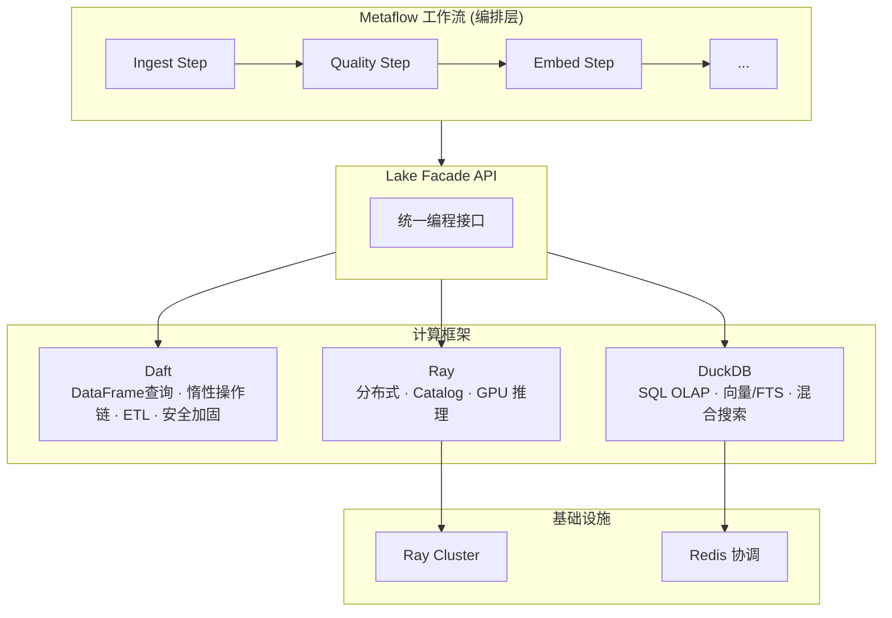

---

## 四B、工作流编排层 (Metaflow)

Metaflow 作为 DARMU 栈中的编排层，管理数据处理的步骤顺序、并行分发、容错重试、资源声明和运行追溯。

### Flow 拓扑总览

```text
┌─────────────────────────────────────────────────────────────────────┐
│                     Arrow Lake Metaflow Flows                       │
│                                                                     │
│  ┌──────────┐  ┌──────────┐  ┌───────────┐  ┌──────────┐          │
│  │ Ingest   │  │ Embed    │  │ KG        │  │ BatchRAG │          │
│  │ Flow     │  │ Flow     │  │ Flow      │  │ Flow     │          │
│  │          │  │          │  │           │  │          │          │
│  │ foreach  │  │ foreach  │  │ branch    │  │ foreach  │          │
│  │ retry    │  │ resources│  │ retry     │  │ timeout  │          │
│  │ catch    │  │ retry    │  │ catch     │  │ retry    │          │
│  └────┬─────┘  │ catch    │  │ resources │  │ catch    │          │
│       │        └────┬─────┘  └─────┬─────┘  └────┬─────┘          │
│       │             │              │              │                │
│       ▼             ▼              ▼              ▼                │
│  ┌──────────────────────────────────────────────────────┐          │
│  │              Lake Facade / Storage API                │          │
│  └──────────────────────┬───────────────────────────────┘          │
│                         │                                          │
│  ┌──────────────────────┼───────────────────────────────┐          │
│  │         Metaflow 基础设施                             │          │
│  │  ArrowLakeFlowSpec · FlowRegistry · StateRollback    │          │
│  │  RetryCategory · ErrorClassifier · AuditTrail        │          │
│  │  ScheduleConfig · RunTags · ArgoWorkflowBridge       │          │
│  │  RunTracker (Client API)                              │          │
│  └──────────────────────────────────────────────────────┘          │
│                                                                     │
│  ┌──────────────────────────────────────────────────────┐          │
│  │         已有 Flow (v1.3.3 线性管道)                    │          │
│  │  QualityPipelineFlow · MayaE2EFlow · ScheduledQuality │          │
│  └──────────────────────────────────────────────────────┘          │
└─────────────────────────────────────────────────────────────────────┘
```

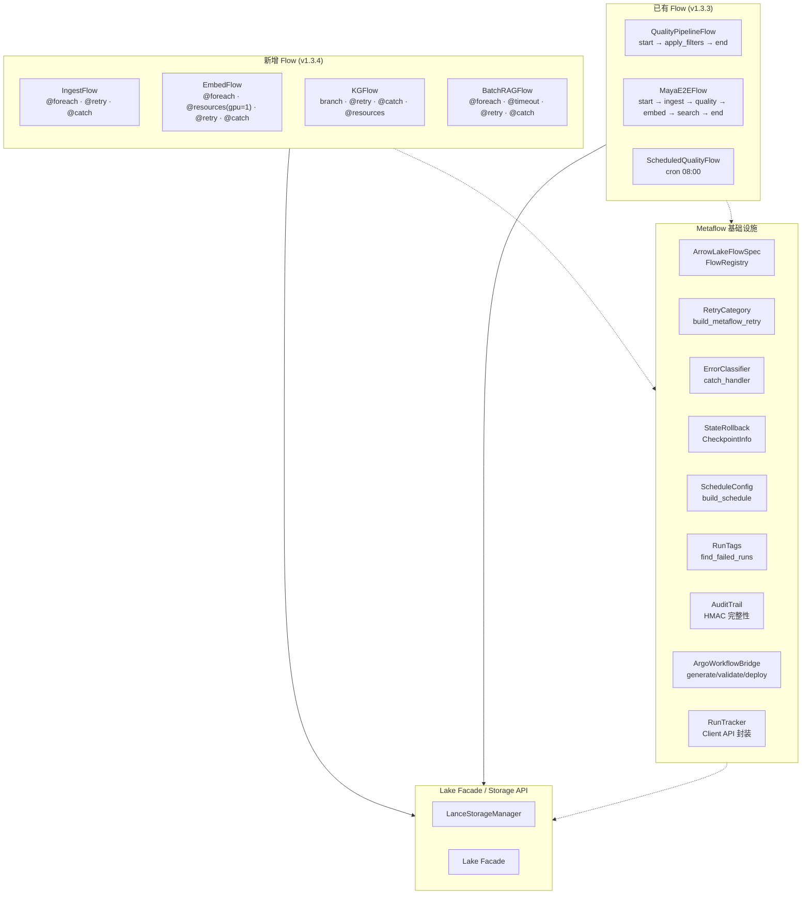

### 各 Flow 拓扑详情

#### IngestFlow — 并行摄入 + 死信队列

```text
start (扫描目录)
  │
  ├── foreach(files) ──┐
  │   @retry(3)        │
  │   @catch           │ N 路并行
  │   ingest_file      │
  │                    │
  ├── foreach(files) ──┤
  │   ingest_file      │
  │                    │
  └── foreach(files) ──┘
           │
       join (汇总: success + dead_letter)
           │
         end (JSON 报告)
```

#### EmbedFlow — 分片编码 + GPU 资源管理

```text
start (加载数据, 分 shard)
  │
  ├── foreach(shards) ──┐
  │   @resources(gpu=1) │
  │   @retry(2)         │ N 路并行
  │   @catch            │
  │   encode_shard      │
  │                     │
  ├── foreach(shards) ──┤
  │   encode_shard      │
  │                     │
  └── foreach(shards) ──┘
           │
       join (合并 Table → 覆写数据集)
           │
         end (JSON 报告)
```

#### KGFlow — 分支并行 + 条件插入

```text
start (加载数据, 准备索引)
  │
  ├─── extract_entities ──→ join_kg
  │    @retry(3)                │
  │    @catch                   │
  │                             │
  └─── ensure_schema    ──→ join_kg
       @resources(8G)           │
                                  │
                          insert_vertices
                          @resources(16G)
                          @retry(2)
                          @catch
                                  │
                                end
```

#### BatchRAGFlow — 并行查询 + 超时保护

```text
start (加载问题列表)
  │
  ├── foreach(questions) ──┐
  │   @retry(3)            │
  │   @timeout(60s)        │ N 路并行
  │   @catch               │
  │   query                │
  │                        │
  ├── foreach(questions) ──┤
  │   query                │
  │                        │
  └── foreach(questions) ──┘
           │
       join (汇总结果)
           │
         end (JSON 报告)
```

### Metaflow 特性使用矩阵

```text
                foreach  retry  catch  timeout  resources  branch  Client API
IngestFlow        ●       ●      ●
EmbedFlow         ●       ●      ●                ●
KGFlow                           ●               ●        ●
BatchRAGFlow      ●       ●      ●      ●
QualityPipeline                   ●               ●
ScheduledQuality                  ●
```

### 基础设施模块一览

| 模块 | 文件 | 职责 |
| ---- | ---- | ---- |
| ArrowLakeFlowSpec | `workflow/base.py` | 基类 mixin: _load_config + _auto_tag |
| FlowRegistry | `workflow/base.py` | Flow 发现与注册表 |
| RetryCategory | `workflow/retry.py` | 重试分类: TRANSIENT / RESOURCE / SPOT |
| ErrorClassifier | `workflow/error_handler.py` | 错误分类: TRANSIENT / RESOURCE / VALIDATION / FATAL |
| StateRollback | `workflow/rollback.py` | Lance 版本 checkpoint + rollback |
| ScheduleConfig | `workflow/schedule.py` | cron / daily / hourly 调度配置 |
| RunTags | `workflow/tags.py` | 自动标签生成 + 失败 run 查询 |
| AuditTrail | `workflow/audit.py` | HMAC 审计日志 |
| ArgoWorkflowBridge | `workflow/argo.py` | Argo YAML 生成/验证/部署 |
| RunTracker | `workflow/run_tracker.py` | Client API: run_history / compare_runs |

### 装饰器最佳实践

```text
推荐装饰器顺序 (从外到内):

@resources(gpu=1, memory=16000)   # 1. 资源声明 — 调度时生效
@retry(times=3)                    # 2. 重试策略
@timeout(seconds=300)              # 3. 超时控制
@catch(var="error")                # 4. 异常捕获 — 兜底
@step                              # 5. Metaflow step
def my_step(self):
    if hasattr(self, "error"):
        # 容错处理: 分类错误、记录死信、回滚状态
    else:
        # 正常处理
```

---

## 五、中间件链

API 请求经过 10 层中间件处理（按执行顺序）：

```text
HTTP Request
    │
    ├── 1. CORS Middleware          # 跨域资源共享
    ├── 2. Exception Handlers       # 全局错误处理
    ├── 3. GZip Middleware          # 响应压缩 (≥1000 bytes)
    ├── 4. Metrics Middleware       # Prometheus HTTP 请求耗时
    ├── 5. Request Size Limit       # max_request_size_bytes 限制
    ├── 6. Security Headers         # CSP/HSTS/X-Frame/X-Content-Type
    ├── 7. Rate Limiting            # Token Bucket 限流 (可选)
    ├── 8. API Key Auth             # X-API-Key 验证 (可选)
    ├── 9. Correlation ID           # X-Request-ID 请求追踪
    ├── 10. JWT Authentication      # Bearer Token 验证 (可选)
    │
    ▼
Router Handler → Lake API → Query Engine / Storage
```

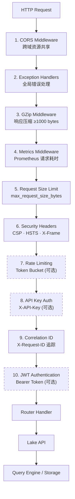

---

## 六、数据流详细设计

### 6A. 摄入流程

```text
[原始文件/URL/PDF/图片/视频]
    │
    v
+--- Ingestor.ingest_mixed() --------------------------------+
|                                                             |
| 1. 文件分类                                                 |
|    ├─ 文本 → text_content                                   |
|    ├─ 图片 → ImageProcessor (缩略图 + EXIF)                  |
|    ├─ 视频 → VideoProcessor (关键帧提取)                     |
|    └─ PDF  → Kreuzberg 解析 / TurboOCR (GPU)                 |
|                                                             |
| 2. 分块 (7 策略)                                            |
|    ├─ recursive / semantic / sentence / fixed_size           |
|    ├─ markdown_heading / html_section / None                 |
|    └─ QualityFilterRegistry 自动过滤                         |
|                                                             |
| 3. 写入 Lance (LanceDB SDK)                                 |
|    └─ metadata + vectors + text_content                     |
|                                                             |
| 4. 媒体上传 MinIO (大文件)                                   |
|    ├─ original → MinIO                                      |
|    └─ S3 URI → Lance 引用列                                  |
|                                                             |
| 5. 审计记录 → AuditTrail.record()                            |
| 6. 血缘记录 → LineageStore.record_event()                   |
+-------------------------------------------------------------+
```

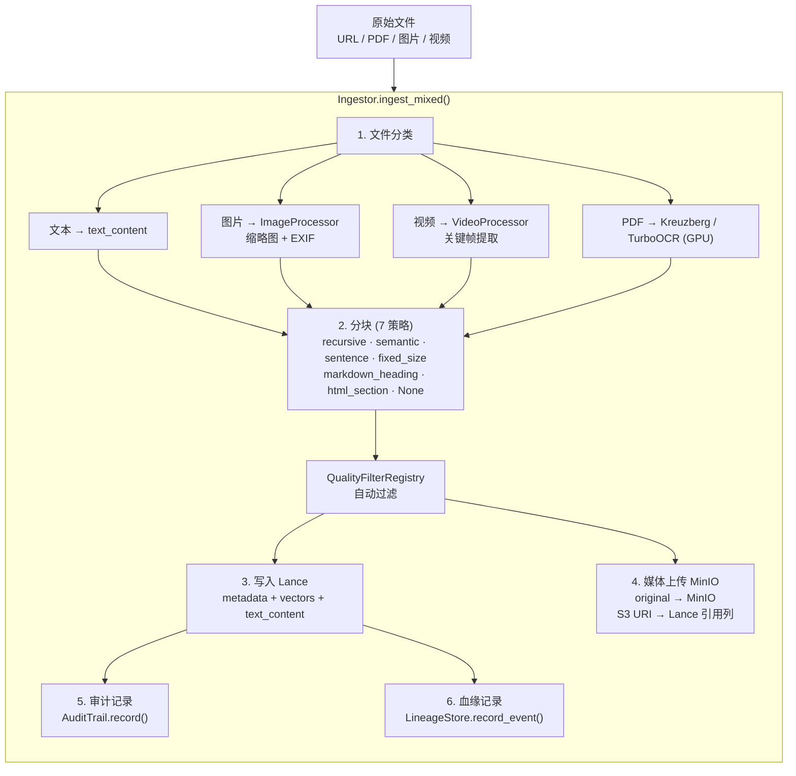

### 6B. 查询流程 (Redis 信号量协调)

```text
[SQL / 搜索请求]
    │
    v
+--- API Router ---------------------------------------------------+
|                                                                  |
| 1. JWT/Auth 验证 + RBAC 权限检查                                  |
|                                                                  |
| 2. lake.get_session_manager().acquire()                          |
|    ├─ Redis 信号量 acquire (INCR + cap, Lua 原子)                |
|    └─ 或 threading.Semaphore (Redis 不可用时)                     |
|                                                                  |
| 3. 从空闲池获取 DuckDB 连接                                       |
|    ├─ 验证连接健康 (SELECT 1)                                     |
|    └─ 不健康则丢弃，新建连接                                       |
|                                                                  |
| 4. 执行查询                                                      |
|    ├─ Lance 数据: __lance_scan() / lance_vector_search()         |
|    ├─ DuckLake: ATTACH TYPE ducklake + DML                       |
|    └─ 资源治理: memory_limit + statement_timeout                  |
|                                                                  |
| 5. 释放连接                                                      |
|    ├─ 归还空闲池 (标注归还时间)                                    |
|    ├─ Redis 信号量 release (DECR, Lua 原子)                      |
|    └─ Prometheus 指标记录                                         |
+------------------------------------------------------------------+
```

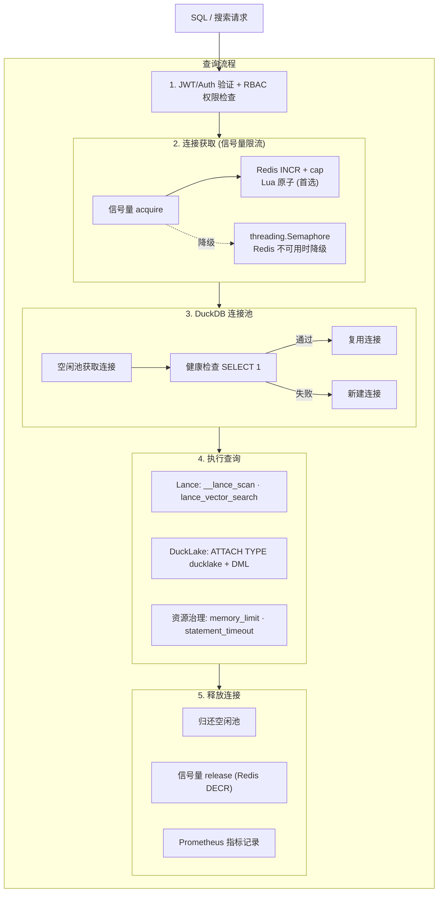

### 6C. RAG 查询流程

```text
[用户问题]
    │
    v
+--- RAGPipeline.query() -------------------------------------+
|                                                             |
| 1. 并行检索                                                 |
|    ├─ lance_vector_search()  → DuckDB → Lance 向量索引       |
|    ├─ lance_fts()             → DuckDB → Lance FTS 索引      |
|    ├─ lance_hybrid_search()   → DuckDB → Lance RRF 融合      |
|    └─ HugeGraph 遍历         → Gremlin API → 子图三元组       |
|                                                             |
| 2. 上下文组装                                               |
|    ├─ Token 预算管理 (ContextWindow)                         |
|    ├─ 结果去重 + 引用追踪 (ContextCitation)                   |
|    └─ 图三元组合并 (GraphRAG)                                |
|                                                             |
| 3. Prompt 渲染 (Jinja2 模板 + PromptRegistry)               |
|                                                             |
| 4. LLM 生成 (via Provider)                                  |
|    ├─ 同步: generate() → RAGResponse                        |
|    └─ 流式: generate_stream() → AsyncIterator[str]           |
|                                                             |
| 5. 引用标注 + 返回                                           |
+-------------------------------------------------------------+
```

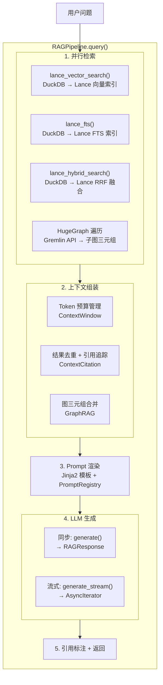

### 6D. DuckLake ETL 物化流程

```text
[Lance 只读 SSOT]
    │
    v
+--- DuckDB SQL ---+
|                   |
| 1. CREATE VIEW    |
|    __lance_scan   |
|                   |
| 2. OLAP 聚合      |
|    GROUP BY / CUBE|
|                   |
| 3. CREATE TABLE   |
|    workspace.*    |
|    (物化到 DuckLake)|
|                   |
| 4. DML 操作       |
|    INSERT/UPDATE  |
|                   |
| 5. 快照标记       |
|    expires_at     |
+-------------------+
```

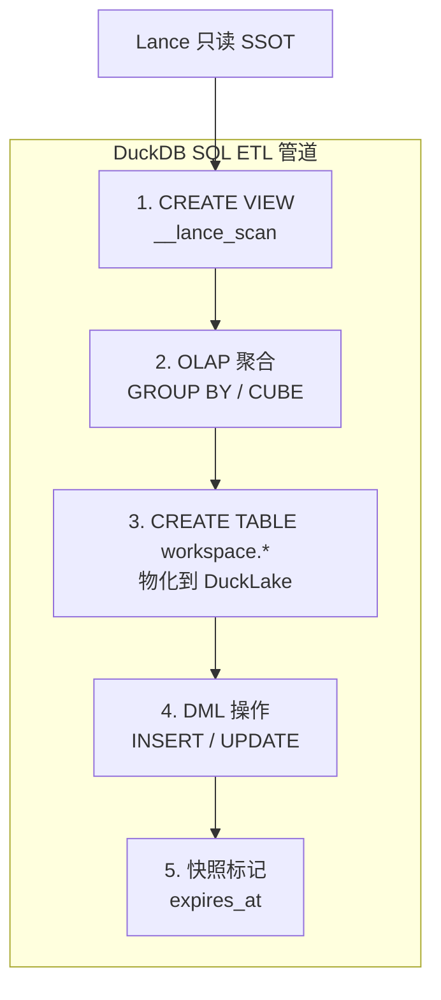

### 6E. Daft DataFrame 查询流程 (安全加固)

```text
[POST /api/v1/datasets/{name}/query/daft]
    │
    v
+--- DaftQueryEngine.load() ----------------------------------+
|                                                             |
| 1. 数据集名验证 (_SAFE_IDENTIFIER_RE)                       |
|    └─ 拒绝: 空/路径穿越/特殊字符                              |
|                                                             |
| 2. Lance 数据集加载                                          |
|    ├─ daft.read_lance(lance_path, io_config)                |
|    ├─ FileNotFoundError → 脱敏错误消息                       |
|    └─ RuntimeError → 脱敏错误 + 内部日志                     |
+-------------------------------------------------------------+
    │
    v
+--- 链式操作 Pipeline (惰性求值) -----------------------------+
|                                                             |
| sort(column, desc)    → 列名验证                            |
|     ↓                                                       |
| filter(predicate)     → Daft Expression                     |
|     ↓                                                       |
| groupby(cols).agg()   → 列名验证 + 7种聚合函数               |
|     ↓                                                       |
| sql(query)            → 空查询拒绝 + 长度上限(10K)           |
|                        + DDL/DML 关键词黑名单                 |
|     ↓                                                       |
| pivot/explode/sample  → 参数验证 + 聚合白名单                |
|     ↓                                                       |
| distinct/offset/limit → 边界检查                             |
|     ↓                                                       |
| select(columns)       → 列名验证                            |
+-------------------------------------------------------------+
    │
    v
+--- collect() → Arrow Table ---------------------------------+
|                                                             |
| 1. max_rows 安全上限 (默认 100K)                            |
|    ├─ 超限 → 截断 + warning 日志                            |
|    └─ max_rows=0 → 禁用限制                                 |
|                                                             |
| 2. 返回 pyarrow.Table                                      |
|    └─ → arrow_table_to_response() → JSON / Arrow IPC        |
+-------------------------------------------------------------+
```

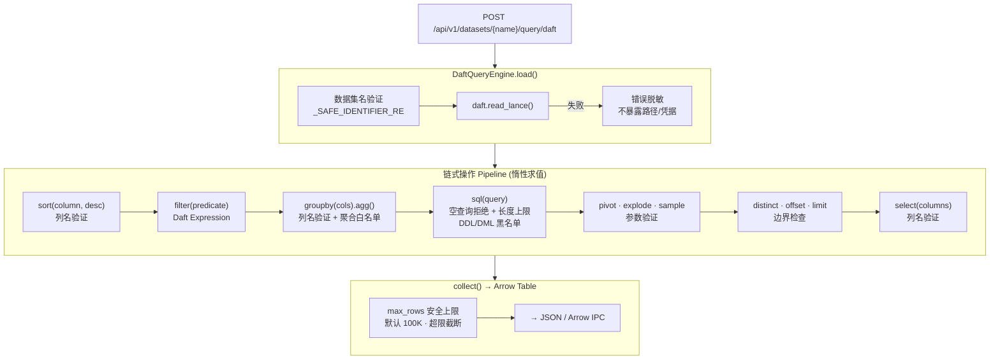

### 7A. Docker Compose Profile 矩阵

| Profile | 服务 | 用途 |
| --------- | ------ | ------ |
| `core` | api, minio, minio-init, redis | 最小生产 |
| `dev` | core + ray-head, ray-worker, jupyter + 源码挂载 | 开发 |
| `compute` | ray-head, ray-worker | 计算扩展 |
| `gpu` | core + compute + GPU 资源 | GPU 加速 |
| `monitoring` | core + compute + prometheus | 可观测 |
| `ocr` | turbo-ocr (GPU) | OCR 处理 |

### 7B. 网络拓扑

```text
arrow-lake-net (172.30.0.0/16)
├── api
├── minio
├── redis
├── ray-head
├── ray-worker
├── jupyter (dev only)
└── turbo-ocr (ocr only)

hg-net (external)
├── api (connected)
└── hg-server (外部 HugeGraph 实例)
```

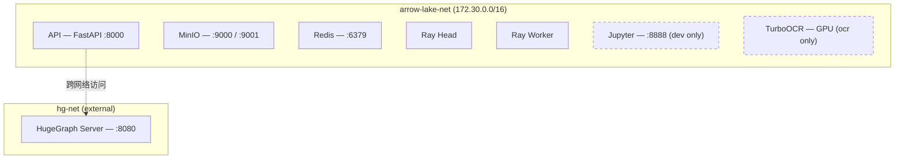

### 7C. 服务资源限制

| 服务 | 内存限制 | CPU 限制 | PIDs | 健康检查 |
| ------ | --------- | --------- | ------ | --------- |
| API | 2G | 1.0 | 256 | /health (30s) |
| MinIO | 1G | 0.5 | 512 | mc ready (10s) |
| Redis | 512M | 0.5 | 256 | redis-cli ping (10s) |
| Ray Head | 4G | 2.0 | 1024 | ray status (15s) |
| Ray Worker | 4G | 2.0 | 1024 | disabled |
| Jupyter | 2G | 1.0 | 256 | /lab (15s) |
| TurboOCR | 2G + GPU | 1.0 | 64 | /health (30s) |

---

## 八、核心组件职责矩阵

| 组件 | 职责 | 读写 | v1.4.0 状态 |
| ------ | ------ | ------ | ------------ |
| **Lance** | 统一数据格式 | SSOT | 生产使用，7 种分块策略 |
| **LanceDB SDK** | 数据管理层 | 写入+管理 | 完整 CRUD + 版本 + 索引 |
| **DuckDB** | 查询分析层 | 查询为主 | Session Pool + 资源治理 + Profiling + 多实例路由 |
| **Daft** | DataFrame 查询层 | 查询+ETL | 惰性操作链 + DaftQueryEngine + 安全加固 + 原生媒体处理 |
| **DuckLake** | 可写衍生层 | 完整 DML | DuckDB 扩展加载，ETL 物化 |
| **MinIO** | S3 存储后端 | 读写 | 生产集成，storage_options 接通 |
| **Redis** | 分布式协调 | 读写 | 信号量 + JWT 黑名单 + 多实例心跳 |
| **HugeGraph** | 知识图谱 | 读写 | 外部部署，Gremlin 安全加固 |
| **RAG Engine** | 检索增强生成 | 读写 | 完整 Pipeline + GraphRAG + 流式 |
| **FastAPI** | HTTP 接口 | — | 16 routers，RBAC + 行列ACL，OLAP SSE 流式 |
| **Ray** | 分布式计算 | — | Ray Cluster + GPU Autoscaler (冷却期+缩容保护) |
| **Prometheus + OTel** | 可观测性 | — | 完整 traces + metrics + 健康检查 |
| **Metaflow Flows** | 工作流编排 | — | 7 Flows (4 新增): foreach/branch/retry/catch/timeout/resources |
| **Metaflow 基础设施** | 编排支撑 | — | 10 模块: Registry/Retry/Error/Rollback/Schedule/Tags/Audit/Argo/Tracker |
| **QualityRuleEngine** | 声明式质量规则 | 读 | 4 checks (length/range/regex/duplicate) + 3 actions (reject/flag/remove) |
| **PermissionChecker** | RBAC + 行列ACL | 管理 | 数据集 ACL + 行过滤 + 列裁剪，Admin 绕过 |
| **GravitinoBridge** | 元数据联邦 | 读写 | Metalake/Catalog/Schema/Table/Fileset CRUD，优雅降级 |
| **GravitinoTagService** | 标签治理 | 读写 | 跨数据源统一标签管理，实体标签绑定/解绑/批量查询 |
| **GravitinoPolicyService** | 策略引擎 | 读写 | 数据掩码、行级过滤、数据保留策略 |
| **GravitinoStatsCollector** | 统计采集 | 读 | 表/列级统计信息（行数、空值率、NDV、极值） |
| **GravitinoModelRegistry** | 模型注册 | 读写 | ML 模型版本化注册、别名管理 |
| **GravitinoRBACBridge** | RBAC 桥接 | 管理 | Arrow Lake 角色/权限映射到 Gravitino 权限体系 |
| **GravitinoSyncScheduler** | 定时同步 | 读写 | 增量/全量元数据同步，冲突检测与合并策略 |

---

## 九、健康检查依赖链

```text
GET /health/ready 检查顺序:
  1. LanceDB 存储连接 (本地/S3)
  2. MinIO S3 可达性 (如 backend=minio)
  3. DuckDB 连接池状态
     ├─ pool_size
     ├─ active_sessions
     ├─ queued_requests
     ├─ total_queries
     └─ total_errors
  4. HugeGraph REST API (如启用, 非阻断)
  5. Ray Cluster (如启用, 非阻断)
```

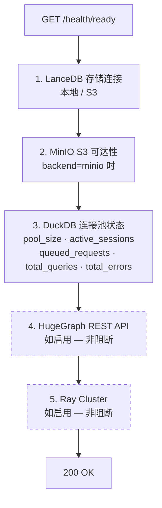

---

> 详细设计参见：[architecture-v1.3.0.md](architecture-v1.3.0.md) | [architecture-v1.0_draft_up.md](architecture-v1.0_draft_up.md)
>
> **v1.3.4 变更摘要**：Metaflow 工作流编排层升级 — 新增 4 个高级特性 Flow (IngestFlow / EmbedFlow / KGFlow / BatchRAGFlow)，使用 @foreach 并行、@branch 分支、@retry 容错、@catch 死信、@timeout 超时、@resources 资源声明。新增 RunTracker (Client API 封装)。原有 3 个线性 Flow 保留。总计 7 Flows + 10 基础设施模块，285 测试覆盖。
>
> **v1.3.4 补充变更**：
> - **DuckDB 查询缓存**: OLAP 层新增 LRU 查询缓存 (`query/_cache.py`)，支持 TTL + max_entries，命中时跳过 SQL 编译与执行
> - **HTTP 安全工厂**: `core/http.py` 统一 httpx 客户端创建，默认 `trust_env=False`，防止容器内代理泄漏；全部 8 处客户端迁移到工厂
> - **代理泄漏修复**: `docker-compose.prod.yml` 显式清空 HTTP_PROXY，阻断宿主机代理泄漏到容器；Embedding router 使用配置模型名
> - **可观测性补全**: Loki + Promtail 日志聚合、Prometheus 告警规则 (`arrow_lake.yml`)、Grafana 多数据源 (Prometheus + Loki)
> - **生产反向代理**: nginx TLS 终端 + 安全头 (CSP/HSTS/X-Frame) + 速率限制
> - **数据备份**: MinIO 定时备份脚本 (`backup-minio.sh`) + 保留策略 + CronJob 集成
>
> 详细设计参见：[architecture-v1.3.0.md](architecture-v1.3.0.md) | [architecture-v1.0_draft_up.md](architecture-v1.0_draft_up.md) | [metaflow-optimization-plan.md](../metaflow-optimization-plan.md)
>
> **v1.4.0 变更摘要**：
> - **DuckDB Profiling**: `enable_profiling` 配置，`explain_analyze()` 输出每算子耗时/行数/内存峰值
> - **DuckDB Relational API**: `metadata.py` 新增 `_relational_query()` 类型安全查询（schema discovery）
> - **大文件拆分**: `ingestor.py` 870→200行拆为 3 个 mixin；`client.py` 838→300行拆为 traversers + import/export
> - **DuckDB 水平扩展**: 多实例连接池路由 (round-robin) + Redis 信号量协调 + 实例注册/心跳
> - **GPU Autoscaling**: 冷却期 + 缩容保护 + 扩缩容事件持久化
> - **Schema 演进**: `SchemaCompatibilityChecker` 类型缩窄/列删除/向量维度检查
> - **Daft 原生媒体**: 批量图像 decode/resize/encode 迁移到 Daft Rust 实现，感知哈希迁移到 `daft.functions.image_hash()`
> - **血缘可视化 API**: `GET /lineage/graph/{name}` 完整血缘图 + `POST /lineage/impact` 影响分析 + `GET /lineage/stats` 统计
> - **质量规则引擎**: 声明式 `QualityRuleEngine`，支持 length/range/regex/duplicate 检查 + reject/flag/remove 动作，从 JSON/YAML/API 加载规则集
> - **行级/列级 ACL**: `DatasetACL` 数据类，`PUT/GET/DELETE /admin/acl/{dataset}` 管理端点，查询/搜索结果自动列裁剪+行过滤
> - **FTS 分页**: `offset` 参数全链路支持 (API → facade → FTS bridge → LanceDB `.offset()`)
> - **OLAP 流式**: `stream=True` 返回 SSE，每事件为 Arrow IPC batch (base64)，`StreamingResult` 支持批量大小配置
> - **3296+ tests passing, bandit 0 高危**
>
> **v1.4.1 变更摘要**：
> - **Gravitino 元数据联邦**: 新增元数据联邦层，集成 Apache Gravitino 实现跨数据源统一元数据管理、标签治理、策略执行、统计采集与 RBAC 桥接
> - **GravitinoBridge**: 核心桥接组件，封装 Gravitino REST API 交互，提供 Metalake/Catalog/Schema/Table/Fileset 完整 CRUD
> - **GravitinoTagService**: 标签治理 — 跨数据源统一标签管理，支持实体标签绑定/解绑/批量查询
> - **GravitinoPolicyService**: 策略引擎 — 数据掩码、行级过滤、数据保留策略的定义与执行
> - **GravitinoStatsCollector**: 统计采集 — 表/列级统计信息（行数、空值率、NDV、极值）定期采集并持久化
> - **GravitinoModelRegistry**: 模型注册 — ML 模型版本化注册、别名管理、元数据关联
> - **GravitinoRBACBridge**: RBAC 桥接 — 将 Arrow Lake 角色/权限映射到 Gravitino 权限体系，实现统一访问控制
> - **GravitinoSyncScheduler**: 定时同步 — 增量/全量元数据同步调度，支持冲突检测与合并策略
> - **优雅降级**: Gravitino 不可用时自动降级为本地元数据操作，保证核心功能不受影响
> - **数据流**: FastAPI Router (`api/routers/gravitino.py`) → GravitinoBridge (`catalog/gravitino_bridge.py`) → Gravitino REST API (:8090)
> - **存储**: Gravitino Server (gravitino-data volume) + Lance REST Catalog (:9101)
> - **8 个新增源文件**: gravitino_bridge.py, gravitino_client.py, gravitino_models.py, gravitino_stats.py, gravitino_sync.py, gravitino_policies.py, gravitino_tags.py, config/gravitino.py

---

## 十、元数据联邦层 (Metadata Federation Layer)

**位置**: 位于 API/Facade 层与存储/计算层之间，提供跨数据源的统一元数据管理。

```text
┌─────────────────────────────────────────────────────────────────┐
│                    元数据联邦层 (Gravitino Integration)            │
│                                                                 │
│  ┌─────────────────┐  ┌──────────────────┐  ┌────────────────┐  │
│  │ GravitinoBridge │  │ GravitinoTag     │  │ GravitinoPolicy│  │
│  │ (核心桥接)       │  │ Service (标签治理) │  │ Service (策略)  │  │
│  │ Metalake/Catalog│  │ 绑定/解绑/批量查询 │  │ 掩码/行过滤/    │  │
│  │ Schema/Table    │  │                  │  │ 保留策略        │  │
│  │ Fileset CRUD    │  │                  │  │                │  │
│  └────────┬────────┘  └────────┬─────────┘  └───────┬────────┘  │
│           │                    │                     │           │
│  ┌────────┴────────┐  ┌───────┴──────────┐  ┌──────┴─────────┐  │
│  │ GravitinoStats  │  │ GravitinoModel   │  │ GravitinoRBAC  │  │
│  │ Collector       │  │ Registry         │  │ Bridge         │  │
│  │ (统计采集)       │  │ (模型注册)        │  │ (RBAC 桥接)    │  │
│  │ 行数/空值/NDV   │  │ 版本化/别名/元数据│  │ 角色权限映射    │  │
│  └────────┬────────┘  └───────┬──────────┘  └──────┬─────────┘  │
│           │                    │                     │           │
│  ┌────────┴────────────────────┴─────────────────────┴────────┐  │
│  │              GravitinoSyncScheduler (定时同步)               │  │
│  │         增量/全量同步 · 冲突检测 · 合并策略                     │  │
│  └──────────────────────────┬─────────────────────────────────┘  │
│                              │                                   │
│  ┌──────────────────────────┴─────────────────────────────────┐  │
│  │              GravitinoClient (HTTP 客户端)                    │  │
│  │         连接池 · 重试 · 超时 · 认证 (OAuth/Simple)             │  │
│  └──────────────────────────────────────────────────────────────┘  │
│                                                                 │
│  ┌──────────────────────────────────────────────────────────────┐  │
│  │              优雅降级 (Graceful Degradation)                   │  │
│  │  Gravitino 不可用 → 自动降级为本地元数据操作                       │  │
│  │  核心功能不受影响，仅元数据联邦能力暂时不可用                         │  │
│  └──────────────────────────────────────────────────────────────┘  │
└─────────────────────────────────────────────────────────────────┘

数据流:
  FastAPI Router (gravitino.py) → GravitinoBridge → Gravitino REST API (:8090)
                                                    ↳ Lance REST Catalog (:9101)

存储:
  Gravitino Server → gravitino-data volume (元数据持久化)
  Lance REST Catalog → Lance 文件系统 (Catalog 元数据)

配置:
  arrow_lake/config/gravitino.py → GravitinoConfig (url, metalake, auth, sync_interval)
  deploy/docker-compose.yml → gravitino 服务定义
  deploy/scripts/init-gravitino.sh → 初始化 Metalake/Catalog/Schema
```

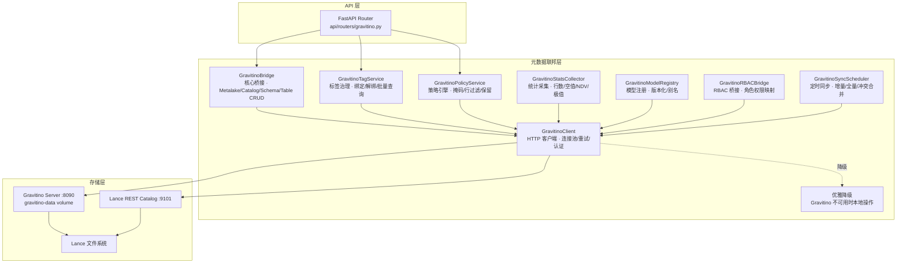

### 元数据联邦层组件职责

| 组件 | 文件 | 职责 |
| ---- | ---- | ---- |
| **GravitinoBridge** | `catalog/gravitino_bridge.py` | 核心桥接：Metalake/Catalog/Schema/Table/Fileset 完整 CRUD，统一元数据操作入口 |
| **GravitinoClient** | `catalog/gravitino_client.py` | HTTP 客户端：连接池管理、自动重试、超时控制、OAuth/Simple 认证 |
| **GravitinoModelRegistry** | `catalog/gravitino_models.py` | 模型注册：ML 模型版本化注册、别名管理、元数据关联 |
| **GravitinoStatsCollector** | `catalog/gravitino_stats.py` | 统计采集：表/列级统计信息（行数、空值率、NDV、极值）定期采集 |
| **GravitinoSyncScheduler** | `catalog/gravitino_sync.py` | 定时同步：增量/全量元数据同步调度，冲突检测与合并策略 |
| **GravitinoTagService** | `quality/gravitino_tags.py` | 标签治理：跨数据源统一标签管理，实体标签绑定/解绑/批量查询 |
| **GravitinoPolicyService** | `quality/gravitino_policies.py` | 策略引擎：数据掩码、行级过滤、数据保留策略的定义与执行 |
| **GravitinoRBACBridge** | `api/routers/gravitino.py` + `api/rbac.py` | RBAC 桥接：Arrow Lake 角色/权限映射到 Gravitino 权限体系 |
| **GravitinoConfig** | `config/gravitino.py` | 配置管理：Gravitino 连接参数、认证方式、同步间隔等 |

### 降级策略

```text
正常模式:
  API Request → GravitinoBridge → Gravitino REST API → 返回元数据

降级模式 (Gravitino 不可用):
  API Request → GravitinoBridge → 检测连接失败
    → 记录警告日志
    → 返回本地缓存元数据 (如有)
    → 或返回降级响应 (功能受限提示)

恢复:
  GravitinoSyncScheduler 定期探测 Gravitino 可用性
  → 恢复后自动触发增量同步，补齐降级期间的元数据变更
```

---

> 详细设计参见：[architecture-v1.3.0.md](architecture-v1.3.0.md) | [architecture-v1.0_draft_up.md](architecture-v1.0_draft_up.md) | [v1.4-optimization-plan.md](../v1.4-optimization-plan.md)
>
> **v1.4.1 详细规划**：[v1.4.1-gravitino-integration-plan.md](../v1.4.1-gravitino-integration-plan.md)
