# Arrow Lake 总体架构图

**版本**: v1.3.4 | **日期**: 2026-05-18
**来源**: [architecture-v1.3.0.md](architecture-v1.3.0.md) + [architecture-v1.0_draft_up.md](architecture-v1.0_draft_up.md)

---

## 一、系统分层架构

```text
                              +---------------------------+
                              |     客户端 / 前端应用       |
                              +-------------+-------------+
                                            |
                              +-------------v-------------+
                              |   API Gateway / Ingress   |
                              +-------------+-------------+
                                            |
                   +------------------------+------------------------+
                   |                        |                        |
        +----------v----------+  +----------v----------+  +----------v----------+
        | Arrow Lake REST API |  |  Python SDK (Lake)  |  |  CLI (Click)        |
        | FastAPI · 15 routers|  |  Facade · 8 Mixins  |  |  15 command groups  |
        +----------+----------+  +----------+----------+  +---------------------+
                   |                        |
          +--------+--------+       +-------+-------+
          | Middleware Chain|       | RAG Engine    |
          | Auth·RateLimit  |       | Retrieve+Gen  |
          | Security·OTel   |       +---+-----+-----+
          +--------+--------+           |     |
                   |                +---v--+  +--v-----------+
          +--------v---+--------+   |DuckDB|  | LLM Provider  |
          | LanceDB SDK| DuckDB  |   |SQL   |  | OpenAI/vLLM   |
          | (数据管理层)|(OLAP    |   |引擎  |  | Ollama        |
          | 写入/索引   | 分析层) |   |      |  +---------------+
          | Schema演化  |         |   |      |
          | 版本管理    |         |   |      |
          +--------+----+--+--+--+---+------++
                   |     |  |  |           |
                   |     |  |  +-----------+-----+
                   |     |  |                    |
                   |     |  +----------+   +-----v----------+
                   |     |             |   | Daft Query     |
                   |     |             |   | Engine         |
                   |     |             |   | (DataFrame     |
                   |     |             |   |  惰性操作链)    |
                   |     |             |   | sort/filter/   |
                   |     |             |   | groupby/sql/   |
                   |     |             |   | pivot/explode  |
                   |     |             |   +-----+----------+
          +--------v-----v--v--v--------+      |
          |      Lance 数据格式层        |<-----+
          |  列式+向量+FTS+版本管理       |
          +----+-------------------------+
               |
               +──────────┬──────────────────┬─────────────────+
               |          |                  |                 |
     +---------v---+ +----v-----------+ +----v----------+ +----v----------+
     | Lance Files | | MinIO / S3     | | Redis         | | HugeGraph     |
     | (列式存储)   | | (Blob Storage) | | Session·JWT   | | (图数据库)     |
     +-------------+ +----------------+ | Semaphore     | | (外部部署)     |
                                       +---------------+ +---------------+

          +------------------------------------------------------------+
          |                       部署层                                |
          |  Docker Compose (6 profiles)  |  Helm + Kubernetes          |
          |  api · minio · redis          |  HPA · PDB · Ingress        |
          |  ray-head · ray-worker        |  Secret · CronJob Backup    |
          |  jupyter · turbo-ocr          |  NetworkPolicy              |
          +------------------------------------------------------------+
```

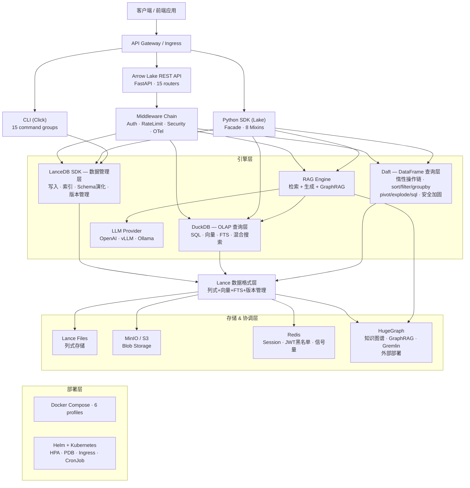

### 分层说明

| 层级 | 组件 | 职责 |
| ------ | ------ | ------ |
| **客户端层** | CLI / REST API / SDK / Jupyter | 用户交互入口 |
| **网关层** | FastAPI + Middleware Chain | HTTP 接口、认证、限流、安全头、可观测 |
| **SDK 层** | Lake facade (8 Mixins) | 统一编程接口，懒初始化组件 |
| **管理层** | LanceDB SDK | 数据写入 / 索引创建 / Schema 演化 / 版本管理 |
| **OLAP 查询层** | DuckDB + Lance 扩展 | SQL OLAP / 向量搜索 / FTS / 混合搜索 / Session Pool |
| **DataFrame 查询层** | Daft + DaftQueryEngine | 惰性 DataFrame 操作链 / SQL 子查询 / 安全加固 / 行数限制 |
| **衍生层** | DuckDB + DuckLake 扩展 | ETL 物化 / 可写工作区 / DML |
| **格式层** | Lance | 列式存储 + 向量索引 + 全文索引 + 版本管理 |
| **存储层** | MinIO (S3) / 本地 FS | Lance 格式持久化 + 媒体二进制 |
| **协调层** | Redis | 分布式信号量 / JWT 黑名单 / Session 协调 |
| **图数据库** | HugeGraph (外部) | 知识图谱 / GraphRAG / Gremlin 遍历 |
| **外部层** | LLM / Ray / OTel | 生成 / 分布式计算 / 可观测 |

---

## 二、LanceDB SDK / DuckDB / Daft 三方分工

**核心原则：LanceDB SDK 负责数据管理（写），DuckDB 负责 SQL 查询分析（读），Daft 负责 DataFrame 编程式查询（读）。三者互补，各司其职。**

```text
LanceDB SDK (数据管理层)
├── 写入 (table.add) → Lance 文件
├── 索引 (create_index / create_fts_index) → Lance 索引
├── Schema 演化 (add/drop/alter columns) → Lance 文件
└── 版本管理 (list_versions / tags) → Lance 元数据

DuckDB (SQL 查询分析层)
├── lance 扩展 → Lance (只读 SSOT: 原始数据、向量、FTS)
├── ducklake 扩展 → DuckLake (可写衍生: ETL、物化、工作区)
└── 原生 SQL → JOIN 跨存储查询

Daft (DataFrame 查询层)
├── DaftQueryEngine → Lance 数据集加载 (S3/本地)
├── LazyDaftFrame → 惰性操作链 (sort/filter/groupby/join/sql/pivot/explode/sample)
├── 安全加固 → 标识符验证 + SQL 黑名单 + collect 行数限制 + 错误脱敏
└── REST API → POST /api/v1/datasets/{name}/query/daft (链式 pipeline)
```

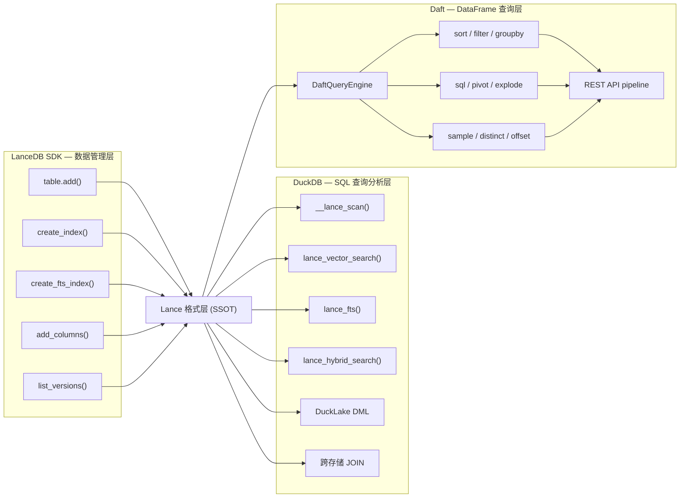

### 职责矩阵

| 操作类别 | DuckDB lance 扩展 | LanceDB SDK | Daft | 说明 |
| ------- | :---: | :---: | :---: | ------- |
| 创建向量索引 (IVF-PQ) | - | ✓ | - | `table.create_index()` |
| 创建 FTS 索引 (BM25) | - | ✓ | - | `table.create_fts_index()` |
| 向量搜索 (使用索引) | ✓ | ✓ | - | DuckDB `lance_vector_search()` |
| 全文搜索 (使用索引) | ✓ | ✓ | - | DuckDB `lance_fts()` |
| 混合搜索 (RRF 融合) | ✓ | ✓ | - | DuckDB 原生 `lance_hybrid_search()` |
| OLAP SQL (聚合/JOIN/窗口) | ✓ | - | - | DuckDB 强项 |
| 数据写入 (add/optimize) | - | ✓ | - | `table.add()`, `table.optimize()` |
| Schema 演化 | - | ✓ | - | `table.add_columns()` 等 |
| 版本管理 (list/tags) | - | ✓ | - | `table.list_versions()` 等 |
| 跨存储 JOIN (Lance+DuckLake) | ✓ | - | - | DuckDB 独有能力 |
| DataFrame 编程式查询 | - | - | ✓ | 惰性操作链: sort/filter/groupby/pivot |
| SQL 子查询 (CTE/窗口函数) | - | - | ✓ | `frame.sql()` — DuckDB 不擅长的复杂子查询 |
| Ingest 文件读取 (CSV/Parquet/JSON) | - | - | ✓ | Daft 多格式读取 |
| 多模态数据处理 | - | - | ✓ | 图像/音频/视频 + embed/classify/prompt |
| 安全标识符验证 | - | - | ✓ | 全方法 `_SAFE_IDENTIFIER_RE` 校验 |

### 调用关系

```text
Ingest 流程:
  数据 → LanceDB SDK (table.add + table.create_index) → Lance 文件
  文件读取 → Daft (read_csv/read_parquet/read_json) → 数据预处理 → LanceDB SDK

SQL Query 流程:
  REST API → DuckDB SQL (lance_vector_search / lance_fts / __lance_scan) → Lance 文件

DataFrame Query 流程:
  REST API → DaftQueryEngine.load() → LazyDaftFrame (链式操作) → collect() → Arrow Table
  SDK → lake.daft_query() → sort/filter/groupby/sql/pivot → collect()

管理流程:
  Admin API → LanceDB SDK (schema_evolution / version_management / optimize) → Lance 文件
```

---

## 三、数据流总体关系

```text
[原始数据] --ingest--> [LanceDB SDK] --create_index--> [Lance 格式层 (元数据+向量+索引)]
       |                      |  (数据管理层)                  |
       |                      | 写入/Schema演化/版本            |
       |                      +-------------------------------+
       |                      |
       |              +-------v-------+
       |              | MinIO / S3    | ← Lance 持久化后端 (storage_options)
       |              | (生产)         |
       |              +-------+-------+
       |                      |
       |              +-------v-------+
       |              | 本地 FS       | ← Lance 持久化后端 (开发)
       |              +---------------+
       |
       +---> [HugeGraph] ← KG Construction
       |
       +---> [MinIO 原始媒体] ← 二进制文件 (非 Lance)
                      |
                      +------------+------------+------------+
                                   |            |            |
                          [DuckDB SQL 查询层]  [Daft DataFrame 查询层]
                          ┌──────────────────────┐
                          │ lance 扩展:          │
                          │ · __lance_scan       │ → OLAP SQL
                          │ · lance_vector_search│ → 向量搜索
                          │ · lance_fts          │ → 全文搜索
                          │ · lance_hybrid_search│ → 混合搜索
                          ├──────────────────────┤
                          │ ducklake 扩展:       │
                          │ · ETL 物化           │ → 衍生数据
                          │ · DML (读写)         │ → 工作区
                          │ · 快照时间旅行         │ → 版本管理
                          └──────────┬───────────┘
                          ┌──────────────────────┐
                          │ Daft DataFrame 引擎: │
                          │ · sort/filter/groupby│ → 编程式查询
                          │ · sql/pivot/explode  │ → 复杂变换
                          │ · sample/distinct    │ → 采样去重
                          │ · 安全加固 + 行数限制  │ → 防注入/DoS
                          └──────────┬───────────┘
                                     |
                 +───────────────────+───────────────────+
                 |                   |                   |
         [REST API 直查]     [RAG Engine 检索]    [Graph Traversal]
         OLAP/Faceted        |                    [HugeGraph]
         向量/FTS/混合        │                        |
         Daft DataFrame       │                        |
                            +──┬─────────────+─────────┘
                               │             │
                    +──────────▼───┐  +───────▼──────┐
                    │ 上下文组装    │  │  图三元组      │
                    │ token预算/去重 │  │  子图序列化    │
                    +──────┬───────┘  +───────┬──────┘
                           +────────┬────────┘
                                    │
                           [LLM Provider]
                           OpenAI/Anthropic/vLLM/Ollama
                                    │
                           [Cited Response]
```

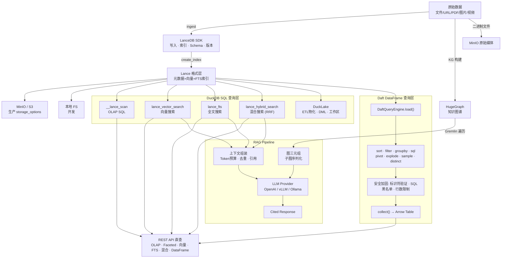

---

## 四、计算框架层 (DARMU 栈)

| 首字母 | 框架 | 职责 | 部署位置 |
| -------- | ------ | ------ | --------- |
| **Da** | Daft | DataFrame 查询引擎: 惰性操作链 + 编程式 ETL + Lance 查询 + 安全加固 | 嵌入 API 进程 |
| **R** | Ray | 分布式计算，CatalogActor + GPU 调度 + 并行 map | Ray Cluster (独立) |
| **M** | Metaflow | 工作流编排，质量管道 + 端到端 Flow + 调度 | 嵌入 API 进程 |
| **U** | DuckDB | OLAP SQL + Lance/DuckLake 扩展 + Session Pool | 嵌入 API 进程 |

### 三框架协作关系

```text
┌──────────────────────────────────────────────────────────┐
│                    Metaflow 工作流                        │
│  (编排层: 步骤顺序、重试、调度、审计)                       │
│                                                          │
│  ┌─────────┐   ┌──────────┐   ┌──────────┐              │
│  │  Ingest │ → │  Quality │ → │  Embed   │   ...       │
│  │  Step   │   │  Step    │   │  Step    │              │
│  └────┬────┘   └────┬─────┘   └────┬─────┘              │
│       │              │              │                     │
│       ▼              ▼              ▼                     │
│  ┌─────────────────────────────────────────────┐         │
│  │            Lake Facade API                   │         │
│  └────────┬──────────┬───────────┬─────────────┘         │
│           │          │           │                          │
│           ▼          ▼           ▼                          │
│     ┌──────────┐ ┌────────┐ ┌──────────┐                  │
│     │   Daft   │ │ DuckDB │ │   Ray    │                  │
│     │ 文件读取  │ │ SQL OLAP│ │ 分布式    │                  │
│     │ ETL 转换  │ │ 向量/FTS│ │ Catalog  │                  │
│     │ 惰性求值  │ │ 混合搜索│ │ GPU 推理  │                  │
│     └──────────┘ └────────┘ └──────────┘                  │
│                                                         │
│  基础设施: Ray Cluster + Redis 协调                       │
└──────────────────────────────────────────────────────────┘
```

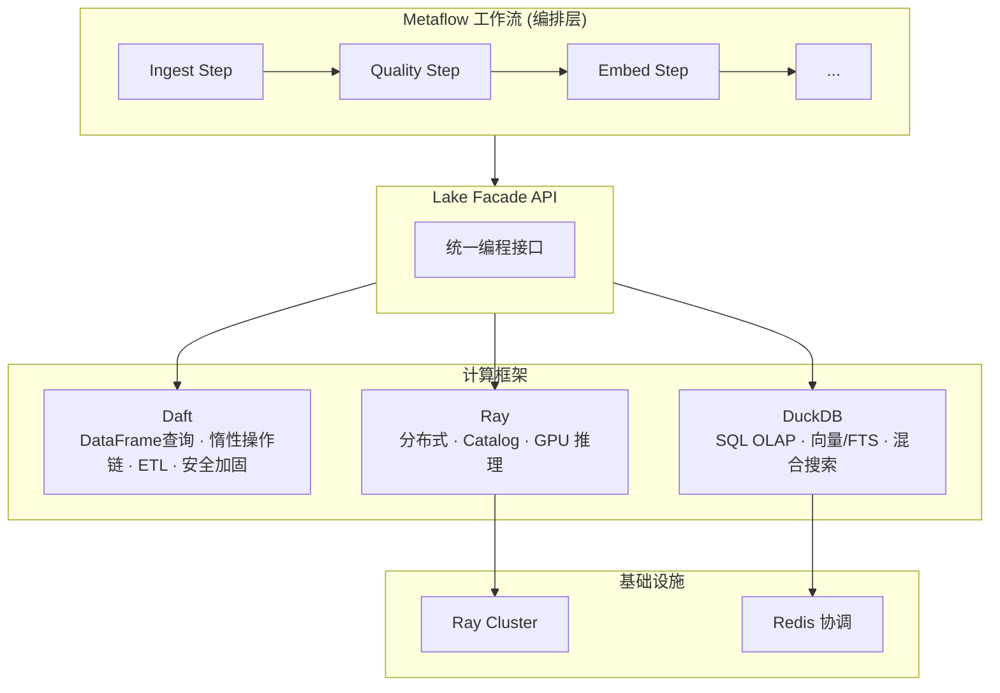

---

## 五、中间件链

API 请求经过 10 层中间件处理（按执行顺序）：

```text
HTTP Request
    │
    ├── 1. CORS Middleware          # 跨域资源共享
    ├── 2. Exception Handlers       # 全局错误处理
    ├── 3. GZip Middleware          # 响应压缩 (≥1000 bytes)
    ├── 4. Metrics Middleware       # Prometheus HTTP 请求耗时
    ├── 5. Request Size Limit       # max_request_size_bytes 限制
    ├── 6. Security Headers         # CSP/HSTS/X-Frame/X-Content-Type
    ├── 7. Rate Limiting            # Token Bucket 限流 (可选)
    ├── 8. API Key Auth             # X-API-Key 验证 (可选)
    ├── 9. Correlation ID           # X-Request-ID 请求追踪
    ├── 10. JWT Authentication      # Bearer Token 验证 (可选)
    │
    ▼
Router Handler → Lake API → Query Engine / Storage
```

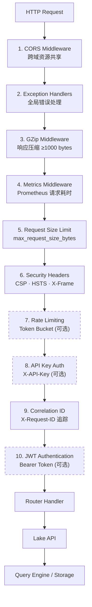

---

## 六、数据流详细设计

### 6A. 摄入流程

```text
[原始文件/URL/PDF/图片/视频]
    │
    v
+--- Ingestor.ingest_mixed() --------------------------------+
|                                                             |
| 1. 文件分类                                                 |
|    ├─ 文本 → text_content                                   |
|    ├─ 图片 → ImageProcessor (缩略图 + EXIF)                  |
|    ├─ 视频 → VideoProcessor (关键帧提取)                     |
|    └─ PDF  → Kreuzberg 解析 / TurboOCR (GPU)                 |
|                                                             |
| 2. 分块 (7 策略)                                            |
|    ├─ recursive / semantic / sentence / fixed_size           |
|    ├─ markdown_heading / html_section / None                 |
|    └─ QualityFilterRegistry 自动过滤                         |
|                                                             |
| 3. 写入 Lance (LanceDB SDK)                                 |
|    └─ metadata + vectors + text_content                     |
|                                                             |
| 4. 媒体上传 MinIO (大文件)                                   |
|    ├─ original → MinIO                                      |
|    └─ S3 URI → Lance 引用列                                  |
|                                                             |
| 5. 审计记录 → AuditTrail.record()                            |
| 6. 血缘记录 → LineageStore.record_event()                   |
+-------------------------------------------------------------+
```

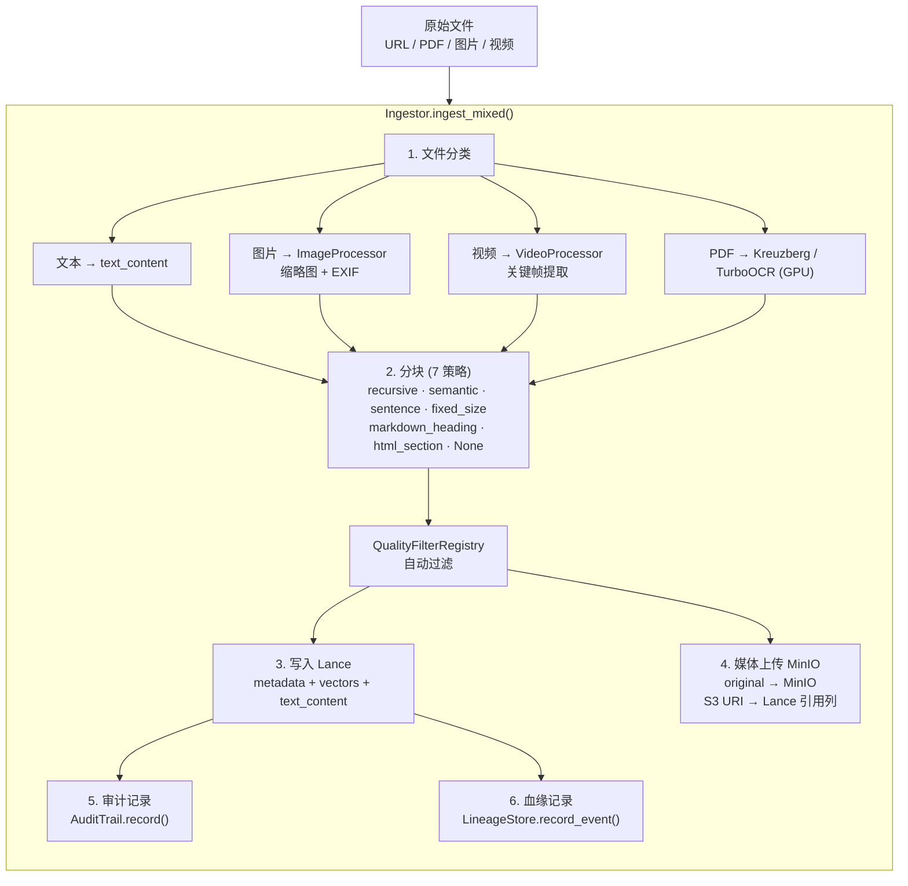

### 6B. 查询流程 (Redis 信号量协调)

```text
[SQL / 搜索请求]
    │
    v
+--- API Router ---------------------------------------------------+
|                                                                  |
| 1. JWT/Auth 验证 + RBAC 权限检查                                  |
|                                                                  |
| 2. lake.get_session_manager().acquire()                          |
|    ├─ Redis 信号量 acquire (INCR + cap, Lua 原子)                |
|    └─ 或 threading.Semaphore (Redis 不可用时)                     |
|                                                                  |
| 3. 从空闲池获取 DuckDB 连接                                       |
|    ├─ 验证连接健康 (SELECT 1)                                     |
|    └─ 不健康则丢弃，新建连接                                       |
|                                                                  |
| 4. 执行查询                                                      |
|    ├─ Lance 数据: __lance_scan() / lance_vector_search()         |
|    ├─ DuckLake: ATTACH TYPE ducklake + DML                       |
|    └─ 资源治理: memory_limit + statement_timeout                  |
|                                                                  |
| 5. 释放连接                                                      |
|    ├─ 归还空闲池 (标注归还时间)                                    |
|    ├─ Redis 信号量 release (DECR, Lua 原子)                      |
|    └─ Prometheus 指标记录                                         |
+------------------------------------------------------------------+
```

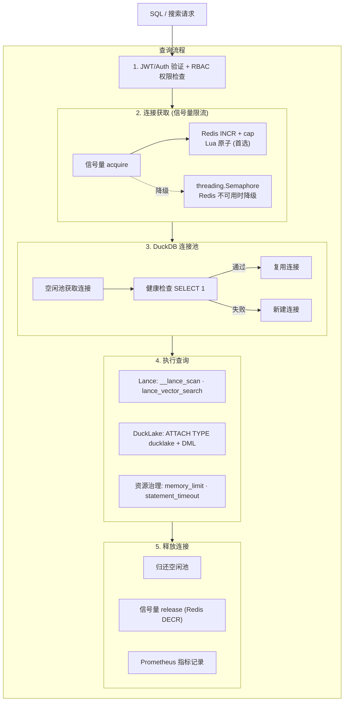

### 6C. RAG 查询流程

```text
[用户问题]
    │
    v
+--- RAGPipeline.query() -------------------------------------+
|                                                             |
| 1. 并行检索                                                 |
|    ├─ lance_vector_search()  → DuckDB → Lance 向量索引       |
|    ├─ lance_fts()             → DuckDB → Lance FTS 索引      |
|    ├─ lance_hybrid_search()   → DuckDB → Lance RRF 融合      |
|    └─ HugeGraph 遍历         → Gremlin API → 子图三元组       |
|                                                             |
| 2. 上下文组装                                               |
|    ├─ Token 预算管理 (ContextWindow)                         |
|    ├─ 结果去重 + 引用追踪 (ContextCitation)                   |
|    └─ 图三元组合并 (GraphRAG)                                |
|                                                             |
| 3. Prompt 渲染 (Jinja2 模板 + PromptRegistry)               |
|                                                             |
| 4. LLM 生成 (via Provider)                                  |
|    ├─ 同步: generate() → RAGResponse                        |
|    └─ 流式: generate_stream() → AsyncIterator[str]           |
|                                                             |
| 5. 引用标注 + 返回                                           |
+-------------------------------------------------------------+
```

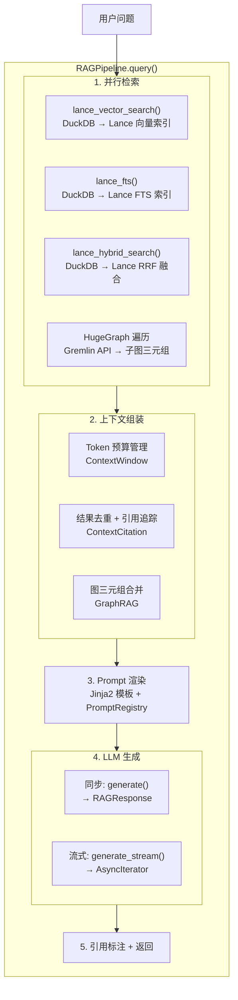

### 6D. DuckLake ETL 物化流程

```text
[Lance 只读 SSOT]
    │
    v
+--- DuckDB SQL ---+
|                   |
| 1. CREATE VIEW    |
|    __lance_scan   |
|                   |
| 2. OLAP 聚合      |
|    GROUP BY / CUBE|
|                   |
| 3. CREATE TABLE   |
|    workspace.*    |
|    (物化到 DuckLake)|
|                   |
| 4. DML 操作       |
|    INSERT/UPDATE  |
|                   |
| 5. 快照标记       |
|    expires_at     |
+-------------------+
```

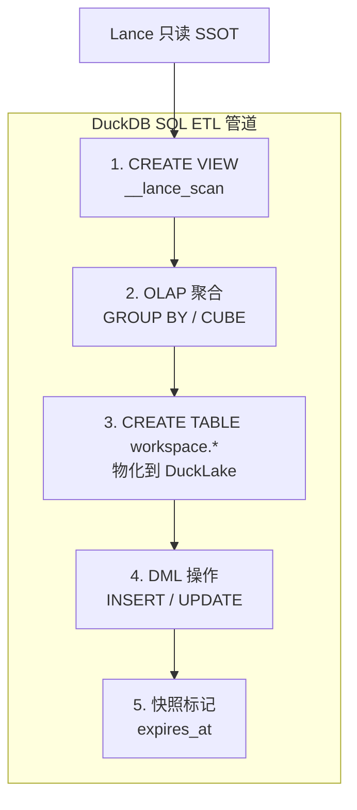

### 6E. Daft DataFrame 查询流程 (安全加固)

```text
[POST /api/v1/datasets/{name}/query/daft]
    │
    v
+--- DaftQueryEngine.load() ----------------------------------+
|                                                             |
| 1. 数据集名验证 (_SAFE_IDENTIFIER_RE)                       |
|    └─ 拒绝: 空/路径穿越/特殊字符                              |
|                                                             |
| 2. Lance 数据集加载                                          |
|    ├─ daft.read_lance(lance_path, io_config)                |
|    ├─ FileNotFoundError → 脱敏错误消息                       |
|    └─ RuntimeError → 脱敏错误 + 内部日志                     |
+-------------------------------------------------------------+
    │
    v
+--- 链式操作 Pipeline (惰性求值) -----------------------------+
|                                                             |
| sort(column, desc)    → 列名验证                            |
|     ↓                                                       |
| filter(predicate)     → Daft Expression                     |
|     ↓                                                       |
| groupby(cols).agg()   → 列名验证 + 7种聚合函数               |
|     ↓                                                       |
| sql(query)            → 空查询拒绝 + 长度上限(10K)           |
|                        + DDL/DML 关键词黑名单                 |
|     ↓                                                       |
| pivot/explode/sample  → 参数验证 + 聚合白名单                |
|     ↓                                                       |
| distinct/offset/limit → 边界检查                             |
|     ↓                                                       |
| select(columns)       → 列名验证                            |
+-------------------------------------------------------------+
    │
    v
+--- collect() → Arrow Table ---------------------------------+
|                                                             |
| 1. max_rows 安全上限 (默认 100K)                            |
|    ├─ 超限 → 截断 + warning 日志                            |
|    └─ max_rows=0 → 禁用限制                                 |
|                                                             |
| 2. 返回 pyarrow.Table                                      |
|    └─ → arrow_table_to_response() → JSON / Arrow IPC        |
+-------------------------------------------------------------+
```

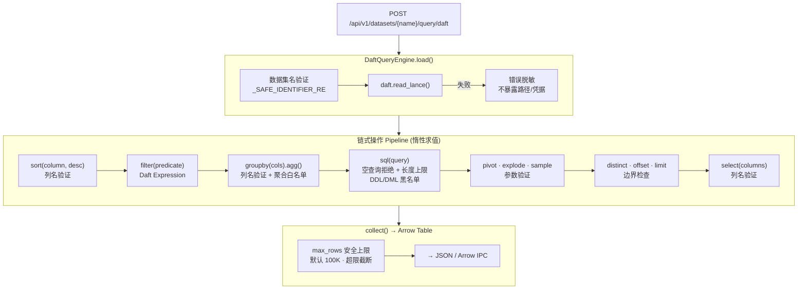

### 7A. Docker Compose Profile 矩阵

| Profile | 服务 | 用途 |
| --------- | ------ | ------ |
| `core` | api, minio, minio-init, redis | 最小生产 |
| `dev` | core + ray-head, ray-worker, jupyter + 源码挂载 | 开发 |
| `compute` | ray-head, ray-worker | 计算扩展 |
| `gpu` | core + compute + GPU 资源 | GPU 加速 |
| `monitoring` | core + compute + prometheus | 可观测 |
| `ocr` | turbo-ocr (GPU) | OCR 处理 |

### 7B. 网络拓扑

```text
arrow-lake-net (172.30.0.0/16)
├── api
├── minio
├── redis
├── ray-head
├── ray-worker
├── jupyter (dev only)
└── turbo-ocr (ocr only)

hg-net (external)
├── api (connected)
└── hg-server (外部 HugeGraph 实例)
```

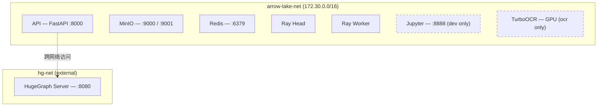

### 7C. 服务资源限制

| 服务 | 内存限制 | CPU 限制 | PIDs | 健康检查 |
| ------ | --------- | --------- | ------ | --------- |
| API | 2G | 1.0 | 256 | /health (30s) |
| MinIO | 1G | 0.5 | 512 | mc ready (10s) |
| Redis | 512M | 0.5 | 256 | redis-cli ping (10s) |
| Ray Head | 4G | 2.0 | 1024 | ray status (15s) |
| Ray Worker | 4G | 2.0 | 1024 | disabled |
| Jupyter | 2G | 1.0 | 256 | /lab (15s) |
| TurboOCR | 2G + GPU | 1.0 | 64 | /health (30s) |

---

## 八、核心组件职责矩阵

| 组件 | 职责 | 读写 | v1.3.0 状态 |
| ------ | ------ | ------ | ------------ |
| **Lance** | 统一数据格式 | SSOT | 生产使用，7 种分块策略 |
| **LanceDB SDK** | 数据管理层 | 写入+管理 | 完整 CRUD + 版本 + 索引 |
| **DuckDB** | 查询分析层 | 查询为主 | Session Pool + 资源治理 + lance/ducklake 扩展 |
| **Daft** | DataFrame 查询层 | 查询+ETL | 惰性操作链 + DaftQueryEngine + 安全加固 + 89 测试覆盖 |
| **DuckLake** | 可写衍生层 | 完整 DML | DuckDB 扩展加载，ETL 物化 |
| **MinIO** | S3 存储后端 | 读写 | 生产集成，storage_options 接通 |
| **Redis** | 分布式协调 | 读写 | 信号量 + JWT 黑名单 |
| **HugeGraph** | 知识图谱 | 读写 | 外部部署，Gremlin 安全加固 |
| **RAG Engine** | 检索增强生成 | 读写 | 完整 Pipeline + GraphRAG + 流式 |
| **FastAPI** | HTTP 接口 | — | 15 routers，RBAC 三角色，安全头 |
| **Ray** | 分布式计算 | — | Ray Cluster + GPU Autoscaler |
| **Prometheus + OTel** | 可观测性 | — | 完整 traces + metrics + 健康检查 |

---

## 九、健康检查依赖链

```text
GET /health/ready 检查顺序:
  1. LanceDB 存储连接 (本地/S3)
  2. MinIO S3 可达性 (如 backend=minio)
  3. DuckDB 连接池状态
     ├─ pool_size
     ├─ active_sessions
     ├─ queued_requests
     ├─ total_queries
     └─ total_errors
  4. HugeGraph REST API (如启用, 非阻断)
  5. Ray Cluster (如启用, 非阻断)
```

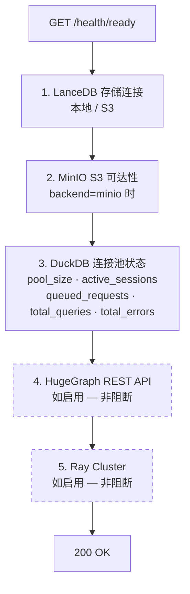

---

> 详细设计参见：[architecture-v1.3.0.md](architecture-v1.3.0.md) | [architecture-v1.0_draft_up.md](architecture-v1.0_draft_up.md)
>
> **v1.3.4 变更摘要**：Daft 从 Ingest 辅助角色升级为 DataFrame 查询引擎层，新增 DaftQueryEngine / LazyDaftFrame / REST API pipeline，含安全加固（标识符验证 + SQL 黑名单 + collect 行数限制 + 错误脱敏），89 测试覆盖。
