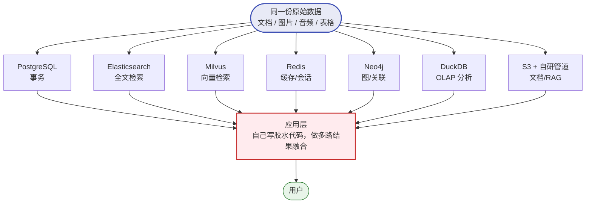
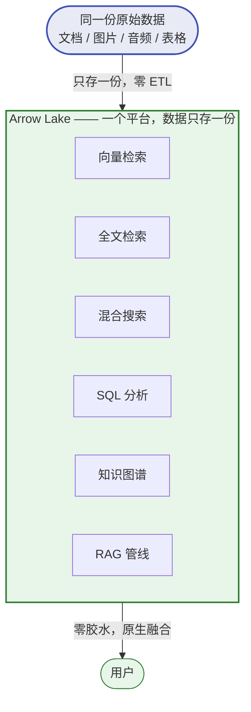
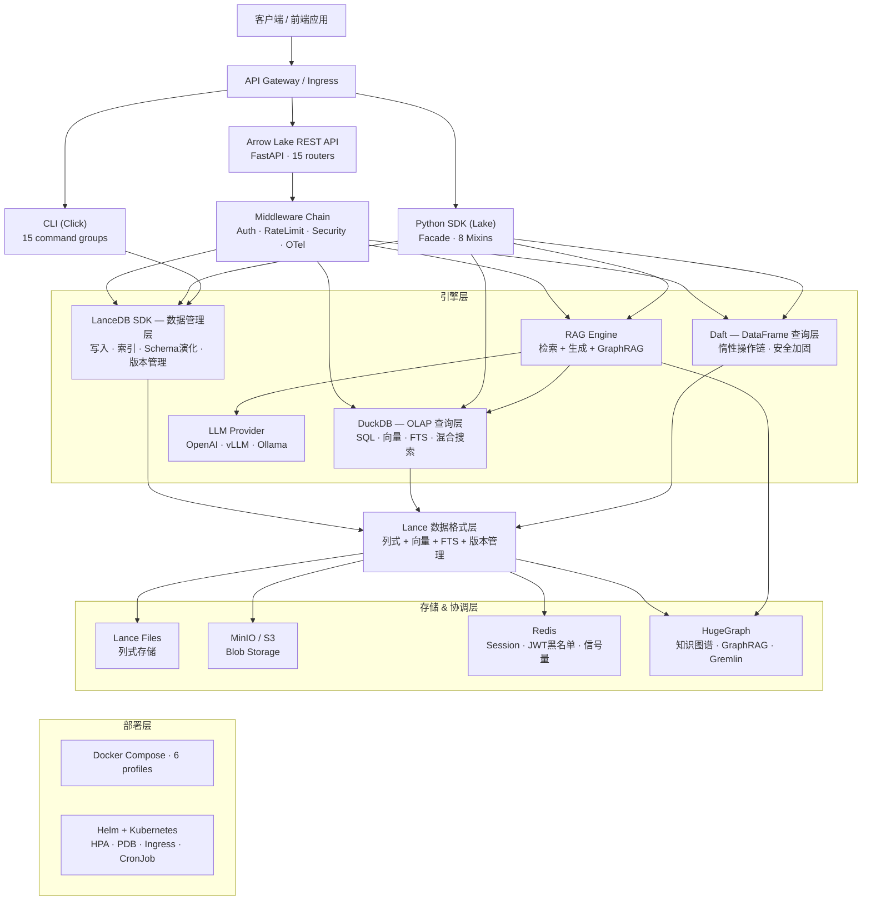
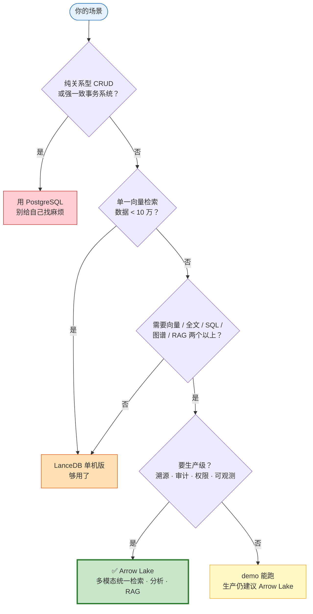

# 一个数据团队，不该维护七个数据库

> Arrow Lake — 生产级多模态数据湖仓。文本、图像、音频、向量、知识图谱，一套系统全收。

---

## 先说业务：你的数据，早就不是表格了

十年前，"数据"就是表格——行、列、SQL，PostgreSQL 加个 Redis 撑起一切。但 LLM 和多模态 AI 这三年，把"数据"的含义彻底改写了。

今天一个现代应用（电商、内容平台、企业知识库都一样），用户一天里产生的诉求是这样的：

- "下单、改地址、查物流" → 事务与关系数据
- "搜一下'无线降噪耳机'" → 关键词搜索
- "给我推荐类似的""以图搜图" → 语义 / 向量检索
- 页面要秒开、登录态要记住 → 缓存与会话
- "这个商品关联了哪些类目、谁也买过" → 关联关系 / 图
- "上个月各品类销量趋势" → 数据分析与报表
- "上传一份 PDF，让它能问答" → 非结构化文档 + RAG

七个诉求，每一个都合理，每一个都是今天的标配。问题不在诉求，而在它们背后的**数据形态天差地别**：表格、文本、向量、键值、图、列存、文档——没有一种数据库能把它们同时做好。

## 每个诉求，催生一个系统

于是，对每一个诉求，业界都给出了经过千锤百炼的最佳工具：

| 业务诉求 | 数据形态 | 最佳工具 | 解决的问题 |
| --- | --- | --- | --- |
| 下单 / 查订单 | 结构化表格 | PostgreSQL | ACID 事务、关系完整性 |
| 关键词搜索 | 倒排索引 | Elasticsearch | 全文检索、分词、相关性 |
| 语义搜索 / 以图搜图 | 高维向量 | Milvus / Pinecone | 近邻向量检索 (ANN) |
| 缓存 / 会话 / 限流 | 键值 | Redis | 亚毫秒读写 |
| 关联关系 / 推荐 | 节点 + 边 | Neo4j | 多跳图遍历 |
| 报表 / BI / 聚合 | 列式分析 | DuckDB / ClickHouse | 大规模 OLAP |
| 文档 / PDF / 图片 RAG | 非结构化 | S3 + 自研管道 | 解析 → 分块 → 嵌入 |

**没有任何一个选型是错的。** 每一个都是该领域被反复验证的最佳工具。你不是拍脑袋乱选的——你是被真实的业务需求，一步一步推到这里的。

## 拼起来，就是你的技术架构

七个系统单独看都合理，拼在一起就长成了这样：



同一份原始数据，要被**复制、转换、搬运**到七个不同的存储里。应用层每次响应用户，可能要并发查询三四个系统，再自己写代码把结果拼起来——那个"以图搜图 + 全文检索 + 混合排序"，就是在 Milvus、ES、PostgreSQL 之间来回搬数据，再花三个月写 RRF 融合逻辑（而这套融合，Arrow Lake **内置了**，一行代码）。

## 这套架构：曾经合理，现在成了灾难

公平地说，它有它的好处——这也是为什么几乎所有团队最终都会走到这一步：

- **每个系统都是该领域最强工具**，单点性能最优
- **各自独立扩缩容**，一个挂了不连累另一个
- **选型成熟**，社区资料多、好招人

但代价，在数据量和 AI 需求上来之后，开始压垮团队：

- **数据搬家**：同一份用户数据，PG 一份、ES 一份、Milvus 一份……存储和算力翻几倍
- **数据漂移（最致命）**：供应商 A 在 PostgreSQL 里已停业（`closed`），向量库里还躺着它"正常供货"的旧嵌入——用户搜"能供货的供应商"，系统自信地返回了 A。这就是 **embedding drift（嵌入漂移）**：源数据在演进，向量索引却在原地，**静默、累积、难以察觉**，没有告警，结果只是悄悄地持续变错。行业里有个判断很尖锐——**向量数据库从抽象上就是错的**，它把嵌入当成独立数据，切断了对源的引用。
- **七套运维**：部署、监控、备份、升级、安全，每样来七遍，团队创新精力被运维吸干
- **人才门槛**：要养懂七个系统的工程师，任何一个离职就留下没人敢碰的代码
- **迭代慢**：加一个搜索功能要排几周期——等它上线，业务方早改主意了

这就是凌晨三点的告警、汇报时答不上来的搜索结果、"花三个月写胶水代码"的共同根源。

## 真正的反差

把上面那张碎片化的图，塌缩掉中间七层，就是 Arrow Lake：



注意看：那个红色的应用层，消失了。不是把七个系统换成"第八个系统"，而是**根本没有七个系统**——同一张 Lance 表，向量、全文、混合、SQL、图、RAG 全部就地完成。零 ETL，零胶水，零凌晨告警。

落到代码上，就这么简单：

```python
from arrow_lake import Lake
import pyarrow as pa

lake = Lake("./my_lake")

lake.create_dataset("docs", table)

# 向量 + 全文 + 混合，一个调用
lake.search_hybrid("docs", query="机器学习", top_k=10)

# 同一份数据，直接 SQL
lake.olap_query("docs", "SELECT category, COUNT(*) FROM docs GROUP BY category")
```

没有 Docker。没有配置文件。`pip install arrow-lake`，六十秒内拿到第一个结果。

这不是 demo 里的玩具。这是**同一套代码**，换一个 `base_uri` 指向 MinIO/S3，接上 Ray 分布式集群，挂上 HugeGraph 知识图谱和 Gravitino 元数据治理——就是生产部署。开发环境到生产环境，零代码改动。

## 剖开看：Arrow Lake 的技术架构

不是把几个开源组件 `pip install` 一下就敢叫"平台"。Arrow Lake 是一套分层工程，每一层都有明确职责、背后是经过验证的组件：



请求自上而下流动：客户端 → 网关（鉴权 / 限流 / 安全头 / 可观测）→ 三种入口（REST API / Python SDK / CLI）→ 引擎层（LanceDB 数据管理、DuckDB 查询、Daft DataFrame、RAG、LLM）→ **Lance 统一格式层** → 存储 & 协调层（Lance 文件、MinIO/S3、Redis、HugeGraph）；部署层（Compose / Helm）横跨底部。

盯住中间那个 **Lance 数据格式层**——它是「数据只存一份」的物理基础：列式 + 向量索引 + 全文索引 + 版本管理四合一，上面所有引擎读写同一份 Lance 文件，不复制、不 ETL。这就是为什么向量检索、全文搜索、SQL 分析能"就地完成"。

> 上图是项目官方总体架构图，完整版（含数据流、查询引擎选型、Metaflow 编排、元数据联邦等十余张细分图）见 `docs/design_plan/architecture-overview.md`。

这不是 PPT 上的方框。每一层都能在代码里指到具体的目录、具体的依赖版本。开发环境跑单机 Lance，生产环境挂 Ray + S3 + HugeGraph + Gravitino——同一套抽象，换后端实现，业务代码零改动。

## 证据，不是形容词

我们不说"企业级"。我们说**数字**：

| 指标 | Arrow Lake | 行业典型基线 |
| --- | --- | --- |
| 单元/集成/E2E 测试 | **5,325 通过** | 多数数据工具 < 500 |
| 代码覆盖率 | **90%+** | — |
| Bandit 安全扫描 | **0 个 HIGH** | 多数项目有遗留 |
| REST 端点 | **40+** | — |
| 配置维度 | **27 个独立段** | 通常硬编码或单一 YAML |
| 从安装到首个结果 | **< 60 秒** | 数据平台通常数天 |

```text
通过测试用例数（实测）
Arrow Lake    ████████████████████████████ → 5,325
Typical tool  ██ → < 500（不到 Arrow Lake 的 1/10）
```

5,325 个测试不是装饰。它意味着：当你往生产环境推一个 PR，CI 在告诉你哪些东西会断——而不是让你的用户在凌晨三点告诉你。

## 性能：真跑出来的数字

不是「理论上支持百万 QPS」的 PPT 口号。下面这些数字来自 `docs/impls/benchmarks.json`，50 次迭代实测，每一行都能复现：

| 操作 | 平均 | P99 | 吞吐 |
| --- | --- | --- | --- |
| OLAP 查询（10k 行 · 过滤+排序+LIMIT） | 0.97 ms | 1.24 ms | 1,033 ops/s |
| OLAP 聚合（10k 行 · GROUP BY） | 1.16 ms | 1.85 ms | 865 ops/s |
| 文档分块（20 页 · recursive 512） | 0.34 ms | 0.60 ms | 2,923 ops/s |
| SQL 注入防御校验 | 0.008 ms | 0.016 ms | 117,960 ops/s |
| Token 计数（启发式） | 0.001 ms | 0.002 ms | 792,611 ops/s |

亚毫秒级的 OLAP，意味着交互式「边查边出结果」的分析是现实的；20 页文档分块不到 1ms，意味着摄入管道不会成为瓶颈；SQL 注入防御每秒跑 11.8 万次——**安全检查的代价趋近于零**，这就是我们敢说「安全不是事后加的」的底气。

> 单机基准（5k–10k 行规模）。向量检索 / 混合搜索的延迟随索引规模变化，吞吐随 Ray 集群节点数扩展。完整原始数据见 `docs/impls/benchmarks.json`。

## 一个平台，六种能力，零数据搬家

| 能力 | 传统做法 | Arrow Lake |
| --- | --- | --- |
| **向量检索** | 独立向量库 (Milvus/Pinecone) | LanceDB 原生 IVF_PQ / IVF_HNSW_PQ |
| **全文检索** | Elasticsearch 集群 | Tantivy + jieba 中文分词，内嵌 |
| **混合搜索** | 自研 RRF 融合代码 | `search_hybrid()` 一行调用 |
| **SQL 分析** | 独立 OLAP 引擎 | DuckDB 流式聚合、窗口函数 |
| **知识图谱** | Neo4j + 自研同步 | HugeGraph + GraphRAG，数据同源 |
| **RAG 管线** | LangChain 拼装 | 端到端：分块→嵌入→检索→重排→流式 |

关键不是"我们也有这些功能"。关键是**数据只存一份**。同一个 Lance 表，同一个 Arrow 内存格式，向量化、全文索引、SQL 查询、知识图谱构建——全部就地完成。没有 ETL。没有数据漂移。没有"向量库和关系库不一致"的凌晨告警。

## RAG 不是调个 API

大多数"RAG 框架"的真相是：拼接 prompt + 调 OpenAI。Arrow Lake 的 RAG 是一条生产管线：

- **检索质量**：HyDE 查询改写、MultiQuery 扩展、CrossEncoder / LLM 重排序——召回之后还要 rerank
- **多轮对话**：会话历史注入 + Token 预算管理，不是把整个聊天记录塞进 context
- **流式输出**：SSE 原生支持，token 级返回，前端不等满
- **可观测**：每一步延迟有 OpenTelemetry span，Prometheus 暴露 P95，不是黑盒
- **溯源**：每条回答带 citation，指向具体的文档块和行号

调一个 `client.chat.completions.create()` 不是 RAG。那是个 demo。

## 安全不是事后加的

很多数据工具的安全模型是："先把功能做出来，再加个 API Key"。Arrow Lake 从第一行代码开始：

- **RBAC 三级**：VIEWER / EDITOR / ADMIN，作用在 40+ 个端点上
- **双模认证**：API Key + JWT (HS256/RS256)，Redis 黑名单 + TTL
- **注入防御**：Gremlin 注入、SQL 注入、路径穿越、FQN 注入——四个方向的参数化
- **审计链**：HMAC-SHA256 防篡改审计，任何操作可追溯且不可抵赖
- **传输安全**：TLS 终止 + CSP + HSTS + X-Frame-Options，nginx 层完整

Bandit 扫描 0 个 HIGH。这不是"我们重视安全"的口号，是 CI 的硬门槛。

## 部署形态：从笔记本到 K8s

```text
开发:  Lake("./data")                    # 本地文件，零依赖
测试:  arrow-lake demo                   # 15 秒合成数据演示
单机:  docker compose up                 # 11 服务，profile 激活
集群:  helm install arrow-lake           # HPA + PDB + NetworkPolicy + CronJob 备份
```

四种形态，同一套代码。Helm Chart 自带：CPU + 自定义指标 HPA、02:00 UTC 定时备份、Ingress、PodDisruptionBudget、NetworkPolicy（限制 pod 间通信，Redis 6379 / HugeGraph 8080 / HTTPS 443 / DNS 53）。

容器层面：`cap-drop ALL`、只读文件系统、资源限制、PID 约束。不是"也能跑在 K8s"，是"按 K8s 生产规范设计"。

## 元数据治理：不是选配

数据多了，第一个崩的不是存储，是**你不知道自己有什么数据**。

Arrow Lake 集成 Apache Gravitino 1.2.1：

- **联邦元数据**：DuckDB ↔ Lance Catalog 双向同步，跨源查询
- **Tag / Policy**：列级标签，数据分类治理
- **Model Catalog**：模型版本化纳入元数据管理
- **血缘**：摄入 / 检索 / 查询全链路血缘记录，数据从哪来、被谁用过、流向何处

这是企业数据平台的标配，不是数据科学家笔记本里的玩具该有的东西。Arrow Lake 让它在 `docker compose` 一步到位。

## 谁该用这个

别读一堆文字，先走一遍这棵决策树——3 秒判断你适不适合：



落在绿色那一格？下面这份清单是你的详细对照：

**适合：**

- AI/ML 团队，受够了为每个搜索需求拼装一套中间件
- 数据工程团队，需要在向量、全文、SQL 之间做实时联合查询
- 企业级 RAG 落地，要求溯源、审计、权限、可观测
- 知识图谱 + GraphRAG 场景，不想再维护一套图数据库同步管道

**不适合：**

- 只需要纯关系型 CRUD —— 用 PostgreSQL，别给自己找麻烦
- 单一向量检索、数据量 < 10 万 —— LanceDB 单机版够了，不需要完整平台
- 强一致性的事务型业务系统 —— 这是分析 + 检索平台，不是 OLTP

我们不假装能解决所有问题。我们解决的是"多模态数据的统一检索、分析和 RAG"这一件事——做到生产级。

## 底线

一个数据团队，不该维护七个数据库。

Arrow Lake 用 5,325 个测试、90% 覆盖率、0 个安全高危、亚毫秒级 OLAP，把向量检索、全文搜索、混合排序、SQL 分析、知识图谱、RAG 管线收进一个平台。数据存一份，能力全都有。

**别再读文档了——动手试一次：**

```bash
pip install arrow-lake
arrow-lake demo          # 15 秒合成数据，跑通整条管线
```

不用 Docker，不用配七个数据库，不用写胶水代码。六十秒后，你会知道这套东西是不是你找了三年的那个。

demo 跑通了，再挑你最痛的那个场景——以图搜图、混合检索、企业 RAG、还是知识图谱——照着 `docs/cookbook/` 的例子抄一遍。代码在你自己机器上跑起来，再决定要不要上生产。

---

**Arrow Lake v1.6.3** — 生产就绪版本 · MIT License · [gitee.com/wits__sunpw/wits-infra-dintellihub](https://gitee.com/wits__sunpw/wits-infra-dintellihub)

*LanceDB + Daft + Ray + DuckDB + HugeGraph + Gravitino — 不是七个数据库，是一个平台。*
