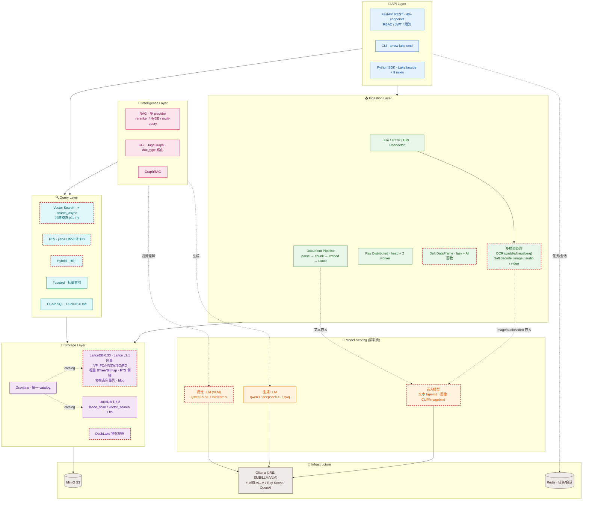

# v1.8.0 Roadmap — 深度优化与新特性

**日期**: 2026-06-26
**背景**: 基于 v1.7.1(标量索引 + LANCE/DuckDB 调优 + lancedb 0.33/pylance 7 + async 入口 + cookbook 对齐)之后,结合四个本地技能(**lance-org** 格式层 / **lancedb** 应用层 / **duckdb** 引擎层 / **daft** 计算层,均基准 2026-06)的高级特性,与项目架构(arrow-lake: Lance 湖仓 + lancedb SDK + DuckDB 引擎 + Daft + Ray + HugeGraph + Gravitino + MinIO)对照,梳理后续可优化与新增能力。
**状态**: 🟡 规划中（#13 Daft AI 函数已实施 ✅，2026-06-26；余项待做）

---

## 架构总览（综合，对齐 product 4 层 + v1.7.1 现状 + v1.8.0 增强）

> 对齐 [`arrow-lake-product-introduction.md`](arrow-lake-product-introduction.md) 的四层架构（Ingestion / Storage / Query / Intelligence + API），节点内容更新到 v1.7.1 现状，**虚线节点 = v1.8.0 待增强**。模型层按**职责拆分**（嵌入 / 生成 / 视觉 LLM），Ollama 只是承载服务之一。

**多模态数据流**（核心）：
`File/HTTP/URL → 多模态处理(OCR / Daft decode_image·audio·video) → 嵌入(文本 bge-m3 / 图像 CLIP) → Lance 多模态向量列 → 跨模态检索(文搜图 / 图搜图)`

**v1.8.0 增强映射**（虚线节点）：

| 节点 | v1.8.0 增强项（对应上表编号） |
|---|---|
| **EMB** | #6 CLIP/imagebind 图像嵌入（跨模态检索）· #13 Daft 内置 embed_text/classify |
| **VLM** | #18 多模态统一栈（视觉理解入 RAG） |
| **MM** | #2 Lance blob 存原始 image/audio/video · #13 Daft decode + AI 函数 |
| **VS / HS** | #5 Reranker 精排 · #7 ColBERT/colpali(late interaction) · #17 全链路 async |
| **FTS_Q** | #4 多语言分词(lindera/icu)· #12 DuckDB 原生 fts 备选 |
| **DAFT** | #13 内置 AI 函数 · #14 Gravitino 连接器 · #16 流式 >16x 内存 · #15 分布式索引 backfill |
| **DLC** | #9 DuckLake 物化视图 · #10 SQL-PGQ 轻图查询 · #11 prepared statements |
| **LANCE** | #1 tags/branches · #2 blob · #3 row_id lineage |
| **横切** | #18 多模态统一栈 · #19 Gravitino 统一 catalog |

---

## 一、Lance 格式层 —— 未充分用的原生能力

| # | 能力 | 项目现状 | 建议 | 价值 |
|---|---|---|---|---|
| 1 | **tags / branches(Git 式数据版本)** | 仅 `cleanup_old_versions`(线性版本) | 给关键 dataset 打 tag(`v1.7-train`),支持 A/B、回滚、可复现训练 | 数据版本治理 |
| 2 | **Blob 存储(多模态原文)** | 图片/视频在 MinIO + 路径引用 | Lance blob 原地存 image/audio/video bytes + 嵌入 | 多模态一致性 + 省一次 IO |
| 3 | **row-level lineage(row_id)** | v1.7.1 有**事件级** lineage store | 叠加 Lance 原生 row_id(行级溯源) | 精细血缘 |
| 4 | **FTS 多语言分词** | jieba(中文) | 加 lindera(日文)/ icu | 国际化 |

---

## 二、lancedb 应用层 —— 召回 / 多模态深化

| # | 能力 | 现状 | 建议 |
|---|---|---|---|
| 5 | **Reranker(cross-encoder 精排)** | RAG 有 `RAG_RERANKER` 配置,未接 lancedb reranker | 混合搜索后接 cross-encoder(Cohere/Voyage/Jina/ColBERT),RRF 粗排 + 精排提精度 |
| 6 | **多模态嵌入(CLIP / imagebind)** | 仅文本嵌入(bge-m3);有 `photos` dataset | 加 CLIP 图像嵌入,跨模态检索(文搜图/图搜图) |
| 7 | **ColBERT / colpali(late interaction)** | 单向量 | 文档检索用多向量 token-level(colpali),召回质量跃升 |
| 8 | **`hf://` 现成数据集** | 无 | 评测/种子数据 `lancedb.connect("hf://datasets/lance-format/...")` |

---

## 三、DuckDB 引擎层 —— 联邦与图查询

| # | 能力 | 现状 | 建议 |
|---|---|---|---|
| 9 | **DuckLake 物化视图(跨存储 join)** | `ducklake_enabled` 配置在,cross-storage 物化未充分用 | 跨 MinIO/本地/HugeGraph 元数据物化 join,`federated_query` 提速 |
| 10 | **SQL-PGQ 属性图查询**(DuckDB 1.5 新) | 图查询全走 HugeGraph | 轻量图查询(邻居/路径)用 in-process SQL-PGQ,与 HugeGraph 互补(重图→HG,轻查询→DuckDB) |
| 11 | **Prepared statements** | 元数据查询动态 SQL | DuckLake 元数据表 prepared(`duckdb-optimization-plan` P1 曾提) |
| 12 | **vss / fts 扩展** | 用 lance 扩展的 `lance_fts` | DuckDB 原生 fts/vss 作备选/对比 |

---

## 四、Daft 计算层 —— 分布式与 AI 函数(最大潜力)

| # | 能力 | 现状 | 建议 |
|---|---|---|---|
| 13 | **内置 AI 函数(`prompt()`/`embed_text()`/`classify_*()`)** ✅ 已实施 | 嵌入自建(Local/Api/RayServe encoder) | Daft 内置:自动批处理/限流/重试/背压。**PoC 验证 cosine=1.0 vs Local，speedup 1.14x，代码删减 ~120 行**。注:仅嵌入层；KG 抽取 he_extractor 保留 hyper-extract（Daft prompt 拆独立后续项） |
| 14 | **Daft ↔ Gravitino 连接器** | Gravitino 集成在,Daft 直连未用 | Daft 26 连接器含 Gravitino,联邦查询/元数据直接 Daft(不经 DuckDB 转译) |
| 15 | **分布式索引 backfill(Ray)** | Ray 用于 KG/计算,索引单机 | 大规模 IVF_PQ 索引 build 用 Ray 分布式(PB 级) |
| 16 | **惰性执行 >16x 内存** | 大数据用 Ray + 自定义 | Daft 流式 `write_parquet()` 处理超内存,KG build 大 dataset |

---

## 四·补、cookbook 场景 → Daft 高级特性映射（场景驱动落地）

cookbook 业务场景映射到 Daft 高级特性（# 编号对应上表），让特性有具体落地点：

| cookbook 场景 | Daft 高级特性 | 价值 |
|---|---|---|
| `05_image_video_ingest`（多模态摄入） | `decode_image/audio/video` + `classify_*` + CLIP 嵌入（#13/#18） | 多模态端到端管道 |
| `06_full_pipeline_papers` / `19_knowledge_graph_build`（嵌入 + LLM 抽取） | `embed_text()` + `prompt()`（#13）—— 自动批处理/限流/重试/背压 | **删减手写调度代码** + 健壮性 |
| `13_data_quality_pipeline`（质量评分） | `classify_*` UDF + `@daft.udaf` 聚合（#13） | 质量评分管道化 |
| `04_quality_and_dedup`（去重） | `@daft.func` UDF + 分布式（#15） | 大规模去重 |
| `20_rag_qa_system` / `31_graphrag_qa`（多模态 RAG） | 多模态嵌入 CLIP + VLM `prompt()`（#18） | 跨模态问答 |
| `16_incremental_update_workflow`（大数据） | lazy 执行 + **>16x 内存** + 流式 `write_parquet()`（#16） | 超内存增量 |
| 大规模索引重建（KG/全文） | Ray 分布式 backfill（#15） | PB 级索引 |

> **最高 ROI PoC**：把 `19_knowledge_graph_build` / `06_full_pipeline_papers` 的"嵌入 + LLM 抽取"改用 Daft `embed_text()` + `prompt()`，替换手写的批处理/重试/限流调度 —— 代码量与健壮性双提升，是最好的对比验证场景。

---

## 五、跨技能架构建议

| # | 建议 | 说明 |
|---|---|---|
| 17 | **全链路 async** | v1.7.1 加了 `search_async`(向量),但 FTS/Hybrid/faceted 仍 sync。为高并发补齐 async 全链路(配套连接池 + 压测) |
| 18 | **多模态统一栈** | Lance blob 存原文 + CLIP 嵌入 + Daft `decode_image`/`prompt()` 处理 + lancedb 跨模态检索 —— 端到端多模态(项目已有 photos/videos 数据,缺这条链) |
| 19 | **Gravitino 统一 catalog** | DuckDB + Daft + lancedb 三引擎都经 Gravitino 找元数据,真正联邦(现部分集成) |

---

## 优先级(按价值/成本)

### 🟥 高价值低成本(先做)
- **#13** Daft AI 函数替代自建嵌入调度(删减调度代码 + 自动批处理/限流)
- **#5** Reranker 接入(混合搜索精度提升)
- **#1** Lance tags/branches(数据版本治理,无破坏性)

### 🟧 中(价值/成本均衡)
- **#6 + #2** 多模态 CLIP + Lance blob(端到端多模态链)
- **#10** SQL-PGQ 轻图查询(与 HugeGraph 互补)
- **#9** DuckLake 物化视图(联邦查询提速)
- **#11** Prepared statements(元数据查询)

### 🟨 大工程(按需/压测驱动)
- **#17** 全链路 async(高并发才做)
- **#15** 分布式索引 backfill(PB 级才做)
- **#7** ColBERT/colpali(召回质量极致)

---

## 落地建议

- 每项独立会话实施(清爽 context + 聚焦)
- 先做 🟥 三项(#13/#5/#1)—— 低风险高收益,可快速验证
- 多模态链(#6+#2+#18)作为 v1.8.0 主题(项目已有数据基础)
- async/分布式(#17/#15)留压测驱动,不 speculative

## 参考

- 技能:[lancedb](file:///home/witshine/.claude/skills/lancedb/SKILL.md) · [lance-org](file:///home/witshine/.claude/skills/lance-org/SKILL.md) · [duckdb](file:///home/witshine/.claude/skills/duckdb/SKILL.md) · [daft](file:///home/witshine/.claude/skills/daft/SKILL.md)
- 上游:[docs.lancedb.com](https://docs.lancedb.com) · [lance.org](https://lance.org) · [duckdb.org](https://duckdb.org/docs/current/) · [docs.daft.ai](https://docs.daft.ai)
- 相关:[v1.7.1 优化计划](v1.7.1-lance-duckdb-stack-optimization-plan.md)
