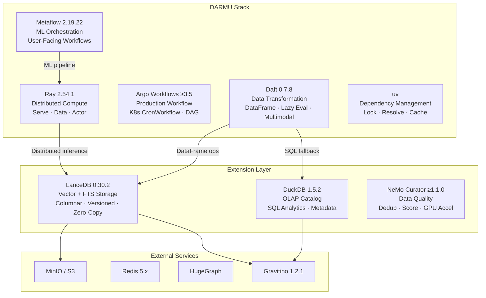
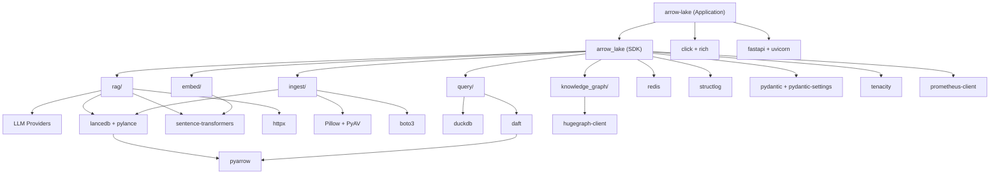

# Dependency Map — Framework Responsibilities & Compatibility

**Version:** v1.5.3 | **Updated:** 2026-06-04

---

## Framework Responsibility Boundaries

## Responsibility Matrix

| Framework | Primary Role | Boundary | Does NOT Do |
|-----------|-------------|----------|-------------|
| **Daft** | Data transformation, multimodal DataFrame | Data pipeline ETL | Workflow orchestration, model serving |
| **Ray** | Distributed compute, inference parallelization | Scale-out compute | Data transformation, user workflow |
| **Metaflow** | ML workflow orchestration (user-facing) | End-to-end ML pipelines | Data transformation, serving |
| **Argo** | Production K8s workflow | Cron jobs, DAG workflows | ML logic, data processing |
| **LanceDB** | Vector + FTS storage | Index + query | OLAP analytics, metadata governance |
| **DuckDB** | OLAP analytics + metadata catalog | SQL queries, schema metadata | Vector search, file storage |

## Overlap Analysis

| Overlap Area | Frameworks | Resolution |
|-------------|-----------|------------|
| Distributed data processing | Daft vs Ray Data | Daft for ETL/transform, Ray for inference/serving |
| Workflow orchestration | Metaflow vs Argo | Metaflow for ML dev, Argo for K8s production |
| SQL query | Daft SQL vs DuckDB | DuckDB for analytics, Daft for in-pipeline filtering |

---

## Dependency Topology

